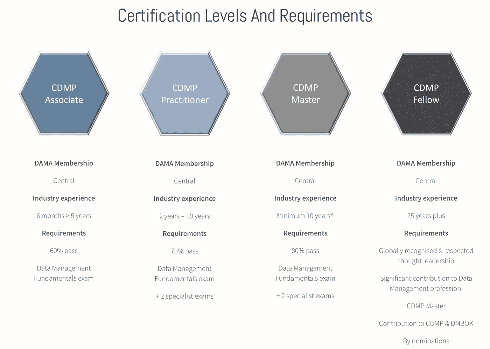

# 你从未听说过的最好的数据科学认证

> 原文：<https://towardsdatascience.com/best-data-science-certification-4f221ac3dbe3?source=collection_archive---------0----------------------->

## 数据策略最有价值培训实用指南。

逆流而上解决数据质量问题。由[阿莱克萨纳](https://www.pexels.com/photo/man-swimming-in-an-infinity-pool-4239547/)在[像素](https://www.pexels.com/photo/man-swimming-in-an-infinity-pool-4239547/)上拍摄的照片。

** ***更新 1/6/21*** : *如果你对 CDMP 基础考试的全面学习计划感兴趣，可以看看我整理的这个* [*邮件系列*](https://www.datastrategypros.com/products/cdmp-study-plan) *来帮你。在 90 天结束时，你会完全准备好* ***毫不费力*** ***王牌 CDMP*** *。*

** ***更新 11/23/20*** *:*

 [## 数据科学家如何获得最被低估的认证

### 这种简单的开卷测试为数据科学家提供了数据策略方面的专业知识和重要的领导技能。

towardsdatascience.com](/cdmp-exam-d65e1255016b) 

**** ***更新 10/13/20*** *:我现在通过了基础考试，被认定为 CDMP 合伙人。有问题吗？在评论中留言或者加入* [***学习小组***](https://www.facebook.com/groups/346145433213551/) *。*

**** ***更新 8/15/20*** *:最近我注意到认证考试是* [***开卷***](https://amzn.to/2F0MGcM) *，这是非常令人兴奋的，因为这意味着在真实世界设置中记忆的时间更少，而处理数据的时间更多。另外，我在脸书***上开了一个* [***学习小组——加入帮助你备考。***](https://www.facebook.com/groups/346145433213551/)*

*八年前，数据科学被宣布为“21 世纪最性感的工作”然而，埋头苦读数小时的数据仍然让人感觉**绝对**T2 不性感。如果说有什么不同的话，那就是数据科学职业生涯的传奇般的崛起说明了大多数组织在管理数据方面做得有多差。*

*进入**认证数据管理专业(**[**CDMP**](https://cdmp.info/)**)**来自数据管理协会国际( [DAMA](https://dama.org/) )。CDMP 是你从未听说过的最好的数据战略认证。(老实说，当你考虑到你可能正在从事一份十年前并不存在的工作时，这一认证尚未普及就不足为奇了。)*

*数据战略是一个重要的学科，它涵盖了数据生命周期的端到端管理、数据治理的相关方面以及数据伦理的关键考虑。*

*这篇文章概述了获得 CDMP 的**方法和理由**，这为有效的数据战略思想领导奠定了基础。它还包括一项调查，您可以就数据科学的数据管理的最重要方面提出您的想法，并查看社区的共识。*

*本指南中的**:***

1.  ***[关于 CDMP 考试](#154f)***
2.  ***[如何准备 CDMP](#5f84)***
3.  ***[CDMP 考什么](#cdd5)***
4.  ***[调查——数据管理最重要的方面](#14d1)***
5.  ***[为什么数据科学家应该获得 CDMP 认证](#733b)***

******免责声明*** *:本帖非 DAMA International 赞助——所反映的观点仅是我个人观点。我在亚马逊上添加了一个链接到*[*DMBOK*](https://amzn.to/32oK8hH)*的链接，这是考试所需的参考指南，因为这是一个开卷考试。通过此链接购买这本书有助于支持我在数据科学和数据策略方面的写作——提前致谢。****

## ***关于 CDMP 考试***

***CDMP 培训提供了与数据策略相关的 14 个领域的专业知识(我将在后面的章节中详细介绍)。考试是**开卷**，但是考试上的 **100 道题**必须在 **90 分钟**内完成——没有太多时间来查找东西。因此，非常熟悉[参考资料](https://amzn.to/32oK8hH)非常重要。***

***当你安排考试(300 美元)时，DAMA 提供了 40 个练习题，这些练习题很好地反映了实际考试的难度。作为进一步的资源，[查看这篇关于学习认证过程的文章](https://medium.com/@nicolejaneway/how-to-ace-the-aws-cloud-practitioner-certification-with-minimal-effort-39f10f43146#9066)。***

***可以通过网络摄像头在线参加考试(监考费 11 美元)。考试形式是多项选择——从五个选项中选择一个正确的选项。你可以标记问题，然后再回来。在考试结束时，你会立即得到分数反馈。***

*****超过 60%视为通过**。如果你有兴趣获得 CDMP 助理认证并继续前进，这很好。如果你对 CDMP 认证的高级层次感兴趣，你必须通过 70% (CDMP 从业者)或 80% (CDMP 硕士)。要获得最高级别的认证，CDMP 研究员，你需要获得硕士认证，并展示行业经验和对该领域的贡献。这些**高级认证中的每一项都需要通过两次专业考试**。***

***这让我想到了我的最后一点，那就是为什么——纯粹从职业发展的角度来看——你应该选择通过 CDMP 的学习和考试过程:来自 DAMA 的认证与领导、管理和数据架构方面的高端职位相关联。(把 CDMP 想象成一个半秘密的数据忍者团体。)与数据管理相关的企业角色和联邦合同越来越多地要求获得 CDMP 认证。[阅读更多](https://jonshaulis.com/index.php/2019/11/26/hurray-i-earned-my-cdmp/)。***

******

***via [CDMP](https://cdmp.info/about/)***

*****优点**:***

*   ***提供关于数据策略相关主题的全面知识库***
*   ***开卷考试意味着花在死记硬背上的时间更少***
*   ***针对不同级别的数据管理专业人员的四个层次***
*   ***通过最低级别认证的 60%分数要求***
*   ***与精英角色相关联***
*   ***向 DAMA 国际提供 3 年会员资格***
*   ***311 美元的考试费比微软和开放集团的其他数据相关认证便宜***

*****缺点**:***

*   ***DAMA 没有一家主要的技术公司(如亚马逊、谷歌、微软)的支持，这些公司正在积极推动营销工作，推动 CDMP 认证的品牌认知度——这意味着 CDMP 可能主要在已经熟悉数据管理的个人中被认为是有价值的***
*   ***与 [AWS 云从业者证书](https://medium.com/@nicolejaneway/how-to-ace-the-aws-cloud-practitioner-certification-with-minimal-effort-39f10f43146])(100 美元)或 [GPC 证书](https://cloud.google.com/certification)(200 美元)相比，311 美元的考试费相对昂贵***

*****替代品**:***

*   ****微软认证解决方案助理* ( [MCSA](https://www.microsoft.com/en-us/learning/mcsa-certification.aspx) ) —专注于各种微软产品的模块化认证(330 美元以上)***
*   ****微软认证解决方案专家* ( [MCSE](https://www.microsoft.com/en-us/learning/mcse-certification.aspx) ) —建立在 MCSA 的基础上，集成了诸如[核心基础设施](https://www.microsoft.com/en-us/learning/mcse-core-infrastructure.aspx)、[数据管理&分析](https://www.microsoft.com/en-us/learning/mcse-data-management-analytics.aspx)和[生产力](https://www.microsoft.com/en-us/learning/mcse-productivity-certification.aspx)(495 美元以上)等主题的认证***
*   ****开放组架构框架*([TOGAF](https://www.opengroup.org/certifications/togaf-individual-certification))—软件开发和企业架构方法论高级框架的各种级别认证(550 美元以上)***
*   ***规模敏捷框架(Scaled Agile Framework)软件工程团队基于角色的认证(995 美元)***

## ***如何准备去 CDMP***

***鉴于 CDMP 是一个开卷考试，为了考试而学习，所需要的就是 DAMA Body 的知识书( [*DMBOK*](https://amzn.to/32oK8hH) $55)。它大约有 **600 页**，但是如果你把你的学习时间主要集中在第一章(数据管理)、图表&模式、角色&职责和定义上，那么这应该能让你达到 80%的及格分数。***

***就如何使用 DMBOK 而言，一名考生建议在 8-10 周内每周末 4-6 小时。另一种方法是每天早晚阅读几页。无论你如何处理，确保你将[间隔重复](https://medium.com/@pruthvikumar.123/using-spaced-repetition-to-supercharge-your-programming-skills-a1b355934f61)融入到你的学习方法中。***

***除了作为考试的学习指南， *DMBOK* 当然也是有用的参考书，如果你的同事需要学习数据策略或者他们在网上研讨会期间打瞌睡，你可以把它放在他们的桌子上。***

## ***CDMP 在测试什么***

***CDMP 涵盖了 14 个主题——我按照它们在考试中出现的频率列出了它们，并为每个主题提供了一个简短的定义。***

*****数据治理** ( 11%) —确保数据资产正式管理的实践和流程。[阅读更多](https://www.dataversity.net/what-is-data-governance/)。***

*****数据质量** ( 11%) —根据数据的准确性、完整性、一致性、完整性、合理性、及时性、唯一性/重复数据删除、有效性和可访问性，确保数据适合消费。[阅读更多](https://www.dataversity.net/what-is-data-quality/)。***

*****数据建模和设计**(11%)——将商业需求转化为技术规范。[阅读更多](https://www.dataversity.net/what-is-a-data-modeler/)。***

*****元数据管理** (11%) —收集的数据信息。[阅读更多](https://www.dataversity.net/what-is-metadata/)。***

*****主数据和参考数据管理** (10%) —参考数据是用于对数据库中的其他数据进行分类的信息，或者仅用于将数据库中的数据与组织边界之外的信息相关联的信息。主参考数据是指在组织内多个系统之间共享的信息。[阅读更多](https://www.dataversity.net/dataed-webinar-reference-master-data-management-unlocking-business-value/)。***

*****数据仓库和商业智能**(10%)—[数据仓库](/data-warehouse-68ec63eecf78)以一种优化的方式存储来自运营系统(以及潜在的其他数据资源)的信息，以支持决策过程。商业智能是指利用技术收集和分析数据，然后将其转化为有用的信息。[阅读更多](https://www.dataversity.net/brief-history-data-warehouse/)。***

*****文档和内容管理** (6%) —用于组织和存储组织文档的技术、方法和工具。[阅读更多](http://dataversity.net/big-data-semantic-web-enterprise-content-management/)。***

*****数据集成和互操作性** ( 6%) —使用技术和业务流程来合并来自不同来源的数据，目标是方便有效地提供对有价值信息的访问。[阅读更多](https://www.dataversity.net/the-fundamentals-of-data-integration/)。***

*****数据架构** (6%) —根据组织的数据策略，描述现有状态、定义数据需求、指导数据集成和控制数据资产的规范。[阅读更多](https://www.dataversity.net/what-is-data-architecture/)。***

*****数据安全** ( 6%) —实施政策和程序以确保人和事物对数据和信息资产采取正确的行动，即使存在恶意输入。[阅读更多](https://www.dataversity.net/what-is-data-security/)。***

*****数据存储和操作** ( 6%) —保存、删除、备份、组织和保护组织信息的硬件或软件的特性。[阅读更多](https://www.dataversity.net/what-is-data-storage/)。***

*****数据管理流程** ( 2%) —数据的端到端管理，包括收集、控制、保护、交付和增强。[阅读更多](https://www.dataversity.net/what-is-data-management/)。***

*****大数据** ( 2%) —超大型数据集，通常由各种结构化、非结构化和半结构化数据类型组成。[阅读更多](https://www.dataversity.net/what-is-big-data/)。***

*****数据道德** ( 2%) —包含数据处理、算法和其他实践的行为准则，以确保数据在道德背景下得到适当使用。[阅读更多](https://www.dataversity.net/what-are-data-ethics/)。***

## ***调查***

***出于好奇，我很乐意**听听你对数据管理最重要方面的看法**。在您在下面的投票中做出选择后，您将会看到社区的想法。***

****你的选择是出于什么考虑？你认为为 CDMP 学习是学习这些话题的有效方法吗？在评论里说吧。****

## ***为什么数据科学家应该获得 CDMP 认证***

***仍然不相信为什么数据策略很重要？让我们从数据科学家的角度来看一下，他们的目标是增加知识和收入潜力。***

******

***[Franki Chamaki](https://unsplash.com/photos/1K6IQsQbizI) 在 [Unsplash](https://unsplash.com/photos/1K6IQsQbizI) 上的照片。该标牌是一家利用人工智能服务于零售业的公司的商标。***

***据说数据科学家是统计学、计算机科学和领域知识的结合点。为什么你想在你的盘子里多加一样东西呢？***

> ***就成功而言，擅长两种互补的技能比擅长一种技能要好***

***《呆伯特漫画》的作者和创作者斯科特·亚当斯提出了这样一个观点:“你获得的每一项技能都会让你成功的几率翻倍。”他承认这可能有点过于简单化——“显然有些技能比其他技能更有价值，你获得的第 12 项技能可能不如前 11 项技能中的每一项有价值”——但关键是有时**拓宽** **比深入**更好。***

***抛开收益的相对大小(*因为我严重怀疑它是每项技能的 2 倍…谢谢你，边际收益递减定律*)，相对于辛苦学习一项特定技能，拓宽你的技能组合无疑会带来更大的收益。简而言之，这就是我认为数据科学家学习数据策略非常重要的原因。***

***一般来说，**拥有多样化的技能可以让你:*****

1.  *****利用跨学科的知识更有效地解决问题*****
2.  ***与其他专业的队友更好地交流***
3.  *****在接触新项目方面迈出第一步*****

***了解**数据策略可以让你从一个数据消费者转变为组织中的数据倡导者**。忍受所有绕口令缩写( [*DMBOK*](https://amzn.to/32oK8hH) )是值得的——真的吗？他们就不能把它叫做数据管理书吗？ *)* 为了加深你对端到端知识生成过程的欣赏。***

*****如果你喜欢阅读这篇文章**，请在 [Medium](https://medium.com/@nicolejaneway) 、 [LinkedIn](http://www.linkedin.com/in/nicole-janeway-bills) 和 [Twitter](https://twitter.com/Nicole_Janeway) 上关注我，了解更多提升你的数据科学技能的想法。加入 CDMP 考试的学习小组。[购买 DMBOK](https://amzn.to/32oK8hH) 。***

## ***使你的技能多样化的其他文章***

*** [## 使用 Java 解决您的数据科学问题

### 通过了解这种广泛使用的编程语言的基础知识，快速访问高质量的数据。

towardsdatascience.com](/java-for-data-science-f64631fdda12)  [## 数据仓库综合指南

### 了解数据仓库作为分析就绪数据集的主存储库的角色。

towardsdatascience.com](/data-warehouse-68ec63eecf78)  [## 如何不费吹灰之力通过 AWS 云从业者认证

### 预测:多云，第一次尝试有 100%的机会通过。

medium.com](https://medium.com/@nicolejaneway/how-to-ace-the-aws-cloud-practitioner-certification-with-minimal-effort-39f10f43146)***