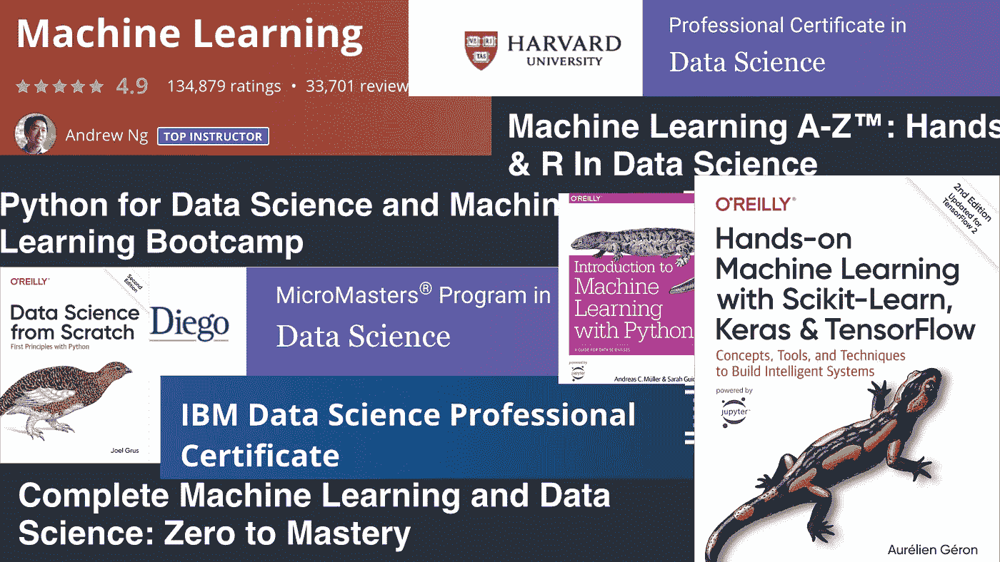

# 最佳数据科学资源以及如何使用它们来获得数据科学能力

> 原文：<https://towardsdatascience.com/best-data-science-resources-online-and-how-to-use-them-to-attain-data-science-competency-50ec9e572879?source=collection_archive---------61----------------------->

## 回顾最受欢迎的资源和推荐选项，将它们结合起来实现您的目标

本文中包含的一些资源的标题。我做的图像。

我收到的最常见的请求之一是推荐在线课程。这不是一件容易的事。在线课程竞争非常激烈，有许多课程提供不同的知识，几乎都声称自己是最好的课程。这就是为什么本周我坐下来回顾了学习数据科学的最受欢迎的课程和书籍的内容。

在这篇文章中，我将分享我对流行的数据科学课程和书籍的看法。在文章的最后，你可以找到我推荐的利用这些资源学习数据科学的方法。

# 我知道…

…你只是想看一下推荐课程的列表，但请稍等片刻。我要说的对你的课程选择很重要。在寻找数据科学课程时，您应该记住以下几点:

*   每门课程的创立者在准备课程时都有不同的想法，他们根据这些想法选择教学主题。不要完全相信一个教师对学科有全面和公正的看法。
*   对“完整训练营”这样的说法要有所保留。事实上，一门课程涵盖了你所听过的关于数据科学的一切，但这并不意味着它完全涵盖了这些内容。
*   最后，你可以选择适合你的课程。教学风格、课程水平和先决条件都很重要。不要只选择最流行的。
*   如果你很难找到适合你具体情况的课程，我的建议是，当你寻找课程时，去找一门课程的最低分，看看人们抱怨的东西是否适用于你。例如，许多人可能会给这门课打 5 颗星，但如果你学的是数学，而与你情况相近的人试图选修这门课，却因为与数学有关的原因而不喜欢它，那么这就证明这门课可能不适合你。
*   你不必从单一的课程中获得所有的知识。你可以找到几门相辅相成的课程。有时从几个来源获取知识甚至更好。有点重叠并不是一件坏事。
*   最重要的是，一门课程不能给你所有你需要知道的东西。把它当成一个起点，聪明地选择但不要想太多。你需要学习的只是基础知识。其余的来自实践。

既然你已经听了我的建议，让我们跳到复习部分。首先，知道我如何评价这些课程对你来说很重要。

# 我是如何评估这些资源的？

如果你学过我的数据科学入门课程，你会知道我把做数据科学所需的知识分为三层。理论、实践和技术。我将根据每门课程如何达到要求的理论知识来评估每门课程。

请记住，我是从获得数据科学所需的基础知识的角度来评判课程的。我所关心的是，这门课程能否让你从“对数据科学知之甚少”发展到可以开始实施自己的项目。因为一旦你知道的足够多，可以开始实施，你就会通过试错来弥补你知识中的所有空白。在数据科学中，有很多东西要归功于经验。不是所有的东西都能通过学习学会。

**免责声明:**我没有参加这些课程，也没有做他们的测验/练习。我的知识将是有限的。我在这里尝试做的是复习课程大纲和预习课程视频，并尝试得出结论。我还浏览课程评论，看看以前的学生对此有何反应。

我做了这些评论，因为我想提供我作为数据科学家的现有知识，以帮助您判断哪门课程更适合您。我和一个非数据科学家做这件事的不同之处在于，我对所需的技能有更好的看法，也知道对一个数据科学家来说什么是重要的。说到底，我如何评价这些课程是我的个人意见，不代表任何其他党派或组织。这篇文章或我在里面说的任何事情都是**而不是**赞助或推广的。

我已经说得够谨慎了。让我们言归正传。

# 在线课程

# [IBM 数据科学专业认证](https://www.coursera.org/professional-certificates/ibm-data-science)

这个认证是一个很好的开始。适合完全初学者。它将把你从一个“我不知道什么是数据科学”的点带到一个非常有知识的点。它涵盖了广泛的主题，但并不完整，也没有包括一些更高级的主题。这是以简单的方式学习数据科学基础知识的好方法。我不建议你把这门课作为唯一的课程。用一门更深入的课程来补充它会更好地为你服务。总的来说，这是一个很好的第一课。

# [约翰霍普金斯大学数据科学专业](https://www.coursera.org/specializations/jhu-data-science)

这门课感觉很学术，但也有很实用的一面。它包括一些基础知识，但我发现它在提供数据科学的全貌方面有所欠缺。数据准备和处理数据相关问题等重要知识缺失，但有关于统计和研究的章节。这不像是一个很好的工业翻译。它深入到一些高级的主题，比如降维，但是我不确定是否预先提供了足够的基础。我不会向初学者推荐这门课程。此外，我不会仅仅因为它不完整就选择它作为我自己的研究对象。

# [密歇根大学 Python 专业的应用数据科学](https://www.coursera.org/specializations/data-science-python#courses)

这个课程有些东西好，有些东西不好。这对于可视化和对文本挖掘感兴趣的人来说是好的，但对于获得机器学习或一般数据科学实践的良好画面来说不是好的。拥有广泛的流行机器学习算法，但不知何故缺少无监督学习和缺乏数据准备。如果你有时间，甚至只是学习文本挖掘基础，这可能是一个很好的副业。

# [吴恩达的机器学习](https://www.coursera.org/learn/machine-learning)

这个课程是专门针对机器学习的，而不是一般的数据科学。它教授机器学习的数学和理论，同时也触及高级主题。因此，它不是初学者的课程。这门课程最大的缺点是使用了相当过时的工具，比如 Matlab。此外，它忽略了一些非常重要的算法，如决策树或随机森林。因此，不觉得它是一个完整的包，或者它可能在 8 年前是完整的，但现在有缺口。我建议，只有在对数据科学有了基本了解之后，才能学习这门课程。

# 【2020 年数据科学课程:完整的数据科学训练营

这是一门雄心勃勃的课程。它拥有从职业建议到 Python 到机器学习算法到统计学的一切。以这门课的题目数量，可以做五门课。虽然它涵盖了许多主题，但它似乎错过了一些基础概念，如数据准备和机器学习基础。而且，结构似乎有点乱。正如我之前提到的，对所教内容雄心勃勃的课程往往是肤浅的。我本人没有上过这门课，但我不认为深度学习和职业建议应该放在同一门课中。恕我直言，当所有其他课程都可用时，我不会选这门课。

# [用于数据科学和机器学习的 Python 训练营](https://www.udemy.com/course/python-for-data-science-and-machine-learning-bootcamp/)

我在网上见过的最全的课程之一。它很好地介绍了与数据科学相关的技术，并教授了一些使用 Python 进行数据准备的实践，同时还涉及了数据可视化。引入了许多最流行的算法，但我不确定有多好。这些课程似乎没有深入到这些算法是如何工作的，而是它们是如何在 Python 中实现的。大部分基本的数据科学基础知识都包括在内。我认为，就我所见，这是一门非常实用的课程。它可能不太适合学习数据科学的理论方面，但在机器学习方面，它有利于学习如何编写 python 代码。

# [数据科学 A-Z:现实生活中的数据科学练习包括](https://www.udemy.com/course/datascience/)

这门课程似乎是为了培养一种非常特殊的数据科学家。这不是一门理论课程，相反，它试图通过教授数据科学的操作方法以及非常具体的工具和软件来变得非常实用。我认为这门课所教的技能不能很好地概括。因此，我不推荐这个课程。

# [机器学习 A-Z:数据科学中的实践 Python&R](https://www.udemy.com/course/machinelearning/)

这个课程用 Python 和 R 两种语言讲授所有内容，这使得它太长了，但是，当然，你可以跳过你不感兴趣的语言的实现视频。它有一个很好的机器学习算法的选择，但机器学习似乎是这门课程唯一关注的事情。它不包括可视化、python 基础、数据科学技术或机器学习理论。仅简单提及与训练机器学习算法相关的数据准备。这门课程可能是学习更多关于机器学习算法以及如何实现它们的好选择，而不是学习一般数据科学的来源。

# [完整的机器学习和数据科学:零到精通](https://www.udemy.com/course/complete-machine-learning-and-data-science-zero-to-mastery/)

这不是最先出现的课程之一，但我在这里包括了这门课程，因为我参加了同一批人的 web 开发课程，并且很喜欢它。这似乎是一门非常实用和动手的课程。它并没有给人这样的感觉，即它将教授 ML 算法或一般数据科学背后的许多理论。相反，它会教你 Python，建立一个数据科学环境，数据科学的基础知识和 ML 算法的实现。当你想亲自动手时，这是一门很好的课程。

# [哈佛大学数据科学专业证书](https://www.edx.org/professional-certificate/harvardx-data-science)

这个课程是我能找到的最好的课程之一。理论上是非常完备的。它适当地回顾了机器学习的基础，介绍了最重要的算法和技术。我发现数据准备(课程中的数据扯皮)部分有点欠缺。这门课唯一让我不喜欢的是主要技术是 r，总而言之，这门课一开始听起来很扎实。

# [加州大学圣地亚哥分校的数据科学微硕士项目](https://www.edx.org/micromasters/uc-san-diegox-data-science)

这是一门高级课程，可以用来进一步学习。它有一个很棒的数学和统计部分。如果你想为你的机器学习知识打下坚实的理论基础，在对数据科学的主要概念有信心后，我会选择这门课程。

# [IBM 的数据科学基础](https://cognitiveclass.ai/learn/data-science)

这就像数据科学课程一样简单。如果你对进入数据科学仍持观望态度，并想体验一下它是什么，我会去上这门课。这只是一个非常简单的介绍，不需要太多时间。你可以将本课程与使用 Python 的[数据分析](https://cognitiveclass.ai/courses/data-analysis-python)和使用 Python 的[机器学习](https://cognitiveclass.ai/courses/machine-learning-with-python)结合起来，更深入地了解数据科学。

# 书

# [使用 Scikit-Learn、Keras 和 TensorFlow 进行机器实践学习，第二版](https://www.oreilly.com/library/view/hands-on-machine-learning/9781492032632/)

这本书是最好的书之一，甚至可能是最好的。它基本上包含了您需要了解的一切，让您对自己的数据科学知识充满信心。所有的理论、数学甚至统计数据。如果你问我，这是一个独立的冠军。

虽然我认为这本书对任何人都会很管用，但普遍的看法是，这是一本中级水平的书，而不是一本初学者的书。我在一定程度上同意。我不会向初学者推荐整本书，而只推荐第一部分。这是因为第二部分进入深度学习，这对初学者来说是不必要的。无论如何，第一部分应该足以让你对数据科学有一个非常扎实的理解。

你可以很容易地用我上面提到的简单课程来补充它，以便更轻松地开始数据科学，然后全身心投入这本书。

# [数据科学从零开始，第二版](https://www.oreilly.com/library/view/data-science-from/9781492041122/)

这本书的目标是让读者在不使用任何库的情况下手工实现算法。通过这样做，这本书很好地教授了数据科学和机器学习的基础知识。即使你不想在动手编码开始之前从头开始动手实现机器学习算法，学习数据科学背后的理论也是非常有用的。还有，作者爆笑。

# [用 Python 进行机器学习简介](https://www.oreilly.com/library/view/introduction-to-machine/9781449369880/)

这是另一个伟大的初学者水平的书。它主要关注机器学习及其背后的理论。它不会花太多时间处理数据。然而，这是一本研究机器学习算法的理论和实用性的好书。

# 学习平台

我知道有 Datacamp，Dataquest 等线上平台。我这周没有时间复习它们。我将很快浏览它们，并通过更新这篇文章来分享我的观点。

# 如果你愿意的话，可以是总结或最终裁决

我会建议几条途径:

# 选项 1

如果你想学习数据科学和机器学习背后的理论，并获得实践经验

**IBM 数据科学专业认证**打造基础

+

**吴恩达的机器学习课程**获取机器学习的理论知识(注意过时的应用，对实现持保留态度)

+

**Python for Data Science and Machine Learning boot camp**或 **Machine Learning A-Z:动手实践 Python & R In Data Science** 获取实践知识

# 选项 2

**‍** 如果想专注于理论知识

**IBM 数据科学专业认证**打造基础

+

**加州大学圣地亚哥分校的数据科学微硕士项目**深入探讨高级主题

# 选项 3

‍:如果你只想学一门课

**哈佛数据科学专业证书**学习全面的数据科学技能

# 选项 4

‍:如果你是一个非常注重实践的人，不想学习太多理论

**完整的机器学习和数据科学:零到精通**

# 选项 5(个人最爱)

课程和你的学习旅程是非常个人化的。这就是为什么我一直非常小心，不去对你应该做什么或不应该做什么提出任何宏大的主张。当然，我有一个最喜欢的。我并不是说这对每个人来说都是最好的方式。我只是说，如果我必须给我的兄弟或姐妹关于如何学习数据科学的建议，我会告诉他/她遵循这个选项。

**IBM 数据科学专业认证**打造基础

+

**使用 Scikit-Learn、Keras 和 TensorFlow 进行机器学习实践**以获得对数据科学和机器学习概念的全面而正确的理解

+

不管多少，都要坚持做兼职项目

# 一锤定音

实事求是地看待这些资源，尽你所能从中获取，留下那些不适合你的。你将有时间重复、重温和重新学习一些(如果不是大部分)概念。不要把一门课程的结束或者一个证书的获得看作是你学习旅程的结束，到那时你应该什么都知道了。你的学习不会在参加这些课程或获得一些证书后就结束。相反，这是你学习新篇章的开始。在这一点上，你应该开始把你的技能用在项目上。通过这种方式，你可以实践你所学的东西，发现你知识中的差距，并通过解决这些差距来进一步提高自己。

我希望这篇文章能帮助您确定迈向数据科学的第一步，这样您就可以平稳地过渡到更具实践性的阶段。

👉*对数据科学领域以及如何开始学习感到困惑？* [*免费参加数据科学入门迷你课程*](https://www.soyouwanttobeadatascientist.com/courses/data-science-kick-starter-mini-course) *！*