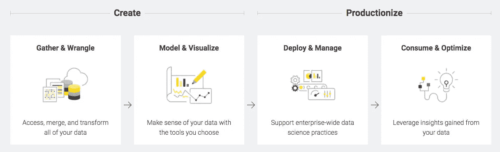

# 数据科学家的最佳数据科学工具

> 原文：<https://towardsdatascience.com/best-data-science-tools-for-data-scientists-75be64144a88?source=collection_archive---------10----------------------->

## 数据科学工具，使任务可以实现

数据分析做出强有力的决策([来源](https://www.sciencenews.org/)

> 我们正在进入一个数据可能比软件更重要的新世界。
> **——**

**AI 已经接管了我们很多平凡的任务，并在这个过程中让我们的生活变得更加轻松。这归功于研究人员、数据科学家和开发人员在收集、研究和重塑数据方面投入的大量研究和奉献。不仅仅是 IT 部门，所有行业都从这些进步中受益。如果没有工作工具的发展和改进，这一切都不可能实现。**

# **2020 年要学习的顶级数据科学工具**

> **当我说“数据科学”时，我指的是将数据转化为现实世界行动的工具集合。这些包括机器学习、数据库技术、统计学、编程和特定领域技术。**

**随着现有工具的改进和更新工具进入数据科学领域，许多任务变得可以实现，而这些任务在早期要么过于复杂，要么难以管理。这些工具背后的**核心思想**是将数据分析、机器学习、统计学和相关概念联合起来，充分利用数据。这些工具对于任何希望深入数据科学世界的人来说都至关重要，选择正确的工具可以让世界变得不同。**

> **信息是 21 世纪的石油，分析是内燃机。
> —彼得·桑德加德**

# **● **Apache Hadoop****

> **面向可靠、分布式、可扩展计算的开源软件。**

****

**Hadoop——面向可靠、分布式、可扩展计算的开源软件([来源](https://mapr.com/products/apache-hadoop/)**

**[Apache Hadoop](https://hadoop.apache.org/) 是由**Apache Software Foundation**根据 **Apache License 2.0** 授权的开源软件。通过使用跨节点集群的并行处理，它有助于解决复杂的计算问题和数据密集型任务。Hadoop 通过将大文件分割成块，并通过指令将其发送到节点来实现这一点。帮助 Hadoop 实现更高效率和更流畅处理的组件包括:**

**● Hadoop Common 为子系统提供标准库和函数**

**● Hadoop 分布式文件系统提供文件系统和机制，用于拆分和分发数据块**

**● Hadoop YARN 调度作业并管理集群**

**● Hadoop MapReduce 用于处理并行处理**

**●将每个项目的磁盘驱动性能提高 10 倍**

**●与外部应用和软件解决方案无缝集成**

# **● **SaS****

> **将数据转化为洞察力**

****统计分析系统**的简称， [SAS](https://www.sas.com/en_id/home.html) 是由 SAS 研究所开发的统计工具。这是最古老的数据分析工具之一。**最新稳定版本 v9.4m6** 于 2018 年 11 月发布。SAS 提供的主要功能有:**

**●通过大量可用教程轻松学习**

**●一套包装完好的工具**

**●简单而强大的图形用户界面**

**●文本内容的粒度分析**

**●无缝的专业技术支持**

**●视觉上吸引人的报告**

**●识别拼写错误和语法错误，以便进行更准确的分析**

> **目标是将数据转化为信息，将信息转化为洞察力。
> **——卡莉·菲奥莉娜****

**SAS 允许你从几个领域挖掘、改变、管理和检索数据。**配合 SQL** ，SAS 成为**数据访问和分析的极其高效的工具。** SAS 已经发展成为一套服务于多种用途的工具，其中包括:**

**●数据挖掘**

**●统计分析**

**●商业智能应用**

**●临床试验分析**

**●计量经济学和时间序列分析**

# **●画面**

> **功能强大且发展最快的数据可视化工具**

**[Tableau](https://www.tableau.com/) 是一款出色的**数据可视化工具**，最近**被全球领先的企业 CRM 之一 Salesforce** 收购。Tableau 专注于在短时间内提供清晰的数据表示，可以帮助更快地做出决策。它通过利用在线分析处理立方体、云数据库、电子表格和关系数据库来做到这一点。**

**Tableau 的便利性让您可以专注于统计数据，而不必担心如何设置它。开始使用就像将数据集拖放到应用程序上一样简单，而设置过滤器和自定义数据集则轻而易举。**

*   **全面的端到端分析**
*   **高级数据计算**
*   **轻松发现内容**
*   **完全受保护的系统，将安全风险降至最低**
*   **反应灵敏的用户界面，适合所有类型的设备和屏幕尺寸**

****要知道的一件有趣的事情—****

# **●张量流**

**说到 **AI，DL 和 ML，** [TensorFlow](https://www.tensorflow.org/) 这个名字你总会听到。 [**由 Google**](/top-google-ai-tools-for-everyone-60346ab7e08) 提供，TensorFlow 是一个无所不能的库，它可以构建和训练模型，部署在计算机、智能手机和服务器等不同的平台上，以有限的资源实现最大的潜力。**

**使用 TensorFlow，您可以**创建统计模型**、**数据可视化**，并访问 ML 和 DL 的一些同类最佳且广泛使用的功能。TensorFlow 对 Python 的偏爱使其成为一种强大的编程语言，通过存储、过滤和操作数字和数据来进行分布式数值计算。**

# **● **数据机器人****

****[data robot](https://www.datarobot.com/)成立于 2012 年**，现在被称为满足你所有人工智能需求的企业级解决方案。它旨在自动化构建、部署和维护人工智能的端到端过程。DataRobot 只需简单点击几下就能让你上手，而且不需要你是专业人士就能完成很多工作。DataRobot 为您的业务需求提供以下功能:**

**●自动化 ML**

**●自动化时间序列**

**● MLOps**

**● Paxata 帕克萨塔**

**这些可以与其他部署选项(如云或内部部署)结合使用或单独使用。对于数据科学家来说，这使他们能够更多地关注手头的问题，而不是忙于设置东西。**

> **有趣的是-**

** [## 为新冠肺炎的响应工作开放其平台

### 与 AWS 合作，有意者可免费使用 DataRobot 公司数据科学家还预测…

www.datarobot.com](https://www.datarobot.com/news/press/datarobot-opens-up-its-platform-for-covid-19-response-efforts/) 

# ● **BigML**

> 立即开始做出数据驱动的决策。

BigML 的成立只有一个目标，那就是让每个人更容易建立和分享数据集和模型，最终让机器学习变得更容易。旨在提供强大的 ML 算法，仅用一个框架来减少依赖性。BigML 的专业知识包括以下领域:

●分类

●回归

●时间序列预测

●聚类分析

●异常检测

●主题建模

BigML 包括一个易于使用的 GUI，允许交互式可视化，使数据科学家轻松做出决策。对 REST APIs 的支持可以让您立即启动并运行。通过 JSON PML 和 PMML 导出模型的能力有助于从一个平台到另一个平台的无缝过渡。还支持内部和外部部署。

# ● **Knime**

> F [ree 和开源](https://en.wikipedia.org/wiki/Free_and_open-source_software)数据分析、报告和集成平台

[KNIME](https://www.knime.com/) 是一个多用途工具，它可以**进行数据报告和分析**，同时可以轻松地将数据挖掘和机器学习等元素集成到您的数据中。KNIME 的直观 GUI 允许用最少的编程知识进行**轻松提取**、**转换**和**数据加载**。KNIME 支持创建可视化数据管道来创建模型和交互式视图，可以处理大量数据。

knime——免费和开源的数据分析、报告和集成平台([来源](https://www.knime.com/))

KNIME 的集成能力允许用下面列出的数据库管理语言扩展其核心功能，例如:

> ● SQLite
> 
> ● SQL 服务器
> 
> ● MySQL
> 
> ●甲骨文
> 
> ● PostgreSQL
> 
> ●还有更多

# ●阿帕奇火花

> **Apache Spark** 是用于大规模数据处理的统一分析引擎。

[Apache Spark](https://spark.apache.org/)by**Apache Software Foundation**是一款分析和处理大规模数据的工具。它允许您通过合并数据并行性和容错性对数据集群进行编程，以便对它们进行集中处理。对于数据集群，Spark 需要一个集群管理器和一个分布式存储系统。Spark 还继承了 Hadoop 的一些特性，比如 YARN、MapR 和 HDFS。

Spark 还提供数据清理、转换、模型构建和评估。Spark 的内存工作能力使其处理数据和写入磁盘的速度极快。支持与其他编程语言的集成、转换以及它的开源特性使它成为数据科学家的一个很好的选择。

# ● **RapidMiner**

RapidMiner —数据科学平台([来源](https://rapidminer.com/))

RapidMiner 是一个面向团队的数据科学平台，它将数据准备、机器学习和预测模型部署结合在一起。

RapidMiner 提供的工具可以帮助您从最初准备数据到最后一步(即分析部署的模型)准备模型。RapidMiner 本身作为一个完整的端到端数据科学包，利用了其他产品提供的集成，例如:

●机器学习

●深度学习

●文本挖掘

●预测分析

RapidMiner 面向数据科学家和分析师，它提供的一些功能包括:

●数据准备

●结果可视化

●模型验证

●用于扩展核心功能的插件

● ver 一千五百原生算法

●实时数据跟踪和分析

●支持数十种第三方集成

●全面的报告能力

●适合任何规模团队使用的可扩展性

●卓越的安全特性

# ● **Matplotlib**

> Matplotlib 让简单的事情变得简单，让困难的事情变得可能。

[Matplotlib](https://matplotlib.org/) 是任何数据科学家都必须知道的 Python 的基本开源图形绘制库之一。它不仅为用户提供了广泛的定制选项，而且不会使任何事情变得过于复杂。任何熟悉 Python 的人都知道 Python 凭借其庞大的库集合以及与其他编程语言的集成有多么强大。

使用 Matplotlib 的简单 GUI，数据科学家可以创建引人注目的数据可视化。几个导出选项使您可以更容易地将自定义图形带到您选择的平台上。

# ● **Excel**

> 更好地了解您的数据

米卡——照片由[米卡·鲍梅斯特](https://unsplash.com/@mbaumi?utm_source=unsplash&utm_medium=referral&utm_content=creditCopyText)在 [Unsplash](https://unsplash.com/?utm_source=unsplash&utm_medium=referral&utm_content=creditCopyText) 上拍摄

作为微软 Office 工具套件的一部分，Excel 对于普通人来说是一个简单的电子表格管理工具，但在数据科学家等超级用户手中，它将成为一个极其高效的工具。众所周知，Excel 对于新手来说是一个简单的入门工具，但是一旦他们发现它有多强大，他们就会继续使用。

Excel 显示数据的方式使其强大的数据可视化风格使决策一目了然。Excel 提供的公式就像上面的樱桃一样，将 Excel 从一个简单的表示应用程序的数字转换成可以处理这些巨大数字的东西，可以是连接、查找长度、查找总和、平均值等等。** 

# **结论**

**数据在当今人工智能的世界中发挥着决定性的作用，使数据科学家能够做出有影响力的决策。在缺乏强大的数据科学工具的情况下，这项任务变得异常复杂。无论您的专业水平如何，我们都让您更容易了解可用的工具。如果您对数据科学感兴趣，您有大量的工具可供选择。虽然这些工具中有一些值得被称为多面手，但也有一些迎合了特定的需求。**

> *****注:*** *为了消除各种各样的问题，我想提醒你一个事实，这篇文章仅代表我想分享的个人观点，你有权不同意它。***

# **更多有趣的阅读—**

**我希望这篇文章对你有用！以下是一些有趣的读物，希望你也喜欢**

** [## 2020 年人工智能工程师的顶级编程语言

### 从几种编程语言中，人工智能工程师和科学家可以挑选出适合他们需要的语言

towardsdatascience.com](/top-programming-languages-for-ai-engineers-in-2020-33a9f16a80b0)  [## 机器学习和深度学习的最佳 Python 库

### 现代机器学习模型和项目的 Python 库

towardsdatascience.com](/best-python-libraries-for-machine-learning-and-deep-learning-b0bd40c7e8c)  [## 选择 PyTorch 进行深度学习的理由

### PyTorch 可以为深度学习程序员提供很多东西

towardsdatascience.com](/reasons-to-choose-pytorch-for-deep-learning-c087e031eaca) 

> ***关于作者***
> 
> ***克莱尔 D*** *。在*[***Digitalogy***](https://www.digitalogy.co/)***—****是一个内容制作者和营销人员，这是一个技术采购和定制匹配市场，根据全球各地的特定需求，将人们与预先筛选的&顶尖开发人员和设计师联系起来。在*[***Linkedin***](https://www.linkedin.com/company/digitalogy)*，*[***Twitter***](https://twitter.com/DigitalogyCorp)*，*[***insta gram***](https://www.instagram.com/digitalogycorp)**。****