# 用于正向和反向工程的最佳数据库设计工具

> 原文：<https://towardsdatascience.com/best-database-design-tools-for-forward-and-reverse-engineering-cdaab971013d?source=collection_archive---------12----------------------->

## *这篇文章强调了用于正向和反向数据库工程的可视化工具的基本要求。我们还列举了数据库设计中最流行的可视化解决方案。*

图片来自 [Piqsels](https://www.piqsels.com/en/public-domain-photo-jfulj) (CC0)

**数据设计可视化工具的基本要求**

数据库设计软件必须确保的首要事情是正向和反向工程。实现它的一个方法是视觉设计。它在数据模型中引入变更时生成代码，支持向前工程。而且，它从代码中构建一个图形模型，支持逆向工程。

因此，数据库设计的可视化解决方案必须在以下功能中提供图形正向和反向工程:

1.  可视化数据库结构以供进一步分析。
2.  使用容器聚集逻辑上相关的对象。
3.  跟踪表之间的逻辑关系。
4.  打开大型 SQL 数据库图表。
5.  在图表中创建和编辑数据库对象。

此外，还应具备以下可视化工具:

1.  数据建模语法的符号列表。
2.  对象的注释。
3.  文档化的计划，显示当前 SQL 图的逻辑结构。在数据库图表中浏览表及其相关性时，可以使用它。
4.  图表概述(在图表中缩放和导航)。
5.  所显示数据的详细程度(是否显示约束、索引等。).
6.  设计列表(优化黑白打印、彩色打印等。).

数据库可视化解决方案还可能涉及其他需求。

**数据库设计可视化工具概述**

在我们阐明了数据库可视化设计工具的基本标准之后，让我们回顾一下最流行的软件解决方案。我们从各种网络评级和评论中编辑了这个列表，特别关注那些工具中存在的正向和反向工程选项。

[**MySQL 工作台**](https://www.mysql.com/products/workbench/)

MySQL WorkBench 是数据库架构师、开发人员和设计人员的强大工具集。在其他特性中，它提供了可视化数据库设计和管理数据库的选项。正向和反向工程都有工具。用户可以顺利无误地将图形数据模型转换成 MySQL 服务器上的数据库。该软件适用于数据建模、服务器配置、数据库管理和备份。此外，该产品与 Windows、Mac 和 Linux 兼容。

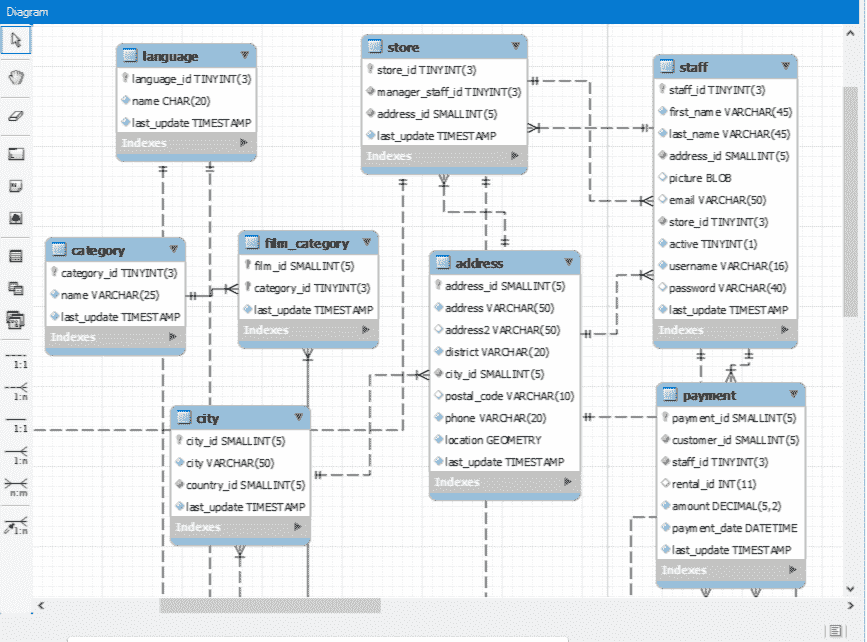

*图片 1。MySQL Workbench 中的数据模型*

[**DbForge 工作室**](https://www.devart.com/dbforge/)

dbForge Studio for MySQL 是一个多功能解决方案，用于创建和维护 MySQL 和 MariaDB 数据库。该功能涵盖了 PL/SQL 编码、数据同步、表分析、模式比较以及针对所有类型的数据库开发工作的更多选项。值得一提的是数据库结构可视化特性——它在 MySQL 数据库图中显示所有对象及其属性。制作这种图表的工具是 MySQL 数据库设计器的一部分。这样，你就可以通过拖放来进行逆向工程。该产品针对团队协作进行了优化。

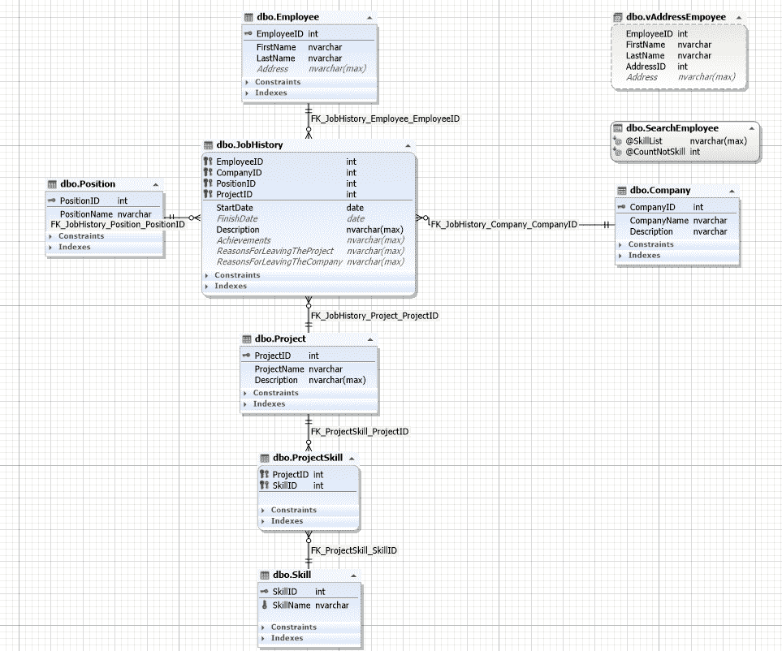

*形象二。DbForge Studio 中的数据模型*

[**SSMS**](https://docs.microsoft.com/en-us/sql/ssms/download-sql-server-management-studio-ssms?view=sql-server-ver15)

SQL Server Management Studio (SSMS)是一个基于 Windows 的免费实用工具，可用于任何 SQL 基础设施。该解决方案允许开发人员访问、管理和开发所有 SQL Server、SQL 数据仓库和 Azure SQL 数据库组件。该环境提供了各种各样的图形工具和丰富的脚本编辑器，适合所有级别的管理员。其中一个优势是在本地计算机和云中使用数据库和数据仓库。请注意，该解决方案仅与操作系统 Windows 兼容(AMD 或 Intel)。

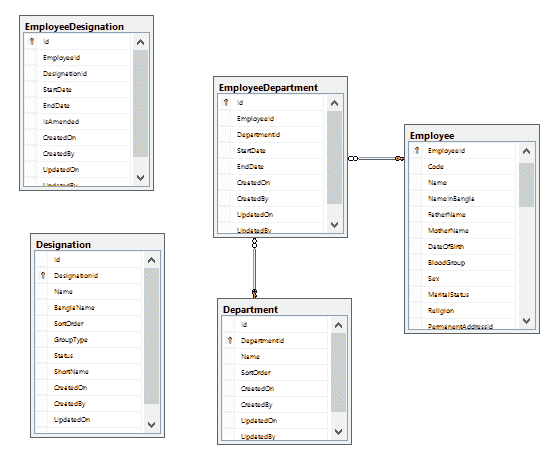

*图片 3。SSMS 的数据模型*

[**Visual Studio**](https://visualstudio.microsoft.com/)

Microsoft Visual Studio 是一个多用途的 IDE(集成开发环境),适用于数据库开发和维护。它可以导入现有的模式并将它们转换成数据库。在编译器、图形设计器和许多其他功能的帮助下，它可以执行与数据库设计相关的所有必要任务。逆向工程是可用的，该软件可以为每个特定的数据库对象生成 T-SQL 文件。Visual Studio 与 Microsoft SQL Server 数据库和 Azure SQL 数据库都兼容。

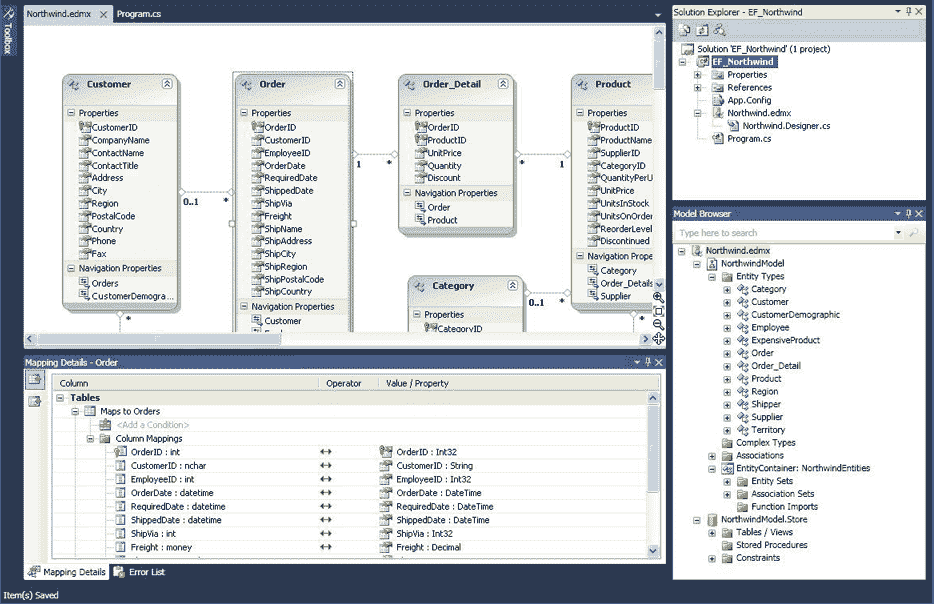

*图片 4。Visual Studio 中的数据模型*

[**SQLGate**](https://www.sqlgate.com/)

SQLGate 是数据库开发和管理的集成解决方案。它的主要目标是简化所有类型的数据库操作。它支持所有流行的数据库，并允许用户直接连接这些数据库。这种集成软件不需要复杂的安装，其所有功能都更简单。对象资源管理器确保快速访问对象面板进行分析和编辑。调试实用程序有助于检测查询中的任何错误，从而有助于正确编写查询。

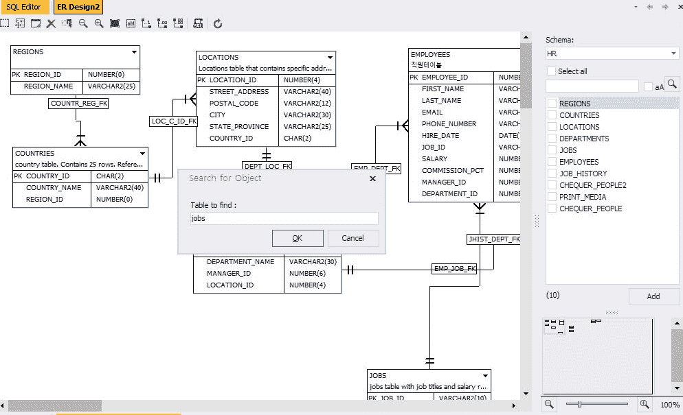

*图片 5。SQLGate 中的数据模型*

[**Navicat 数据建模器**](https://navicat.com/en/products/navicat-data-modeler)

Navicat Data Modeler 是一款流行的数据库设计工具，主要用于构建数据模型(概念模型、逻辑模型和物理模型)。该解决方案适用于数据库结构的可视化设计、逆向和正向工程以及许多其他任务。用户可以从数据库结构创建图表，并可视化模型以查看元素之间的关系。模型的任何部分都可以转换成物理数据库实体。支持所有流行的数据库。

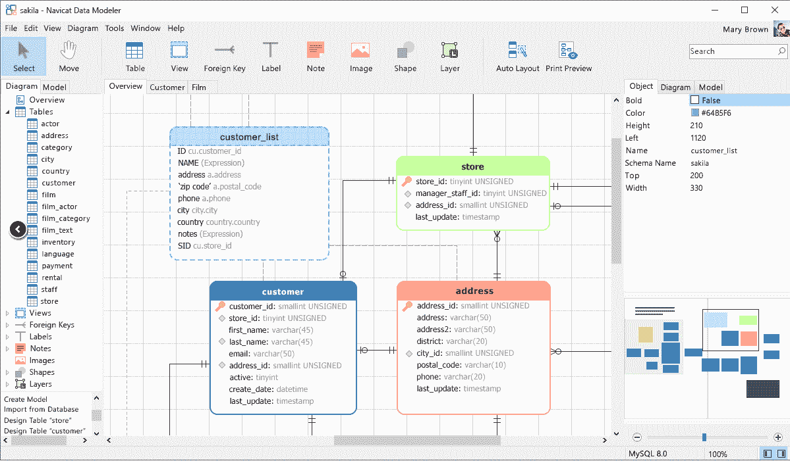

*图片 6。Navicat 数据建模器中的数据模型*

**DBeaver 是数据库开发人员、管理员和分析师的免费工具，兼容所有流行的数据库。基于开源框架，DBeaver 允许开发人员创建和添加程序扩展，增强功能。除其他功能外，该工具还提供了以 ERD 形式查看数据库结构的选项。这些图显示了数据库对象及其用于分析的依赖关系。可以通过拖放元素来编辑布局，但是图只显示了数据库的当前状态。无法保存更改。**

**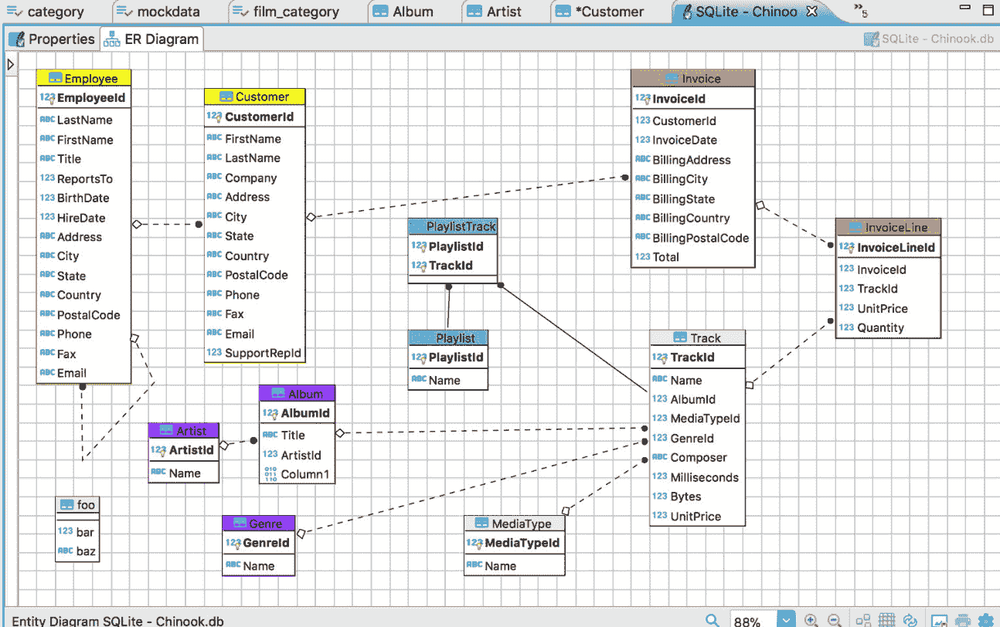**

***图 7。DBeaver* 中的数据模型**

**[**呃/工作室**](https://www.idera.com/er-studio-enterprise-data-modeling-and-architecture-tools)**

**ER/Studio 是数据库设计和数据架构的解决方案。它支持大多数数据库平台，受到许多领域的数据专家的青睐。其强大的数据建模功能使其对逻辑和物理数据库设计都很有用。有一些选项，如自动数据库代码生成、数据建模、从逻辑或物理模型生成 XML 模式、将模型与实际数据库进行比较等。**

**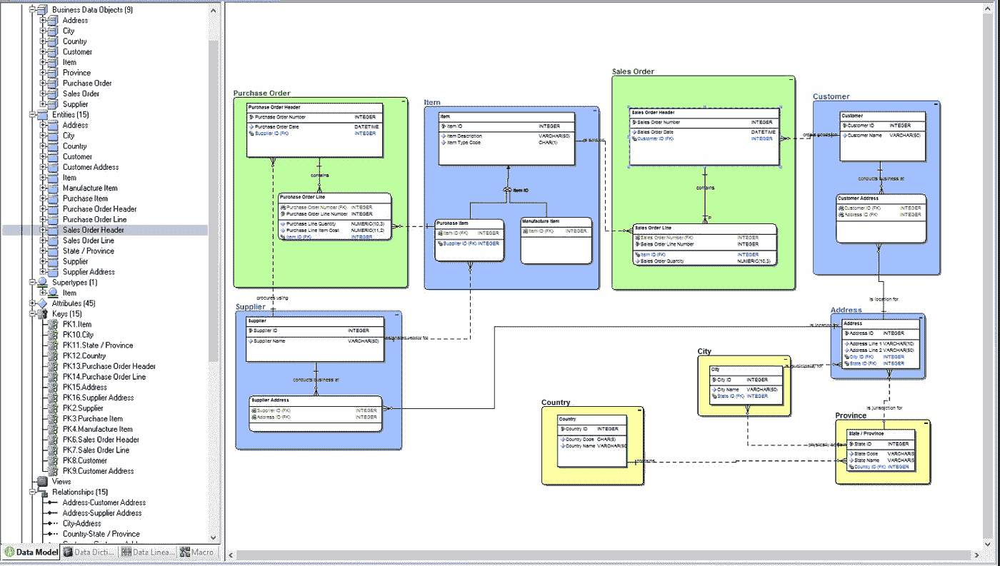**

***图片 8。ER/Studio 中的数据模型***

**在其他流行的工具中，值得一提的是以下工具:**

*   **[PowerDesigner](https://www.sap.com/products/powerdesigner-data-modeling-tools.html)**
*   **[Toad 数据建模器](https://www.toadworld.com/products/toad-data-modeler)**
*   **[TablePlus](https://tableplus.com/)**
*   **[瓦伦蒂娜工作室](https://www.valentina-db.com/en/valentina-studio-overview)**
*   **[DbSchema](https://dbschema.com/)**
*   **[尔 Builder](https://soft-builder.com/erbuilder-data-modeler/)**
*   **[SchemaSpy](http://schemaspy.org/)**
*   **[数据库设计器](https://www.dbdesigner.net/)**
*   **[模式抓取器](https://www.schemacrawler.com/)**
*   **[欧文数据建模器](https://erwin.com/products/erwin-data-modeler/)**
*   **[视觉范式 ERD 工具](https://www.visual-paradigm.com/features/database-design-with-erd-tools/)**
*   **RapidMiner**
*   **[地图商务在线](https://www.mapbusinessonline.com/)**
*   **维尔塔贝洛**
*   **[卢西德哈特](https://www.lucidchart.com/pages/)**
*   **[SQL 数据库建模器](https://sqldbm.com/Home/)**
*   **[HeidiSQL](https://www.heidisql.com/)**
*   **[阿帕奇火花](https://spark.apache.org/)**

**在我们的工作中，我们发现[db forge Studio for SQL Server](https://www.devart.com/dbforge/sql/studio/)是最有用和最方便的。我们将进一步描述如何使用该工具创建[数据库图](https://www.devart.com/dbforge/sql/studio/database-diagram.html)工具，以及如何将这些方法应用于逆向工程。**

****db forge Studio for SQL Server 中数据库图表的主要工程特性****

**前面，我们在专门讨论数据库逆向工程的文章(link)中考虑了正向和逆向工程，并介绍了数据库设计中最流行的可视化工具。现在，让我们继续检查这样一个工具的功能和任务性能。为此，我们选择了[db forge Studio for SQL Server](https://www.devart.com/dbforge/sql/studio/)中的[数据库图表工具](https://www.devart.com/dbforge/sql/studio/database-diagram.html)。**

**该过程的第一步是为 JobEmplDB 数据库创建一个模式。**

**转到所需的数据库，并在“数据库”主菜单中选择“数据库图表”:**

**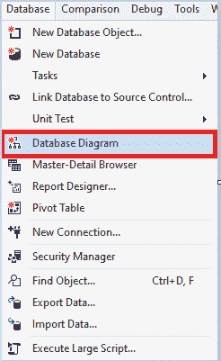**

***图片 9。创建数据库图表***

**按住鼠标左键，将数据库拖动到“数据库图表”区域:**

****

***图片 10。数据库图表***

**现在我们有了 JobEmplDB 数据库的图表。它显示所有对象(表、视图、存储过程)。此外，它还显示了表之间的依赖关系。**

**每个表显示一个约束块和一个索引块。双击特定的依赖项，它会打开关系编辑器:**

**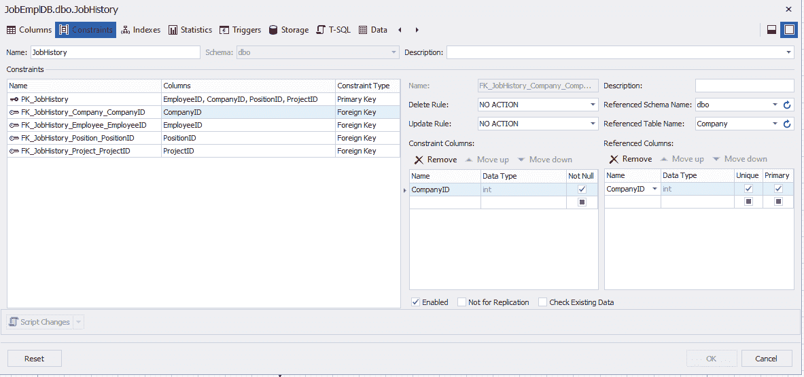**

***图片 11。关系编辑器***

**双击表格打开表格编辑器:**

**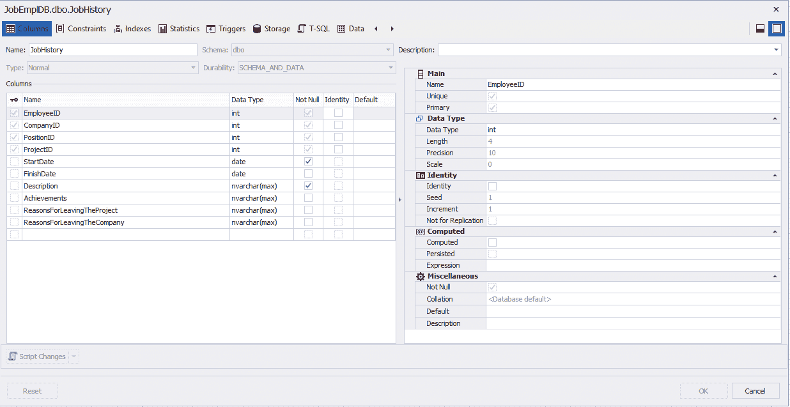**

***图片 12。表格编辑器***

**表格编辑器包括:**

1.  **列的内容和定义。**
2.  **约束的内容和定义。**
3.  **索引的内容和定义。**
4.  **统计学的内容和定义。**
5.  **触发器的内容和定义。**
6.  **T-SQL 选项卡上的表定义。**

**此外，您可以通过转到 Data 选项卡来查看表的内容。**

**还有一个类似的视图编辑器:**

**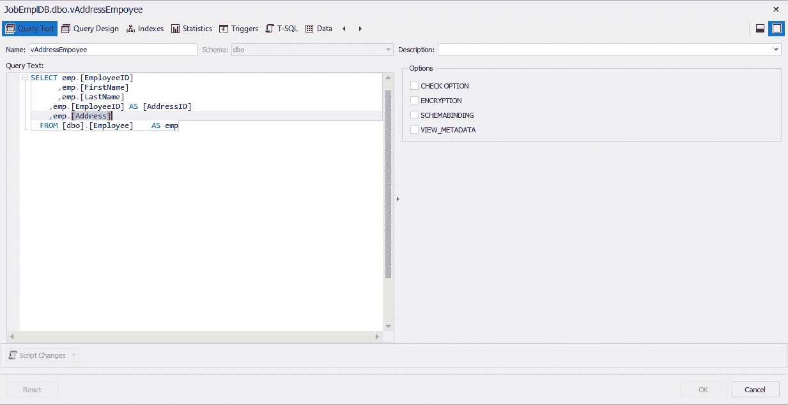**

***图 13。视图编辑器***

**视图编辑器包括:**

**视图的定义。**

**视图定义的图形编辑器。**

**索引的列表和定义。**

**统计的列表和定义。**

**触发器的列表和定义。**

**同样，如果转到 Data 选项卡，您可以查看表的内容。**

**至于存储过程和函数，编辑器也允许更改它们的定义:**

**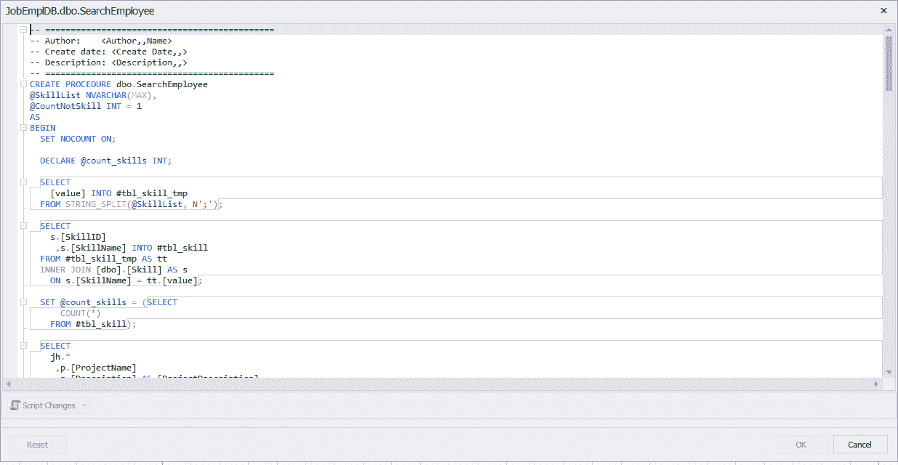**

***图片 14。存储过程/函数的编辑器***

**所有由编辑者引入数据库模型的更改，数据库都会保存自己。因此，您可以用图形方式修改数据库。它促进了正向和反向工程。**

**除此之外,“数据库图表”工具还允许:**

**1)如果有太多单独的项目，则创建可视容器并对对象进行分组:**

**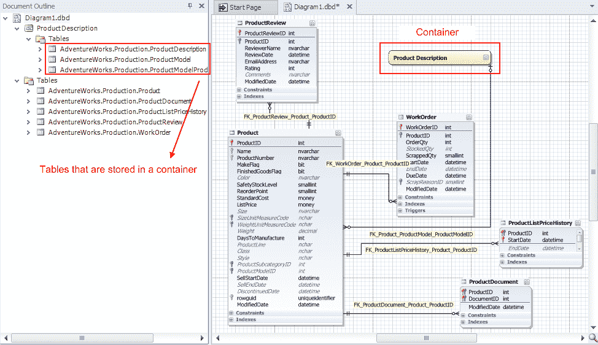**

***图片 15。通过可视容器对对象进行分组***

**2)对特定对象的每个元素或对象本身进行评论。**

**3)创建附加图形元素，以便更好地理解数据库图表:**

**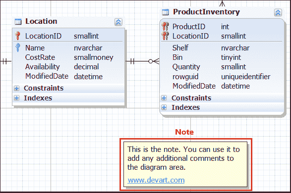**

***图片 16。创建图形元素(注意)***

**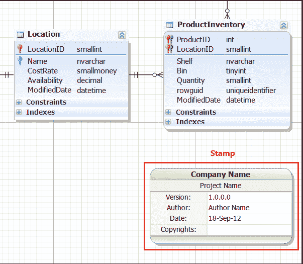**

**图像 17。制作邮票**

**4)优化打印模式:**

**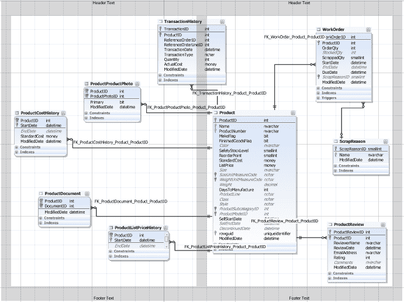**

**图 18。优化模式以打印它**

**5)跟踪表之间的逻辑相关性:**

**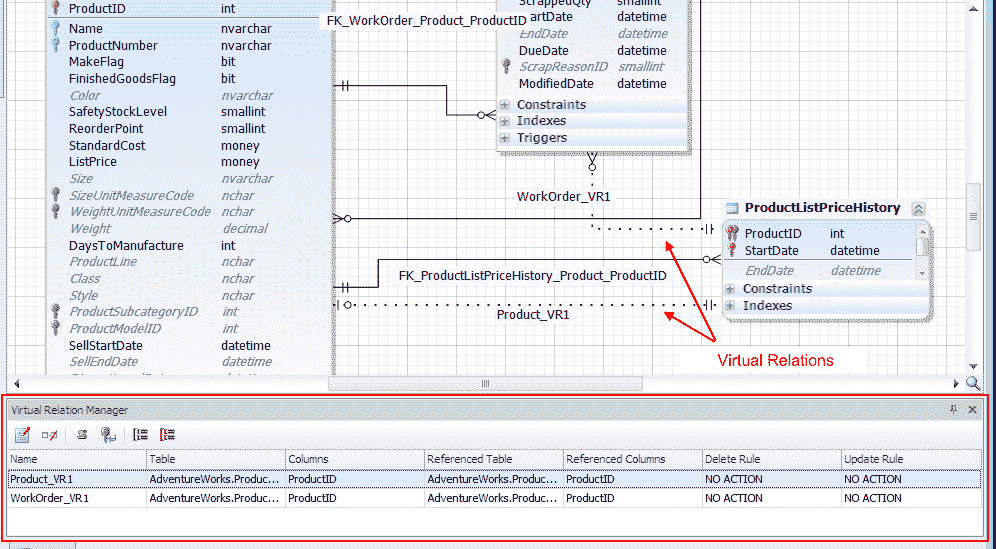**

***图像 19。跟踪表之间的逻辑关系***

****结论****

**作为一个既方便又实用的正向和反向工程解决方案的例子，我们选择了 DbForge Studio for SQL Server 中的[数据库图表工具](https://www.devart.com/dbforge/sql/studio/database-diagram.html)。该工具提供了高效工作所需的所有选项。它有许多优点，但最有帮助的一点是，它使得不必针对系统视图编写查询(包括复杂的查询)来获取 SQL Server 数据库中对象的信息。**

****参考文献**:**

**1)https://docs . Microsoft . com/en-us/SQL/relational-databases/system-catalog-views/catalog-views-transact-SQL？view=sql-server-ver15**

**2)https://docs . Microsoft . com/en-us/SQL/relational-databases/system-information-schema-views/system-information-schema-views-transact-SQL？view=sql-server-ver15**

**3)https://blog . devart . com/SQL-database-design-basics-with-example . html；**

**https://blog . devart . com/generate-test-data-with-SQL-data-generator . html；**

**https://blog . devart . com/export-and-import-JSON-data-via-db forge-data-pump-for-SQL-server . html**

**4)数据库图表**