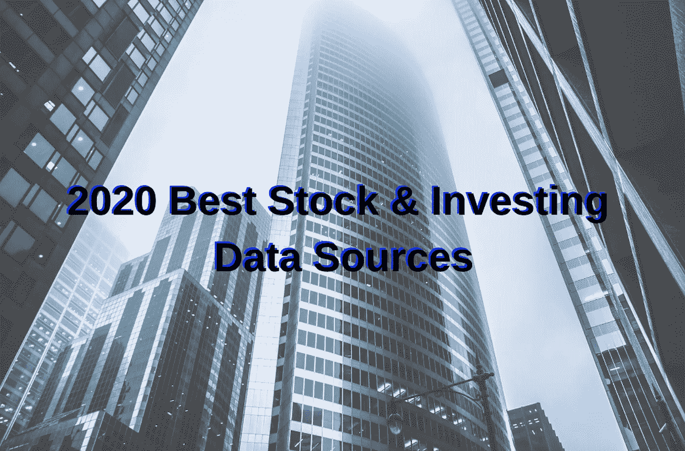
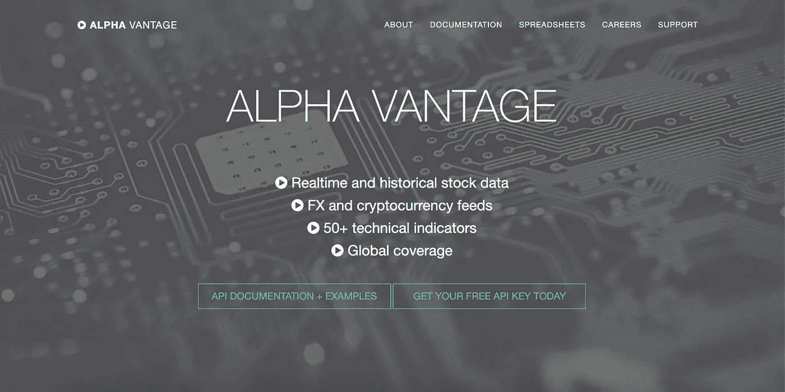
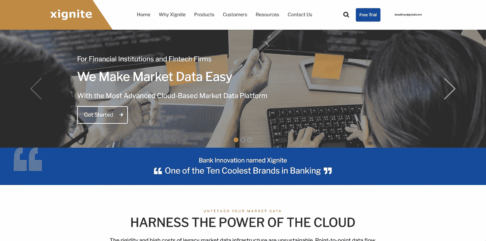
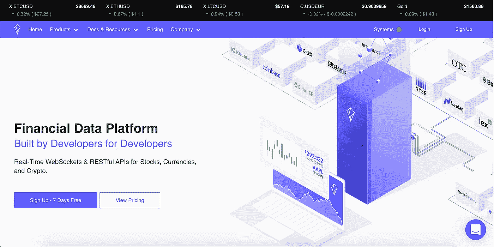
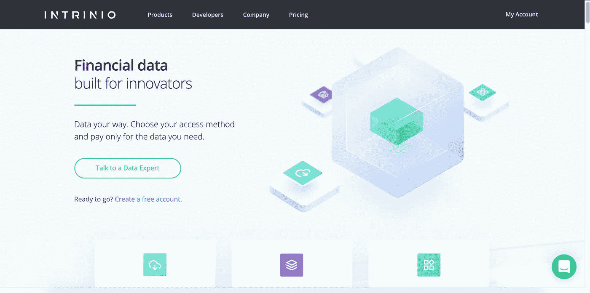
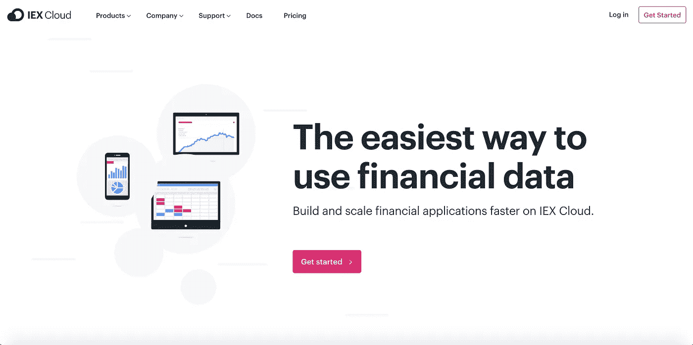
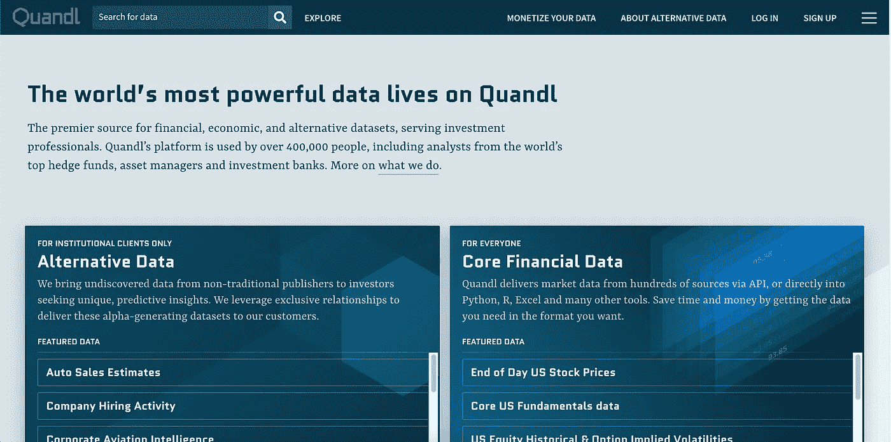
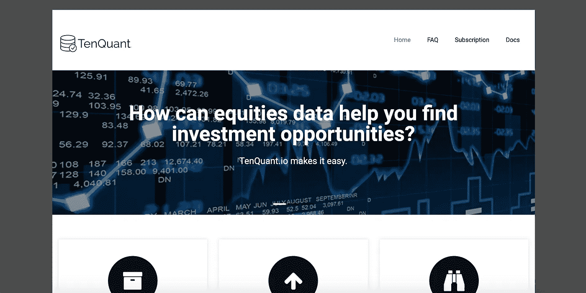

# 库存 API:2020 年最佳 6 个(免费和付费)

> 原文：<https://towardsdatascience.com/best-free-and-paid-stock-market-apis-for-2020-11adb98e7023?source=collection_archive---------1----------------------->

## 6 大股票应用编程接口为你的投资策略和分析提供动力

照片来自 [Essow Kedelina 在 Pexels 上](https://www.canva.com/media/MADGyZknaJ4)

> “我们搜索历史数据，寻找我们不会随机出现的异常模式。”
> 
> ——吉姆·西蒙斯，[复兴科技](https://en.wikipedia.org/wiki/Renaissance_Technologies)的创始人，被认为是有史以来最伟大的量化投资者之一。

在寻找这些模式的过程中，一个标准的 API 会带来很大的不同。

在过去的几十年里，获取数据一直是通过彭博、FactSet、Thompson Reuters、CapIQ 等支付高额费用的网站。两个旗舰产品是[彭博终端和路透社 Eikon](https://www.investopedia.com/articles/investing/052815/financial-news-comparison-bloomberg-vs-reuters.asp) ，每个座位每年的费用在 20，000 美元到 24，000 美元之间，不包括安装或直播费用。

每一种都有它的优点，但是幸运的是，进入这个领域已经没有必要或者经常甚至是有利的了，一个简单的[股票 API](https://www.freecodecamp.org/news/what-is-an-api-in-english-please-b880a3214a82/) 可能是你需要的答案。没有必要在几个千兆字节的数据和一个大的硬件上花钱，在额外的费用后，几乎可以为你买一个新的特斯拉 Model 3。尤其是如果你只需要原始数据来收集你的见解和运行你的测试。

顺便说一句，我希望你不是还在做空特斯拉。图片来自 [electrek](https://electrek.co/guides/tesla-model-3/) 和[维基百科](https://en.wikipedia.org/wiki/Bloomberg_Terminal)。

在过去十年中，提供空间的数据爆炸式增长，为那些希望作为业余爱好者或严肃的专业投资者修补空间的人提供了高质量、低成本的解决方案。作为一个既在对冲基金工作过，经营我自己的爱好算法交易，又在数据提供商工作过的人，数据就是我的生命。我已经购买了几乎所有的订阅，并测试了以下各种用例的提供商。**如果你不是工程师，那也没关系**，他们中的一些人有 excel、google sheets 或其他方法来获取他们的数据，让你的生活更轻松。每一个 API 提供者都有一个商业选项，要么是自助服务，要么是联系他们的支持页面。

以下是最佳整体股市 API 的阵容:

1.  [阿尔法优势](https://www.alphavantage.co/)
2.  [石墨](https://www.xignite.com/)
3.  [Polygon.io](https://polygon.io/)
4.  [Intrinio](https://intrinio.com/)
5.  [IEX 云](https://iexcloud.io/)
6.  [交易商](https://developer.tradier.com/)(和其他经纪公司)

最佳免费股市 API:

1.  [阿尔法优势](https://www.alphavantage.co/)
2.  [IEX 云](https://iexcloud.io/)
3.  [交易商](https://developer.tradier.com/)(和其他经纪公司)

底部是荣誉奖，特别说明，这里有一个链接到当前 Reddit 主题，有更多的见解。

# 1.阿尔法优势

[https://www.alphavantage.co/](https://www.alphavantage.co/)

你看到阿尔法华帝在这么多榜单上名列前茅是有原因的。

当谈到所有人的免费数据时，没有什么能与 Alpha Vantage 相比。凭借最慷慨的免费 tier @ 5 股票 API 调用/分钟& 500 英镑/天，他们允许任何人访问他们的整个数据库，而无需输入任何卡信息。如果你想要额外的[使用](https://www.alphavantage.co/premium/)，他们有一个简单的定价层，你可以为更多的 API 调用付费。

他们的[文档](https://www.alphavantage.co/documentation/)清晰易用，[电子表格支持](https://www.alphavantage.co/spreadsheets/)可用，因此他们拥有大量的 [GitHub](https://github.com/search?utf8=%E2%9C%93&q=alpha+vantage&type=) 追随者。作为雅虎金融幸存者的最初救星之一，他们在上市几年后不断改进。访问 20 年的历史数据，外汇，加密，部门表现，和技术指标，这个 YC 哈佛校友创业是一个全面的“是”，无论是业余投资者还是严肃的专业人士。

Alpha Vantage 的缺点是他们没有太多可供选择的数据类型。除了行业表现和技术指标，它只是价格数据，然而，如果这是你所需要的，这是去的地方。

## 最适合:对想要各种价格数据的业余投资者来说很重要。技术性和非技术性的。

# 2.昔格尼特

[https://www.xignite.com/](https://www.xignite.com/)

如果你不在乎价格，并且想尽可能多地调用 API 来打击数据提供商，那么 [Xignite](https://www.xignite.com/) 绝对是你应该关注的地方。

有了像 [Wealthfront](https://www.wealthfront.com/) 和 [Robinhood](https://robinhood.com/) 这样的客户，他们已经在社区中声名鹊起。拥有最大的数据包选择之一，(按地区付费)，这些家伙没有 API 限制。

与 Intrinio 的支付方案类似，他们通过专注于商业应用市场来区分自己。就技术基础设施而言，他们以可能是最好的股票 API 而自豪。他们有一个 7 天的有限试验计划，这并没有真正做到公正。他们使用数据即服务模式，从 AWS 云中获取数据。

另一家具有强大人际互动的公司，他们有一个销售团队，确保客户感到受到照顾和支持。

这些家伙的缺点是价格。在 Xignite 的平台上，Intrinio 的类似软件包的价格可能是它的五倍多。

## 最适合:严肃的投资者，预算不是问题，或者你不想处理数据库。无论是技术性的还是非技术性的。

# 3.多边形. io

[https://polygon.io/](https://polygon.io/)

[多边形](https://polygon.io/)是如果你把西格尼特和英特里尼奥斯结合在一起，并把它们留在美国境内会发生的事情。

这是我在上次[审查](https://medium.com/@patrick.collins_58673/the-disruptors-in-the-financial-data-industry-f705008b37be)中忽略的一个提供商，这是我不应该做的。他们还拥有无限的 API 请求，并有 3 个简单的价格层，货币+加密，美国股票和企业。我认为它们类似于 Intrinio，但更多地关注美国，这使得它们对我们来说简单而容易。因此，他们的定价可以便宜一点。

为大型网站如 [Robinhood](https://robinhood.com/) 和[羊驼](https://alpaca.markets/)提供支持，他们专注于自己的专业领域，仅美国、加密和外汇市场，并在那里做得很好。一进入这个网站，你就会看到很多关于他们的流媒体和网络套接字的文档，这两个都是很棒的产品。

## 最佳选择:专注于美国的严肃投资者。技术用户优先。

# 4.Intrinio

【https://intrinio.com/ 

Intrinio 是一个不同于前两个版本的怪物。

尽管 Alpha Vantage 可能是大众化免费数据的领导者，Intrinio 可能是各种替代数据的女王。Intrinio 平台最吸引人的地方之一是其庞大的资料库，其中包含了极其具体和另类的数据，有超过 [300 个提要](https://product.intrinio.com/marketplace/financial-data?category=all&geography=all)！

他们有大量自己开发的 SDK，当你进入网站时，在右下角有一个聊天框。一进入网站，就能看到一个对真人的快速、可用的客户支持，并与之聊天。在他们的免费试用中有一点限制，在你决定选择一个之前，他们允许你对每个软件包有一个好的感觉。

与上述两者的费率限制相反，Intrinio 是按套餐付费的，这意味着你要为你想要的数据付费。从[爱尔兰证券交易所](https://product.intrinio.com/financial-data/irish-stock-exchange-prices)的价格到[美国高级分析包](https://product.intrinio.com/financial-data/advanced-analytics)的一切都非常具体，所以你可以得到你想要的东西。

每个套餐都有自己的使用条款和费率限制，因此在订购套餐之前，您必须检查这些条款。他们的用户界面上还有学生、创业、军事和商业价格。

对于那些只想获得基本价格数据的人来说，他们的平台可能是压倒性的，或者比你想要的更多。一旦你开始尝试获取一些不同地区的数据，价格就会开始上涨。他们的自由层很弱，经常与 Quandl 竞争 alt。数据客户端。

## 最适合:认真的投资者，他们重视支持，想要替代数据。无论是技术性的还是非技术性的。

# 5.IEX 云

[https://iexcloud.io/](https://iexcloud.io/)

我是《[闪光男孩](https://www.amazon.com/Flash-Boys-Wall-Street-Revolt/dp/0393351599)》这本书的忠实粉丝，喜欢 IEX 正在寻找的东西，他们的衍生产品 [IEX 云](https://iexcloud.io/)也做得很好……但也许没有他们的交易所好。

有了这个条目，我们回到了一个真正免费的数据提供商，这是另一个你现在可以免费打电话的平台。

IEX 云正在不断更新，他们甚至增加了一些有前途的饲料保费数据功能。当涉及到来自 IEX 交易所的任何类型的数据时，他们都是准确无误的。对这些人来说，美国的价格不是问题。他们在试图增加其他交易所数据时会遇到一些问题，有时并不像人们希望的那样准确。

该集团拥有最独特的支付结构，他们每月在按消息付费平台上工作。所以每个月你都有一定数量的“消息”。消息是他们在文档中描述的单元。每个 API 调用都返回一个“[数据权重](https://iexcloud.io/docs/api/#data-weighting)属性，它们告诉您已经使用了多少条消息来进行该调用。邮件的大小变化很大，由你来决定这个月要使用多少邮件。

尽管有不同类型的数据，并且是最便宜的替代方案之一，IEX 云是一个稳定的、不断进步的平台，并且在我看来是全国最好的交易所之一，其使命是保持市场公平。

## 最适合:对业余投资者严肃的投资者，主要集中在美国。技术优先。

# 6.交易商(和其他经纪公司)

[https://developer.tradier.com/](https://developer.tradier.com/)

有一些很棒的平台将获取市场数据与他们的交易平台结合起来， [Tradier](https://developer.tradier.com/) 就是其中之一。

他们背后有一个了不起的社区，一个简单的注册他们的开发者平台，你可以立即开始获得我们延迟的数据(15 分钟)。这是大多数经纪公司拥有类似功能的标准，但如果您升级到他们的完全经纪账户，他们也可以选择获得实时和国际数据。

经纪账户是免费的，但他们有一些闲置费用，所以如果你想要这些数据，你必须要么在他们的平台上交易，要么承担闲置费用(根据你的使用情况，可能会更便宜)

对于廉价的纯价格数据解决方案，Alpha Vantage 或 IEX 云最有可能是更简单的集成，但也许从同一个平台获得一切(如果他们有足够的数据，没有速率限制)，这可能是一个可靠的选择。

## 最适合:想要交易和使用来自同一个平台的数据的严肃或业余投资者。最好是技术类的。

# 荣誉奖

[https://www.quandl.com/](https://www.quandl.com/)

https://www.tenquant.io/

[Quandl](https://www.quandl.com/):Intrinio 的类似产品和替代数据，如果 Intrinio 没有你想要的，就去这里。他们专注于出售 alt 数据。

Tenquant :可能是最好的后起之秀，一个仍在建设中的基本面聚焦项目。

# 拥有市场数据的券商:

1.  [羊驼](https://alpaca.markets/) —仅限美国，但你可以开立纸质账户并获取数据，使用 live 账户可以从 Polygon 获取数据。你可以进行纸上交易并获取数据，而不必在他们那里开立经纪账户，然后在你准备好的时候升级。
2.  [互动经纪人](https://www.interactivebrokers.com/en/home.php) —另一个数据和量化投资平台，他们有多个教程帮助你入门。这是另一家在网上有大量业务的券商。
3.  [ETRADE](https://us.etrade.com/home?sr_id=BR&mp_id=57103585905&ch_id=p&gclsrc=ds) ， [Ally](https://www.ally.com/invest/) ， [Thinkorswim](https://www.tdameritrade.com/tools-and-platforms/thinkorswim/features.page) …许多主要的大公司也有市场数据 API。费用和费率限制各不相同。

# 跟进想法

社区很幸运在数据领域有这么多的参与者，特别是在 2012 年 Google Finance 股票 API 和 2017 年 Yahoo Finance 股票 API 停止使用之后。到目前为止，这两家公司似乎都没有文档或计划回归，而且有很多猜测关于他们为什么首先关闭。

需要警惕的一个关键问题是，如果一个股票 API 提供商提供特定的交易所数据，而你不必与该特定的交易所签署协议，这通常是不合法的。一些交易所对谁以及如何消化他们的数据非常严格，如果你使用他们的数据，通常你必须以某种方式向他们付费。有时候，这些可能是非法出售数据的供应商，那些证券交易所会跟踪他们，以确保他们不会持续很久。

那么你最喜欢哪些提供商呢？哪些数据提供商最适合哪些经纪人？请在下面的评论区告诉我！

你可以继续阅读我剩下的文章，或者看看我的[最新文章](https://medium.com/@patrick.collins_58673/stock-api-landscape-5c6e054ee631)！

*这篇文章中的所有观点都是我个人的，并不代表我现在和以前雇主的观点。*

*可以在*[*Twitter*](https://twitter.com/PatrickAlphaV)*[*Medium*](https://medium.com/@patrick.collins_58673)*上关注我，或者在*[*GitHub*](https://github.com/PatrickAlphaC)*上找我。**

**最后更新日期:2020 年 5 月 4 日**