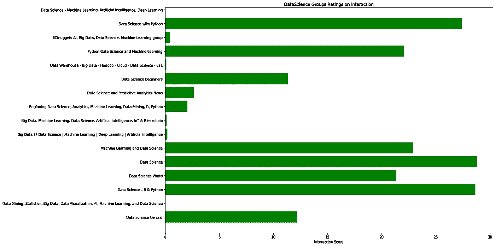
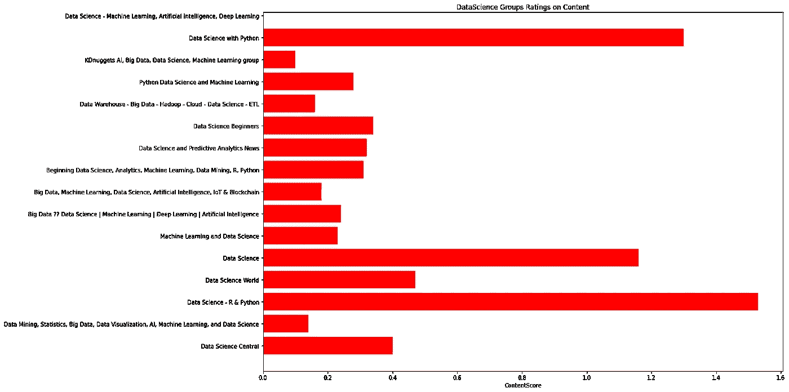
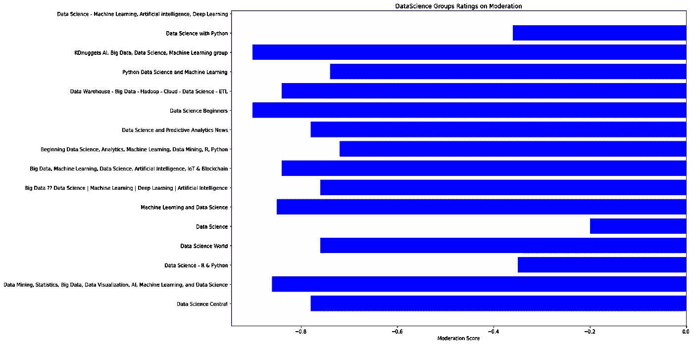
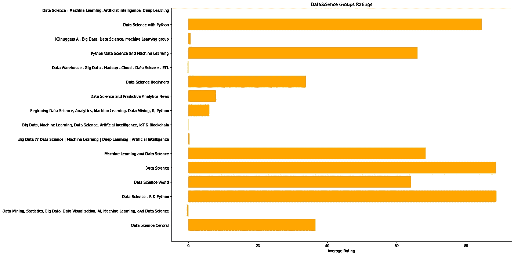

# 数据科学家加入的最佳团体

> 原文：<https://towardsdatascience.com/best-groups-to-join-for-data-scientists-97a63d585af8?source=collection_archive---------13----------------------->

照片由[杜凡](https://unsplash.com/@miinyuii?utm_source=unsplash&utm_medium=referral&utm_content=creditCopyText)在 [Unsplash](https://unsplash.com/s/photos/groups?utm_source=unsplash&utm_medium=referral&utm_content=creditCopyText) 上拍摄

## 基于内容、互动和适度评分的评级

**“有良伴相伴，路漫漫其修远兮。”——**土耳其谚语。

我们谨慎地选择我们的朋友、同事和熟人，因为我们知道在一个好的公司里有多重要，社交网络也不例外。

我们加入脸书和 LinkedIn 上的群组；Twitter 和 Instagram 上的页面，了解数据科学的最新发展，提出与我们工作相关的问题，并建立联系。

我们分析了这些社会群体的质量，特别是对数据科学家来说，有三个参数。

> **1。互动:**群体成员在群体中的活跃程度如何？
> 
> **2。内容:**这些群里交流的是什么样的内容？
> 
> **3。适度:**集团是否没有潜在的垃圾邮件和误导性广告和促销？

**数据集:**数据收集自脸书和 LinkedIn 上每个群组的最后 50 篇帖子。所有在脸书和 LinkedIn 上拥有超过 5 万名成员的群体都被考虑在内。该数据*是从 2020 年 8 月 24 日至 2020 年 8 月 28 日收集的。数据存放在[https://www . ka ggle . com/shrasthisinghal/data-science-social-groups-survey](https://www.kaggle.com/shrashtisinghal/data-science-social-groups-survey)

# **调查中的群体列表:**

> 数据科学中心
> 
> 数据挖掘、统计学、大数据、数据可视化、人工智能、机器学习和数据科学
> 
> 数据科学— R & Python
> 
> 数据科学世界
> 
> 数据科学
> 
> 机器学习和数据科学
> 
> 大数据▶️数据科学|机器学习|深度学习|人工智能
> 
> 大数据、机器学习、数据科学、人工智能、物联网和区块链
> 
> 开始数据科学，分析，机器学习，数据挖掘，R，Python
> 
> 数据科学和预测分析新闻
> 
> 数据科学初学者
> 
> 数据仓库—大数据— Hadoop —云—数据科学— ETL Python
> 
> 数据科学和机器学习
> 
> KDnuggets AI，大数据，数据科学，机器学习组
> 
> 使用 Python 的数据科学

# **按平均分降序排列的组别**

数据科学组排名

# **完成调查结果:**

互动分数条形图

内容分数条形图

适度分数条形图

平均分数条形图

# **见解:**

> 1.脸书上的数据科学小组比 LinkedIn 上的小组表现更好。
> 
> 2.没有推广内容的小组在互动得分上表现不佳。
> 
> 3.越大越好并不总是正确的。一些成员数量最多的组实际上是成员之间的交互可以忽略不计的死组。
> 
> 4.这些群体中的大多数人是为了推广内容而不是其他活动。
> 
> 5.数据科学世界、机器学习和数据科学、Python 数据科学和机器学习等团体在团体中主要有推广内容；尽管如此，成员之间的互动和对内容的欣赏在组成员中是很高的。建议这些群组推广与数据科学相关的内容、公司和产品。
> 
> 6.像数据科学研究与 Python、数据科学和数据科学与 Python 这样的小组适合询问数据科学相关的问题、职业指导和工作职位。

# **互动评分:**

*脸书新闻主管亚当·莫瑞西说，评论往往比赞更有意义，而且“对接收者来说，较长的评论往往比较短的评论更有意义。”*

没有定义的方法来计算喜欢、短评论和长评论之间的关系。因此，我们武断地将它理解为以下社交媒体领导者的观点。

互动得分将是以下比例的喜欢、短消息和长消息的加权平均值。

> 喜欢- 0.5
> 
> 短评- 1.5
> 
> 长注释- 3

# **内容评分:**

技术小组应该是你看到与技术相关的内容的地方。我们对一个群体中受欢迎的内容类型进行了评分。

> 数据科学迷因:0.5
> 
> 数据科学资源:1
> 
> 职业讨论:1
> 
> Bug 讨论:2
> 
> 实时会话:2.5
> 
> 工作机会:1
> 
> 面试讨论:2
> 
> 数据科学问题:2
> 
> 通用数据科学岗:1

# **审核分数:**

> 宣传 YouTube 内容:-1
> 
> 宣传资料:-1
> 
> 促销网站:-1
> 
> 垃圾邮件:-2

# **平均评分:**

互动比内容更重要，因为它告诉我们群体中人们的参与度。即使内容是一般的、不合标准的或宣传性的，它仍然服务于某些目的，但是如果没有群体成员的参与，这个群体就死了。

> 平均分:(3*互动分)+(2 *内容分)+(1 *适度分)

请随意探索数据集，下载以收集更多见解，并就评分、数据收集或见解发表评论。

在那之前，祝你学习愉快。先谢了