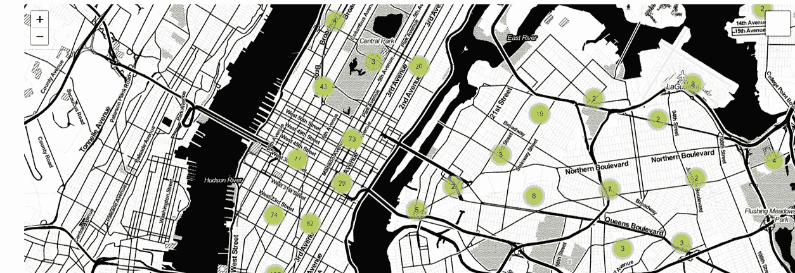
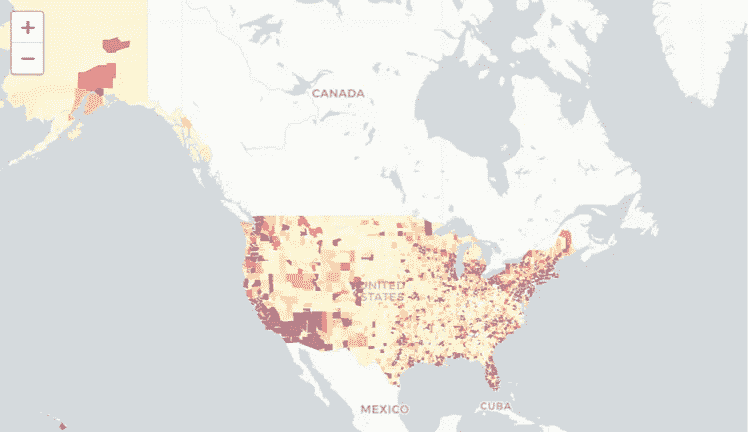
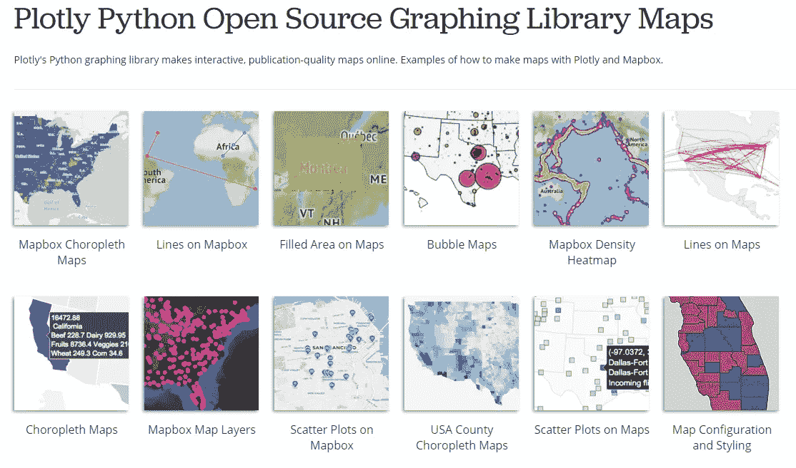
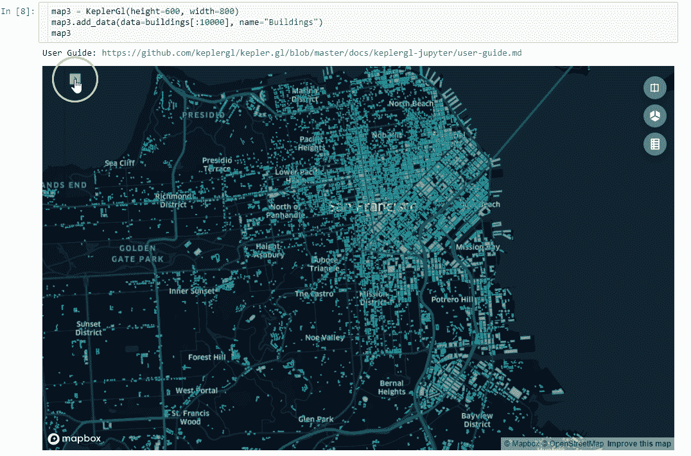
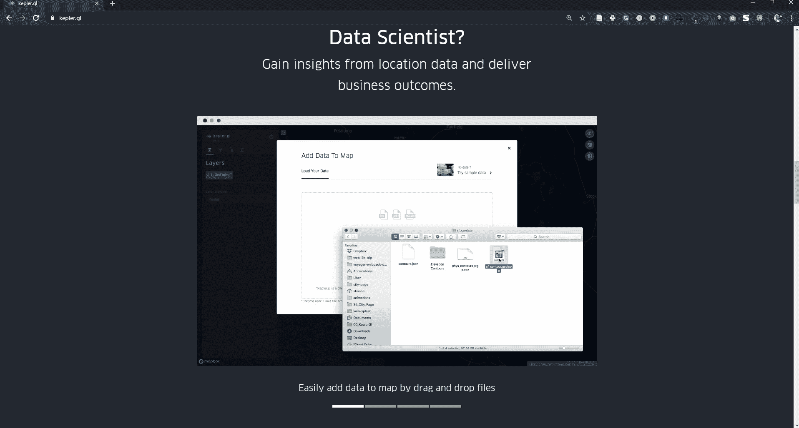
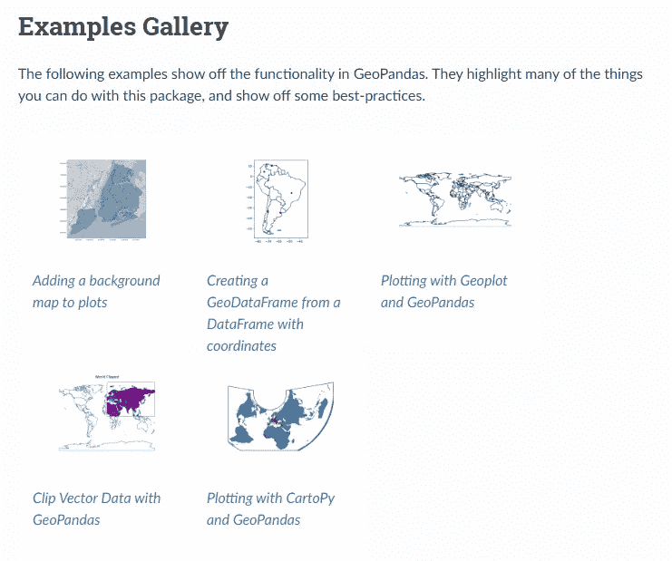
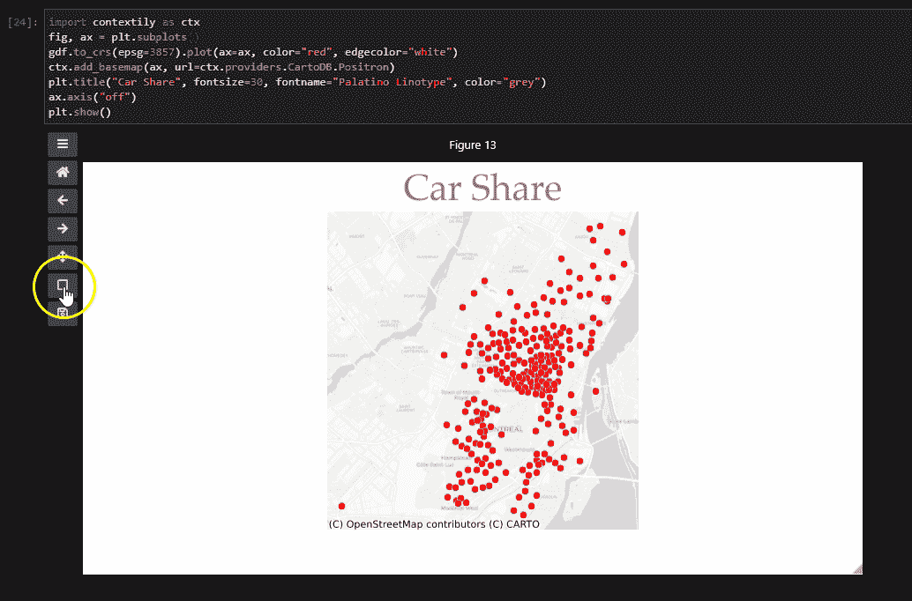

# Python 中地理空间数据可视化的最佳库

> 原文：<https://towardsdatascience.com/best-libraries-for-geospatial-data-visualisation-in-python-d23834173b35?source=collection_archive---------7----------------------->

## 空间数据可视化的 10 大 Python 库


安德里亚娜·博济奇在 [Unsplash](https://unsplash.com?utm_source=medium&utm_medium=referral) 上的照片

地理空间数据无处不在，随着新冠肺炎可视化的出现，我们看到了使用地理空间数据可视化工具的高峰。对于 python 用户，我们有几个强大的空间数据可视化库。在本文中，我将分享一些 Python 生态系统中地理空间数据可视化的最佳包。

我们涵盖了 Python 中 6 大地理空间数据可视化库，以及它们提供的一些示例功能。

## 1.PyViz/HoloViz(Geoviews、Datashader、HvPlot)

Holoviz 维护的库拥有你可能需要的所有数据可视化，包括仪表板和交互式可视化。特别是 Geoviews，其专用的地理空间数据可视化库，提供了易于使用和方便的地理空间数据。

> G [eoViews](https://geoviews.org/#) 是一个 [Python](http://python.org/) 库，它使得探索和可视化地理、气象和海洋数据集变得容易，例如那些用于天气、气候和遥感研究的数据集。

[Geoviews](https://geoviews.org/) API 提供了直观的界面和熟悉的语法。使用 Geoviews 绘制地理空间数据非常简单，并且提供了交互性。让我们看一个使用 Geopandas 数据集的例子。

```
**import** **geoviews** **as** **gv**
**imporg geopandas as gpd**gv.Polygons(gpd.read_file(gpd.datasets.get_path('naturalearth_lowres')), vdims=['pop_est', ('name', 'Country')]).opts(
    tools=['hover'], width=600, projection=crs.Robinson()
)
```


世界国家图-地理视图

如果你想开始，这里有 Geoviews 的初学者指南教程。

[](/interactive-geospatial-data-visualization-with-geoviews-in-python-7d5335c8efd1) [## 使用 Python 中的 Geoviews 进行交互式地理空间数据可视化

### 如何开始使用 Geoviews 的初学者指南。

towardsdatascience.com](/interactive-geospatial-data-visualization-with-geoviews-in-python-7d5335c8efd1) 

此外，PyViz 生态系统提供了其他可以处理地理空间数据的库，包括 hvPlot，它可以将您的数据可视化提高到一个新的水平。

HvPlot 允许用户使用不同的数据类型，并可以扩展其他 Python 库的使用，包括 Pandas、Geopadnas、Dask 和 Rapids。

[Datashader](https://datashader.org/) 也是处理大数据的地理空间数据科学家的另一个必备数据可视化库。它将该过程分为多个步骤，并行运行，以快速创建大型数据集的可视化。

最后， [Panel](https://panel.holoviz.org/) ，Python 的高级应用和仪表板解决方案，提供了一个易于使用的界面，可以使用 Jupyter 笔记本创建交互式 web 应用和仪表板。

## 2.薄层

Folium 广泛用于地理空间数据可视化。它建立在 fleed . js 的基础上，通过其强大的插件可以覆盖 Python 中的大多数制图需求。

> follow 构建在 Python 生态系统的数据优势和 fleet . js 库的映射优势之上。在 Python 中操作您的数据，然后通过 leav 在活页地图中可视化它。

leav 入门很简单，可以简单的调用 leav。地图立即可视化底图。然后，您可以添加图层，以便在 follow 中提供的交互式底图上显示您的数据。

```
**import** **folium**m = folium.Map(location=[45.5236, -122.6750])
m
```

下面是一些使用 Here 库功能和插件的例子。



聚类标记(左)—带叶的聚类图(右)

## 3.巧妙的表达

Plotly 及其高级 API 库 Plotly Express 具有广泛的地理空间数据可视化功能。尽管缺少对 Geopandas 地理数据框架的本地支持，但该库拥有许多制图类型和易于使用的 API。随着 2019 年 Plotly Express 的推出，使用 Plotly 创建地理空间可视化变得更加容易。

以这个动画 Choropleth 地图为例，Plotly Express 只用一行代码就完成了。与其他库相比，实现这一点可能需要您编写大量代码，并破解不同的解决方案。

通过 [Dash](https://plotly.com/dash/) ，一个在数据科学中广泛使用和下载最多的 web 应用，Plotly 提供了一个部署 web 应用的完整解决方案。借助 Plotly Express 直观 API 和 Dash Plotly，您可以将地理空间网络应用程序和可视化提升到一个新的水平。



Plotly 地理空间数据可视化 Galery 的例子。

## 4.开普勒格尔

[kepler.gl for Jupyter](https://github.com/keplergl/kepler.gl/blob/master/docs/keplergl-jupyter/README.md) 是一款优秀的大地理空间数据可视化工具。它结合了世界一流的可视化工具、易于使用的用户界面(UI)以及 python 和 Jupyter 笔记本的灵活性。

只需几行代码和 Jupyter 笔记本中易于使用的界面，您就可以使用 Kepler GL for Jupyter Python 库创建美观的地理空间数据可视化。下面的 GIF 展示了使用 Python 中的 Kepler GL 进行 3D 映射的一些可能性。



kepler.gl 是一个基于网络的大型地理空间数据集可视化工具，建立在 T2 deck . GL 的基础上。优步在 2018 年将其开源，其功能令人印象深刻。您可以轻松地拖放您的数据集，并在 web 上立即调整它，以便轻松地可视化大规模地理空间数据集。



开普勒 GL 网络界面

开普勒 GL 的 web 界面非常优秀。然而，如果你喜欢使用 Jupyter 笔记本，同样的功能现在也可以在 Jupyter 笔记本上使用。开始使用 Kepler GL for Jupyter notebook 很容易。您可以咨询此资源，让您立即投入使用。

[](/kepler-gl-jupyter-notebooks-geospatial-data-visualization-with-ubers-opensource-kepler-gl-b1c2423d066f) [## 开普勒。GL & Jupyter 笔记本:优步开源开普勒的地理空间数据可视化。标距长度

### 在 Jupyter 笔记本中绘制地理空间数据&轻松地与开普勒的用户界面交互以调整可视化。

towardsdatascience.com](/kepler-gl-jupyter-notebooks-geospatial-data-visualization-with-ubers-opensource-kepler-gl-b1c2423d066f) 

## 5.IpyLeaflet

IpyLeaflet 是另一个令人印象深刻的地理空间数据可视化工具，它建立在 Jupyter Widgets 和传单可视化库之上。因此，如果你喜欢使用叶库，你应该感觉在正确的地方使用 IpyLeaflet 和 Jupyter 笔记本。

IpyLeaflet 中的交互功能是无与伦比的，因为小部件支持双向交互。因此，您的地图不仅是交互式的，而且可以捕捉用户输入来触发新的计算。

例如，*分割贴图*控件可用于比较不同的 IpyLeaflet 层。

## 6.地质公园



Geopandas 示例库

如果您碰巧用 Python 处理或争论地理空间数据，Geopandas 无需介绍。它是研究地理空间数据科学的主力，在处理地理空间数据方面做了许多繁重的工作。

我总是用 Geopandas 来结束静态地图的可视化，因为用 Geopandas 和它的。绘图界面。主要的缺点是它只提供静态地图。

然而，最近针对底图的[和针对交互式 matplotlib 图的](https://github.com/geopandas/contextily)[*IPYMPL*](https://github.com/matplotlib/ipympl)*的改进和补充使得使用 Geopandas 创建交互式地图变得更加简单。*

**

*使用 Ipympl 的交互式 Geopandas 地图*

*上面的 GIF 展示了 Geopandas 图与 Ipympl 的交互性。如果你想开始使用这种交互性，这是一篇初学者指南博文。*

*[](/how-to-produce-interactive-matplotlib-plots-in-jupyter-environment-1e4329d71651) [## 如何在 Jupyter 环境下生成交互式 Matplotlib 图

### 使用所有使用 Matplotlib 的 Python 库创建交互式绘图/地图

towardsdatascience.com](/how-to-produce-interactive-matplotlib-plots-in-jupyter-environment-1e4329d71651)* 

# *结论*

*本文分享了 Python 生态系统中一些最好的地理空间数据可视化工具。我们已经介绍了 Python 中 6 大地理空间可视化库。如果你认为我们错过了这里的一些图书馆，请告诉我。*