# 巴西弗洛里亚诺波利斯(北岸)新企业的最佳地点:Foursquare 数据分析

> 原文：<https://towardsdatascience.com/best-places-for-new-businesses-in-florian%C3%B3polis-brazil-north-shore-a-foursquare-data-analysis-1a6034024011?source=collection_archive---------54----------------------->

## 数据显示了哪些机会？

**简介**

**背景**

巴西因里约热内卢或圣保罗而闻名。但是巴西最南部的一个州在一个岛上有一个奇特的首都。或者说大部分资本都在这个岛上。我说的是弗洛里亚诺波利斯。

与田园诗般的岛屿(圆形)不同，“圣凯瑟琳岛”实际上…很长。北岸和南岸相距 54 公里(约 33 英里)。

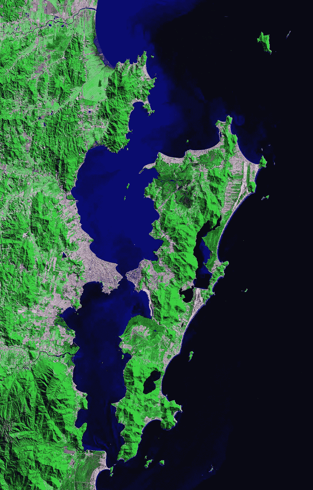

美国宇航局—【https://zulu.ssc.nasa.gov/mrsid/】T4，公共领域，[https://commons.wikimedia.org/w/index.php?curid=1214933](https://commons.wikimedia.org/w/index.php?curid=1214933)

这个岛与大陆的连接很近，只有一点有桥，而且几乎在岛的中心。

岛的中心是一个大城市，拥有一个城市所拥有的一切:大型建筑、商店、交通。但是有些地方非常平静，可以在美丽的海滩上享受“悠闲”的生活。

在夏天，许多游客去享受海滩，把这个平静的地方变成了一个拥挤快乐的夏日空间。但要在北岸建立业务，这一年的运动意味着一场噩梦。有时候，夏天开放并不意味着冬天也开放。

住在北岸的人抱怨超市或面包店的基本需求选择少。远离岛中心的闹市区，这是一个大问题。

**挑战**

因此，我决定分析 Foursquare 的数据，以发现一个新的企业可以在什么地方满足人们的需求。这个想法是对商业和人类的新的可能性进行一个伟大的数据驱动的分析。

**数据和我将如何解决问题**

我将从 Jurerê、Canasvieiras、Cachoeira do Bom Jesus 和 Foursquare 的 Ponta das 卡纳斯的邻居那里收集场地数据。我将根据类型进行分类，绘制一张地图来了解不同的需求。

我将根据种类和邻近程度对这些场所进行分类，以总结出哪些业务已经占据了这些邻居的很大一部分空间。

我还会对邻居进行聚类，以识别那些没有统一数量的不同场所。

最后，我会列出每个邻居不同的地点和场所类别，以此来帮助那些想开始新事业的人。

谁会对这个项目感兴趣？

想在巴西 Florianópolis 北岸开一家新企业的人。

居住在 Florianópolis 北岸并希望了解附近更多商业选择的人。

**方法论**

选择的是定量方法。

**我是如何得到数据的**

使用一些流行的 Python 库，我开始定义要分析的邻域:Jurerê Leste、Jurerê Oeste、Canasvieiras、Cachoeira do Bom Jesus 和 Ponta das 卡纳斯。

我得到了地理编码，其功能可以连接到 ArcGIS 服务。有了这些信息，我建立了一个数据框架。为了了解我的地理编码是否正确，我测试了绘制地图。

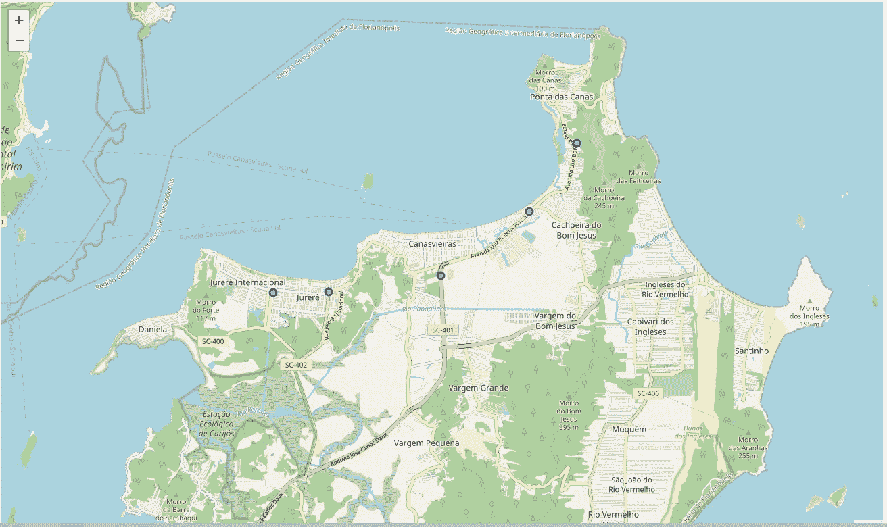

*作者图片——叶子情节*

确定一切正常后，我继续使用 Foursquare API 收集 Foursquare 数据。我将 JSON 中的数据标准化，使用 Pandas 函数来获取所展示场馆的类别类型，并根据需要进行各种调整，以获得包含街区、场馆名称、类别以及地理位置的数据框架。

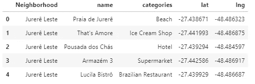

第一次分析表明需要进行调整。因此，我得到了列类别的独特值，去掉了一些与研究目的不相关的值，如“海滩”、“度假村”和“住宅建筑”。

绘制地图，这是新的面貌:

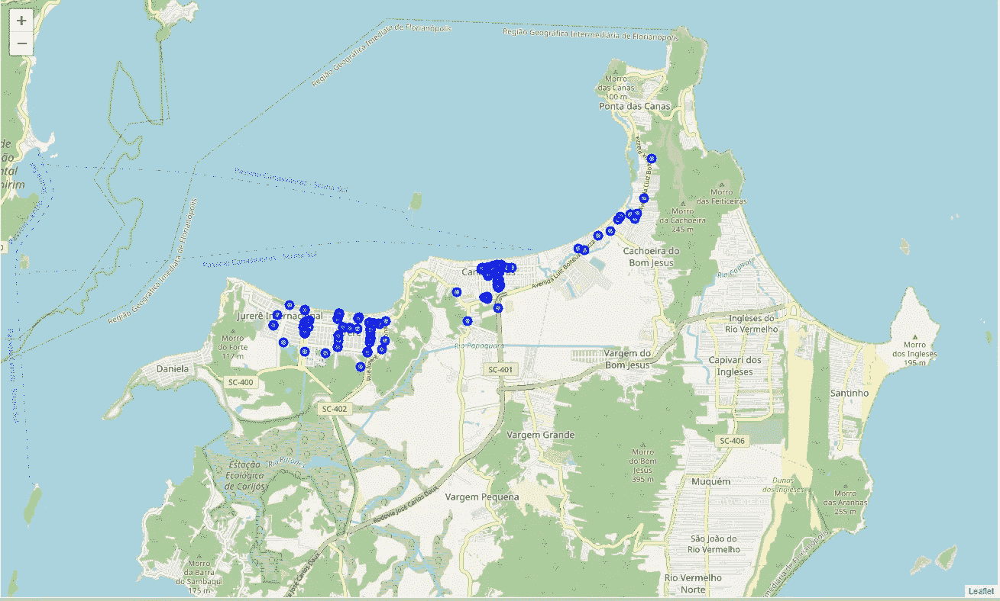

*作者图片—叶子图*

我对分类不满意。即使是描述商业，他们中的一些人显然过于详细，这使得人们很难想象街区的必需品。所以我创建了“类”，一种理解类别的方式，一个“宏观”的类别。它们是:"酒吧/餐厅"、"药房"、"娱乐"、"健身"、"面包店"、"夜生活"、"商店"、"咖啡馆/小吃"、"市场"、"宠物"和"彩票"。

**分析**

我从不同种类的数据框架中获取这些数据来绘制和理解信息。我决定绘制一个水平条形图，以直观显示每个社区的主要业务种类。

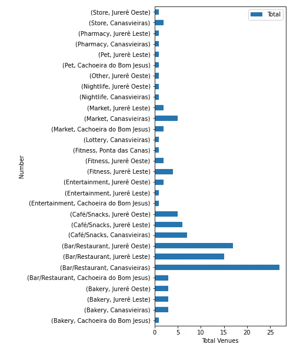

*作者图片*

对于这种数据帧格式:

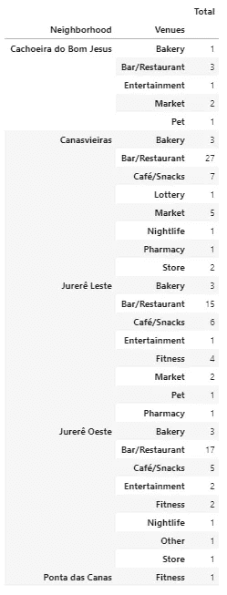

*作者图片*

在这一点上，我注意到一件重要的事情:不是所有的社区都有所有类别的业务。我需要在数据框中添加一些代表“0”业务类别的行。

我创建了一个函数，它扫描每个街区的所有类别，并给出每个街区缺少哪些类别的信息。

在每个社区数据框中添加了所有的“0”类别后，我开始靠近社区看。

我开始为每个街区绘制新的图表，与最近的邻居进行比较。

**Jurerê Leste**

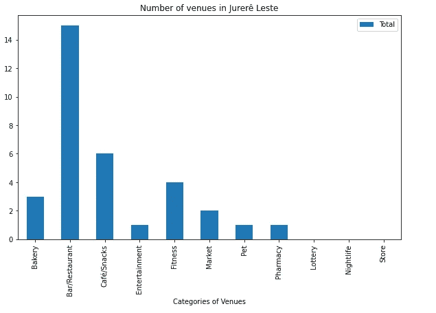

*作者图片*

Jurerê Leste 被称为“传统的 Jurerê”，这里有很多房子，是一个放松的地方。下一个街区 Jurerê Oeste 以“时尚之地”闻名，到处都是豪宅和一些夜总会。但作为一个旅游目的地，餐馆是一种趋势。

**Jurerê Oeste**

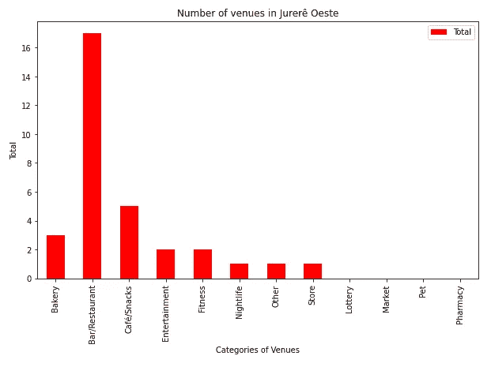

*作者图片*

好像一样？但不是！Jurerê Oeste，时尚而富有的邻居，显示几乎相同数量的餐馆(再次，旅游目的地！)，但是可以看到丰富的夜生活和一些店铺。几乎相同，但不同的场地显示出明显的偏差。

**比较 Jurerê Leste 和 Jurerê Oeste**

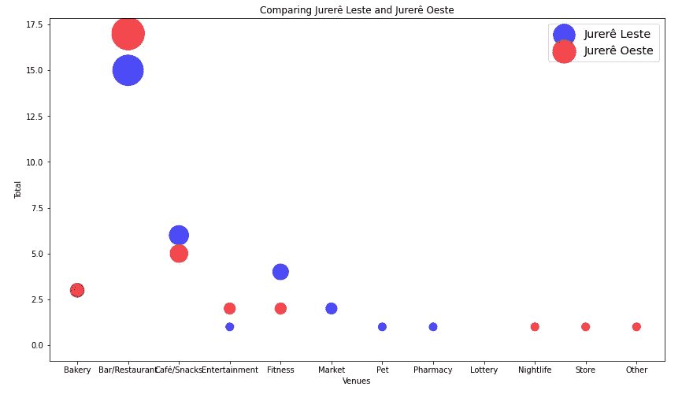

*作者图片*

并排比较两个街区，你可以理解每种偏见(魅力或住房)的影响，也可以理解旅游目的地理念的影响。对于几乎相同数量的餐馆和咖啡馆，我们还可以看到一些所需的服务，这些服务可以在一个地方得到验证，但不能在另一个地方得到验证。先前完成的分析显示了对洗衣和抽奖的特殊需求。即使 Jurerê Leste 缺乏市场或药店，住在一个社区的人也很自然地要走几公里才能看到他们的需求得到满足。

**卡纳斯维尔拉斯**

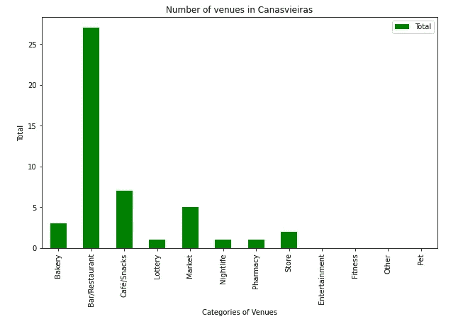

*作者图片*

Canasvieiras 是最受欢迎的旅游目的地之一，尤其是对阿根廷和乌拉圭游客而言。这个地方，显然有更多的选择，显示出同样的模式:很多餐馆，但缺乏其他选择。对这两个地方来说，靠近卡舒埃拉多邦杰斯是一个很好的补充。

**卡舒埃拉多邦耶稣**

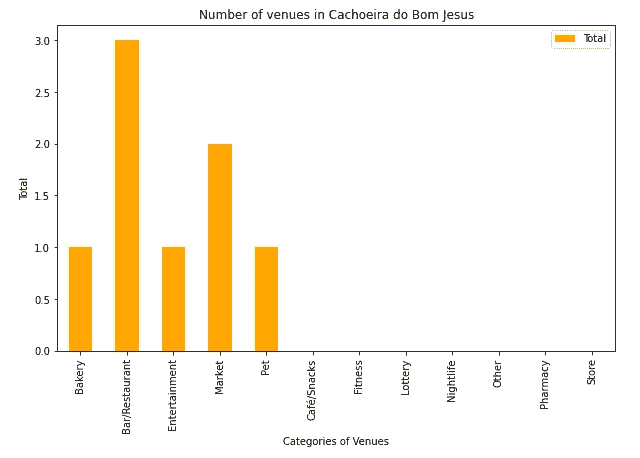

*作者图片*

Cachoeira do Bom Jesus 以两条有生意和很多房子的街道而闻名。正如我们可以想象的那样，这反映了不同业务的缺乏。同样，餐馆是这个街区的“明星”。一个拥有 2000 多名工人的科技园(“智人园”)也影响到餐馆的人群:因为每个人都需要一个吃午饭的地方，所以商人决定开餐馆是很自然的。

**比较 Canasvieiras 和 Cachoeira do Bom Jesus**

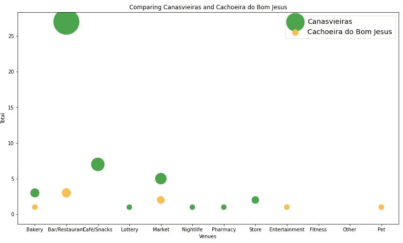

*作者图片*

Canasvieiras 是一个更“中心”的社区，显示了更多的选择。下一个街区 Cachoeira do Bom Jesus 的选择较少，但与 Jurerê Leste-Jurerê Oeste 相比，可以利用一些邻近的优势。顺便说一句，邻近是两个街区互补的因素之一:他们之间只共享三种场地。

**蓬塔达斯卡纳斯**

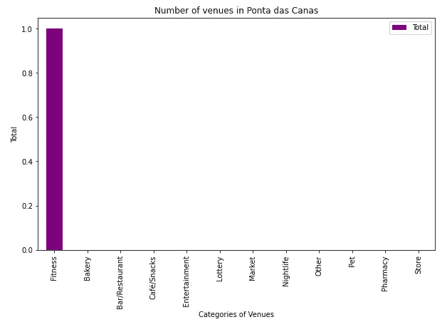

*作者图片*

蓬塔达斯卡纳斯只展示了一种场所:健身。作为 Cachoeira do Bom Jesus 附近的延续，蓬塔达斯卡纳斯没有很大一部分的领土，这可以解释为什么缺乏场地。

比较蓬塔达斯卡纳斯和卡舒埃拉多邦耶稣

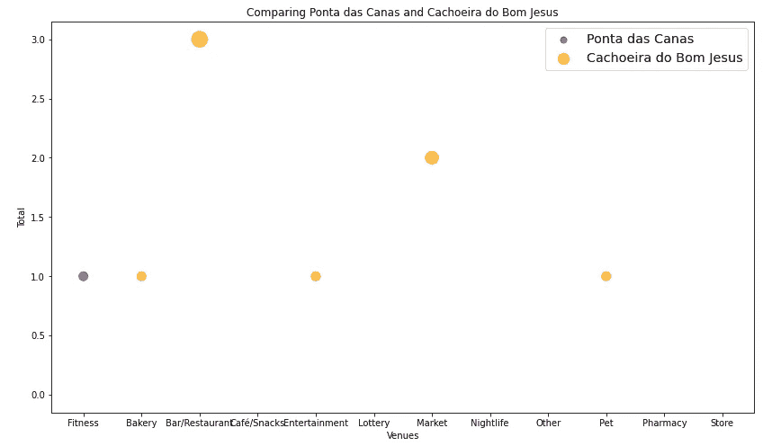

*作者图片*

无论是住宅区还是小社区，蓬塔达斯卡纳斯和卡舒埃拉多邦杰斯都缺乏商业。它可以显示出对 Canasvieiras 的依赖。

**比较所有邻居**

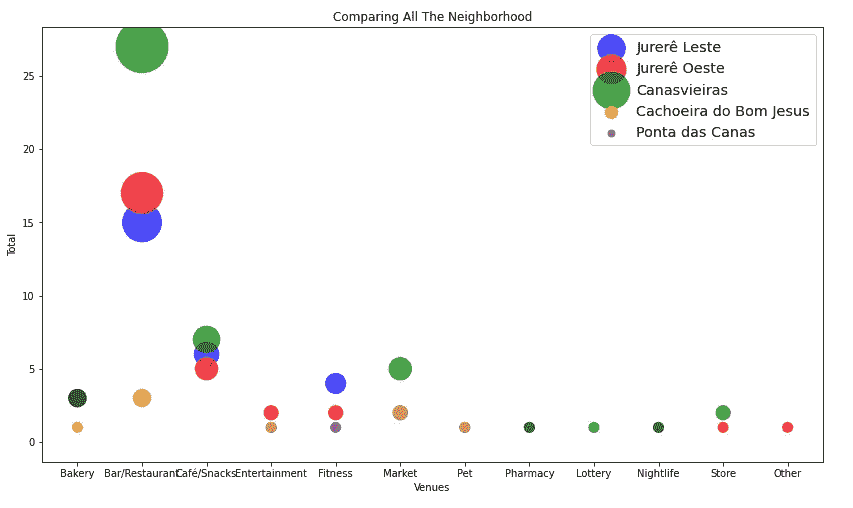

*作者图片*

即使几乎所有的邻居都有去餐馆的明显倾向，也可以说在很短的距离内很难找到其他一些服务。其中一些似乎在所有领域都是独一无二的。这表明了新业务的决定性必要性，尤其是对那些实际生活在这些社区的人来说。

**结论**

**关于 Florianópolis-North Shore 的商机和需求**

根据分析的数据，我们可以得出结论:

蓬塔达斯卡纳斯，即使是一个非常小的社区，也需要更多的企业。我们只能找到一个健身房。市场、杂货店、药店和面包店等基本需求在这个社区可能是一个不错的选择。

受够了餐馆和酒吧！我们知道，在一个旅游目的地(附近也有大型科技公司)的餐馆是一个显而易见的选择——但那里已经饱和了。

附近的面包店很多。但由于卡舒埃拉邦耶稣只有一个，蓬塔达斯卡纳斯没有，这可能是一个在蓬塔达斯卡纳斯开面包店的好机会。住在卡舒埃拉多邦耶稣的人也可以使用它。

“咖啡馆/小吃”类别在 Jurerê(东帝汶和东省)和 Canasvieiras 很常见。即使知道从 Canasvieiras 到 Cachoeira do Bom Jesus 和 Ponta das 卡纳斯的距离并不大，这些街区的咖啡店也可以代表一个有趣的商业项目。

娱乐的选择很少，特别是如果你正在考虑一个家庭，但美丽的海滩是那些社区的大明星，所以投资这种场所可能有风险。

Jurerê Leste 和 Oeste 以及 Ponta das 卡纳斯都有健身房和健身中心。Canasvieiras 和 Cachoeira do Bom Jesus 是为他们的邻居服务的，但 Canasvieiras“中心”部分的健身中心可能是一个很好的搭配！

正如我们已经说过的，在巴西，彩票不仅仅代表赌博。他对社区的意义在于，可以很容易地在彩票领域进行一些银行活动，这表明它们非常有用。由于我们在 Canasvieiras 只有一次抽奖，这可能是最好的商业机会之一。

Jurerê Leste 和 Jurerê Oeste 地区只有两家属于“市场”类别的企业。它大约有 2，58 公里(27，750，257，61 英尺)，只有两个市场。这是个好机会。

夜总会和休闲场所在冬季关闭。我们只有两个选择:一个在 Canasvieiras，一个在 Jurerê Oeste。由于全年开展这项业务风险很大，因此需要更多的数据来了解这是否是一个好机会。

宠物店也很少:一家在 Cachoeira do Bom Jesus，另一家在 Jurerê Leste，我们可以想象这个“中心点”可能是满足需求的好地方。但这仍然是一个进行更多研究和规划新业务的好机会。

药店是每个人有朝一日都需要涉足的行业之一。在巴西，只有药店可以卖药。因此，只有两个(一个在 Canasvieiras，一个在 Jurerê Leste)表明缺乏。这可能是一个很好的商机——甚至需要药剂师来开一家。

商店可以满足每个人的需求，让生活在 Florianópolis 北岸的人生活更轻松。但我们只能找到三个(两个在 Canasvieiras，一个在 Jurerê Oeste)。仅仅这个话题就可以成为另一个大分析的来源，但它显示了对新商店的需求以及巨大的商机。

**关于研究**

方法论领域的选择是正确的。即使分析不深刻，这些数据也能帮助产生新业务的想法。但是 Foursquare 的数据似乎并不可信。分析数据，很清楚信息准确性的不确定性。住在这些社区中的一个，我能记得比 Foursquare 能给我更多的生意。看看 Foursquare 的数据并不是一个坏主意(因为它们是免费的)。如果我被雇佣来做这个分析，我会尝试其他 API 和资源来给我更多的信息。

对笔记本感兴趣？

进入我的 [GitHub](https://github.com/shaiala/Coursera_Capstone/blob/master/Final%20Project.ipynb) ！