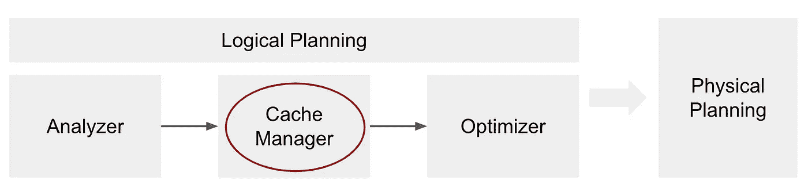
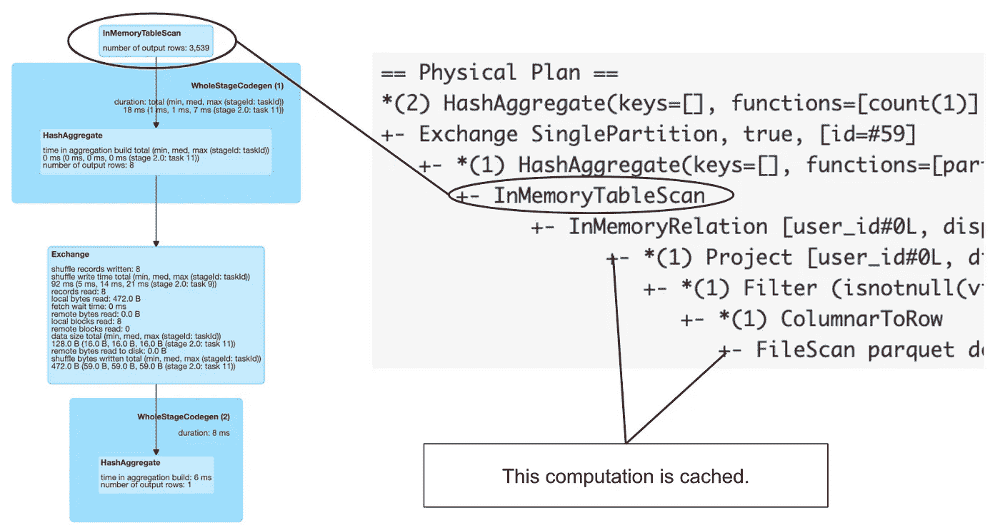
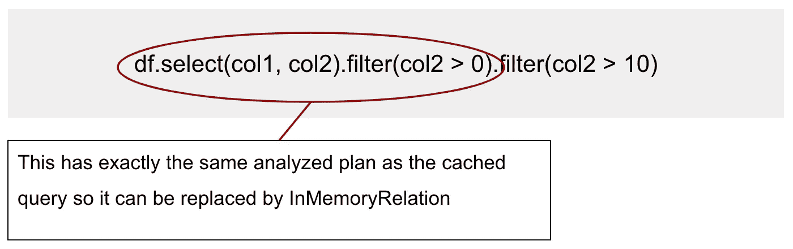
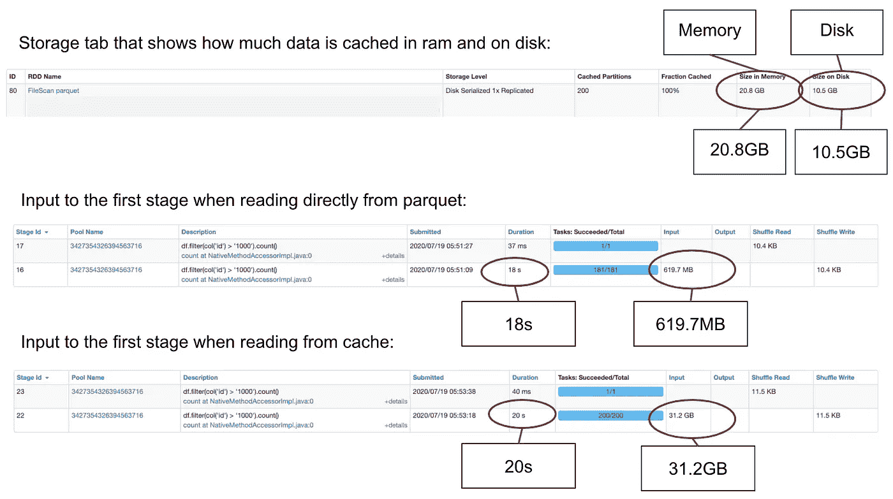
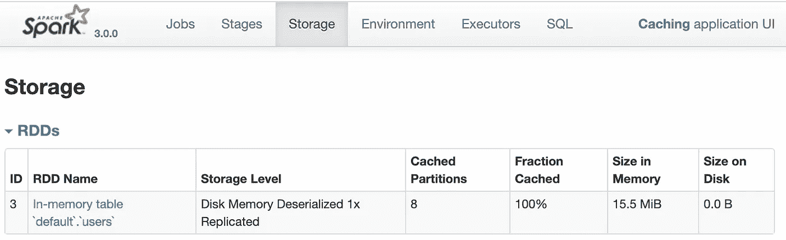

# Spark SQL 中缓存的最佳实践

> 原文：<https://towardsdatascience.com/best-practices-for-caching-in-spark-sql-b22fb0f02d34?source=collection_archive---------0----------------------->

## 深入探究 Spark 中的数据持久性。

在 Spark 中，SQL 缓存是重用某些计算的常用技术。它有可能加快使用相同数据的其他查询的速度，但是如果我们想要获得良好的性能，有一些注意事项需要记住。在本文中，我们将深入了解缓存的内部工作原理，并尝试揭开 Spark 与数据持久性相关的行为的神秘面纱。

# 使用数据框架 API

在 DataFrame API 中，有两个函数可以用来缓存数据帧， *cache()* 和 *persist()* :

```
df.cache() # see in PySpark docs [here](https://spark.apache.org/docs/latest/api/python/pyspark.sql.html#pyspark.sql.DataFrame.cache)df.persist() # see in PySpark docs [here](https://spark.apache.org/docs/latest/api/python/pyspark.sql.html#pyspark.sql.DataFrame.persist)
```

它们几乎是等价的，区别在于*持久化*可以带一个可选参数*存储级别*，通过它我们可以指定数据将被持久化到哪里。两个函数的 *storageLevel* 的默认值是 *MEMORY_AND_DISK* ，这意味着如果内存中有空间，数据将存储在内存中，否则，数据将存储在磁盘上。[在这里](https://spark.apache.org/docs/latest/api/python/pyspark.html#pyspark.StorageLevel)你可以看到其他可能的存储级别的(PySpark)文档。

缓存是一种惰性转换，因此在调用该函数之后，数据不会发生任何变化，但是查询计划会由*缓存管理器*通过添加一个新的操作符*inmemorrelation*来更新。因此，这只是一些信息，稍后在调用某个操作时，将在查询执行期间使用这些信息。Spark 将在缓存层中查找数据，如果数据可用，就从那里读取数据。如果它在缓存层找不到数据(第一次运行查询时肯定会发生这种情况)，它将负责将数据获取到缓存层，并在之后立即使用它。

# 缓存管理器

*缓存管理器*负责根据查询计划跟踪哪些计算已经被缓存。当缓存函数被调用时，*缓存管理器*被直接调用，它取出调用缓存函数的数据帧的*分析逻辑计划*，并将该计划存储在名为 *cachedData* 的索引序列中。

*缓存管理器*的阶段是逻辑规划的一部分，它发生在分析器之后、优化器之前:



当您运行带有操作的查询时，查询计划将被处理和转换。在*缓存管理器*的步骤中(就在优化器之前)，Spark 将检查被分析计划的每个子树是否存储在*缓存数据*序列中。如果发现匹配，这意味着相同的计划(相同的计算)已经被缓存(可能在之前的某个查询中),因此 Spark 可以使用它，并使用 *InMemoryRelation* 操作符将该信息添加到查询计划中，该操作符将携带关于该缓存计划的信息。这个 *InMemoryRelation* 随后被用于物理规划阶段，以创建物理操作符 *InMemoryTableScan* 。

```
df = spark.table("users").filter(col(col_name) > x).cache()df.count() # now check the query plan in Spark UI
```



在上图中，您可以看到使用缓存的查询的图形和字符串表示。要查看缓存了哪些转换，您需要查看计划的字符串表示，因为图形表示没有显示这些信息。

# 基本示例

让我们看一个简单的例子来更好地理解*缓存管理器*是如何工作的:

```
df = spark.read.parquet(data_path)df.select(col1, col2).filter(col2 > 0).cache()
```

考虑以下三个查询。他们中的哪一个将利用缓存的数据？

```
1) df.filter(col2 > 0).select(col1, col2)2) df.select(col1, col2).filter(col2 > 10)3) df.select(col1).filter(col2 > 0)
```

决定性因素是*分析过的逻辑计划*。如果它与缓存查询的分析计划相同，那么将利用缓存。对于第 1 个查询，您可能会说它有相同的计划，因为在这两种情况下优化器都会推送过滤器。但这其实并不完全准确。需要理解的重要一点是，*缓存管理器*的阶段发生在**优化器**之前。相同的是优化的计划，而不是分析的计划。因此，查询 n. 1 不会仅仅因为分析的计划不同就利用缓存。

对于查询 n. 2，您可能会再次假设它将使用缓存的数据，因为过滤器比缓存查询中的过滤器更严格。我们可以从逻辑上看到查询的数据在缓存中，但是 Spark 不会从那里读取它，原因和之前一样——分析的计划不同——这一次过滤条件不一样。然而，要使用缓存的数据，我们可以通过在那里添加过滤器来修复第二个查询:

```
df.select(col1, col2).filter(col2 > 0).filter(col2 > 10)
```

乍一看，过滤器 *col2 > 0* 在这里似乎没有用，但这并不是因为现在部分分析的逻辑计划将与缓存的计划相同，并且*缓存管理器*将能够找到它并在查询计划中使用*inmemorrelation*。



第 3 个查询很复杂，乍一看，它似乎也有不同的分析计划，因为查询是不同的——我们只选择了 *col1。*然而，过滤条件是使用*列 2* ，这在之前的投影中是不存在的，因此分析器将调用规则 *ResolveMissingReferences* ，并且它将把*列 2* 添加到投影中，并且分析的计划实际上将与缓存的计划相同。这一次*缓存管理器*将找到并使用它。

所以最终的答案是 3 号查询将利用缓存的数据。

# 最佳实践

让我们列出一些与缓存相关的经验法则:

*   缓存数据帧时，为其创建一个新变量 *cachedDF = df.cache()* 。这将允许您绕过我们在示例中解决的问题，有时不清楚什么是分析的计划，什么是实际缓存的。在这里，每当您调用 *cachedDF.select(…)* 时，它都会利用缓存的数据。
*   使用 *cachedDF.unpersist()* 将不再需要的数据帧取消持久化。如果缓存层变满，Spark 将开始使用 LRU(最近最少使用)策略从内存中驱逐数据。所以使用 *unpersist* 更好地控制什么应该被驱逐是个好习惯。此外，内存中的空间越大，用于执行的空间就越多，例如，用于构建哈希映射等等。
*   在缓存之前，请确保只缓存查询中需要的内容。例如，如果一个查询将使用 *(col1，col2，col3)* ，第二个查询将使用 *(col2，col3，col4)* ，请选择这些列的超集: *cachedDF = df.select(col1，col2，col3，col4)。cache()* 。如果 *df* 包含许多列，并且在后续查询中只需要一小部分，那么调用 *cachedDF = df.cache()* 就没有多大用处。
*   只有在有意义的时候才使用缓存。也就是说，如果缓存的计算将被多次使用。很好地理解了将数据放入内存也与一些开销有关，因此在某些情况下，如果计算足够快并且根本不使用缓存，简单地再次运行计算可能会更快，正如您在下一段中看到的。

# 比缓存更快

有些情况下，缓存没有任何帮助，反而会降低执行速度。例如，这与基于以支持列修剪和谓词下推的列文件格式存储的大型数据集的查询相关，如 parquet。让我们考虑下面的例子，我们将缓存整个数据集，然后在其上运行一些查询。我们将使用以下数据集和聚类属性:

```
dataset size: 14.3GB in compressed parquet sitting on S3
cluster size: 2 workers c5.4xlarge (32 cores together)
platform: Databricks (runtime 6.6 wit Spark 2.4.5)
```

首先，让我们测量不使用缓存的查询的执行时间:

```
df = spark.table(table_name)df.count() # runs 7.9sdf.filter(col("id") > xxx).count() # runs 18.2s
```

现在使用缓存运行相同的查询(整个数据集不适合内存，大约 30%缓存在磁盘上):

```
df = spark.table(table_name).cache()# this count will take long because it is putting data to memory
df.count() # runs 1.28mindf.count() # runs 14sdf.filter(col("id") > xxx).count() # runs 20.6s
```

难怪第一次计数需要 1.3 分钟，这是与将数据放入内存相关的开销。但是，正如您所看到的，与直接从 parquet 读取相比，第二次计数和使用过滤器的查询对于缓存的数据集来说也需要更长的时间。这是两个主要原因的结合。第一个是 parquet 文件格式的属性——基于 parquet 的查询本身就很快。在从 parquet 读取的情况下，Spark 将只读取元数据来获取计数，因此不需要扫描整个数据集。对于过滤查询，它将使用列修剪，只扫描 *id* 列。另一方面，当从缓存中读取数据时，Spark 将读取整个数据集。这一点从 Spark UI 就可以看出来，你可以查看第一阶段的输入大小(见下图)。

第二个原因是数据集很大，不完全适合 ram。部分数据也存储在磁盘上，从磁盘读取比从 ram 读取要慢得多。



# SQL 中的缓存

如果您喜欢直接使用 SQL 而不是 DataFrame DSL，您仍然可以使用缓存，但是有一些不同。

```
spark.sql("cache table table_name")
```

主要区别在于，使用 SQL 时，默认情况下缓存是急切的，因此作业将立即运行，并将数据放入缓存层。为了使它像在 DataFrame DSL 中一样懒惰，我们可以显式地使用 *lazy* 关键字:

```
spark.sql("cache lazy table table_name")
```

要从缓存中删除数据，只需调用:

```
spark.sql("uncache table table_name")
```

# 查看缓存的数据

有时您可能想知道哪些数据已经被缓存了。一种可能是检查 Spark UI，它提供一些关于已经缓存在集群上的数据的基本信息。



对于每个缓存的数据集，您可以看到它在内存或磁盘上占用了多少空间。您甚至可以放大并单击表中的记录，这将带您到另一个页面，其中包含每个分区的详细信息。

要检查整个表是否被缓存，我们可以使用 Catalog API:

```
spark.catalog.isCached("table_name")
```

目录 API 也可用于从缓存中删除所有数据，如下所示:

```
spark.catalog.clearCache()
```

在 Scala API 中，你也可以使用提供一些功能的*缓存管理器*的内部 API，例如，你可以询问*缓存管理器*是否为空:

```
// In Scala API:val cm = spark.sharedState.cacheManagercm.isEmpty
```

# 数据持久性的其他可能性

缓存是可用于重用某些计算的多种技术之一。除了缓存，还有检查点和交换重用。

例如，在因为查询计划太大而需要中断查询计划的情况下，检查点非常有用。大型查询计划可能会成为驱动程序中处理该计划的瓶颈，因为处理一个非常大的计划需要很长时间。然而，检查点会破坏计划并具体化查询。对于接下来的转变，Spark 将开始建立一个新的计划。检查点操作与两个函数 [*检查点*](https://spark.apache.org/docs/latest/api/python/pyspark.sql.html#pyspark.sql.DataFrame.checkpoint) 和 [*本地检查点*](https://spark.apache.org/docs/latest/api/python/pyspark.sql.html#pyspark.sql.DataFrame.localCheckpoint) 有关，这两个函数的不同之处在于用于数据的存储。

另一方面，Spark 将 shuffle 的输出保存在磁盘上的交换重用是一种不能由某个 API 函数直接控制的技术，而是 Spark 自己处理的内部特性。在某些特殊情况下，可以通过重写查询来实现相同的交换分支，从而间接控制交换。要阅读更多关于交换重用的内容，您可以查看我的另一篇[文章](/be-in-charge-of-query-execution-in-spark-sql-c83d1e16b9b8)，在那里我会更详细地描述它。

# 结论

在本文中，我们试图揭开 Spark 与缓存相关的行为的神秘面纱。我们已经看到了它是如何工作的，以及使用 DSL 和 SQL 之间的区别。我们讨论了如何尽可能提高缓存效率的一些最佳实践。在一个例子中，我们展示了对于不适合内存的大型数据集，避免缓存可能会更快，尤其是当数据以列文件格式存储时。我们还提到了缓存的一些替代方法，比如检查点或重用交换，它们在某些情况下对数据持久性很有用。