# 强化学习的最佳实践

> 原文：<https://towardsdatascience.com/best-practices-for-reinforcement-learning-1cf8c2d77b66?source=collection_archive---------23----------------------->

## 解除时间和基数的诅咒。

机器学习是研究密集型的。与经典编程相比，它包含了更高程度的不确定性。这对产品管理和产品开发有重大影响。

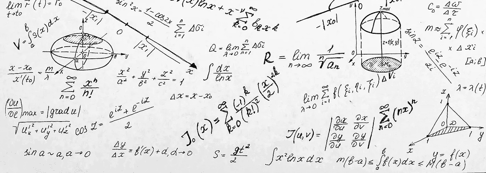

Nicolas Maquaire 授权的 Shutterstock 提供的图片。

开发一个性能良好的智能产品是非常困难的。此外，生产环境的成本也很高。这种挑战的组合会使许多创业公司的商业模式充满风险。

在我的[上一篇文章](/inference-on-the-edge-21234ea7633)中，我描述了新人在雾计算中使用人工智能时面临的挑战。更具体地说，我详细说明了在边缘做出推断需要什么。

在这篇文章中，我将描述一些我认为是开始强化学习(RL)项目的最佳实践。我将通过举例说明我在视频游戏上复制 [Deepmind 的表现时学到的一些经验来做到这一点。这是我从事的一个有趣的兼职项目。](/are-the-space-invaders-deterministic-or-stochastic-595a30becae2?source=friends_link&sk=bf9fb38db5ce1055ceae1e0f64f92613)

谷歌在 42 款 Atari 游戏上用同样的网络实现了超人类的表现(见[通过深度强化学习实现人类级别的控制](https://www.nature.com/articles/nature14236))。那么，让我们看看我们是否能达到同样的结果，并找出成功所需的最佳实践！

你可以在下面的 [Github 库](https://github.com/NicMaq/Reinforcement-Learning)中找到源代码；此外，对于想了解我的算法如何工作的读者，我发表了 [Breakout 解释了](https://colab.research.google.com/drive/1nzH8TZ8zFth0oLwXwIXbn9OuAaJ4mVXG?usp=sharing)和 [e-greedy 和 softmax 解释了](https://colab.research.google.com/drive/1--qFcl5QuTuudC-yYcE1odKx_htui4h6?usp=sharing)。这是两个 Google Colab 笔记本，我在其中解释了预期的 sarsa 和两个策略 e-greedy 和 softmax 的实现。

# 时间和基数诅咒

每个 RL 从业者处理的主要问题是不确定性和无限的技术选择，以及非常长的培训时间。

我称之为 RL 的时间和基数诅咒。我认为每个人或每个团队开始强化学习项目的最佳实践是:

1.  构建一个工作原型，即使它的性能很差或者是一个简单的问题
2.  尽可能减少训练时间和内存需求
3.  通过测试不同的网络配置或技术选项来提高准确性
4.  检查，再检查，然后再检查你的每一行代码

对于这些最佳实践，我想补充一点:

1.  监控可靠性。有时候，运气是不可重复的
2.  平行是你的朋友。平行测试不同的想法

先来攻坚一个很简单的教科书案例:[打开 AI 健身房 Acrobot](https://gym.openai.com/envs/Acrobot-v1/) 。然后，我们将转向一些更具挑战性的游戏:突围和太空入侵者。

如果你有兴趣在继续之前积累知识，我推荐你阅读理查德·萨顿和安德鲁·巴尔托的《T2 强化学习》。

如果你正在积极参与一个项目，我推荐你读一读 Andrew NG 的“[机器学习向往](https://www.deeplearning.ai/machine-learning-yearning/)”

# 用开放的 AI Acrobot 学习

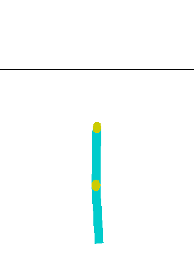

作者图片

在 RL 中处理复杂的项目之前，我的建议是从简单的项目开始，因为你会在互联网上找到更多的文献。找到解决方案会更容易，更重要的是，因为测试新想法会更快(失败得快，失败得好)。

开放人工智能提供了丰富的选择。因为我专攻控制系统，所以我决定使用 Acrobot。我在攻读工程学位的时候做过一个非常类似的项目:[双摆](https://www.youtube.com/watch?v=B6vr1x6KDaY)。

对于这个兼职项目，我决定从 Acrobot 开始。

如图所示，acrobot 系统具有两个关节和两个连杆，其中只有两个连杆之间的关节被驱动。最初，链接向下悬挂，目标是将较低链接的末端摆动到水平线以上。

## 代理的剖析

什么是强化学习？

这是我们通过与环境互动来学习这一理念的直接实现。这样，它就模仿了大脑。

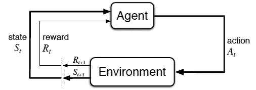

作者图片

在 RL 中，在游戏的每一步，我们决定最好的行动，然后我们取回奖励并进入下一个状态。对于 Acrobot，状态由两个旋转关节角度和关节角速度的 sin()和 cos()组成。

[cos(θ1)sin(θ1)cos(θ2)sin(θ2)θ1θ2]

在《强化学习》一书中，萨顿和巴尔托描述了不同的时间差(TD)技术。TD 学习是指一类[无模型](https://en.wikipedia.org/wiki/Model-free_(reinforcement_learning))强化学习，其中使用深度网络来逼近价值函数。价值函数估计每个动作有多好。

我从最常见的 RL 算法 Expected Sarsa 及其特例 Q-Learning 开始。两种算法都使用一种策略。粗略地说，策略是代理行为函数。该策略使用价值函数估计来决定最佳行动。我们将使用软策略(ɛ-greedy 和软最大)，这意味着每个行动都有机会被执行。当以 1-ɛ的概率选择最佳行动，并以ɛ.的概率随机选择最佳行动时，策略是ɛ-greedy 我最喜欢的是，softmax 策略根据动作值估计值为每个动作分配一个优先级。

在[通过深度强化学习的人类级控制](https://www.nature.com/articles/nature14236)中，Deepmind 使用 Q-Learning 和 e-greedy 策略。

我们将要使用的两种算法都带有一些超参数和许多选项。举几个例子，最重要的是学习(𝜶)和折现率(𝞬)，批量大小，ε(ɛ)或τ(𝝉)，用于在探索和开发之间找到正确的平衡，经验重放记忆的大小，探索步骤的数量，退火步骤的数量，模型更新频率，权重初始化，以及优化器。

当然，超参数的列表还有很多。

这就是我所说的基数的诅咒。

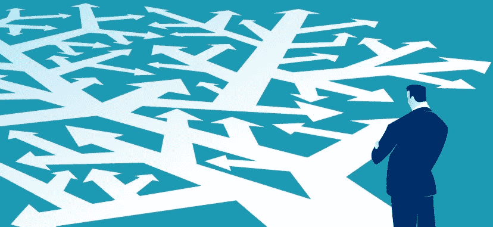

*基数的诅咒。图片由 Nicolas Maquaire* 授权的 Shutterstock 提供。

这就是为什么我的第一个最佳实践是构建一个“工作”原型。然后专注于性能。

那么。我们如何解除基数的诅咒？

首先，我建议在 web 上搜索类似的实现，以便理解其他从业者使用的超参数。除了帮助你获得成功，这将有助于发展你的直觉，这是非常重要的。事实上，“直觉”是吴恩达在他名为[深度学习专业化](https://www.coursera.org/learn/neural-networks-deep-learning/)的奇妙课程中使用最多的词语之一。

在我第一次尝试摇动 Acrobot 时，我的一些跑步收敛了。下面，我们可以看到十场以上的成功率。当然，肯定还有改进的空间，但我的算法正在学习，这是一个好的开始。

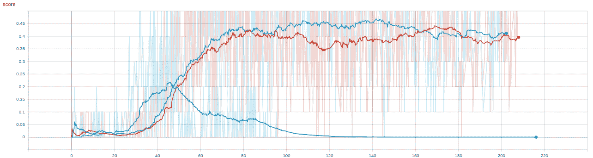

*横轴单位是训练小时数。纵轴单位是十场以上的成功率。作者配图。*

在图表上，你也可以看到我训练网络超过一个星期。这些网络在第二天左右开始融合。这给我们上了很好的一课:作为人工智能从业者，我们等啊等啊等。这是时间的诅咒！

现在回想起来，如果我计算我在我的机器前花费的小时数，仔细检查我的许多尝试的损失和准确性，这当然相当于获得了 RL 心理学学位！我很自豪我成为了 RL 算法的心理学专家。

我训练的一些人工智能表现得像冠军。少数人有自杀倾向，表现不那么纯粹随机(不好)。其他人则有经常性的倦怠(和丑陋)。

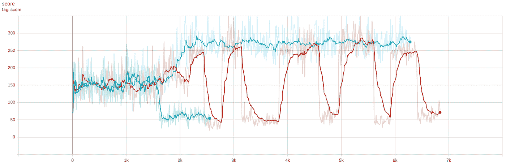

[*好人(蓝色)、坏人(绿色)和丑人*](https://en.wikipedia.org/wiki/The_Good,_the_Bad_and_the_Ugly) *(红色)。作者配图。*

发展你的直觉有助于你找到解决问题的方法。这里，坏人对最佳行动选择有问题，而坏人对其目标网络有问题。

就像深度学习中的偏差和方差方法一样，你可以发展自己的直觉来更快地诊断你的问题。

现在我们有了冠军，让我们看看如何提高它的性能。

## 培训代理

**GPU vs CPU**

深度学习和强化学习的一个主要区别是没有预先存在的数据集。当代理与环境交互时，数据集(或体验重放，或 RL 中的存储器)被创建。这导致了性能瓶颈，因为流水线依赖于 CPU 操作。这也是为什么大部分教程的张量流运算都发生在 CPU 上的原因。我非常肯定，当将所有 tensorflow 操作放在 CPU 上时，您的第一次尝试将显示更好的性能。

GPU 上的训练绝对不是自动的。但是如果做得正确，它会提高速度，正如你从下图中看到的。

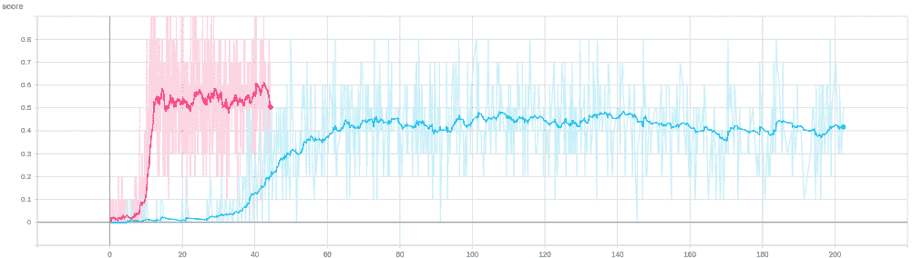

*横轴表示训练时间。用 GPU 上的大部分操作红；仅在 CPU 上运行时为蓝色。作者配图。*

性能瓶颈是由在 CPU 内存和 GPU 内存之间来回移动大量小对象造成的。因此，了解在哪里创建 tensorflow 变量以及如何利用 tensorflow 2.x 的急切执行非常重要。

在我的机器上，限制因素通常是 CPU 的内存，它存储了体验缓冲区的所有图像。我通常不会看到高 GPU 内存消耗，因为数据是在 CPU 的内存上创建和管理的。我使用 tensorflow 数据 API 来创建数据集。数据集加载图像并将其提供给 GPU。我也没有看到 GPU 的高利用率，因为每个进程都在等待 CPU 执行下一步，并等待数据集产生一个小批量。

此外，所使用的数据类型对性能也有重要影响。使用 int16 代替 float32 将提高速度，并有助于在您的机器上管理多个 1.000.000 经验回放。

小心你的数据类型有助于你并行训练多个网络，走得更快，这进一步解除了时间的诅咒。

这些步骤显然支持我们的第二个最佳实践:尽可能减少训练时间和内存需求。

**超参数和网络架构**

既然我们已经使算法在速度和内存消耗方面尽可能高效，我们可以专注于解除基数的诅咒。当然，我们仍有许多部分需要整合，但这更容易管理。我们现在可以并行进行多次运行，并更快获得结果。

我建议将您的所有超参数设置为社区普遍接受的值。找到这些值的最好方法是找到挖掘类似用例的论文，看看它们使用的是什么参数。然后，我建议对 2 或 3 个最重要的超参数进行手动搜索。不要忘记使用 10 的幂来有效地扫过你的超参数的整个范围。有些非常敏感(尤其是 softmax 温度)。

对于网络架构，我推荐复制你找到的任何有趣论文中的网络架构。然后，尝试不同数量的隐藏层或不同数量的节点。此外，请记住，层的初始化内核极其重要。

例如，我注意到，当最后一个密集层使用方差缩放而不是默认的 Glorot 初始化时，使用 softmax 策略的预期 Sarsa 不会收敛。

为了说明不同数量的节点可以带来的改进，我们在之前的 CPU/GPU 比较中添加了一次新的运行。粉红色和红色图之间的唯一区别是我交换了最后两层(从 256 和 128 感知器到 128 和 256)。

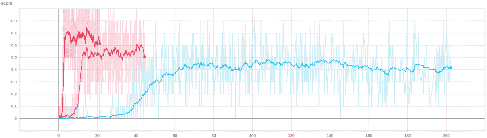

*以小时为横轴的训练。新图层排列的红色。作者配图。*

如果您使用经典网络架构和 4 个状态的堆栈作为输入，数百次运行使我认为最重要的超参数是:

1.  学习率
2.  探测和退火参数(或 softmax 的温度)
3.  图层的初始化
4.  主要网络参数更新的频率
5.  目标网络更新的频率

通过遵循我们的最佳实践，我们获得了非常好的改进。如下所示，我们显著提高了精确度和计算时间。

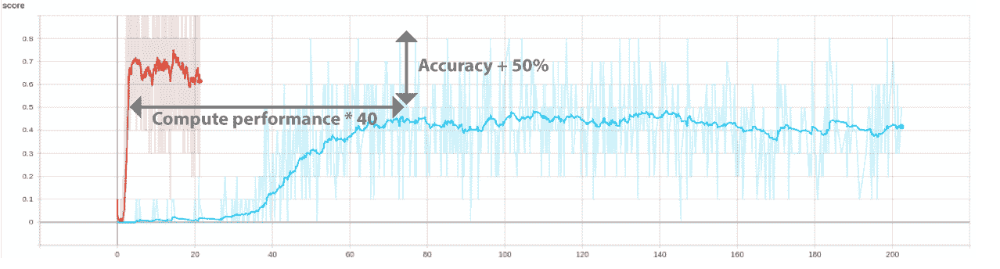

*通过 GPU 和一点网络调整获得的改进。作者配图。*

不用说，这会对新产品的上市和相关成本产生非常重要的影响。这显然支持了我们的第三个最佳实践:通过测试不同的网络配置或技术选项来提高准确性。

作为对进一步提高类似用例的准确性和收敛时间感兴趣的读者的补充说明:我的下一步将是使用 tile 编码。我很确定这将进一步提高速度和性能。

由于我们在 Acrobot 上的工作，我们现在有了一个很好的平台来尝试更具挑战性的东西:计算机视觉的强化学习。

# 雅达利的 RL 和计算机视觉

## 突围和太空入侵者

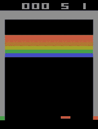

作者图片

Breakout 是雅达利于 1976 年 5 月 13 日开发并发布的一款街机游戏。玩法:一层砖块排列在屏幕的上三分之一处，目标是将它们全部摧毁！

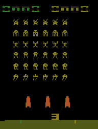

作者图片

《太空入侵者》是 1978 年由 Tomohiro Nishikado 创作的街机游戏。《太空入侵者》是第一款固定射击游戏，它为射击类游戏设定了模板。目标是用水平移动的激光击败一波又一波下降的外星人，以获得尽可能多的分数。

看看我们的算法在那些游戏上表现如何！先睹为快，这两张动画 gif 是在我们的评估会议期间拍摄的。

支持这些新游戏没什么可做的。您需要声明新环境，但最重要的是，您需要调整您的网络和数据管道。对于新网络，我们将使用经典的 ConvNet 架构，与 Google Deepmind 在《自然》杂志论文中使用的网络相同:三个卷积层，后跟几个密集层。然后，我们需要更新数据管道。这有点棘手，因为我们必须存储一百万张图像。

你能在互联网上找到的大多数教程都存储了各州的历史。状态历史堆叠了由环境生成的五个连续图像。四个图像用于估计当前动作值函数，接下来的四个图像用于估计下一个动作值。考虑到存储历史对内存消耗的影响以及我们的第二个最佳实践，我们将只存储状态(图像)。数据管道将动态地重新堆叠状态。

你可以找到我在这个[谷歌协作](https://colab.research.google.com/drive/1nzH8TZ8zFth0oLwXwIXbn9OuAaJ4mVXG?usp=sharing)上所做的详细解释。

顺便提一下，如果像我一样，你使用开放的人工智能健身房来测试不同的算法或技术选项，并希望从开放的人工智能健身房环境转移到现实世界的问题，请注意，确保你的训练在随机环境中进行是至关重要的。你可以在互联网上找到的许多教程都使用了决定论的环境。随机性是鲁棒性的关键要求。如果你在一个开放的人工智能体育馆确定性环境中训练和验证，你的算法不太可能在现实世界的问题上起作用。我在“[中谈到了这个话题，太空入侵者是确定性的还是随机的？](/are-the-space-invaders-deterministic-or-stochastic-595a30becae2)

不幸的是，在这次更新中，我犯了很多错误，花了大量的时间来清除这些错误。为什么？因为即使有一些错误，网络也在学习和融合。精确度显然差得很远，但它正在工作。

这是与经典编程的一个重要区别。

当网络正在学习并稳定在一个适中的分数时，很容易得出超参数需要调整的结论。我掉进这个陷阱好几次了。通常，您从数据管道中删除了一个 bug，并启动了一系列运行，但几天后却发现又出现了另一个 bug。这不仅限于数据管道。我承认我在代码的每一部分都发现了错误。

这支持了我们的第四个最佳实践:检查，再检查，然后再检查你的每一行代码。

根据我的经验，最好的处理方法是创建一个单独的笔记本来证明每一行代码都在工作。很容易不经意地使用矩阵乘法而不是元素乘法，并且很容易在 Tensorflow 或 Numpy 转换中出错。我鼓励你对你的张量流代码非常谨慎。

# 结论

虽然我们只是触及了构建智能产品所面临的技术挑战的表面，但我希望这篇文章能够让您很好地理解一些最佳实践，以便成功启动您的 RL 项目。

对于任何研究密集型项目来说，时间和基数诅咒应该总是被考虑到你的产品管理和团队组织中。

我坚信，机器学习可以真正提供我们解决许多日益增长的问题所需的推动力。

我很乐意帮助任何有远见的人！而且，我非常乐于接受反馈。

感谢您阅读本文！