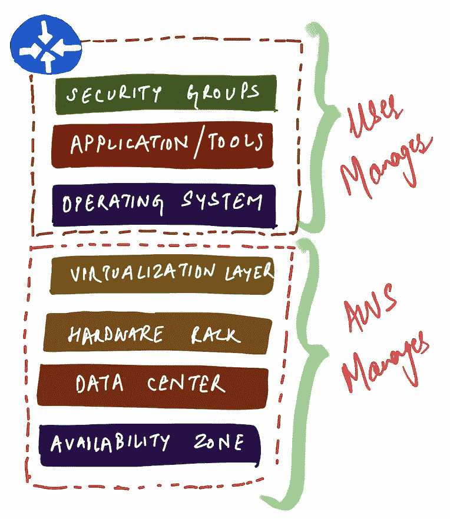
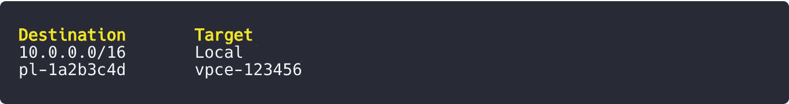
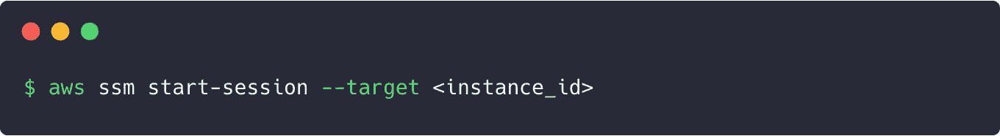

# 保护 AWS EC2 实例的最佳实践

> 原文：<https://towardsdatascience.com/best-practices-for-securing-aws-ec2-instances-4bd656e22462?source=collection_archive---------23----------------------->

## 确保你在 AWS 共享责任模型中尽了自己的一份力

照片由 [PhotoMIX 有限公司](https://www.pexels.com/@wdnet?utm_content=attributionCopyText&utm_medium=referral&utm_source=pexels)从 [Pexels](https://www.pexels.com/photo/building-metal-house-architecture-101808/?utm_content=attributionCopyText&utm_medium=referral&utm_source=pexels) 拍摄

云中的安全性有不同的维度，作为用户，您应该非常谨慎地在易用性、性能和安全性之间取得最佳平衡。虽然 AWS 在确保云的安全*方面做得非常出色，但用户仍然需要在云*中尽自己的一份力量*。从虚拟化、多租户或对数据中心的物理访问的角度来看，AWS 保护了一切，但仍有许多需要用户注意的地方。*

想了解更多？然后继续读。这篇文章将探讨我在过去多年的经验中发现的相关的不同主题。

# 最终用户应该关心什么？

EC2 环境中的用户职责始于操作系统的配置和管理，并向上延伸，包括用户在虚拟机上安装的所有实用程序和软件。这些层可以大致分为:

## 操作系统(包括更新和安全补丁)

AWS 定期升级现有的 ami，这些 ami 进一步指向实例启动时使用的快照、权限和引导卷。如果您使用定制的 AMI，限制对您自己帐户的访问总是一个好的做法。第二，如果有强烈的动机，只在实例终止后保留您的卷。它可能包含应用程序状态数据，将来可以通过将这些卷附加到其他实例来使用这些数据。

AWS 上典型应用程序堆栈的层次

## 实例上的应用程序和实用程序

作为最终用户，您对安装在 EC2 主机上的一切负责。避免使用像 *telnet、*这样的工具。选择一个瘦基础 AMI 并只安装应用程序运行时绝对需要的东西是构建您的设置的最佳方式。通过安装这样的实用程序，您可能会在不知不觉中从您的主机暴露端口。

## 安全组防火墙配置

理解 AWS 中的安全组不仅可以帮助您控制流量，还可以作为一种**识别机制，这一点很重要。**避免使用*默认安全组*，默认情况下，它允许具有相同安全组的两个实例在所有端口上相互对话。因此，您最终可能会向网络中的另一台机器开放所有流量，而这台机器可能会因为完全不同的原因而受到危害。此外，以后与这些安全组相关联的任何其他机器自动成为俱乐部的一部分，从而形成网状拓扑。

# 用于访问 50 多种 AWS 服务的 AWS PrivateLink

目前通过 AWS PrivateLink 可以获得 50 多种 AWS 服务，这基本上意味着你对这些资源的请求从来没有真正通过互联网途径，而是使用 AWS 自己的内部主干网络。

因此，如果您对 EC2 实例的访问需求只是集中在常见的 AWS 服务(如 S3、DynamoDB、API Gateway 等)上。)，完全阻止传出 internet 路由规则并只使用私有端点是有意义的。通过这些修改，您的路由表简化为如下内容:

安全组规则

`pl-1a2b3c4d`在这种情况下，指向 VPC 中特定的 AWS 服务专用链接端点。我遇到过多个堆栈，其中像 S3、DynamoDB 和 EC2 这样的服务总结了所有的堆栈需求。

# 你需要宋承宪吗？

第一个也是最常见的问题是向世界开放 SSH，主要是因为你没有一个专用的静态 IP/CIDR 来识别流量的良好来源。然而，您可以首先从一开始就需要 SSH 开始。AWS 生态系统在过去几年中发展很快，要求 SSH 可能是您最不想做的事情(考虑运行数十台或数千台服务器的堆栈)。在日志、监控和运营管理方面，AWS 已经有了 [Cloudwatch Monitoring](https://aws.amazon.com/cloudwatch/) 、 [AWS Systems Manager](https://aws.amazon.com/systems-manager/) 等的广泛支持。从头开始规划您的架构/堆栈，以便所有可操作的见解都可以从外部获得，这样您就真的不需要访问机器了。将你的资源视为 [*牛*而不是*宠物*](http://cloudscaling.com/blog/cloud-computing/the-history-of-pets-vs-cattle/) 的著名比喻在这里非常贴切。设计您的系统，以便您可以在任何时候轻松地处理它们，而不需要日志、文件等任何本地状态。

## 如果你仍然认为你有——用 SSM

Systems Manager 是 AWS 的优秀产品，它允许您在不关联 SSH 密钥对的情况下访问 EC2 机器。此外，您也不需要允许在端口 22 上进入。通过安装 SSM 代理和[设置配置](https://docs.aws.amazon.com/systems-manager/latest/userguide/systems-manager-setting-up.html)，您可以从您的终端登录到您的实例:

在幕后，SSM 通过返回一个 URL 和令牌来工作，使用它您可以启动一个 WebSocket 连接来发送命令和接收来自实例的输出。

## SSM 还可以帮助您完成日常操作任务

使用 SSM 的“运行”命令，您可以[在一组实例上运行批量命令](https://docs.aws.amazon.com/systems-manager/latest/userguide/execute-remote-commands.html)。这进一步为您提供了运行命令的能力，而无需真正登录到服务器。

# 停止使用 AWS 管理的策略

通常情况下，您不需要 AWS 管理的策略中的“所有”相关权限。第二，你不能控制将来这些政策的更新。总是倾向于最少的授权策略，其中受限制的主体只拥有您需要的访问权限。

# 充分了解您的应用程序堆栈

几年前，我曾经在一台可以通过互联网访问的 EC2 机器上运行过 Jenkins。无论我怎么努力，都无法终止或停止实例上运行的比特币挖掘进程。无论如何，这里的要点是了解运行在公开机器上的栈的所有方面。像 Jenkins 这样的工具工作在许多插件之上，这些插件可能会创建进入你的服务器的后门。此外，这种插件的漏洞很容易暴露，因为整个源代码大多可以在线获得。

# 避免在公共子网中设置实例

公共子网包括具有公共 IP 地址的实例，这些实例通过 Internet 网关路由传出流量(0.0.0.0/0)。这使得他们在互联网上可以接近，从而打破了安全连接的界限。解决这类问题的一个经验法则是，尽量减少你从账户内部向外部世界证明自己身份的方式。相反，即使实例服务于面向公众的应用程序，也总是希望实例位于私有子网中。对于这种需求，您可以始终在公共子网中提供负载平衡器，并为私有子网实例定义路由。与 [Web 应用防火墙](https://aws.amazon.com/waf/)的集成还可以帮助您断然拒绝恶意流量到达您的机器。

# 使用实例角色——避免在 EC2 实例或 ami 中插入/放置访问键

没有什么比短有效期的按需提供的临时访问凭证更好的了。在 EC2 实例、所有官方 SDK、CLI 等中。内置了在向 AWS 发起任何请求之前获取与相关策略一致的临时凭证的支持。

这些动态凭证是使用实例元数据获取的，实例元数据是一个只能从实例内部解析的 REST 端点。根据策略定义中的授权，为请求分配适当范围的访问密钥对，通常在一小时后自动过期。

*本帖到此为止。下次见，楚斯！*

***来自《走向数据科学》编辑的提示:*** *虽然我们允许独立作者根据我们的* [*规则和指导方针*](/questions-96667b06af5) *发表文章，但我们并不认可每个作者的贡献。你不应该在没有寻求专业建议的情况下依赖一个作者的作品。详见我们的* [*读者术语*](/readers-terms-b5d780a700a4) *。*