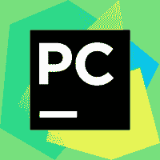
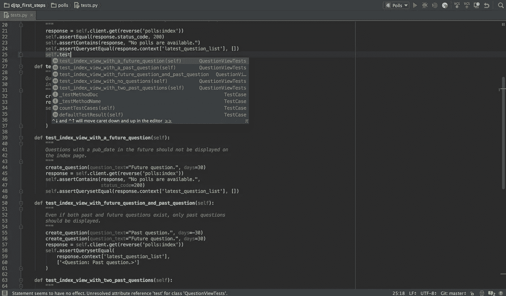
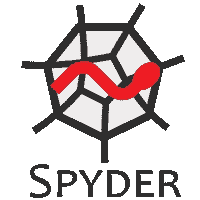
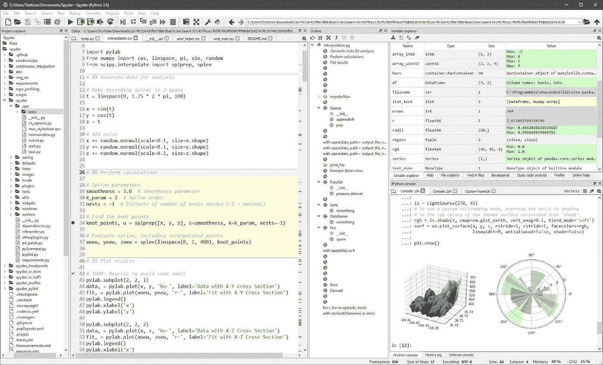
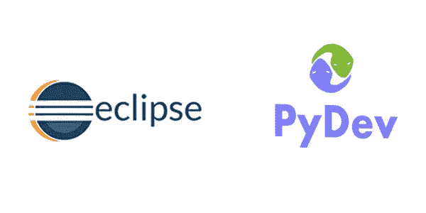
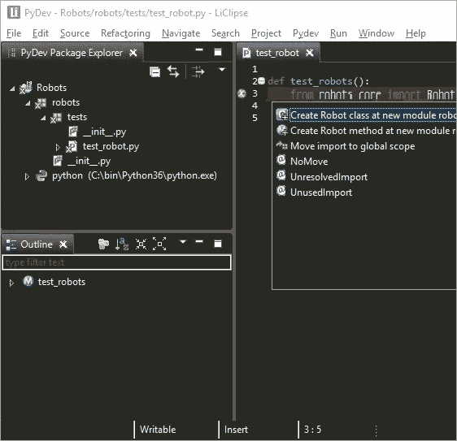
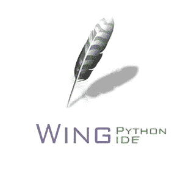
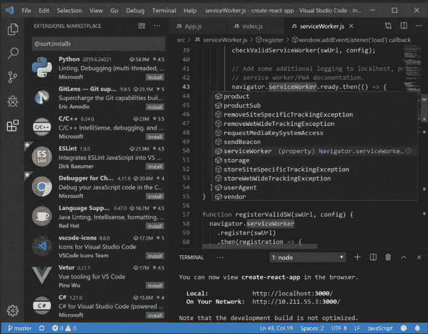
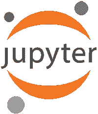
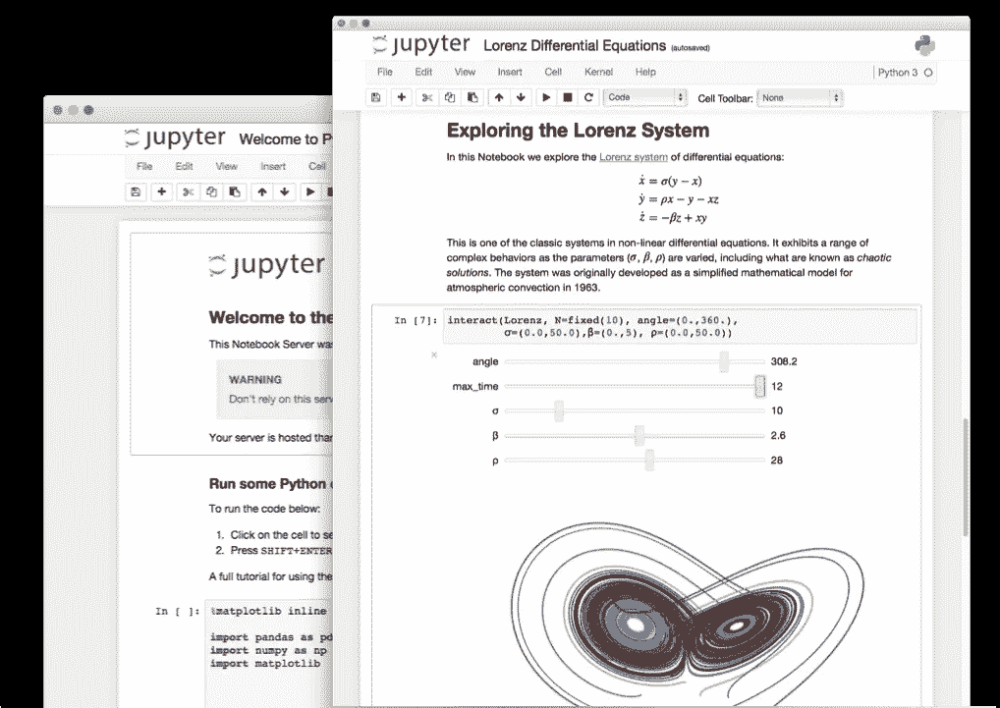

# 你应该知道的最好的 Python IDEs 和代码编辑器

> 原文：<https://towardsdatascience.com/best-python-ides-and-code-editors-you-must-use-in-2020-2303a53db24?source=collection_archive---------1----------------------->

## 具有显著特性的顶级 Python IDEs 和代码编辑器

照片由来自[佩克斯](https://www.pexels.com/photo/blur-close-up-code-computer-546819/?utm_content=attributionCopyText&utm_medium=referral&utm_source=pexels)的[路易斯·戈麦斯](https://www.pexels.com/@luis-gomes-166706?utm_content=attributionCopyText&utm_medium=referral&utm_source=pexels)拍摄

> Python 是程序员需要多大自由的一个实验。太多的自由，没人能读懂别人的代码；太少，表现力受到威胁。
> 
> 吉多·范·罗苏姆

**自诞生以来，** Python 已经迅速发展成为一种多方面的编程语言，成为从 web 应用到部署到 [**人工智能**](https://blog.digitalogy.co/artificial-intelligence-technologies/) 、 [**机器学习**](/machine-learning-books-you-must-read-in-2020-d6e0620b34d7) 、**深度学习**等多种多样项目的选择。

[**Python**](https://www.python.org/)**自带众多特性，比如它的简单性、巨大的软件包和库集合、相对较快的程序执行速度等等。**

> **GitHub 第二受欢迎的语言，也是机器学习最受欢迎的语言。**

**对于一个程序员来说，代码编辑器或 IDE 是接触任何编程语言的第一点，这使得它的选择成为未来旅程中最关键的步骤之一。在整篇文章中，我们将讨论一些顶级的 Python IDEs 和代码编辑器，以及为什么在下一个项目中应该和不应该选择它们。**

> **根据 StackOverflow 的说法，Python 是发展最快的主流编程语言。**

** [## 2019 年堆栈溢出开发者调查

### 每个月，大约有 5000 万人访问 Stack Overflow 来学习、分享和建立他们的职业生涯。我们估计 21…

insights.stackoverflow.com](https://insights.stackoverflow.com/survey/2019)** 

# **什么是集成开发环境(IDE)？**

**IDE 代表 [**集成开发环境**](https://press.rebus.community/programmingfundamentals/chapter/integrated-development-environment/#:~:text=An%20integrated%20development%20environment%20(IDE,IDEs%20have%20intelligent%20code%20completion.) ，不仅包括用于管理代码的标准代码编辑器，还提供了一整套用于调试、执行和测试的工具，这对于软件开发来说是绝对必要的。一些 ide 还带有内置的编译器和解释器。下面列出了在一个专用环境中常见 ide 提供的一些**标准特性**:**

**●语法高亮显示**

**●构建自动化**

**●版本控制**

**●可视化编程**

**●代码格式化和完成**

**●代码重构**

**●支持与外部工具集成**

# **IDE 与代码编辑器**

**对于任何程序员来说，代码编辑器或 IDE 都是最基本的软件，是他们一天开始和结束的事情。要实现它的最大潜力，最好的起点是代码编辑器或 IDE，它本质上允许您使用 Python，但这不是全部。**许多** [**编程语言**](/top-programming-languages-for-ai-engineers-in-2020-33a9f16a80b0) **完全可以在没有 IDE 的情况下工作，而有些则依赖于 IDE。****

****代码编辑器—** 代码编辑器是程序员用于应用程序开发的核心软件。可以把它想象成一个简单的文本编辑器，但是具有额外的特定于编程的高级特性，例如:**

**●语法高亮显示**

**●代码格式**

**●分割文件查看和编辑**

**●即时项目切换**

**●多项选择**

**●跨平台支持**

**●重量轻**

****IDE —** 另一方面，IDE 附带了一套工具，不仅有助于开发应用程序，还有助于测试、调试、重构和自动化构建。不用说，在大多数情况下，IDE 可以提供代码编辑器的所有功能，但是代码编辑器不能取代 IDE。**

# ****2020 年最佳 Python IDEs 和代码编辑器****

**为工作选择合适的工具至关重要。类似地，当开始一个新项目时，作为一名程序员，在选择完美的代码编辑器或 IDE 时，您有很多选择。有很多针对 Python 的 ide 和代码编辑器，在这一节中，我们将讨论一些最好的 ide 和代码编辑器，以及它们的优缺点。**

# **● **皮查姆****

****

**图片来源— [PyCharm](https://www.jetbrains.com/pycharm/)**

*   ****类别:** IDE**
*   **首次发布日期: 2010 年**
*   ****平台兼容性:** Windows、macOS、Linux**
*   ****适合谁:**中高级 Python 用户**
*   ****支持语言:** Python，Javascript，CoffeeScript 等。**
*   ****价格:** Freemium(免费有限功能社区版，付费全功能专业版)**
*   ****下载:**py charm 下载链接**
*   ****使用 Pycharm Python IDE 的热门公司-**
    Twitter、HP、Thoughtworks、GROUPON 和 Telephonic。**

**由 JetBrains 开发的 PyCharm 是一个**跨平台的 IDE** ，它提供了各种各样的特性，比如版本控制、图形调试器、集成单元测试器，以及针对 web 开发和数据科学任务的 pairs。使用 PyCharm 的 API，开发人员可以创建他们的自定义插件，以便向 IDE 添加新功能。**其他功能包括:****

**●代码完成**

**●代码变更的实时更新**

**● Python 重构**

**●支持全栈 web 开发**

**●支持科学工具，如 matplotlib、numpy 和 scipy**

**●支持 Git、Mercurial 等**

**●有付费版和社区版**

## ****py charm 的优势—****

**●可以提高生产率和代码质量**

**●高度活跃的支持社区**

## **PyCharm 的缺点**

**●加载速度可能很慢**

**●需要更改现有项目的默认设置以获得最佳兼容性**

**●初始安装可能会很困难**

****截图供参考-****

****

**图片来源— [PyCharm](https://www.jetbrains.com/pycharm/)**

# **● **Spyder****

****

**图像来源— [Spyder](https://www.spyder-ide.org/)**

*   ****类别:** IDE**
*   **首次发布年份: 2009 年**
*   ****平台兼容性:** Windows、macOS、Linux**
*   ****面向谁:** Python 数据科学家**
*   ****价格:**免费**
*   ****下载:**Spyder 下载链接**

**Spyder 是一个支持像 NumPy、SciPy、Matplotlib 和 Pandas 这样的软件包的工具。Spyder 面向科学家、工程师和数据分析师，提供高级数据探索、分析和可视化工具。**这个跨平台 IDE 的特点包括:****

**●代码完成**

**●语法高亮显示**

**●通过分析器进行代码基准测试**

**●多项目处理**

**●在文件中查找功能**

**●历史日志**

**●用于自检的内部控制台**

**●第三方插件支持**

## ****优势—****

**●包括对众多科学工具的支持**

**●拥有令人惊叹的社区支持**

**●交互式控制台**

**●重量轻**

## ****劣势—****

**●带有执行依赖性**

**●刚开始对新人来说可能有点挑战**

****截图供参考-****

****

**图片来源— [Spyder](https://www.spyder-ide.org/)**

 **[## spyder-ide/spyder

### 版权所有 2009-2019 Spyder 项目贡献者某些源文件和图标可能有其他作者身份/许可…

github.com](https://github.com/spyder-ide/spyder)** 

# **● **Eclipse + Pydev****

****

*   ****类别:** IDE**
*   ****首次发布年份:** 2001 年 Eclipse 的**，Pydev 的 2003 年 Pydev 的****
*   ********平台兼容性:** Windows、macOS、Linux******
*   ******面向谁:**中高级 Python 用户****
*   ****支持语言: Python，(Eclipse 支持 Java 和许多其他编程语言)****
*   ****价格:免费****
*   ******下载:** [PyDev 下载链接](https://www.pydev.org/)****
*   ******使用 PyDev 和 Eclipse Python IDE 的热门公司**——
    Hike、Edify、Accenture、Wongnai、Webedia。****

****Eclipse 是可用的顶级 ide 之一，支持广泛的应用程序开发编程语言，包括 Python。最初是为开发 Java 应用程序而创建的，对其他编程语言的支持是通过插件引入的。用于 Python 开发的插件是 Pydev，它提供了比 Eclipse IDE 更多的好处，比如:****

****Django、Pylint 和 unittest 集成****

****●交互式控制台****

****●远程调试器****

****●转到定义****

****●类型提示****

****●通过自动导入自动完成代码****

## ******优点—******

****●易于使用****

****●程序员友好的特性****

****●免费****

## ******劣势—******

****●复杂的用户界面给工作带来挑战****

****●如果你是初学者，那么使用 Eclipse 会很困难****

******截图供参考-******

********

****图像来源— [Pydev](https://www.pydev.org/)****

**** [## 10 家使用 Python 的世界级公司

### Python 正被 IT 界的一些巨头积极使用

towardsdatascience.com](/10-world-class-companies-using-python-26cde24919a8) 

# ● **怠速**

图片来源— [Python](https://www.python.org/)

*   **类别:** IDE
*   首次发行年份 : 1998 年
*   **平台兼容性:** Windows、macOS、Linux
*   **面向谁:**初级 Python 用户
*   **价格:**免费
*   **下载:** [闲置下载链接](https://docs.python.org/3/library/idle.html)
*   **使用闲置 Python IDE 的热门公司—**
    谷歌、维基百科、CERN、雅虎、NASA。

**集成开发和学习环境**的简称，IDLE 作为其默认 IDE 与 Python 捆绑在一起已经超过 15 年了。IDLE 是一个**跨平台 IDE** ，它提供了一组基本特性来减轻负担。**提供的功能包括**:

●带有彩色代码、输入、输出和错误信息的外壳窗口

●支持多窗口文本编辑器

●代码自动完成

●代码格式

●在文件中搜索

●带断点的调试器

●支持智能缩进

## **优势—**

●非常适合初学者和教育机构

## **劣势—**

●缺少更高级的 ide 所提供的功能，例如项目管理功能

 [## IDLE - Python 3.8.3 文档

### 闲置有以下特点:闲置可能会打开编辑器窗口时，它启动，这取决于设置和你如何启动…

docs.python.org](https://docs.python.org/3/library/idle.html) 

# ● **机翼**

图片来源— [翅膀](https://wingware.com/)

*   **类别** - IDE
*   **首次发布年份—**2000 年 9 月 7 日
*   **平台** - Windows、Linux 和 Mac
*   **面向谁:**中高级 Python 用户
*   **价格:**商业使用一年每位用户 179 美元，永久商业使用许可每位用户 245 美元
*   **下载:** [翼下载链接](https://wingware.com/)
*   **使用 Wing Python IDE 的热门公司-**
    脸书、谷歌、英特尔、苹果和 NASA

功能丰富的 Python IDE Wing 的开发是为了通过引入智能特性(如智能编辑器和简单的代码导航)来加快开发速度。Wing 有 101 个版本、个人版本和专业版本，其中专业版本功能最丰富，也是唯一一个付费版本。**Wing 的其他显著特征包括:**

●代码完成、错误检测和质量分析

●智能重构能力

●交互式调试器

●单元测试器集成

●可定制的界面

●支持远程开发

●支持 Django、Flask 等框架

## **优点—**

●与 Git 等版本控制系统配合良好

●强大的调试能力

## **缺点—**

●缺乏引人注目的用户界面

 [## 用于自然语言处理的 Python 库

### 用于自然语言处理的流行 python 库概述

towardsdatascience.com](/python-libraries-for-natural-language-processing-be0e5a35dd64) 

# ● **云 9 IDE**

图片来源— [亚马逊云 9](https://aws.amazon.com/cloud9/)

*   **类别** : IDE
*   **首次发布年份—** 2010 年
*   **平台** : Linux/MacOS/Windows
*   **使用 Cloud9 Python IDE 的热门公司—**
    Linkedin、Salesforce、Mailchimp、Mozilla、Edify、Soundcloud。

作为亚马逊网络服务的一部分，Cloud9 IDE 只需要一个浏览器就可以让你访问基于云的 IDE。所有代码都在亚马逊的基础设施上执行，转化为无缝和轻量级的开发体验。**功能包括:**

●需要最少的项目配置

●强大的代码编辑器

●代码高亮、格式化和完成功能

●内置终端

●强大的调试器

●实时结对编程能力

●即时项目设置，涵盖大多数编程语言和库

●通过终端无障碍访问多个 AWS 服务

## **优势—**

●实现无服务器应用程序的轻松开发

●非常强大且全球可用的基础设施

## **缺点—**

●完全依赖互联网接入

 [## 机器学习和深度学习的最佳 Python 库

### 现代机器学习模型和项目的 Python 库

towardsdatascience.com](/best-python-libraries-for-machine-learning-and-deep-learning-b0bd40c7e8c) 

# ● **崇高正文 3**

图片来源— [升华](https://www.sublimetext.com/3)

*   **类别:**代码编辑器
*   **首次发布年份:** 2008 年
*   **平台兼容性:** Windows、macOS、Linux
*   **适合谁:**初学者，专业人士
*   **支持语言:** Python 和 C#
*   **价格:**免费增值
*   **下载:** [崇高正文 3 下载链接](https://www.sublimetext.com/3)
*   **使用 Sublime Text Python IDE 的热门公司-**
    星巴克、Myntra、Trivago、Stack、Zapier。

**Sublime Text** 是最常用的跨平台代码编辑器之一，支持多种编程语言，包括 Python。Sublime 提供了各种功能，如大量的视觉定制主题，一个干净和不受干扰的用户界面，并支持包管理器通过插件扩展核心功能。**其他功能包括:**

●通过软件包管理器更新插件

●文件自动保存

●宏

●语法高亮和代码自动完成

●同步代码编辑

●转到任何东西、定义和符号

## **优势—**

●整洁的用户界面

●分割编辑

●快速高性能编辑器

## **缺点—**

●恼人的弹出窗口购买崇高的许可证

●令人困惑的大量快捷方式

●复杂的软件包管理器

# ● **Visual Studio 代码**

图片来源— [Visual Studio 代码](https://code.visualstudio.com/)

*   **类别:** IDE
*   **首次发布年份:** 2015 年
*   **平台兼容性:** Windows、macOS、Linux
*   **送给谁**:专业人士
*   **支持语言:**各大编程语言(Python，C++，C#，CSS，Dockerfile，Go，HTML，Java，JavaScript，JSON，Less，Markdown，PHP，PowerShell，Python，SCSS，T-SQL，TypeScript。)
*   价格:免费
*   **下载:** [Visual Studio 代码下载链接](https://code.visualstudio.com/)
*   **使用可视化源代码的流行公司(Python IDE—**
    )The Delta Group，TwentyEight，Inc .、Focus Ponte Global、Creative Mettle 和 National Audubon Society，Inc .

**由微软**开发的 Visual Studio Code 是一款广受好评的跨平台代码编辑器，它具有高度的可定制性，并允许使用包括 Python 在内的多种编程语言进行开发。它为程序员提供了各种各样的特性，比如智能调试、可定制性、扩展核心特性的插件支持。**主要亮点包括:**

●对 Git 和版本控制的内置支持

●代码重构

●集成终端

●智能感知，实现更智能的代码突出显示和完成

●直观的代码调试能力

●无缝部署到 Azure

## **优势—**

●在积极的社区支持下定期更新

●免费

## **缺点—**

●大量的插件会让寻找合适的插件变得很困难

●对大文件处理不力

●更长的发射时间

**截图供参考-**

图片来源— [Visual Studio 代码](https://code.visualstudio.com/)

 [## Visual Studio 代码中的 Python

### 使用 Microsoft Python 扩展，在 Visual Studio 代码中使用 Python 是简单、有趣且高效的。的…

code.visualstudio.com](https://code.visualstudio.com/docs/languages/python) 

# ● **原子**

图片来源— [原子](https://atom.io/)

*   **类别:**代码编辑器
*   **首次发布年份:** 2014 年
*   **平台兼容性:** Windows、macOS、Linux
*   **适合谁:**初学者，专业人士
*   **支持语言:** Python、HTML、Java 等 34 种语言。
*   **价格:**免费
*   **下载:** [Atom 下载链接](https://atom.io/)
*   **使用 Atom (Python IDE)的热门公司——** 埃森哲、Hubspot、Figma、Lyft、Typeform。

Atom 由源代码托管和软件版本控制领域的佼佼者 Github 开发，是一个轻量级的跨平台代码编辑器，适用于 Python 和许多其他编程语言。Atom 以包的形式提供了许多特性，增强了它的核心特性。它建立在 HTML、JavaScript、CSS 和 Node.js 之上，底层框架是 electronic。**提供的功能包括:**

●通过内置软件包管理器支持第三方软件包

●支持开发者协作

●超过 8000 个功能和用户体验扩展包

●支持多窗格文件访问

●智能代码完成

●可定制选项

## **优势—**

●轻量级代码编辑器

●社区驱动的发展和支持

## **缺点—**

●最近的更新增加了 RAM 的使用

●使用前需要对设置进行一些调整

# ● **Jupyter**

图片来源— [Jupyter](https://jupyter.org/install.html)

*   **类别:** IDE
*   **首次发布年份-**2015 年 2 月
*   **浏览器兼容性:** Chrome，Firefox，Safari
*   **价格:**免费
*   **下载:**Jupyter 下载链接
*   **使用 Jupyter Python IDE 的热门公司-** 谷歌、彭博、微软、IBM 和 Soundcloud。

也被称为 **Project Jupyter，**它是一个 [**开源**](https://blog.digitalogy.co/open-source-technology/) **和跨平台 IDE** ，许多数据科学家和分析师比其他工具更喜欢它。非常适合研究 AI、ML、DL 等技术，以及包括 Python 在内的几种编程语言。Jupyter 笔记本为各种目的(包括分析、可视化和开发)提供代码、文本和方程的无缝创建和共享。**提供的功能包括:**

●代码格式和突出显示

●通过电子邮件、Dropbox 轻松分享

●产生交互式输出

●善于利用大数据

●可以从本地和云机器上运行

## **优势—**

●需要最少的设置

●非常适合快速数据分析

## **缺点—**

●没有经验的用户可能会发现 Jupyter 很复杂

**参考截图-**

图片来源— [Jupyter](https://jupyter.org/install.html)

## 如何为自己选择最好的 Python IDEs 和代码编辑器

选择正确的 IDE 或代码编辑器可能意味着通过更快的开发节省时间，或者由于鲁莽的决定而失去时间。在上一节中，我们已经提到了许多 ide 和代码编辑器及其一些值得注意的特性。如果你不知道下一个 Python 项目应该选择哪一个，我们建议你快速阅读一下。毕竟，如果没有一套合适的 ide 和代码编辑器，程序员会怎么样呢？

> ***注:*** *为了消除各种各样的问题，我想提醒你一个事实，这篇文章仅代表我想分享的个人观点，你有权不同意它。*

# 更多有趣的阅读—

我希望这篇文章对你有用！以下是一些有趣的读物，希望你也喜欢

 [## 面向所有人的顶级谷歌人工智能工具

### 使用谷歌人工智能中心将想法变为现实

towardsdatascience.com](/top-google-ai-tools-for-everyone-60346ab7e08)  [## 数据科学如何助推网飞

### 当有效使用时，数据可以神奇的方式改变您的业务，并将它带到新的高度。

towardsdatascience.com](/how-data-science-is-boosting-netflix-785a1cba7e45)  [## 数据科学家的最佳数据科学工具

### 数据科学工具，使任务可以实现

towardsdatascience.com](/best-data-science-tools-for-data-scientists-75be64144a88)  [## 选择 PyTorch 进行深度学习的理由

### PyTorch 可以为深度学习程序员提供很多东西

towardsdatascience.com](/reasons-to-choose-pytorch-for-deep-learning-c087e031eaca) 

> **关于作者**
> 
> **克莱尔 D** 。是[**Digitalogy**](https://www.digitalogy.co/)**—**的内容制作者和营销人员，这是一个技术采购和定制匹配市场，根据全球各地的特定需求，将人们与预先筛选的&顶尖开发人员和设计师联系起来。在[**Linkedin**](https://www.linkedin.com/company/digitalogy)[**Twitter**](https://twitter.com/DigitalogyCorp)[**insta gram**](https://www.instagram.com/digitalogycorp)上连接 **Digitalogy** 。****