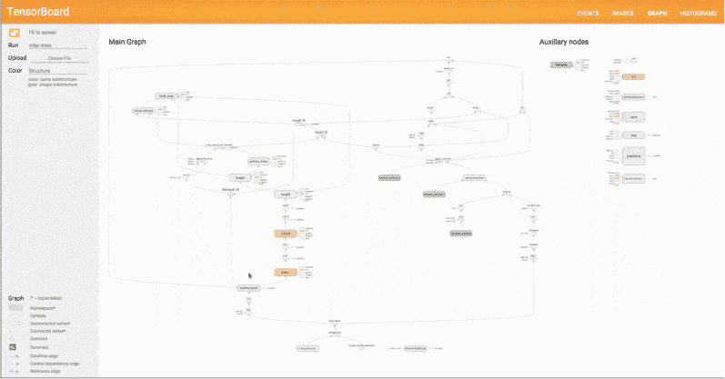
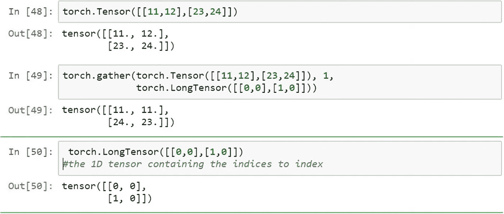
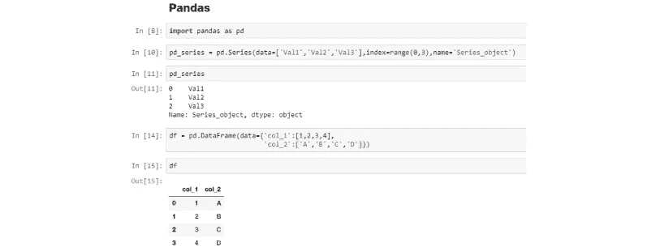
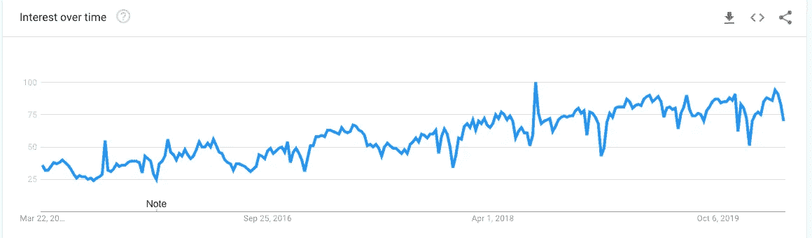
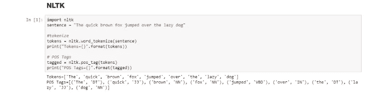
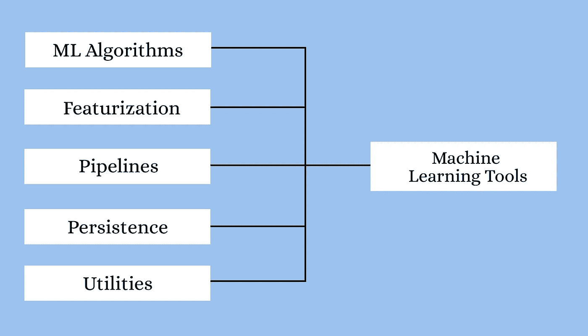
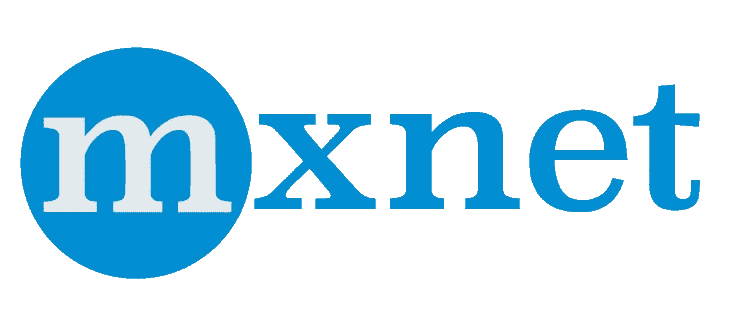
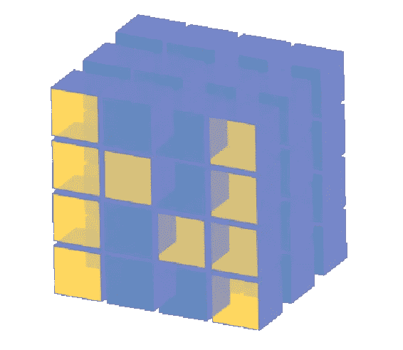
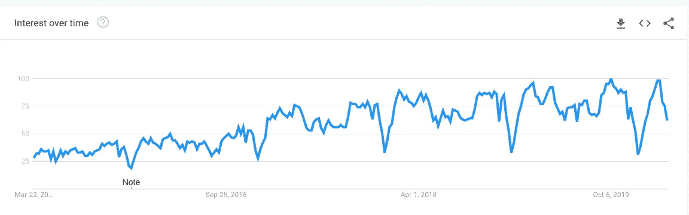

# 机器学习和深度学习的最佳 Python 库

> 原文：<https://towardsdatascience.com/best-python-libraries-for-machine-learning-and-deep-learning-b0bd40c7e8c?source=collection_archive---------1----------------------->

## 现代机器学习模型和项目的 Python 库

机器学习和深度学习的最佳 Python 库

> "机器学习的一项突破相当于十个微软."
> ——比尔·盖茨

**机器学习**和**深度学习**最近随着人工智能行业**的推动而兴起**，这项技术的早期采用者开始看到它结出果实。随着越来越多的企业加入这一行列，并开始投入时间和精力来实现这一未开发领域的潜力，这对在这一领域工作的开发人员来说会更好。

几种编程语言可以让你从人工智能、ML 和 DL 开始，每种语言都提供一个特定概念的据点。一些流行的 ML 和 DL 编程语言是 **Python** 、 **Julia** 、 **R** 、 **Java** 以及其他一些语言。至于现在，我们将更关注于 **Python** 。

# 为什么机器学习和 AI 首选 Python？

> 作为**首选的**机器学习语言，Python 似乎正在赢得战斗。库和开源工具的可用性使其成为开发 ML 模型的理想选择。

长期以来，Python 一直是机器学习和人工智能开发者的首选。Python 为开发人员提供了一些最好的**灵活性和特性**，不仅提高了他们的生产力，还提高了代码的质量，更不用说**丰富的库**帮助减轻了工作量。下面列出了使 Python 成为机器学习、深度学习和人工智能的顶级编程语言的各种功能:

● **免费和开源的特性**使得它对社区友好，并保证长期的改进

● **详尽的库**确保每个现有问题都有解决方案

● **平稳的实施和集成**使不同技能水平的人都可以适应它

●通过**减少编码和调试时间**提高生产率

●可以**用于软计算**，自然语言处理也可以

● **与 C 和 C++** 代码模块无缝协作

> Python 是你能读到的最强大的语言。
> --**-*巴乌杜布*-**

用于机器学习的 Python

# 机器学习和深度学习的最佳 Python 库

虽然有很多语言可供选择，但 Python 是对开发人员最友好的机器学习和深度学习编程语言之一，并且它有一套广泛的库支持，以满足您的每一个用例和项目。

机器学习的最佳 Python 库([来源](https://it.toolbox.com/tech-101/top-python-libraries-for-machine-learning))

# ● **张量流**

> 革命来了！欢迎使用 TensorFlow 2.0。

> **TensorFlow 是一个快速、灵活、可扩展的开源机器学习库，用于研究和生产。**

[**TensorFlow**](https://www.tensorflow.org/) 是在 Python 上进行机器学习的最好的库之一。TensorFlow 由 Google 提供，让初学者和专业人士都可以轻松地建立 ML 模型。

使用 TensorFlow，您不仅可以在计算机上创建和训练 ML 模型，还可以使用 TensorFlow Lite 和 TensorFlow Serving 在移动平台和高性能服务器上提供相同的优势。

TensorBoard( [来源](https://www.tensorflow.org/tensorboard/graphs)

在 ML 和 DL 中，TensorFlow 大放异彩的一些重要领域是:

●处理深度神经网络

●自然语言处理

●偏微分方程

●抽象能力

●图像、文本和语音识别

●想法和代码的轻松协作

核心任务:建立深度学习模型

要了解如何在 TensorFlow 中完成特定任务，可以参考 [TensorFlow 教程](https://www.tensorflow.org/tutorials/)。

# ● **Keras**

[**Keras**](https://keras.io/) 是 Python 最流行和开源的神经网络库之一。最初**由谷歌工程师为 ONEIROS** 设计，ONEIROS 是开放式神经电子智能机器人操作系统的缩写，Keras 很快在 TensorFlow 的核心库中得到支持，使其可以在 TensorFlow 上访问。Keras 提供了创建神经网络所需的几个构建模块和工具，例如:

●神经层

●激活和成本函数

●目标

●批量标准化

●辍学

●联营

Keras 片段([来源](https://www.zeolearn.com/magazine/python-libraries-for-machine-learning))

Keras 通过 ML 和 DL 编程的这些附加特性扩展了 TensorFlow 的可用性。有了一个有用的社区和一个专用的 Slack 频道，获得支持是很容易的。对卷积和递归神经网络的支持也与标准神经网络一起存在。也可以参考斯坦福的 Keras 和[计算机视觉课上的其他](http://cs231n.stanford.edu/)[示例模型。](https://github.com/fchollet/keras/tree/master/examples)

**Keras 备忘单:**[https://S3 . amazonaws . com/assets . data camp . com/blog _ assets/Keras _ Cheat _ Sheet _ python . pdf](https://s3.amazonaws.com/assets.datacamp.com/blog_assets/Keras_Cheat_Sheet_Python.pdf)

**核心任务:**构建深度学习模型

【Keras 入门—

keras-创建你自己的机器学习模型([来源](https://www.youtube.com/watch?v=J6Ok8p463C4)

# ● **PyTorch**

由脸书开发的 PyTorch 是为数不多的 Python 机器学习库之一。除了 Python，PyTorch 的 C++接口也支持 C++，如果你喜欢的话。PyTorch 被认为是最佳机器学习和深度学习框架竞赛中的顶级竞争者之一，它面临着来自 TensorFlow 的触摸竞争。其他细节可以参考 [PyTorch 教程](https://pytorch.org/tutorials/)。

基本 PyTorch 工作流程([来源](https://www.google.com/imgres?imgurl=https%3A%2F%2Fwww.learnopencv.com%2Fwp-content%2Fuploads%2F2019%2F05%2Ftorch-workflow.png&imgrefurl=https%3A%2F%2Fwww.learnopencv.com%2Fpytorch-for-beginners-basics%2F&tbnid=oMug2SdZawVNTM&vet=12ahUKEwiShvLuxqPoAhXSVHwKHa5KDYQQMygWegQIARAv..i&docid=ela9C-X5MB8TuM&w=760&h=406&q=pytorch%20torch.optim%20model%20image&ved=2ahUKEwiShvLuxqPoAhXSVHwKHa5KDYQQMygWegQIARAv))

PyTorch 与 TensorFlow 的一些重要区别在于:

●能够通过图形处理单元加速处理的张量计算

●易于学习、使用并与 Python 生态系统的其他部分集成

●支持建立在基于磁带的自动差异系统上的神经网络

PyTorch 附带的各种模块有助于创建和训练神经网络:

●张量——火炬。张量

Pytorch 张量介绍([来源](https://link.springer.com/chapter/10.1007/978-1-4842-4258-2_1)

●优化器— torch.optim 模块

●神经网络——神经网络模块

●亲笔签名

> **优点**:非常可定制，广泛应用于深度学习研究
> 
> 缺点:较少的 NLP 抽象，没有针对速度进行优化
> 
> **核心任务:**开发和训练深度学习模型

## Keras vs Tensorflow vs PyTorch |深度学习框架对比

深度学习框架比较([来源](https://www.youtube.com/watch?v=DmI58jz2i6w))

# ● **Scikit-learn**

[Scikit-learn](https://scikit-learn.org/stable/user_guide.html) 是另一个被广泛使用的 Python 机器学习库。它包括与不同的 ML 编程库如 NumPy 和 Pandas 的简单集成。Scikit-learn 支持各种算法，例如:

> ●分类
> 
> ●回归
> 
> ●聚类
> 
> ●降维
> 
> ●型号选择
> 
> ●预处理

围绕易于使用但仍然灵活的理念，Scikit-learn 专注于**数据建模**，而不是其他任务，如[数据](https://blog.digitalogy.co/data-breaches-what-you-need-to-know-about-this-threat-now/)的加载、处理、操纵和可视化。从研究阶段到部署，它被认为足以用作端到端 ML。为了更深入地理解 scikit-learn，你可以查看 S [cikit-learn 教程](http://scikit-learn.org/stable/tutorial/index.html)。

**核心任务:**建模

**学习 Scikit-学习-**

scikit——提供大量的机器学习算法([来源](https://www.youtube.com/watch?v=rvVkVsG49uU))

# ●熊猫

[**熊猫**](https://pandas.pydata.org/) 是一个 Python 数据分析库，主要用于**数据操作和分析**。它在数据集为训练做准备之前就开始发挥作用了。熊猫让机器学习程序员轻松处理时间序列和结构化多维数据。就处理数据而言，熊猫的一些伟大特性是:

●数据集重塑和旋转

●数据集的合并和连接

●缺失数据的处理和数据对齐

●各种索引选项，如分级轴索引、花式索引

●数据过滤选项

熊猫片段([来源](https://www.zeolearn.com/magazine/python-libraries-for-machine-learning))

Pandas 使用 DataFrames，这只是一个技术术语，通过向程序员提供 DataFrame 对象来表示数据的二维表示。

**核心任务**:数据处理和分析

**谷歌趋势——随着时间的推移熊猫的兴趣**

谷歌趋势熊猫([来源](https://trends.google.com/trends/explore?date=today%205-y&geo=US&q=pandas))

# ● NLTK

[NLTK](https://www.nltk.org/) 代表**自然语言工具包**，是一个用于自然语言处理的 Python 库。它被认为是最流行的处理人类语言数据的库之一。NLTK 为程序员提供了简单的接口以及大量的词汇资源，比如 FrameNet、WordNet、Word2Vec 以及其他一些资源。NLTK 的一些亮点是:

●在文档中搜索关键字

●文本的标记化和分类

●语音和手写识别

●单词的词汇化和词干化

NLTK 片段([来源](https://www.zeolearn.com/magazine/python-libraries-for-machine-learning))

NLTK 及其软件包被认为是学生、工程师、研究人员、语言学家和从事语言工作的行业的可靠选择。

**核心任务:**文本处理

# ● **火花 MLlib**

> **MLlib** 是 Apache Spark 的可扩展机器学习库

由 Apache 开发的, [Spark MLlib](https://github.com/databricks/spark-deep-learning) 是一个机器学习库，可以轻松扩展您的计算。它使用简单，快速，易于设置，并提供与其他工具的顺利集成。Spark MLlib 瞬间成为开发机器学习算法和应用的便捷工具。

【Spark MLlib 带来的工具有:

Spark Mllib 机器学习工具

使用 Spark MLlib 进行机器学习的程序员可以利用的一些流行算法和 API 有:

●回归

●聚类

●优化

●尺寸缩减

●分类

●基本统计

●特征提取

# ● Theano

[**Theano**](http://www.deeplearning.net/software/theano/) 是一个强大的 Python 库，可以轻松定义、优化和评估强大的数学表达式。使 ano 成为执行大规模科学计算的强大库的一些特性包括:

> ●与 CPU 相比，支持 GPU 在重型计算中表现更佳
> 
> ●与 NumPy 的强大集成支持
> 
> ●更快、更稳定地评估最棘手的变量
> 
> ●能够为您的数学运算创建自定义 C 代码

有了 Theano，你可以实现一些最高效的机器学习算法的快速开发。在 ano 之上构建了一些知名的深度学习库，如 **Keras** 、 **Blocks** 和 **Lasagne** 。关于 Theano 中更高级的概念，可以参考 **Theano 教程**。

# ● **MXNet**

> 一个灵活高效的深度学习库

MXnet——一个灵活高效的深度学习库

如果你的专业领域包括深度学习，你会发现 [**MXNet**](https://mxnet.incubator.apache.org/api/architecture/overview#deep-learning-system-design-concepts) 是最合适的人选。用于训练和部署深度神经网络，MXNet 是**高度可扩展的，并支持快速模型训练**。Apache 的 MXNet 不仅支持 Python，还支持许多其他语言，包括 C++、Perl、Julia、R、Scala、Go 等等。

**MXNet 的可移植性和可扩展性**让您可以从一个平台转移到另一个平台，并根据项目的需求进行扩展。科技和教育领域的一些大牌，如**英特尔**、**微软**、**麻省理工**等等，目前都支持 MXNet。**亚马逊的 AWS** 更倾向于 MXNet 作为其首选深度学习框架的选择。

# ● **Numpy**

Numpy 图书馆

Python 的 [NumPy](https://numpy.org/) 库专注于处理大量多维数据和对数据进行操作的复杂数学函数。NumPy 提供了在数组上快速计算和执行复杂函数的能力。支持 NumPy 的几点有:

●支持数学和逻辑运算

●形状操作

●分类和选择能力

●离散傅立叶变换

●基本线性代数和统计运算

●随机模拟

●支持 n 维数组

NumPy 致力于面向对象的方法，并拥有集成 C、C++和 Fortran 代码的工具，这使得 NumPy 在科学界非常受欢迎。

**核心任务:**数据清理和操作

**谷歌趋势—一段时间内的货币利息**

谷歌趋势 Numpy( [来源](https://trends.google.com/trends/explore?date=today%205-y&geo=US&q=numpy))

# 结论

Python 是一个真正不可思议的开发工具，它不仅是一种通用的编程语言，还能满足您的项目或工作流的特定需求。它提供了大量的库和包，扩展了 Python 的功能，使它成为一个全能的工具，非常适合任何希望开发程序和算法的人。通过上面简要讨论的一些现代机器学习和深度学习的 Python 库，您可以了解每个库都提供了什么并做出选择。

# **更多有趣的阅读—**

我希望这篇文章对你有用！下面是一些有趣的读物，希望你也喜欢

 [## 面向所有人的顶级谷歌人工智能工具

### 使用谷歌人工智能中心将想法变为现实

towardsdatascience.com](/top-google-ai-tools-for-everyone-60346ab7e08)  [## 2020 年人工智能工程师的顶级编程语言

### 从几种编程语言中，人工智能工程师和科学家可以挑选出适合他们需要的语言

towardsdatascience.com](/top-programming-languages-for-ai-engineers-in-2020-33a9f16a80b0)  [## 用于可解释机器学习的 Python 库

### 4 个用于更好地可视化、解释和诠释模型的库

towardsdatascience.com](/python-libraries-for-interpretable-machine-learning-c476a08ed2c7)  [## 数据科学的 10 大 Python 库

### 为您的数据科学探索提供一些很酷的帮助！

towardsdatascience.com](/top-10-python-libraries-for-data-science-cd82294ec266) 

> ***关于作者***
> 
> ***克莱尔 D*** *。在*[***digital ogy***](https://www.digitalogy.co/)***—****是一个内容制作者和营销人员。这是一个技术采购和定制匹配市场，根据全球各地的特定需求，将人们与预先筛选的&顶尖开发人员和设计师联系起来。连接****Digitalogy****on*[***Linkedin***](https://www.linkedin.com/company/digitalogy)*[***Twitter***](https://twitter.com/DigitalogyCorp)*[***insta gram***](https://www.instagram.com/digitalogycorp)*。***