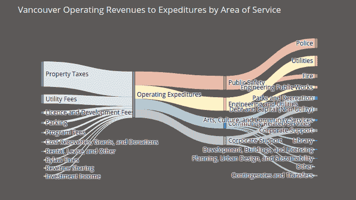

# 最佳中等 Python 可视化

> 原文：<https://towardsdatascience.com/best-python-visualizations-on-medium-a04921f61559?source=collection_archive---------20----------------------->

## 通过观察媒体上的顶级可视化效果，了解可视化数据的最佳技术

> 声明:我为 Datapane 工作

# 动机

Medium 上每天都有关于数据可视化的惊人文章。虽然这是以信息超载为代价的，但这不应该阻止您探索有趣的文章，因为您可以学习许多为项目创建有效可视化的新技术。

我浏览了最近关于 Python 可视化的中型文章，并把其中最好的放在一起——希望它能让你自己更容易地探索它们。我已经将这些提交给了数据面板图库，它正在为我们托管它们。

如果你还不知道 [Datapane](https://datapane.com/) ，它是一个开源框架，面向用 Python 分析数据并需要一种方式来分享他们的结果的人。Datapane 拥有一个免费的公共平台，有一个画廊和社区，人们可以在 Python 数据可视化技术上共享和协作。

在这篇文章中，我将以画廊中的情节为例，说明什么因素构成了有效的情节，介绍不同种类的情节，以及如何自己创建它们！

# 用 Python 实现流水线中的主成分分析和 SVM

# 有趣的想法

在[这篇文章](/visualizing-support-vector-machine-decision-boundary-69e7591dacea)， [Saptashwa Bhattacharyya](https://medium.com/@saptashwa) 结合了 SVM、主成分分析和网格搜索交叉验证来创建一个管道，以找到二元分类的最佳参数。然后，他绘制了一个决策边界来展示我们的算法执行得有多好。

# 令人印象深刻的视觉效果

**联合地块**

联合图确实有助于在一个图中显示两个变量的分布和关系。六边形越暗，落在该区域的点(观测值)越多

**等高线图和核密度估计:** KDE(核密度估计)是一个有用的统计工具，可以让你在给定一组数据的情况下创建一条平滑的曲线。如果您只想可视化某些数据的“形状”(而不是离散直方图)，这可能会很有用。

**配对图**:通过查看配对图，比较不同变量对之间的相关性要容易得多。在下图中，您可以看到平均面积与平均半径有很强的相关性。颜色的差异也有助于了解每对中每个标签的行为—这真的很清楚！

**SVM 等高线图:**这个等高线图真的有助于找到位于那个区域的点实际属于那个区域的百分比。我特别喜欢下面的等高线图，因为我可以看到恶性细胞、良性细胞和支持向量所在的区域，它帮助我理解 SVM 是如何工作的。

**3D SVM 图:**即使我们经常看到 2D SVM 图，但大多数时候，数据是多维的。看到这个 3D 图真的有助于理解 SVM 是如何在多维空间中工作的。

## 要探索的资源

*   [中条](/visualizing-support-vector-machine-decision-boundary-69e7591dacea)
*   运行[活页夹](https://mybinder.org/v2/gh/khuyentran1401/Machine_Learning/ce7fae1c5d9fab8eefcd624674c10afaa1704bbd?filepath=machine_learning%2FSVM_Decision_Boundary%2FDecision_Boundary_SVM.ipynb%27)上的代码

# 用 Plotly 可视化 Gapmind 和篮球数据集

## 有趣的想法

一个好的情节不仅是美丽的，而且能给观众提供正确的信息。如果图表中没有正确的比例，观众会以不同的方式解读信息。

这就是为什么正确的比例如此重要。在[这篇文章](/create-effective-data-visualizations-of-proportions-94b69ad34410)， [JP Hwang](https://medium.com/@_jphwang) 向你展示如何用正确的比例创造有效的情节。

## 令人印象深刻的视觉效果

**曲线图显示了随时间的变化**

该图有效地代表了世界上不同大陆在时间快照中所占的百分比:

但是你如何绘制图表来显示不同大陆的人口比例随时间的变化呢？

作者展示了你可以通过下面的情节做到这一点

从上面的图中可以看出，时间维度被添加到了图中。现在这些图不仅显示了分布，还显示了总数和分布如何随时间变化！整洁！

**气泡图**

随着数据点在两个维度上的增长，无论是条形图还是堆叠条形图都变得更加难以可视化，因为条形图的大小太小，无法提供任何有意义的信息。

这就是为什么作者聪明地使用了气泡图，这是一种在一个图表中查看更多数据点的有效方法，但仍然清楚地显示了比例随时间的变化。

## 要探索的资源

*   [中等文章](/create-effective-data-visualizations-of-proportions-94b69ad34410)
*   运行[活页夹](https://notebooks.gesis.org/binder/v2/gh/khuyentran1401/gapminder/8b2fce261ea19a59765942a0ae875d8e756fef50)上的代码

# 牛郎星情节解构:可视化天气数据的相关结构

## 有趣的想法

您可能知道如何使用热图来显示数据中不同变量之间的相关性，但如果您想从热图中的数字 0.71 中获得更多信息，该怎么办呢？在[这篇文章](/altair-plot-deconstruction-visualizing-the-correlation-structure-of-weather-data-38fb5668c5b1)，[保罗·希姆斯特拉](/altair-plot-deconstruction-visualizing-the-correlation-structure-of-weather-data-38fb5668c5b1)展示了如何通过结合热图和二维直方图来探索天气数据集的结构。

## 令人印象深刻的视觉效果

**与牛郎星联动的剧情**

热图和二维直方图在显示相关性方面都很有效——但是如果你能把它们结合起来会更有效。下面的链接图就是这样做的。

当您单击热图中的每个方块时，您将在右侧看到该热图的 2D 直方图表示！

. 98 的相关性在 2d 直方图中是什么样子的？我们期望线性相关，我们通过看右边的图来证明。相比之下，对于 0.12 的相关性，在 2D 直方图上似乎没有任何模式。非常直观易懂。

## 要探索的资源

*   [中条](/altair-plot-deconstruction-visualizing-the-correlation-structure-of-weather-data-38fb5668c5b1)
*   运行[活页夹](https://mybinder.org/v2/gh/khuyentran1401/altair_cor2dbinnedplot_article/0736924eae9af75cfb9c3524f1263df12497ae01?filepath=content%2Faltair_interactive_cor_article.ipynb)上的代码

# 基于 Python 的 Plotly 的桑基图基础

## 有趣的想法

如何可视化一个流入流出来源不同的网络？例如，政府的税收、公用事业等收入用于哪些服务？与其他服务的支出相比，一项服务的支出百分比是多少？

在[这篇文章](/sankey-diagram-basics-with-pythons-plotly-7a13d557401a)，[蒂亚戈·卡瓦略](https://medium.com/@thiago.bernardes.carvalho)展示了如何用桑基图有效地可视化这样的网络

# 令人印象深刻的视觉效果

**桑基图**

如果您点击图表中的每个网络，您可以清楚地看到收入花在了哪些服务上。如果你只看左边的节点，你可以比较不同收入之间的比例。你可以对右边的节点做同样的事情。这种技术对于绘制流程图特别有用——比如销售渠道，或者访问者在您的网站上走过的路。一张图能传达如此多的信息，真是令人惊讶。

## 要探索的资源

*   [中条](/sankey-diagram-basics-with-pythons-plotly-7a13d557401a)
*   运行[活页夹](https://mybinder.org/v2/gh/khuyentran1401/plotly-sankey/37a27c65dab38712868a6664838b7aa34cc667e3?filepath=sankey.ipynb)上的代码

# 新冠肺炎对美国不同社会群体失业率的影响

## 有趣的想法

你可能知道新冠肺炎严重影响经济，但你知道它如何影响不同的社会群体吗？[本文](/how-to-create-an-animated-bar-chart-in-jupyter-9ee1de8d0e80)作者[冈田新一](https://medium.com/@shinichiokada)旨在用动画条形图回答这个问题。

## 令人印象深刻的视觉效果

**动画条形图**

查看条形图随时间变化的最常见方法是使用滑动条，在滑动条上滑动按钮来查看变化。但是你的滑动速率是变化的，所以你不会看到随着时间的推移以同样的速率变化。这就是为什么动画条形图如此有效。

单击左侧的播放按钮，查看条形图如何随时间变化！现在你可以清楚地看到新冠肺炎教在不同时期对不同社会群体的不同影响。

# 要探索的资源

*   [中等文章](/how-to-create-an-animated-bar-chart-in-jupyter-9ee1de8d0e80)
*   运行[活页夹](https://mybinder.org/v2/gh/khuyentran1401/animated_bar_chart/ce403f0d23666ed8134c74ab2723685c61b49b23?filepath=content%2Fanimated_bar.ipynb)上的编码器，自己创建条形图！

# 结论

我希望这篇文章能为您提供一个良好的开端，让您探索关于可视化的有趣的媒体文章。学习任何东西的最好方法就是自己去尝试。选择一个可视化，运行代码，观察其中的神奇之处！

我喜欢写一些基本的数据科学概念，并尝试不同的算法和数据科学工具。你可以在 LinkedIn 和 Twitter 上与我联系。

如果你想查看我写的所有文章的代码，请点击这里。在 Medium 上关注我，了解我的最新数据科学文章，例如

 [## VSCode 中数据科学家的 4 大代码查看器

### 让 YAML、JSON、CSV 和 Jupyter Notebook 为你工作，而不是与你作对

towardsdatascience.com](/top-4-code-viewers-for-data-scientist-in-vscode-e275e492350d)  [## 可视化的 6 大 Python 库:使用哪一个？

### 对使用哪种可视化工具感到困惑？我为你分析了每个图书馆的利弊

towardsdatascience.com](/top-6-python-libraries-for-visualization-which-one-to-use-fe43381cd658)  [## 使用这四种 Numpy 方法充分利用您的阵列

### 如何垂直拆分 Numpy 数组或查找特定范围内的元素。

medium.com](https://medium.com/swlh/get-the-most-out-of-your-array-with-these-four-numpy-methods-2fc4a6b04736)  [## 我收集了超过 1k 的顶级机器学习 Github 配置文件，这就是我的发现

### 从 Github 上的顶级机器学习档案中获得见解

towardsdatascience.com](/i-scraped-more-than-1k-top-machine-learning-github-profiles-and-this-is-what-i-found-1ab4fb0c0474) 

*原载于 2020 年 3 月 16 日*[*【https://datapane.com】*](https://datapane.com/blog/best-python-visualizations-on-medium/)*。*