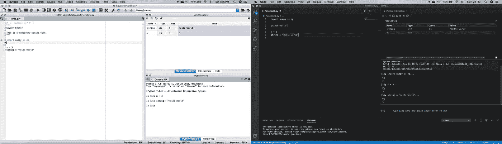
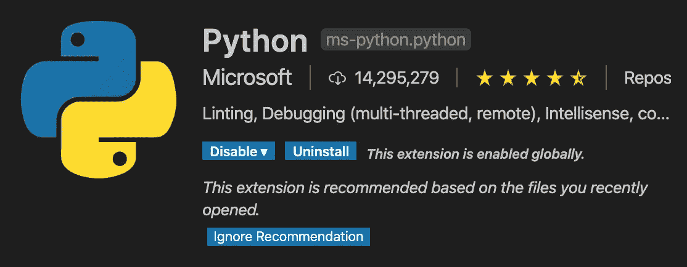
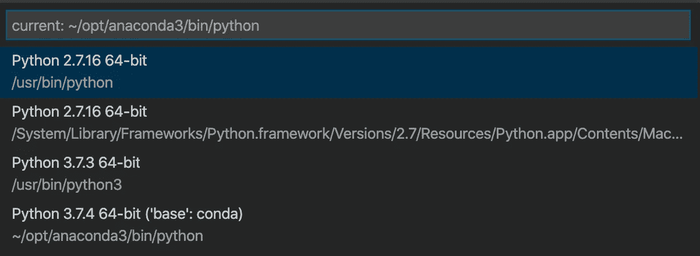

# 最佳 Spyder 替代方案— VS 代码

> 原文：<https://towardsdatascience.com/best-spyder-alternative-vs-code-de0d9a01c8b5?source=collection_archive---------8----------------------->

## 如果你是 Spyder 或 R Studio 的粉丝，你一定会喜欢 Visual Studio 代码。

萨法尔·萨法罗夫在 [Unsplash](https://unsplash.com/s/photos/vs-code?utm_source=unsplash&utm_medium=referral&utm_content=creditCopyText) 上拍摄的照片

当我开始 Python 编程时，Spyder 一直是我的最爱。我喜欢它的变量浏览器，IPython 控制台和项目目录选择器。变量资源管理器允许我检查和调试变量，而不用打印它们。IPython 控制台允许我在写入脚本之前进行任何快速测试，而项目目录选择器允许我在不使用命令行的情况下更改目录。多方便啊！

最近在 [Visual Studio 代码](https://code.visualstudio.com/)中的 Python 开发在过去的一年中有了显著的改进，这激起了我的兴趣。我已经用了几个月了，我真的很喜欢 Visual Studio 代码。以下是我认为 VS Code 是 Spyder 最佳选择的原因。

# 1.熟悉的用户界面

Spyder 3 vs Visual Studio 代码

在我们开始之前，您应该在 VS 代码扩展市场安装 Python 扩展。

与 Spyder 类似，VS Code 也有一个变量浏览器。Python 交互式窗口为您提供了与 IPython 控制台相似的功能。您可以在这里做一个快速代码测试，并在变量浏览器中探索您的变量。

VS Code 还提供了 Python 调试控制台，用于 Python 中的调试。更多细节可以参考 VS 代码博客。

 [## Visual Studio 代码 Python 入门教程

### 在本教程中，您将使用 Python 3 在 Visual Studio 代码中创建最简单的 Python“Hello World”应用程序。由…

code.visualstudio.com](https://code.visualstudio.com/docs/python/python-tutorial) 

# 2.轻松改变 Python 虚拟环境

只需单击位于左下角的 python 版本，即可轻松更改当前的 Python 工作环境。

是的，就像那样。

# 3.Jupyter 笔记本支持

这是我最喜欢的 VS 代码的另一个特性。早在 9 月份，它就推出了对 Jupyter 笔记本的本地支持。你现在可以用 VS 代码打开你的 Jupyter 笔记本，而不必一次打开这么多窗口。

 [## 在 Visual Studio 代码中使用 Jupyter 笔记本

### Jupyter(以前的 IPython)是一个开源项目，它让您可以轻松地将 Markdown 文本和可执行 Python…

code.visualstudio.com](https://code.visualstudio.com/docs/python/jupyter-support) 

# 4.开源免费！

Visual Studio 代码是免费和开源的，在许可的 MIT 许可下发布。开源意味着它将拥有巨大的社区和在线支持。你也可以把它带到任何地方，因为它可以在 Windows、Mac OS 和 Linux 上使用。

# 5.一堆主题和扩展

嗯，谁不喜欢 2020 年的黑暗模式？黑暗模式是 2020 年代码编辑器的必备模式。如果你不是黑暗模式的粉丝，不要担心，在 VS 代码中有很多主题可用，或者你可以自己定制主题。

开源也意味着人们可以通过开发 Visual Studio 代码的扩展来改进它。以下是我最喜欢的 VS 代码扩展:

*   gitLens -一个 Git 扩展，可以帮助你一目了然地可视化代码作者，无缝地导航 Git 库。
*   [emojisense](https://marketplace.visualstudio.com/items?itemName=bierner.emojisense) -一个 emoji 扩展，在 VS 代码中自动完成和显示 emoji。
*   [vscode-icons](https://marketplace.visualstudio.com/items?itemName=vscode-icons-team.vscode-icons) -一个图标扩展，美化你在 VS 代码中的图标视图。
*   一个帮助你检查拼写的扩展。它也适用于骆驼套！

希望这篇文章能帮助你熟悉 Visual Studio 代码。如果你对 Visual Studio 代码有什么好的或有趣的扩展，请和我分享！

干杯！