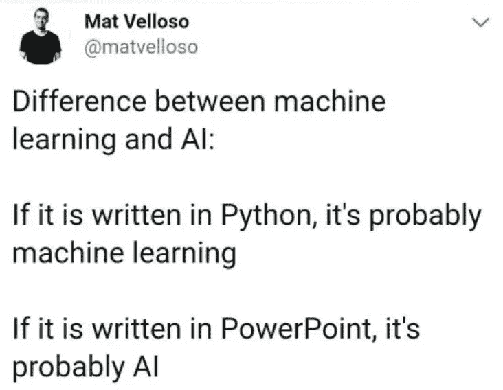

# 你必须拥有的终极字符串超级技能:REGEX

> 原文：<https://towardsdatascience.com/best-string-super-skills-you-must-have-regex-2f5ecbfd2bca?source=collection_archive---------42----------------------->

## 通过这个超级简单的介绍，摆脱 Python 中文本字符串处理问题的困扰。


照片由 [Prateek Katyal](https://unsplash.com/@prateekkatyal?utm_source=medium&utm_medium=referral) 在 [Unsplash](https://unsplash.com?utm_source=medium&utm_medium=referral) 上拍摄

当处理数据时，总是有可能不得不处理文本。做好准备，当时机到来时，在 Python 中一个强大的朋友的帮助下，您将会很好地发现、处理和处理字母数字字符串。

我说的是 **REGEX** 。Regex 代表正则表达式，它描述了一个特殊的字符序列，用于搜索和操作文本字符串中的单词、数字或其他字符。

这篇介绍性的内容旨在为您提供一个很好的方法，并为您提供一些(更多的)初步知识，这些知识对于您熟悉 Regex 是必不可少的。

因为 Regex 是如此强大、庞大和复杂，我敢打赌，您也将分享同样的观点，即无限多的 pythonic 可能性展现在我们面前。让我们来看看一些基本命令。

首先，除了 Pandas，让我们导入`**re**`模块，解锁 python 中所有与 Regex 相关的内容。

```
import pandas as pd
import re
```

我们还需要定义一个文本，我们将在这篇文章的一些例子上工作。

我选择了 Mat Velloso 写的一句话，以一种非常好奇的方式试图用简单的术语来区分机器学习和人工智能。



Mat Velloso 是微软首席执行官的技术顾问，也是开发者的忠实拥护者。[https://twitter.com/matvelloso](https://twitter.com/matvelloso)

让我们剪切并坚持较短的文本部分，使其更简单:

```
text = "If it is written in PYTHON, it's probably machine learning" 
```

# re.findall()

`re`模块有一组函数，允许我们搜索、返回和替换一个字符串或字符串的任何部分。我们从 **findall()** 函数开始，它返回一个包含所有事件的列表。

`rx = re.findall(r'.*PYTHON', text)
print(rx)`

```
['If it is written in PYTHON'] 
```

理解:首先，`findall()` 函数按照它找到的顺序返回一个事件列表。其次，`**‘r’**`是在开始时确保字符串被视为“原始字符串”。

移动到`‘.*PYTHON’`部分。我们希望返回所有内容，直到单词 PYTHON，inclusive。因此，`**.***`是某种王牌符号，从某种意义上说，`*****`将所有内容重复零次或更多次，直到它找到星星，而`**.**`告诉星星返回它找到的所有内容，无论是字母、数字、符号还是空格。

如果我们颠倒命令，我们会收到句子的另一半，请看一个例子。

`rx = re.findall(r'PYTHON.*', text)
print(rx)`

```
["PYTHON, it's probably machine learning"] 
```

将`re.flags`设置为 ignore-case，以便它匹配出现的大小写。

`rx = re.findall('python.*',text, flags=re.IGNORECASE)
print(rx)`

```
["PYTHON, it's probably machine learning"]
```

从这一点开始，我们可以建立一系列的可能性。

`rx = re.findall(r'written.*machine', text)
print(rx)`

```
["written in PYTHON, it's probably machine"] 
```

`rx = re.findall(r'tt.*bl', text)
print(rx)`

```
["tten in PYTHON, it’s probabl"] 
```

接下来看看其他符号，这些符号用于检查字符串**是否以**、(符号`**^**`)或**开始，以特定字符**(符号`**$**`)结束。

*   `**^**`评估并匹配字符串的开头(与`**\A**`相同)
*   `**\w+**`匹配并返回字符串中的字母数字字符

如果我们去掉符号`**+**`，我们只收到第一个字符。

```
text = "If it is written in PYTHON, it's probably machine learning" 
```

`rx = re.findall(r'^\w+', text)
print(rx)`

```
['If']
```

`rx = re.findall('learning$', text)
print(rx)`

```
['learning']
```

如果不匹配，我们会收到一个空列表。

每当一个字符尽可能匹配时，它就被认为是贪婪的。符号`**?**`检查下一个字符是否从该精确位置开始匹配 0 次或 1 次。意思是它指定了一个非贪婪版本的`*****` 和`**+**`。

`rx = re.findall(r' .*? ', text)
print(rx)`

```
[' it ', ' written ', ' PYTHON, ', ' probably ']
```

字符**大括号** `**{b,n}**` 用于当我们想要检查至少`**b**` 次，并且最多`**n**` 次的图案时。

```
text = "If it is written in PYTHON, it's probably machine learning" 
```

`rx = re.findall(r'(t{1,4}|i{1,})', text)
print(rx)`

```
['i', 't', 'i', 'i', 'tt', 'i', 'i', 't', 'i', 'i']
```

在下一个例子中(如下)，我们要求检查至少 1 个`**t**` 和最多 4 个`**t**` ，我们得到了这个精确的结果。

另一方面，我们还检查了至少 1 个`**e**` 和最多 3 个`**e**`，但是正如您所看到的，一行中有 4 个`**e**` ，这意味着这 4 个`**e**`将被分成 3 个一组，这就是我们得到剩余的单个`**e**` 的原因。

`rx = re.findall(r'(t{1,4}|e{1,3})', 'listttt compreheeeension')
print(rx)`

```
['tttt', 'e', 'eee', 'e']
```

使用**方括号** `**[]**`指定我们想要匹配的一组字符。比如`**[abc]**`和`**a**`有 1 个匹配，和`**cab**`有 3 个匹配，和`**hello**`没有匹配。

因此，我们可以使用方括号内的(符号`**-**`)来指定值的范围。因此，`**[a-d]**`与`**[abcd]**`相同，范围`**[1-4]**`与`**[1234]**`相同，以此类推。

按照同样的推理，范围`**[a-z]**`匹配任何小写字母，范围`**[A-Z]**`匹配任何大写字母。如果设置了`**[a-zA-Z]**` 的组合，我们就同时检查上下两种情况。让我们用一些例子来试试。

```
# assigning new text
alpha_num = "Hello 1234"
```

`rx = re.findall(r'[a-z]', 'alpha_num')
print(rx)`

```
['e', 'l', 'l', 'o']
```

`rx = re.findall(r'[a-zA-Z]', 'Hello 1234')
print(rx)`

```
['H', 'e', 'l', 'l', 'o']
```

`rx = re.findall(r'[a-zA-Z0-9]', 'Hello 1234')
print(rx)`

```
['H', 'e', 'l', 'l', 'o', '1', '2', '3', '4']
```

如果我们加上符号`**+**`，会发生什么？

`rx = re.findall(r'[a-zA-Z0-9]+', 'Hello 1234')
print(rx)`

```
['Hello', '1234']
```

提示:如果集合内的第一个字符是`**^**`，那么集合外的所有字符都将被匹配。

`rx = re.findall(r'[^a-zA-Z ]+', 'Hello 1234')
print(rx)`

```
['1234']
```

这些对你来说有意义吗？厉害！

现在来说说**特殊序列**。这些用反斜杠`**\**`写，后跟所需的字符(及其含义)。

*   **\ w**——如前所述，返回字符串包含字母、数字和下划线的匹配项
*   **\ W**-返回每个非字母数字字符
*   **\ d**-返回一个匹配项，其中字符串包含从 0 到 9(0–9)的数字。

如果星号`*****`重复所有事情零次或更多次，符号`**+**`重复所有事情一次或更多次。那么有什么区别呢？让我们创建另一个字符串来举例说明，并仔细看看。

```
# assigning new text
letters_numbers = "The letter A, the character * and the numbers 11, 222 and 3456."
```

`rx = re.findall('\w', letters_numbers)
print(rx)`

```
['T', 'h', 'e', 'l', 'e', 't', 't', 'e', 'r', 'A', 't', 'h', 'e', 'c', 'h', 'a', 'r', 'a', 'c', 't', 'e', 'r', 'a', 'n', 'd', 't', 'h', 'e', 'n', 'u', 'm', 'b', 'e', 'r', 's', '1', '1', '2', '2', '2', 'a', 'n', 'd', '3', '4', '5', '6']
```

相反，如果我们加上符号`**+**`，会有什么不同？

`rx = re.findall('\w+', letters_numbers)
print(rx)`

```
['The', 'letter', 'A', 'the', 'character', 'and', 'the', 'numbers', '11', '222', 'and', '3456']
```

`rx = re.findall('\W', letters_numbers)
print(rx)`

```
[' ', ' ', ',', ' ', ' ', ' ', '*', ' ', ' ', ' ', ' ', ',', ' ', ' ', ' ', '.']
```

仅提取数字:

`rx = re.findall('\d+', letters_numbers)
print(rx)`

```
['11', '222', '3456']
```

`rx = re.findall('\d{3,}', letters_numbers)
print(rx)`

```
['222', '3456']
```

现在，假设我们想从两个元素组成的字符串中只提取大写单词。

```
upper_extract = "Regex is very NICE for finding and processing text in PYTHON"
```

`rx = re.findall('([A-Z]{2,})', upper_extract)
print(rx)`

```
['NI', 'CE', 'PY', 'TH', 'ON']
```

# 重新拆分()

split 方法非常方便，因为它在找到匹配项时会拆分字符串，并返回精确拆分后的字符串列表。

```
numbers = 'The air we breath is made up of 78% nitrogen, 21% oxygen and 1% of other stuff.'
```

`rx = re.split(r'\d+', numbers)
print(rx)`

```
['The air we breath is made up of ', '% nitrogen, ', '% oxygen and ', '% of other stuff.']
```

如果模式不匹配，则返回原始字符串。

一个有用的资源是设置可能发生的最大拆分。我们可以通过将`maxsplit`参数传递给`re.split()`方法来进行设置。

`rx = re.split(r'\d+', numbers, 1)
print(rx)`

```
['The air we breath is made up of ', '% nitrogen, 21% oxygen and 1% of other stuff.']
```

在下一个示例中，只在第一次出现的五个空格处设置拆分。

`rx = re.split(r'\s', numbers, 5)
print(rx)`

```
['The', 'air', 'we', 'breath', 'is', 'made up of 78% nitrogen, 21% oxygen and 1% of other stuff.']
```

# re.sub()

Sub 代表 SubString，使用这个方法，您可以在任何时候用任何文本替换任何匹配。

语法很简单:`re.sub(pattern, replacement, string)`。

可以添加其他参数，例如替换发生的最大次数、区分大小写等。

```
text = "If it is written in PYTHON, it's probably machine learning" 
```

`rx = re.sub(r'written', 'coded', text)
print(rx)`

```
If it is **coded** in PYTHON, it's probably machine learning
```

`rx = re.sub(r'it', 'THAT', text) print(rx)`

```
If **THAT** is wr**THAT**ten in PYTHON, **THAT**'s probably machine learning 
```

在下一个例子中，我们想要的是用“THAT”替换“it ”,但只在第一次出现时。

`rx = re.sub(r'it', 'THAT', text, count=1)
print(rx)`

```
If **THAT** is written in PYTHON, it's probably machine learning
```

在下一个示例中，将通过单词“PYTHON”前后的空格进行拆分，并替换为“code”。如果我们以这种方式键入“PYthon ”,那么设置 ignore-case so 并不重要。

`rx = re.sub(r’\sPYthon,\s’, ‘ code, ‘, text, flags=re.IGNORECASE)
print(rx)`

```
If it is written in **code**, it's probably machine learning 
```

# re.subn()

`re.subn()`产生与`re.sub()`相同的结果，除了它返回替换的数量。

`rx = re.subn(r'it', 'THAT', text)
print(rx)`

```
("If **THAT** is wr**THAT**ten in PYTHON, **THAT**'s probably machine learning", 3) 
```

如果你喜欢这篇文章，我相信你会发现这些也很有趣。

[](/pandas-made-easy-the-guide-i-81834f075893) [## 熊猫变得容易(指南— I)

### 有许多最常用的函数和方法的例子

towardsdatascience.com](/pandas-made-easy-the-guide-i-81834f075893) [](/machine-learning-costs-prediction-of-a-marketing-campaign-exploratory-data-analysis-part-i-758b8f0ff5d4) [## 机器学习:营销活动的成本预测(探索性数据分析——第一部分)

### 预测营销活动最佳目标候选人的数据科学方法

towardsdatascience.com](/machine-learning-costs-prediction-of-a-marketing-campaign-exploratory-data-analysis-part-i-758b8f0ff5d4) 

# 结论

作为 Regex 能力的初步探索，我猜想到现在为止，在处理字母数字字符串时，您会更多地考虑应用这些技术。

Regex 将对您在 Python 上的工作效率产生巨大影响，所以我希望您继续研究并投入一些时间，因为一旦您对它感到满意，您就会意识到几乎有无限的可能性，只有天空才是极限。

随时和我联系，我会很高兴的。谢谢大家！

# 联系人

*   [Linkedin](http://bit.ly/2ybRqYT)
*   [推特](https://bit.ly/3gAwMTP)
*   [中等](https://bit.ly/3gDC5Sp)
*   [GitHub](https://bit.ly/3hHvuHR)
*   [卡格尔](https://bit.ly/31Co038)
*   [电子邮件](mailto:goncaloggomes@gmail.com)

好的阅读，伟大的编码！