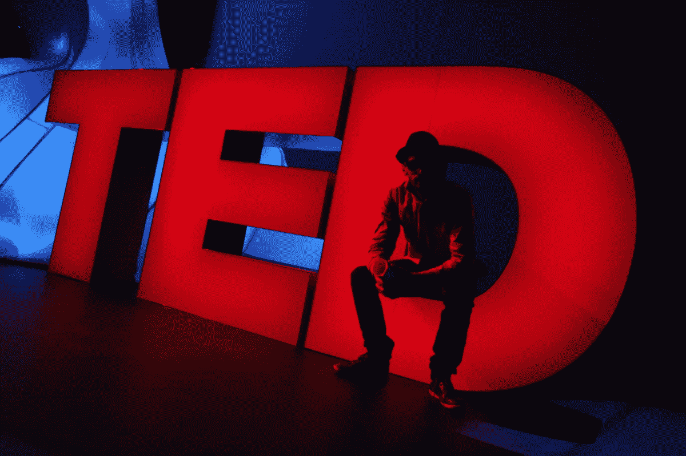

# 数据科学最佳 TED 演讲

> 原文：<https://towardsdatascience.com/best-ted-talks-for-data-science-11b699544f?source=collection_archive---------11----------------------->

## 数据科学，TED，值得传播的想法

## 这里列出了最精彩的 TED 演讲，这些演讲启发了你，并向你展示了数据的力量。



[TED 博客](https://blog.ted.com/10-best-photos-from-ted/)

ED 是一个多元化的全球社区，通过简洁而有力的演讲传播改变世界的想法。代表技术、娱乐和设计的 TED 始于 1984 年的[会议。今天，它在全世界用 100 种语言涵盖了从科学到商业，再到气候变化等全球性问题。](https://www.ted.com/about/our-organization/history-of-ted)

TED 演讲是一个很好的学习新事物的媒介，甚至可以激发你以前从未意识到的好奇心和隐藏的激情。话题如“[什么造就了美好的生活？](https://www.ted.com/talks/robert_waldinger_what_makes_a_good_life_lessons_from_the_longest_study_on_happiness?referrer=playlist-the_10_most_popular_tedx_talks)和[伟大的领导者如何激励行动](https://www.ted.com/talks/simon_sinek_how_great_leaders_inspire_action?referrer=playlist-the_10_most_popular_tedx_talks)只是激励行动和成长的改变生活的想法的几个例子。

也就是说，蓬勃发展的数据科学领域现在也是 TED 演讲者的对话和想法。有许多演讲强调数据的力量，数据的好的一面和坏的一面等等。其中每一个都将为您提供与数据相关的见解。

因此，无论你是数据科学家还是对我们周围数据的指数增长感到好奇的人，这里有一些关于数据科学的最佳 TED 演讲，它们将拓展你的思维，并为你提供世界上最有价值的东西之一——知识。

# 会谈


[Teemu Paananen](https://unsplash.com/@xteemu?utm_source=medium&utm_medium=referral) 在 [Unsplash](https://unsplash.com?utm_source=medium&utm_medium=referral) 上拍摄的照片

```
**Index** 1\. How not to be ignorant about the world 
2\. The Beauty of Data Visualization
3\. Three ways to spot a bad statistic
4\. Big Data is better data
5\. The human insight missing from Big Data
6\. Your company’s data could end world hunger
7\. Who Controls the World
```

# 1.如何不去无知这个世界

ted.com

**主题**:数据可视化
**演讲人**:《真实》
**想法**的作者汉斯·罗斯林:使用数据分析和可视化来揭穿我们头脑中的固有偏见和媒体对非常事件的不再现，这些事件植入了世界问题正在恶化的概念。他使用了一系列问题，向我们展示黑猩猩比我们人类更善于拥有正确的世界观，并让我们相信世界可能是坏的，但同时也在变得更好。

**引用**:

> 如果你对今天有一个基于事实的世界观，你可能有机会了解未来会发生什么。

[链接](https://www.ted.com/talks/hans_rosling_the_best_stats_you_ve_ever_seen?language=en)

# 2.数据可视化的美妙之处

ted.com

**主题**:数据可视化
**演讲嘉宾** : [大卫·麦坎德斯](https://medium.com/u/9af174007963?source=post_page-----11b699544f--------------------------------)，知名数据记者。
**创意**:将复杂的数据集转化为直观的图表，利用好的设计改变我们看待世界的方式。

**引用**:

> 设计是解决问题并提供优雅的解决方案，信息设计是解决信息问题。

[链接](https://www.ted.com/talks/david_mccandless_the_beauty_of_data_visualization?language=en)

# 3.识别错误统计数据的三种方法

ted.com

**主题**:统计学
**演讲者** : Mona Chalabi，数据记者
**想法**:提问、解释和真正理解图表上的数字实际上在说什么的有用技巧。

**引用**:

> 但是你如何质疑政府的统计数据呢？你只是不停地检查一切。找出他们是如何收集数据的。确定您是否看到了图表上需要看到的所有内容。但不要完全放弃数字，因为如果你这样做，我们将在黑暗中做出公共政策决定，除了私人利益之外，什么都不用做。

[链接](https://www.ted.com/talks/mona_chalabi_3_ways_to_spot_a_bad_statistic?referrer=playlist-making_sense_of_too_much_data)

# 4.大数据是更好的数据

**主题**:大数据
**演讲人**:肯尼斯·库基尔，《经济学人》
**理念**的数据分析师:大数据为我们提供了以不同方式看待我们生活的世界的工具，它可以通过增强机器学习等技术工具来解决人类最大的一些难题。

**引用**:

> 我们现在需要重新审视“我”这个信息，它不太明显，但在某些方面更重要。人类最终可以从收集到的信息中学习，这是我们了解世界和我们在其中的位置的永恒追求的一部分，这就是为什么大数据是一件大事。

[链接](https://www.ted.com/talks/kenneth_cukier_big_data_is_better_data)

# 5.大数据中缺失的人类洞察力

ted.com

**主题**:大数据
**演讲嘉宾** : [Tricia Wang](https://medium.com/u/3b91a7c1281f?source=post_page-----11b699544f--------------------------------) ，全球科技民族志学者
**观点**:揭开大数据及其弊端的神秘面纱，建议世界重视“厚数据”——来自人们的有价值、不可量化的见解——以做出推动成功的最佳商业决策。

**引用**:

> 让我们把大数据和厚数据结合起来。让我们带着圣贤的圣殿指南，无论这项工作发生在公司、非营利组织、政府，甚至是软件领域，所有这些都很重要，因为这意味着我们共同致力于创造更好的数据、更好的算法、更好的产出和更好的决策。

[链接](https://www.ted.com/talks/tricia_wang_the_human_insights_missing_from_big_data?referrer=playlist-making_sense_of_too_much_data)

# 6.你公司的数据可以结束世界饥饿

ted.com

**主题**:数据的价值
**演讲人**:UPS 高级技术组首席数据科学家 Mallory Freeman 博士
**理念**:私营企业如何通过捐赠未开发的数据而非金钱，为解决气候变化和世界饥饿等重大问题做出贡献。

**引用**:

> 数据慈善有很好的商业意义，也有助于人道主义世界的革命。如果我们在人道主义行动的所有主要方面协调规划和后勤，我们可以为成千上万的人提供食物、衣服和住所，公司需要站出来发挥作用，我知道他们可以在这场革命中发挥作用。

[链接](https://www.ted.com/talks/mallory_freeman_your_company_s_data_could_help_end_world_hunger?referrer=playlist-making_sense_of_too_much_data)

# 7.谁控制着世界

ted.com

**主题**:复杂性理论
**演讲人**:瑞士科学家詹姆斯·b·格拉茨菲尔德
**观点**:关于复杂性的开创性研究，以及它如何揭示经济如何运作。以及权力如何集中在少数人手中造成了我们社会的脆弱性。

**引用:**

> 与金融、经济、政治、社会相关的想法经常受到人们个人意识形态的影响。

[链接](https://www.ted.com/talks/james_b_glattfelder_who_controls_the_world?language=en)

# 播放列表


[Clem Onojeghuo](https://unsplash.com/@clemono2?utm_source=medium&utm_medium=referral) 在 [Unsplash](https://unsplash.com?utm_source=medium&utm_medium=referral) 上拍摄的照片

TED.com 网站上有很多精彩的播放列表，其中包括一系列与数据相关的演讲。从数据如何拯救生命的话题，到你在互联网上的数字足迹对你的影响。

```
1\. How data can save lives
2\. Making sense of too much data
3\. The dark side of data
4\. Art made of data
5\. What your data tells about you
```

## 1.数据如何拯救生命

一项关于我们可以做些什么来拯救每天聚集大量数据的世界的调查。

该播放列表包含 4 个讲座

[](https://www.ted.com/playlists/495/how_data_can_save_lives) [## 4 TED 谈论数据如何拯救生命

### 以下是数据如何拯救生命

www.ted.com](https://www.ted.com/playlists/495/how_data_can_save_lives) 

## 2.理解太多的数据

现在是大数据时代。但是，我们到底该如何处理这些信息呢？这些演讲探索了理解近乎无限的数据的实用的、道德的——以及壮观的可视化的——方法。

该播放列表包含 5 个讲座

[](https://www.ted.com/playlists/56/making_sense_of_too_much_data) [## 理解太多的数据

### 这就是大数据时代

www.ted.com](https://www.ted.com/playlists/56/making_sense_of_too_much_data) 

## 3.数据的阴暗面

数据可以用来做好事，用来推动社会进步，但也可能被滥用。了解大数据的一些隐藏的黑幕用途。

该播放列表包含 14 个讲座

[](https://www.ted.com/playlists/130/the_dark_side_of_data) [## 数据的阴暗面

### 以下是如何利用数据做好事…

www.ted.com](https://www.ted.com/playlists/130/the_dark_side_of_data) 

## 4.数据构成的艺术

看到模式，创造美——数据可视化已经成为一种艺术形式。会见前卫艺术家，他们使用电子表格、档案和数字数据作为他们的颜料和画布。

该播放列表包含 5 个讲座

[](https://www.ted.com/playlists/201/art_from_data) [## 由数据构成的艺术

### 以下是数据如何被用于观察模式和创造美

www.ted.com](https://www.ted.com/playlists/201/art_from_data) 

## 5.你的数据揭示了你的什么

你在网上分享的东西会比你想象的暴露更多吗？通过这些见解深刻的谈话，探索你的个人数据对你的影响。

该播放列表包含 10 个讲座

[](https://www.ted.com/playlists/374/what_your_data_reveals_about_y) [## 10 TED 谈论你的数据揭示了你的什么

### 以下是你在网上的数字足迹如何揭示你的

www.ted.com](https://www.ted.com/playlists/374/what_your_data_reveals_about_y) 

# 行动计划


由 [Unsplash](https://unsplash.com?utm_source=medium&utm_medium=referral) 上的 [Ragnar Vorel](https://unsplash.com/@sonuba?utm_source=medium&utm_medium=referral) 拍摄

T4:当你感到筋疲力尽，或者感到乏味时，去看看 TED 演讲。我发现 TED 演讲非常有教育意义和鼓舞人心，激励我继续朝着我的激情努力。

这些数据科学策划的 ted 演讲对于那些寻找数据及其在这个以人类为中心的时代的潜力的直观解释的人来说是有益的。此外，它们为未来提供了深刻的见解。

所以，不要在 Instagram 上翻来翻去，也不要看《网飞》,现在就去听一场 TED 演讲，做些笔记，花些时间反思并思考它如何应用到你的生活中。知识就像复利，学得越多，积累得越多。因此，让观看 TED 演讲成为一种日常习惯。你未来的自己会感谢你。

感谢您花时间阅读这篇文章，我希望它能激励您学习并帮助您更好地理解我们身边每天都在传播的指数数据。

请在评论中留下我错过的任何其他 TED 视频！

看看我的文章！

[](https://medium.com/swlh/top-20-websites-for-machine-learning-and-data-science-d0b113130068) [## 机器学习和数据科学的 20 大网站

### 这里是我列出的最好的 ML 和数据科学网站，可以提供有价值的资源和新闻。

medium.com](https://medium.com/swlh/top-20-websites-for-machine-learning-and-data-science-d0b113130068) 

# 联系人

如果你想了解我的最新文章[，请关注我的媒体](https://medium.com/@benthecoder07)。

其他联系方式:

*   [领英](https://www.linkedin.com/in/benthecoder/)
*   [推特](https://twitter.com/benthecoder1)
*   [GitHub](https://github.com/abhinavsagar)
*   [Reddit](https://www.reddit.com/user/benthecoderX)

快乐学习！