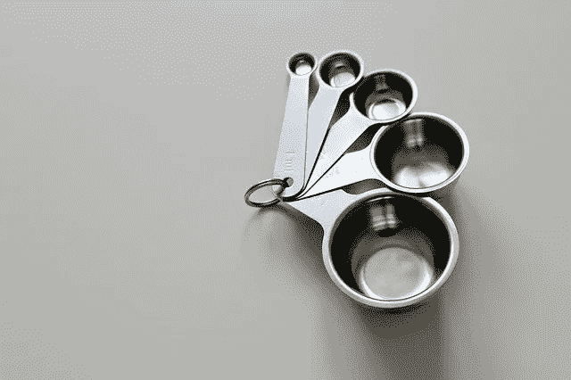
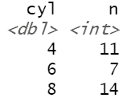
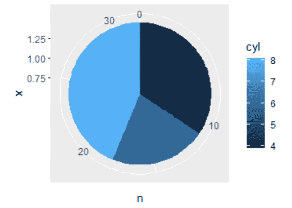
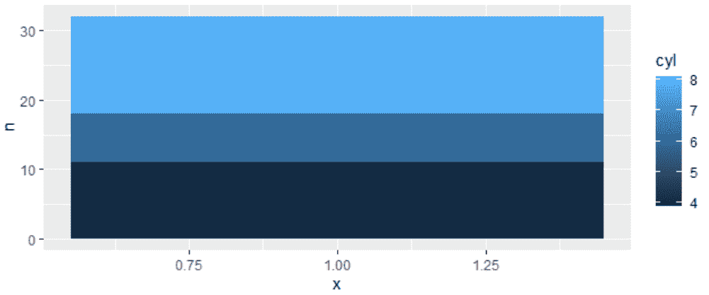
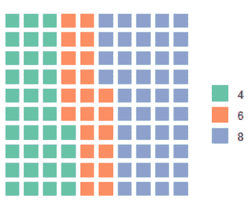
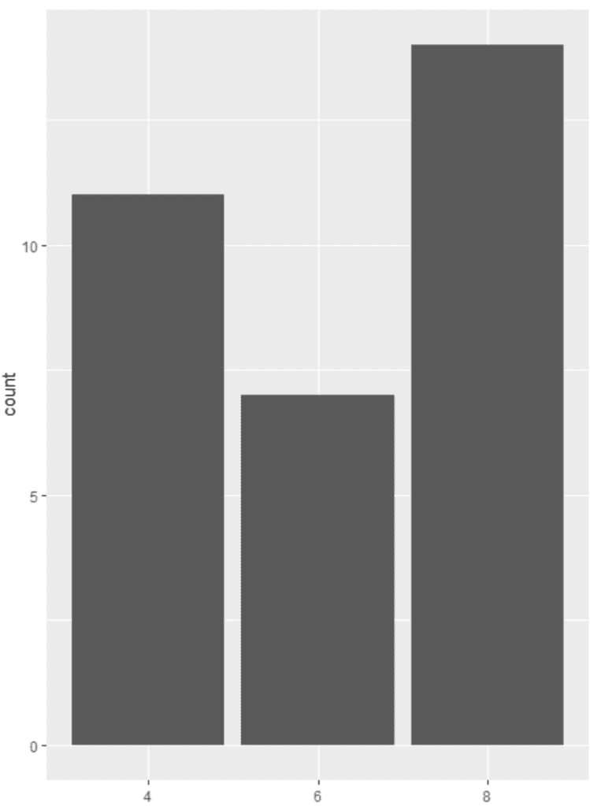

# 可视化比例的最佳方法

> 原文：<https://towardsdatascience.com/best-ways-to-visualize-proportions-956218c7d164?source=collection_archive---------35----------------------->

## 可视化比例数据的三个关键图表



图片来自 [Pixabay](https://pixabay.com/?utm_source=link-attribution&utm_medium=referral&utm_campaign=image&utm_content=2510243) 的 [Monfocus](https://pixabay.com/users/Monfocus-2516394/?utm_source=link-attribution&utm_medium=referral&utm_campaign=image&utm_content=2510243)

# 比例数据示例

无论您的数据分析和数据科学应用是什么，到处都有比例。比例是关于理解组成一个整体的不同部分。

比例很大程度上只是给定分类变量中某事物的计数。这可能是不同行业的客户数量、不同地区的销售电话数量、各种活动类型的活动数量，或者各种口味的冰淇淋甜筒的销售数量。如果你能数出来，并把它分成几组，那么你就得到了比例数据！

# 基本比例可视化

无论你是否熟悉“探索性数据分析”的概念；基本统计数据的简单绘图对任何分析都非常有帮助，尤其是当你正在建立理解的基础，这将通知你更复杂的分析。

# 甜蜜的想象

我将分解三种分析比例的可视化类型，它们将被证明是非常有用的:饼图、华夫饼图和条形图(想象它们实际上是枫糖条形图或糖果条形图，以“糖果”为主题)

# 馅饼时间

# 饼图的陷阱

*   显示角度和偏移角度的比例；会使饼图很难解释
*   一旦你在一个给定的馅饼中得到超过 3-5 个类，就很难比较相对比例——这里的全部目的…
*   好吧，让我们说是的，你可以对你的分类变量的任何给定水平或值的一般分配有一个概念…但是我们经常缺乏精确性，或者对任何给定的值集之间的差异的精确考虑。

# 使用饼图的可取之处

*   相反，饼状图对房地产来说是惊人的。它们很小，可以在一个小空间里包含大量的信息，而不是占用大量的空间。
*   根据你的受众，饼状图可以很容易让不知情的群体快速吸收一个给定的想法。

# 我们开始吧！

从使用 mtcars 数据集的组开始，让我们构建一个饼图。

首先，安装并加载`ggplot2` (install.packages('ggplot2)，然后是库(ggplot2)，然后你就可以开始比赛了)

`ggplot`的快速故障，

*   首先包括您正在处理的数据框架，在本例中是 mtcars
*   然后指定`aes()`-thetics……也就是你希望不同的变量出现在图上的地方
*   第一个是 x，所以不管你的分类变量是什么，你的桶，你的容器，你的冰淇淋口味；加在那里。

从这里开始，在底部抛出`geom_bar()`，让你确切地知道你想要看到什么类型的图表。我们将直接进入语法，但是使用`ggplot`，您可以有效地创建可视化对象，然后告诉该对象您想要如何使用它。

首先给你一个数据的快速概念；下面你可以看到我们正在按 cylinders 变量分组，并计算每个变量中的记录数。

```
counts <- mtcars %>%
  group_by(cyl) %>%
  summarise(n = n())
```



让我们把它扔进馅饼里！

```
ggplot(counts, aes(x = 1, y = n, fill = cyl)) +
  geom_col()+
  coord_polar(theta = 'y')
```



嘣！这是你的第一张饼状图。你会看到，无论你分组的分类变量是什么，都进入了颜色，而我写的计数或 n 进入了 y 美学。

你可能还会注意到`geom_col()`命令和`coord_polar()`

为了说明`coord_polar()`的目的，我将只运行`geom_col()`

```
ggplot(counts, aes(x = 1, y = n, fill = cyl)) +
  geom_col()
```



如您所见，这是一个堆积条形图，其中包含了相关部分。打开`coord_polar(theta = 'y')`,我们就可以将这个柱状图打包成一个饼状图。

# 馅饼的绝佳替代品？华夫饼！

好吧，所以你不喜欢派…华夫饼图表是一个很好的选择。虽然华夫饼图表类似于饼图，但它们实际上将分类变量的每个级别、类别或值编码为正方形的比例。

# 华夫饼图表的陷阱

*   与饼图类似，华夫饼干图很快会因为包含太多的类而陷入困境
*   绝对不要尝试分割华夫饼或饼状图..这不利于对“相对比例”进行合理的比较，而“相对比例”才是全部目的。

要为华夫饼图表准备数据，您需要将数值缩放到 1–100，加起来就是 100。为此我们将使用`dplyr` ( `install.packages('dplyr')`，`library(dplyr)`)。

您将在下面看到的是，我们根据分类对数据集进行分组，然后根据计数或`n()`进行总结。然后，我们使用`mutate`创建一个名为 percent 的新变量。这里最重要的是在我们的`mutate()`函数中，我们正在创建这个缩放到 100 的值。

我们将设置 case_counts 的名称，然后运行`waffle()`

```
count <- mtcars %>%
  group_by(cyl) %>%
  summarise(n = n()) %>% 
  mutate(percent = round(n/sum(n)*100))case_counts <- count$percent
names(case_counts) <- count$cylwaffle(case_counts)
```



好了，我们上路了！

# 让我们用条形图来总结一下

对很多东西来说，棒线只是更好地建立了价值与价值的相对可比性。让我们展开馅饼，把它扔进酒吧。还要注意，这不是直方图。我们将气缸数视为一个分类变量。

```
library(ggplot2)
ggplot(mtcars, aes(x = as.factor(cyl))) +
  geom_bar()
```



堆积条形图的最佳实践:不要孤立地制作它们，三个以后就没什么用了

关键是被比较的整体都共享同一个 y 轴

需要记住的是，任何超过三个变量的东西都很难解释。

为了对你的条形图重新排序，你需要确保分类变量是一个因子`as.factor()`，然后改变级别到你想要的显示顺序

Ggplot 根据它在数据集中看到变量的顺序对条形图和图例进行排序。要覆盖这一点，将 disease 列转换成一个带有`levels`的因子，按照我们希望我们的图使用的顺序。

```
mtcars %>%
  factor(levels = c('2', '4', '6'))
```

这在组织你的情节以优化解释能力时经常会起到很大的作用

# 结论

享受使用比例图表和分类相关数据可视化的乐趣。随着您熟悉不同的图表技术，考虑不同的图表工具作为您可能在给定的数据类型和情况下使用的工具会对您有好处。

祝数据科学快乐！别忘了关注我的博客，获取更多与机器学习、数据可视化、数据争论和所有数据科学相关的博客！datasciencelessons.com。