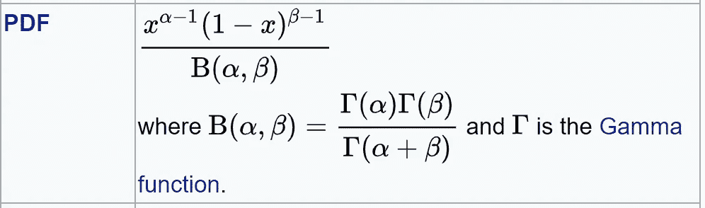
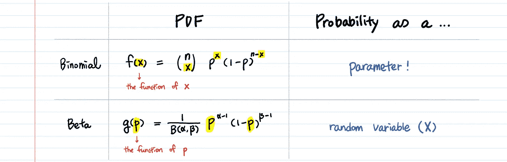
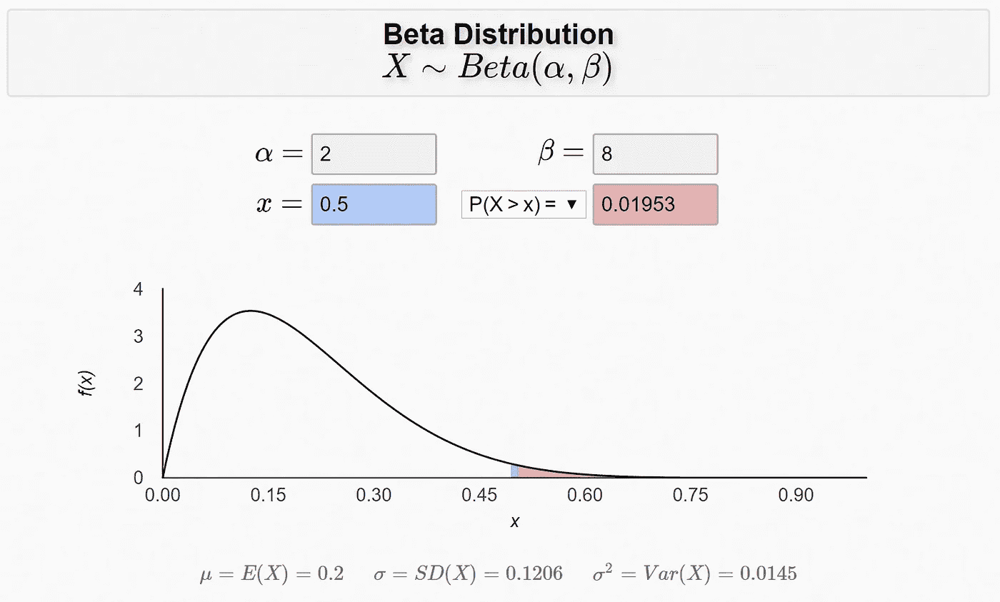
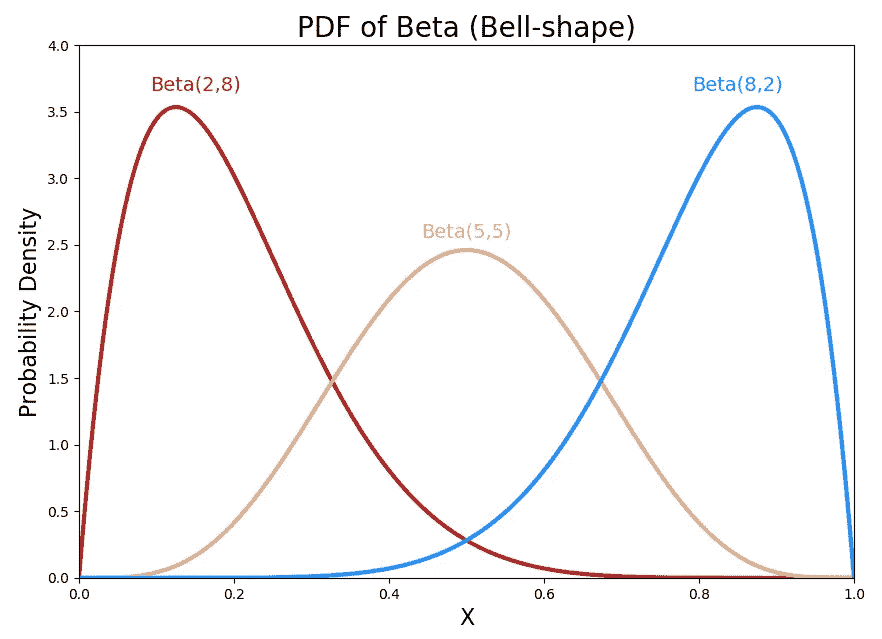
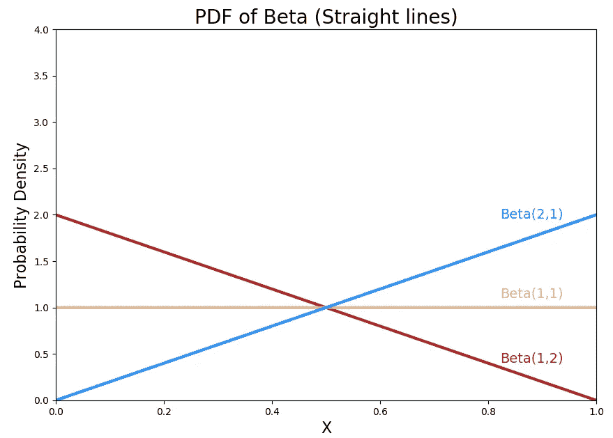
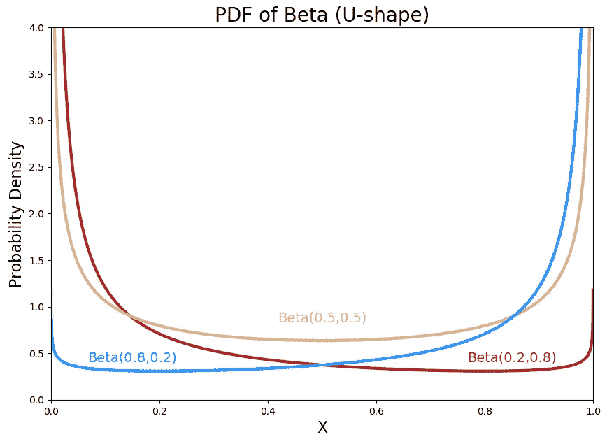
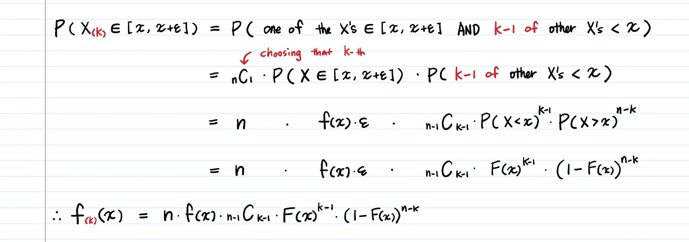
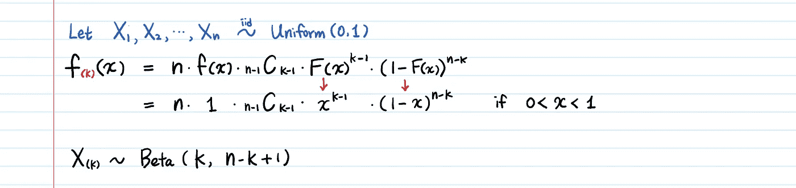
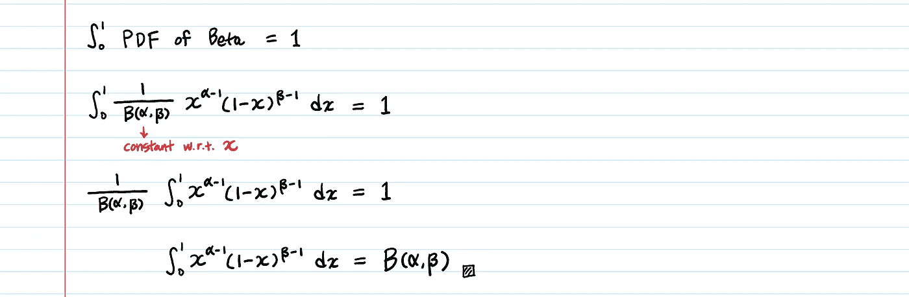
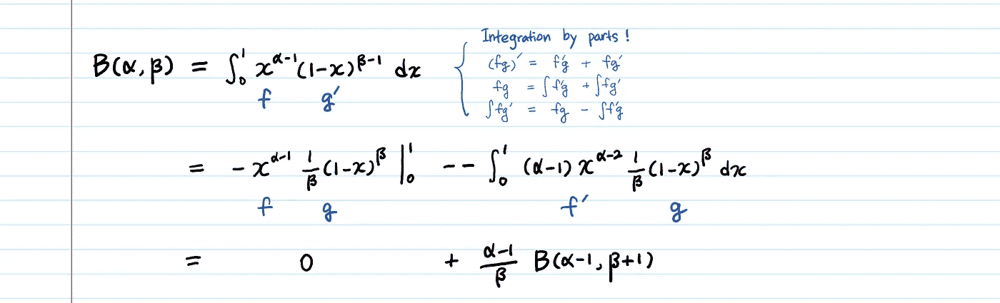

# 贝塔分布——直觉、例子和推导

> 原文：<https://towardsdatascience.com/beta-distribution-intuition-examples-and-derivation-cf00f4db57af?source=collection_archive---------0----------------------->

## 何时使用 Beta 版

贝塔分布是**关于概率 T3 的概率分布*。例如，我们可以用它来模拟概率:你的广告的点击率，客户在你的网站上实际购买的转化率，读者为你的博客鼓掌的可能性，特朗普赢得第二个任期的可能性，乳腺癌女性的 5 年存活率，等等。***

因为贝塔分布模拟一个概率，所以它的范围在 **0** 和 **1** 之间。

# 1.为什么 Beta 发行版的 PDF 看起来是这样的？

维基百科摘录

## 直觉是什么？

**我们暂且忽略** **系数** **1/B(α，β)** 只看分子**x^(α-1)*(1-x)^(β-1)**因为 **1/B(α，β)** 只是一个归一化常数使函数积分为 1。

然后，分子中的术语——**x 的乘方乘以 1-x 的乘方**——看起来很熟悉。

> 我们以前见过这个吗？
> 
> 👉是的。在二项分布中。

当我们从二项分布的角度来看时，对贝塔分布的直觉开始发挥作用。

**X ~二项式(n，p)与 X ~β(α，β)**

二项式和贝塔式的区别在于**前者模拟成功的次数(x)，而后者模拟成功的概率(p)。**

换句话说，概率是二项式中的一个**参数**；在 Beta 中，概率是一个**随机变量**。

## **α、β** 的解释

你可以把 **α-1 想成成功的次数**，把 **β-1 想成失败的次数**，就像二项式中的 **n** & **n-x** 项一样。

**您可以选择α和β参数，但您认为它们应该是**。如果你觉得成功的概率很高，就说 90%，**对α** 设 90，**对β设 10。**如果你不这么想，β90，α10。

随着 **α** 变大(更多成功事件)，大部分概率分布将向右移动，而 **β** 的增加将分布向左移动(更多失败)。

同样，如果 **α** 和 **β** 都增加，分布将变窄，因为我们更加确定。

# 2.例子:概率的概率

假设某人同意和你约会的可能性遵循贝塔分布，其中 **α** = 2， **β** = 8。**你的成功率大于 50%的概率是多少？**

**P(X>0.5)**=**1-CDF(0.5)**= 0.01953

不好意思，很低。😢

爱荷华大学的 Bognar 博士制作了 Beta 分布的计算器，我觉得它既有用又漂亮。您可以试验不同的 **α** 和 **β** 值，并想象形状如何变化。

# 3.为什么我们使用贝塔分布？

如果我们只想用概率分布来模拟概率，那么(0，1)上的任意分布都可以。创建一个应该很容易。随便取一个在 0 到 1 之间的任何地方都不会爆炸并保持正值的函数，然后从 0 到 1 积分，简单地用那个结果除函数。你只是得到了一个概率分布，可以用来模拟概率。既然如此，为什么我们坚持使用贝塔分布而不是任意概率分布呢？

**贝塔分布有什么特别之处？**

贝塔分布是贝叶斯推理中伯努利分布、二项式分布、负二项式分布和几何分布的**共轭先验**(看起来那些是涉及成功&失败的分布)。

使用共轭先验计算后验概率是非常方便的，因为可以避免贝叶斯推理中涉及的昂贵的数值计算。

如果你不知道共轭先验或贝叶斯推理是什么，
先看

 [## 贝叶斯推理——直觉和实现

### 贝叶斯推理的艺术在于你如何实现它...](https://medium.com/@aerinykim/bayesian-inference-intuition-and-example-148fd8fb95d6) 

然后

 [## 共轭先验

### 有两件事使得后验计算很昂贵。首先，我们计算每一个…](https://medium.com/@aerinykim/conjugate-prior-explained-75957dc80bfb) 

作为一名数据/ML 科学家，你的模型永远不会完整。随着更多数据的到来，你必须更新你的模型(这就是为什么我们使用贝叶斯推理)。
贝叶斯推理中的计算可能非常繁重，有时甚至难以处理。但是如果我们可以使用共轭先验的封闭公式，计算就变得轻而易举了。

在我们的日期接受/拒绝示例中，beta 分布是二项式可能性之前的共轭分布。**如果我们选择使用贝塔分布作为先验，在建模阶段，我们已经知道后验也将是贝塔分布。**因此，在进行了更多的实验(请更多的人和你去约会)**之后，你只需将接受和拒绝的次数分别加到现有的参数α，β**上，就可以计算出后验概率，而不用将可能性乘以先验分布**。**

# 4.贝塔分布非常灵活。

贝塔分布的 PDF 可以是有渐近端的 U 型，钟型，严格递增/递减甚至直线。当您改变 **α** 或 **β** 时，分布的形状也会改变。

**a .钟形**

请注意， **α** = 8 和 **β** = 2 的 PDF 图形是蓝色的，而不是读取的。x 轴是成功的概率。

如果 **α** + **β** 足够大并且α & β近似相等，则β分布的 PDF 近似正态。

**b .直线**

测试版 PDF 也可以是直线！

**c. U 形**

当 **α < 1，β < 1，**β的 PDF 为 U 型。

## 形状背后的直觉

为什么 Beta(2，2)是钟形的？

如果你把 **α-1 想成成功的次数**，把 **β-1 想成失败的次数**，**β(2，2)** 表示你得到了 1 次成功，1 次失败。所以成功的概率最高为 0.5 是有道理的。

此外， **Beta(1，1)** 意味着头部和尾部都是零。那么，你对成功概率的猜测在整个[0，1]中应该是一样的。水平直线证实了这一点。

**对于 Beta(0.5，0.5)有什么直觉？**

**为什么是 U 型？头尾为负(-0.5)是什么意思？**

这个我还没有答案。我甚至在 Stackexchange 上问过这个问题，但还没有得到回复。如果你有关于 U 型 Beta 的好主意，请告诉我！

下面是生成上面美丽图形的代码。

# 5.经典推导:顺序统计量

我在学校学贝塔分布的时候，是从顺序统计量推导出来的。顺序统计并不是 Beta 分布最广泛的应用，但是它帮助我更深入地思考这个分布并更好地理解它。

让**x1**，**x2**，。。。、 **X_n** 为 iid 随机变量，PDF **f** ，CDF **F** 。

我们按照升序重新排列它们，这样 **X_k** 就是**第 k 个最小的 X** ，称为**第 k 阶统计量**。

## a.最大 X 的密度是多少？

(不熟悉“密度”这个术语？[阅读“PDF 不是概率”](/pdf-is-not-a-probability-5a4b8a5d9531)

## b.k 阶统计量的密度是多少？

注意，我们不需要选择也不需要排列比 **x** 大的 **X** s。

## c.如何利用 k 阶统计量推导出贝塔分布？

如果我们设置 **X_1** ， **X_2** ，，会发生什么？。。， **X_n** 为 iid 均匀(0，1)随机变量？

为什么统一(0，1)？因为β的定义域是[0，1]。

均匀分布(0，1)的 CDF 为 **x** 。

在这里，我们有测试版！

# 6.β函数作为归一化常数

我之前提议过:

> 我们先忽略系数 **1/B(α，β)** …因为 **1/B(α，β)** 只是一个归一化常数使函数积分到 1。

要使β的 PDF 积分为 1， **B(α，β)的值应该是多少？**

**B(α，β)** 的值应该是多少？

**B(α，β)** 是**从 0 到 1 的βPDF**图下的面积。

# 7.用伽玛函数简化贝塔函数！

这一部分是给像我这样的瘾君子看的。

你可能已经看到了根据伽马函数的[编写的测试版 PDF。β函数是每个参数的γ函数的乘积除以参数总和的γ函数的比值。](/gamma-function-intuition-derivation-and-examples-5e5f72517dee)

维基百科摘录

怎样才能证明 **B(α，β)=γ(α)*γ(β)/γ(α+β)？**

让我们以 **α** 和 **β** 为整数的特殊情况为例，从我们上面推导的内容开始。

我们得到了一个递归关系 **B(α，β) = (α-1) * B(α-1，β+1) / β。**

我们应该如何利用这种关系？

我们可以试着得到基本情况 B(1，*)。

证明得很漂亮！