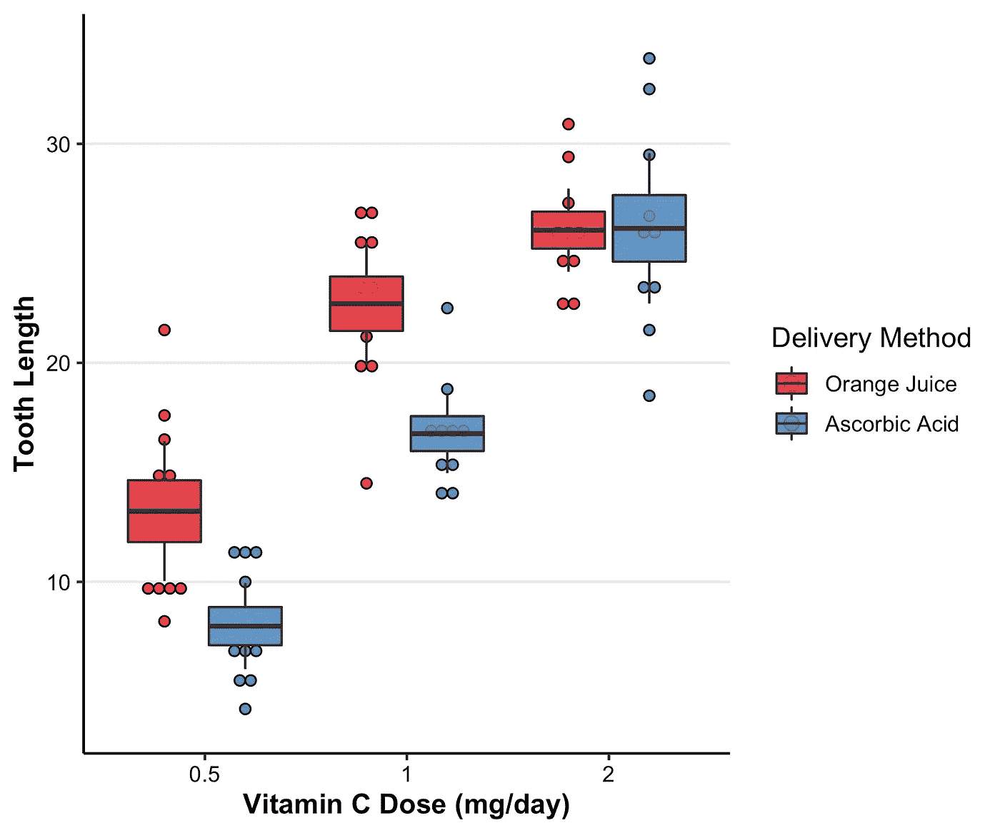

# 心理科学更好的方框图

> 原文：<https://towardsdatascience.com/better-boxplots-for-psychological-science-5fbe552b2eef?source=collection_archive---------33----------------------->

# 介绍

随着“复制革命”开创了行为科学数据透明的新时代，期刊编辑正在寻找不仅仅传达样本均值的数据可视化。

嗒哒！进入箱线图。因为它捕获了如此多方面的数据，所以箱线图有机会满足您所有的数据可视化需求。

唉，正常的盒子情节是不够的。主要原因是经典的箱线图倾向于描绘诸如中位数和四分位距之类的东西——不用于生成统计推断的数据方面。

**盒子情节需要改头换面。**

在本文中，我介绍了一个名为`my_boxplot`的函数，它创建了一个“现代”箱线图，显示与统计推断相关的样本统计数据。它提供了各种各样的论点，让您可以轻松地定制您的情节。

总的来说，目的是帮助每个人轻松地在 r 中制作透明且信息丰富的盒状图。

***本帖是“我的 _ 函数”*** [***文章系列***](https://medium.com/@dyudkin) ***的第二篇，呈现简单的函数，方便 R 初学者对数据的分析和可视化。第一个帖子使得*** [***运行和打印线性回归的结果***](https://medium.com/@dyudkin/custom-r-regression-functions-you-might-find-useful-8f58d610f41) ***。本文中的所有代码，连同函数脚本，都可以在我的*** [***github 资源库***](https://github.com/dyudkin/my_boxplot/) ***中找到。***

# 背景

如果你和我一样，你第一次遇到盒子情节是在中学。在经典盒图中，盒中心代表组中值；方框边缘分别反映了第一个和第三个四分位数临界值的值；触须表示异常值的商定值(远离中值的两个四分位数范围)。


作者图片

在 R 的 ggplot()中创建时，盒状图通常如下所示:

```
require(tidyverse)ggplot(iris, aes(x = Species, y = Sepal.Width)) +
  geom_boxplot()
```


ggplot 箱线图的默认设置。图片作者。

在上图中，我使用了`iris`数据集来绘制不同鸢尾物种的萼片宽度。如你所见，刚毛藻似乎有最大的萼片宽度。我们还注意到 setosa 和 virginica 样本中的一些异常值。

# 缺点

传统上构建盒状图的问题在于，当涉及到行为科学时，它们没有告诉你任何你需要知道的东西。例如，在上面的图中，没有办法容易地目测物种之间的差异是否具有统计显著性。唯一容易推断出这一点的方法是，如果你有每个样本的标准误差或置信区间。经典的盒子剧情，这些都没讲！

# 重新思考盒子情节

为了社会科学的目的，是时候重新考虑盒子情节了。通过创造我们称之为“现代箱线图”的东西来做到这一点现代箱型地块的布局如下:

## 现代盒子情节

*   **框中心**:样本均值
*   **盒边**:平均值的标准误差
*   **盒须** : 95%置信区间

通过这种方法，我们可以通过我们过去学过的标准目测过程，获得关于两个样本是否有显著差异的所有信息。它也比解决这个问题的其他 [方法](https://math.stackexchange.com/questions/2666794/how-to-estimate-a-confidence-interval-on-a-box-plot)更干净、更美观。

# 该功能

我创建了一个名为`my_boxplot`的函数，它允许您使用 R 和 ggplot()快速生成现代盒图。该函数包括几个参数，允许您自定义盒状图的外观。所有代码都可以在我的 [github 库](https://github.com/dyudkin/my_boxplot)中获得。

让我们从最简单的版本开始，这将有助于我们看到函数的默认设置。这个函数调用`iris`数据集，它内置于 base R 中

```
my.boxplot(iris, 
           x = "Species", 
           y = "Sepal.Width")
```


my_boxplot 的默认输出。图片作者。

该图描绘了与从 ggplot 默认设置中获得的信息非常不同的信息。具体来说，方框显示的是组平均值；方框边缘反映平均值的标准误差；盒须反映了 95%的置信区间，所有单独的数据点通过`geom_dotplot`方法显示。

这样做的一个直接好处是，你可以很容易地看出两个平均值之间的差异是否显著。具体来说，我们可以说 setosa 样本明显大于任何其他物种。

调用`my_boxplot`自动将两条有用的信息打印到控制台:一是显示每个盒子级别精确值的汇总表；第二，单向 ANOVA 检验样本均值之间的差异是否显著。

**当您进行数据探索时，将这些元素自动打印到控制台可以节省大量时间**。


在下一部分，我将解释在引擎盖下发生了什么。

# 它是如何工作的

`my_boxplot`调用`my_summary`函数，该函数生成相关信息的表格，包括平均值和置信区间的标准误差。然后，它通过使用反映这些参数的自定义值调用`geom_boxplot`函数来绘制这些信息。

`my_boxplot`还包括许多参数，允许对你的盒子图的外观进行几乎无限的定制，我将在下一节中介绍。

# 定制输出

所以你想让你的方框图漂亮。或者您想调整输出的某些方面。`my_boxplot`允许使用许多不同的参数来定制您的方框图的外观和感觉。

## 显示数据

也许最重要的是，`my_boxplot`允许你定制你想要的单个点在你的图形中出现的方式。我提供了三种不同的设置供您选择:“点图”(默认)、“抖动”和“计数”您也可以关闭数据点。

代码如下:

```
my.boxplot(iris, 
           x = "Species", 
           y = "Sepal.Width",
           points = "none")my.boxplot(iris, 
           x = "Species", 
           y = "Sepal.Width",
           points = "jitter")my.boxplot(iris, 
           x = "Species", 
           y = "Sepal.Width",
           points = "count")
```


points = "none "、" jitter "和" count "的 my_boxplot 输出作者图片。

## 标签和颜色

您可以自定义 x 轴和 y 轴标签，以及框填充颜色。这里我也自定义抖动点的高度。在下面的例子中，我使用`mtcars`数据集来绘制不同气缸(4、6 或 8)的汽车每加仑行驶的英里数。

注意，对于 mtcars 数据集，我必须将`cyl`转换成一个因子，然后才能将其插入`my_boxplot`所需的(分类)x 轴。我还使用了[管道](https://r4ds.had.co.nz/pipes.html) `%>%`操作符:这是`magrittr`包中的一个救命特性，允许您以直观的方式将函数串在一起。

```
fills <- c("#838B8B", "#E0EEEE", "#79CDCD")mtcars %>% mutate(cyl = factor(cyl)) %>% 
  my.boxplot(x = "cyl",
             y = "mpg",
             points = "jitter",
             jitter.height = 0,
             xlab = "Cylinders",
             ylab = "Miles Per Gallon",
             fill = fills)
```


带有自定义填充颜色和轴标题的 my_boxplot。图片作者。

# 附加参数

篇幅不允许我展示函数中的所有参数，您可以使用这些参数来定制您的盒状图的外观。这里是函数参数的完整列表(如果您希望我在函数脚本中添加其他参数，请告诉我！):

*   `xlab` : x 轴标题
*   `ylab` : y 轴标题
*   `width`:框宽
*   `fill`:填充颜色
*   `alpha`:框透明
*   `jitter.height`:垂直抖动量。宽度预设为条形宽度的 1/8。
*   `ci`:你想要的置信区间宽度。例如，您可以将设置为 90% (.9)或 99% (.99)
*   `points`:默认:`"dotplot”`其他选项:`"none”`、`"count”`、`"jitter”`
*   `text.angle`:这是 x 轴标签的角度。例如，如果需要适合长标签，请设置为 45。默认值= 0。
*   `text.size`:轴标题文本大小。默认值= 12。

# 更多定制

该函数(以及一般的 ggplot)的优点是，在调用该函数后，您总是可以在图形输出中添加限定符，就像向 ggplot 对象添加元素一样。在这里，我决定翻转坐标，并为图表添加一个标题。我还调整了盒子的宽度，以获得更具吸引力的外观:

```
my.boxplot(iris, 
           x = "Species", 
           y = "Sepal.Width",
           width = .5) +
  coord_flip() +
  ggtitle("Species and sepal width") +
  theme(plot.title = element_text(hjust = 0.5)) # center title
```


图片作者。

# 分组箱线图

行为科学经常关注两个变量之间的统计交互作用。所以有一个绘图选项是很有用的，它包括绘制交互和结果统计的能力。输入`my_grouped_boxplot`。这个函数包含了它更简单的同类函数的所有功能，但是允许您包含一个额外的双向交互变量。(此处见[脚本](https://github.com/dyudkin/my_boxplot/blob/master/my_grouped_boxplot.R)。)

这里我们使用内置的 R 数据集 ToothGrowth，它包含了一项研究不同剂量的维生素 C(“剂量”)和补充类型(“supp”)对豚鼠牙齿生长(“len”)的影响的实验结果。

```
ToothGrowth %>% mutate(supp = factor(supp, 
                                     labels = c("Orange Juice", 
                                                "Ascorbic Acid")),
                       dose = factor(dose)) %>% 
  my_grouped_boxplot(x = "dose",
                     y = "len",
                     group = "supp",
                     xlab = "Vitamin C Dose (mg/day)",
                     ylab = "Tooth Length") +
  labs(fill = "Delivery Method")
```



图片作者。

这个函数带有基本版本中所有相同的参数。有益的是，我们还可以自动获得带有交互项的完整 2 x 2 方差分析的输出，以评估显著性。


# 结束语

本文的目的是提供一些方便的代码，用于轻松创建更适合心理科学的箱线图，因为它们可以轻松地比较均值和置信区间。

其他人已经开发了许多其他的方法来做这件事；例如，我的同事比利·布雷迪(Billy Brady)编写了一个脚本，用于创建一个定制的点状图(T1)，以及其他一些方便的方法(T3)，用于框状图可视化。

如果您在代码中遇到任何错误，或者您希望与我交流我在这里提供的任何信息，请联系我，我很乐意收到您的来信！你可以在这里找到我的电子邮件地址。

*引用本文:*尤德金，d . a .(2020 年 10 月)。"心理科学更好的方框图."*中等*。检索自[https://medium . com/@ dyudkin/better-box plots-for-psychological-science-5 FBE 552 B2 eef](https://medium.com/@dyudkin/better-boxplots-for-psychological-science-5fbe552b2eef)。

## 关于作者

我是宾夕法尼亚大学[社会和行为科学倡议](https://web.sas.upenn.edu/penn-sbsi/)的行为科学家，也是[More Common](https://www.moreincommon.com/)的研究助理主任。我研究道德和政治极化。你可以在我的[网站](http://www.danielyudkin.com)找到更多关于我工作的信息。