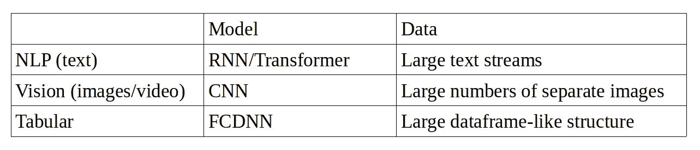
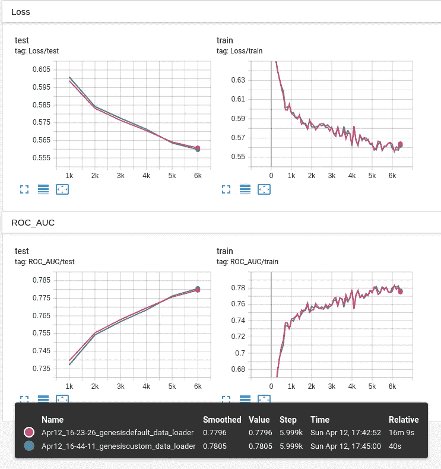

# 更好的数据加载:表格数据的 PyTorch 速度提高了 20 倍

> 原文：<https://towardsdatascience.com/better-data-loading-20x-pytorch-speed-up-for-tabular-data-e264b9e34352?source=collection_archive---------10----------------------->

## 一个简单的改变可以大大加快你的深度学习训练

# 深度学习:对速度的需求

在训练深度学习模型时，性能至关重要。数据集可能非常庞大，低效的训练意味着更慢的研究迭代、更少的超参数优化时间、更长的部署周期和更高的计算成本。

尽管如此，很难证明投入太多时间来加快速度是合理的，因为有许多潜在的死胡同需要探索。不过还好有一些速战速决的可用！

我将向您展示我在 PyTorch 中对表格数据的数据加载器所做的一个简单更改如何将训练速度提高了 20 倍,而没有对训练循环做任何更改！只是 PyTorch 标准数据加载器的简单替代。对于我看到的模型，16 分钟的迭代时间减少到了 40 秒！

并且不需要安装任何新的包，不需要进行任何底层代码更改，也不需要更改任何超参数。

# 研究/行业脱节

在监督学习中，快速浏览一下 [Arxiv-Sanity](https://www.arxiv-sanity.com/top) 告诉我们，目前的顶级研究论文要么是关于图像的(无论是分类还是生成的 GANs)，要么是文本的(主要是 BERT 的变体)。这些在传统机器学习没有机会的领域非常棒——但需要专业知识和大量的研究预算才能很好地执行。

另一方面，许多公司持有的大部分数据已经以漂亮的表格形式存在于数据库中。一些例子包括终身价值评估、点击优化和金融时间序列数据的客户详细信息。

# 表格数据有什么特别之处？

那么，为什么研究和工业之间的裂痕对我们来说是个问题呢？嗯，最先进的文本/视觉研究人员的需求与那些在表格数据集上进行监督学习的研究人员的需求非常不同。

表格形式的数据(即数据库表、Pandas 数据帧、NumPy 数组或 PyTorch 张量)在几个方面使事情变得更简单:

1.  通过*切片*，可以从连续的内存块中获取训练批次。
2.  没有每个样本的预处理成本，允许我们充分利用[大批量训练](https://arxiv.org/pdf/1803.09820.pdf)来获得额外的速度(记住要提高学习率，这样我们就不会过度适应！).
3.  如果你的数据集足够小，它可以一次性加载到 GPU 上。(虽然这在技术上对于文本/视觉数据也是可能的，但是那里的数据集往往更大，并且一些预处理步骤在 CPU 上更容易完成)。

这些优化对于表格数据是可行的，而对于文本/视觉数据是不可行的，因为有两个主要的不同之处:模型和数据。

**模型:**视觉研究倾向于使用大型深度卷积神经网络(CNNs 文本倾向于使用大型递归神经网络(rnn)或变压器；但是对于表格数据，简单的全连接深度神经网络(FCDNN)可以做得很好。虽然并非总是如此，但一般来说，视觉和文本模型需要更多的参数来学习比表格数据中变量之间的交互更细微的表示，因此向前和向后传递可能需要更长的时间。

**数据**:视觉数据往往被保存为充满图像的嵌套文件夹，这可能需要大量的预处理(裁剪、缩放、旋转等)。文本数据可以是大文件或其他文本流。这两者一般都会保存在磁盘上，从磁盘上批量加载。这不是问题，因为磁盘读/写速度不是这里的瓶颈—预处理或向后传递才是。另一方面，表格数据有一个很好的特性，可以很容易地以数组或张量的形式加载到连续的内存块中。表格数据的预处理往往是预先单独完成的，要么在数据库中进行，要么作为对数据集的矢量化操作进行。



不同类型监督学习研究的比较

# PyTorch 和数据加载器

正如我们所看到的，加载表格数据真的非常容易和快速！因此，PyTorch 在默认情况下对表格数据非常有效……*对吗？*

原来不是！😩

就在上周，我在一些表格数据上训练 PyTorch 模型，并想知道训练需要这么长时间。我看不到任何明显的瓶颈，但出于某种原因，GPU 的使用率远低于预期。当我深入分析它时，我发现了罪魁祸首… *数据加载器*。

**什么是数据加载器？**数据加载器做的事情与您想象的完全一样:它们将您的数据从任何地方(磁盘上、云中、内存中)加载到您的模型需要使用它的任何地方(RAM 或 GPU 内存中)。除此之外，他们还负责将您的数据分成不同的批次，进行重组，并在必要时对单个样本进行预处理。将这些代码封装在一个数据加载器中比分散在各处要好，因为这样可以让您的主要训练代码保持整洁。【PyTorch 官方教程也推荐使用数据加载器。

你如何使用它们？这取决于您拥有的数据类型。对于表格数据，PyTorch 的默认数据加载器可以接受一个 TensorDataset。这是训练所需张量的轻量级包装器，通常是 X(或特征)和 Y(或标签)张量。

```
data_set = TensorDataset(train_x, train_y)
train_batches = DataLoader(data_set, batch_size=1024, shuffle=False)
```

然后，您可以在训练循环中使用它:

```
for x_batch, y_batch in train_batches: optimizer.zero_grad() loss = loss_fn(model(x_batch), y_batch) loss.backward() optimizer.step() ...
```

**为什么这样不好？**这个看起来不错，当然也很干净！问题是，每次加载一个批处理时，PyTorch 的 DataLoader 对每个示例调用一次数据集*上的`__getitem__()`函数，并将它们连接起来，而不是一次性读取一个批处理作为一个大块！所以我们最终没有利用我们的表格数据集的优势。当我们使用大批量时，这尤其糟糕。*

我们如何解决这个问题？简单——用下面的两行替换上面的前两行，并从[这个文件](https://github.com/hcarlens/pytorch-tabular/blob/master/fast_tensor_data_loader.py)中复制`FastTensorDataLoader`的定义(这要归功于[杰西·穆](https://cs.stanford.edu/~muj/)，对于[这个答案](https://discuss.pytorch.org/t/dataloader-much-slower-than-manual-batching/27014/6)在 PyTorch 论坛上):

```
train_batches = FastTensorDataLoader(train_x, train_y, batch_size=1024, shuffle=False)
```

`FastTensorDataLoader`只是一个小型的定制类，除了 PyTorch 之外没有其他依赖——使用它不需要对你的训练代码做任何修改！它也支持混排，尽管下面的基准是针对非混排数据的。

**这有什么区别？**在我使用的基准测试集上，定制表格数据加载器的速度比基准测试快了 20 倍。在这种情况下，这意味着 10 个历元的运行不再需要 15 分钟，而是需要不到 40 秒——迭代速度的巨大差异！



两次几乎相同的跑步——除了一次超过 15 分钟，另一次不到一分钟！

这个基准测试是在[的这篇自然论文](https://www.nature.com/articles/ncomms5308)中使用的[希格斯数据集](http://archive.ics.uci.edu/ml/datasets/HIGGS)上运行的。它有 1100 万个示例，是比大多数公共表格 ML 数据集(可能很小)更真实的深度学习基准。).这是一个二元分类问题，有 21 个实值特征。很高兴看到，在进行任何超参数优化之前，我们可以在短短 40 秒的训练时间内，在测试集上达到超过 0.77 ROC AUC！虽然我们离报纸上的 0.88 还有一段距离。

我希望这有所帮助，并且你能够在你自己的训练代码中看到类似的速度提高！在实现了这一点之后，我发现了一些进一步的优化，导致了接近 100 倍的总加速！如果你想看更多，请留下评论，我们可以在后续文章中讨论这些内容。

关于如何自己运行基准代码，请参见附录。该示例包括运行默认 PyTorch 数据加载器(更快的自定义加载器)的代码，以及对结果进行计时和记录到 TensorBoard 的代码。

*这篇文章是在* [*创世纪云*](https://gnsiscld.co/ffsd3) *的计算能力的帮助下完成的:云 GPU 以令人难以置信的成本效率运行在冰岛的一个数据中心，使用 100%可再生能源。* [*注册*](https://gnsiscld.co/ffsd3) *即可获得 50 美元的免费积分，让你在 GTX 1080Ti 上驾驶超过 160 小时！*

*关于作者:Harald 从事股票分析师工作超过八年，目前是一名自由研究员和作家。他的个人博客在*[*www.harald.co*](http://www.harald.co.)*。他经营着* [*ML 竞赛*](http://mlcontests.com)*——一个正在进行的机器学习竞赛的目录——以及一个* [*云 GPU 比较*](https://cloud-gpus.com) *站点。*

*同一作者:*

*   [*为你的云深度学习工作流程增压的五个工具*](https://medium.com/@hcarlens/five-tools-to-supercharge-your-cloud-deep-learning-workflow-3afb2e25be9f)
*   [*如何用 OpenAI 健身房正确设置随机种子*](https://medium.com/@hcarlens/reproducibility-issues-using-openai-gym-8ca605071d6a)
*   [2022 年机器学习顶级云 GPU 提供商](https://medium.com/machine-learning-insights/top-cloud-gpu-providers-for-machine-learning-in-2022-894f6828da08)

# 附录:运行基准测试

所以你可以自己看看结果，这是复制实验的说明。如果您已经安装了本地 GPU 和 PyTorch，您可以跳过前两步！

1.  用你最喜欢的 GPU 云提供商创建一个新的 Ubuntu 18.04 实例(我用的是[Genesis cloud](https://gnsiscld.co/ffsd3)——你注册时可以获得 100 美元的免费积分，这足够运行这个实验几百次了！).

2.使用 [Lambda Stack](https://lambdalabs.com/lambda-stack-deep-learning-software) 一气呵成的安装 CUDA 和 PyTorch:(做完这个别忘了重启！)

```
LAMBDA_REPO=$(mktemp) && \
wget -O${LAMBDA_REPO} [https://lambdalabs.com/static/misc/lambda-stack-repo.deb](https://lambdalabs.com/static/misc/lambda-stack-repo.deb) && \
sudo dpkg -i ${LAMBDA_REPO} && rm -f ${LAMBDA_REPO} && \
sudo apt-get update && \
sudo apt-get — yes upgrade && \
sudo apt-get install — yes — no-install-recommends lambda-server && \
sudo apt-get install — yes — no-install-recommends nvidia-headless-440 nvidia-utils-440 && \
sudo apt-get install — yes — no-install-recommends lambda-stack-cuda
```

3.下载数据集:

```
wget [http://archive.ics.uci.edu/ml/machine-learning-databases/00280/HIGGS.csv.gz](http://archive.ics.uci.edu/ml/machine-learning-databases/00280/HIGGS.csv.gz)
```

4.克隆存储库:

```
git clone [git@github.com](mailto:git@github.com):hcarlens/pytorch-tabular.git
```

5.运行基准脚本:

```
python3 pytorch-tabular/higgs_benchmark.py
```

如果你运行的是 GTX 1080 的实例，比如我使用的 Genesis Cloud，你应该会得到如下结果:

```
ubuntu@genesis:~$ python3 pytorch-tabular/higgs_benchmark.py
2020-04-12 15:05:55.961134: I tensorflow/stream_executor/platform/default/dso_loader.cc:44] Successfully opened dynamic library libcudart.so.10.0
Epoch 0 done.
Epoch 1 done.
Epoch 2 done.
Epoch 3 done.
Epoch 4 done.
Epoch 5 done.
Epoch 6 done.
Epoch 7 done.
Epoch 8 done.
Epoch 9 done.
Epoch 0 done.
Epoch 1 done.
Epoch 2 done.
Epoch 3 done.
Epoch 4 done.
Epoch 5 done.
Epoch 6 done.
Epoch 7 done.
Epoch 8 done.
Epoch 9 done.
Standard dataloader: 124.55s/epoch.
Custom dataloader: 5.24s/epoch.
```