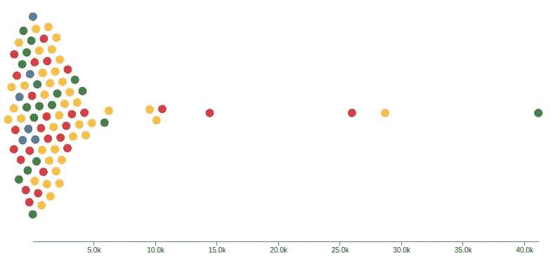
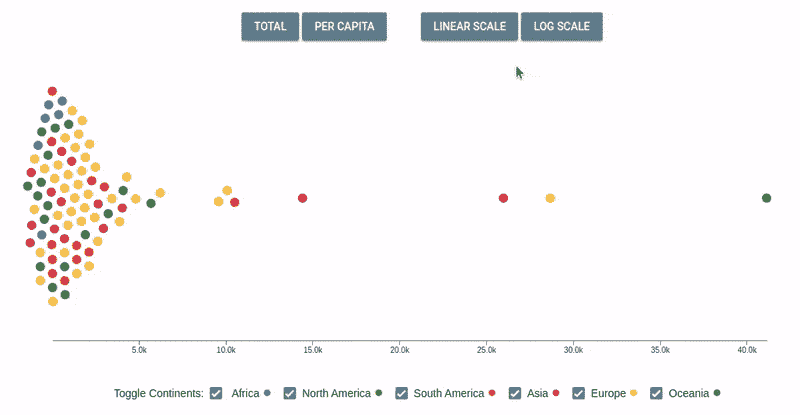
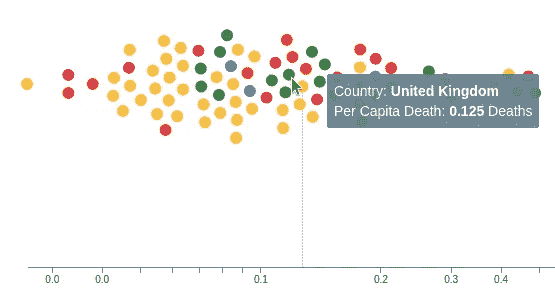
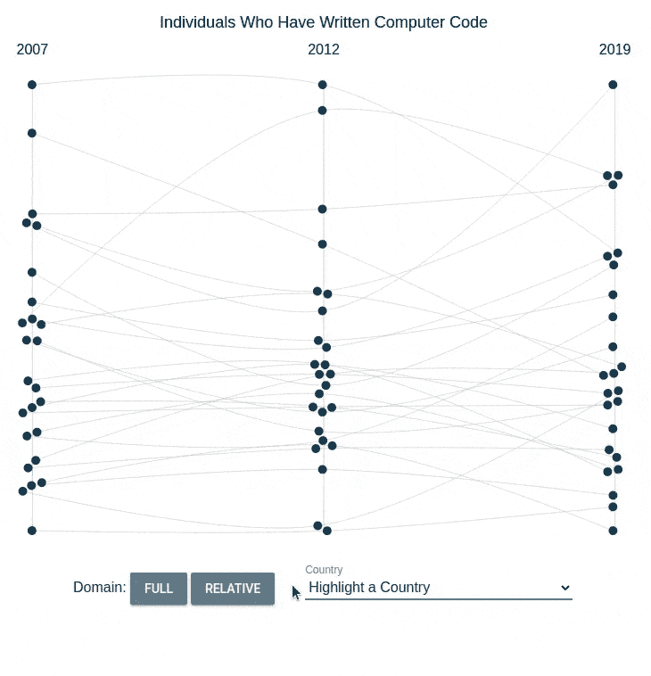

# 使用蜂群图表实现更好的数据可视化

> 原文：<https://towardsdatascience.com/better-data-visualization-using-beeswarm-chart-bb46a229c56b?source=collection_archive---------27----------------------->

## 让我们使用 D3.js 创建一个交互式蜂群图表，以便更好地可视化您的数据。

单个数据集可以用来向观众传达许多不同的信息。这完全取决于你如何可视化数据。换句话说，这取决于你选择哪种图表或图形。大多数时候，人们只是抓住一个条形图或饼图。然而，你可以用更有趣的图表或图形将数据中的信息传达给你的观众——其中之一就是*蜂群图表*。

*注:本文中的所有源代码(包括文档)都可以在 https://github.com/MartinHeinz/charts***找到。**

**

**现场试玩可在*[*https://martinheinz.github.io/charts/beeswarm/*](https://martinheinz.github.io/charts/beeswarm/)进行*

# *蜜蜂-什么？*

*第一次听说*蜂群*图？好吧，让我们先来谈谈它到底是什么:*

**beesworm*图表是一维图表(或绘图)——或者换句话说——在单个轴(通常是 X 轴)上显示所有信息的图表。它将值显示为类似于散点图的点的集合。*

*当您想要一次显示大量数据点时，这种图表非常有用，例如，每个国家一个节点，这对于条形图或饼图来说是个问题。想象一个有 150 个楔形的饼图——不，谢谢。*

*此外，这使得发现离群值变得容易，因为它们不会是*群体*的一部分。*

*此图表的另一个特点是，您可以很好地可视化不同的比例(线性和对数)以及它们之间的转换，并为点着色以添加额外的维度(例如，国家的大陆)。*

*说得够多了，让我们来看一个例子:*

**

*实际上，我们将在这里使用的数据集是什么？嗯，在 kaggle.com[上可以找到*世卫组织自杀统计数据*。可能是奇怪的选择，嗯？实际数据非常符合这种图表。所以，让我们看看我们能把它用得多好！](https://www.kaggle.com/szamil/who-suicide-statistics)*

# *我们需要什么*

*在深入研究代码之前，让我们看一下我们将使用的库:*

*对于所有的绘图和可视化，我们将使用 *D3.js* 和普通的旧 Javascript。如果你不熟悉 *D3.js* —它代表*数据驱动文档*，是操纵数据的 Javascript 库。D3.js 的主要优势在于它的灵活性——它给你的只是有效操作数据的函数。*

*在本文中，我们将使用 *D3.js* 第 5 版，你需要做的就是在你的 HTML 中包含``(完整代码清单[此处](https://github.com/MartinHeinz/charts/blob/master/beeswarm/index.html))。*

# *代码*

# *搭建舞台*

*在我们开始操作任何数据之前，我们首先需要做一些初始设置:*

*首先，我们为`width`、`height`和`margin`定义了一些全局变量，以及 3 个数据结构，用于比例、数据测量和绘图图例，我们将在余下的代码中使用它们。我们还使用这些来定义图表的初始状态，它存储在`chartState`变量中。*

*接下来我们要定义的是图中所有节点(圆圈)的颜色:*

*为了创建一个配色方案，我们使用`d3.scaleOrdinal`来创建从域(洲名)到范围(色码)的映射。然后，我们将这些颜色应用于 CSS IDs，它们被赋予 HTML GUI 中的复选框。*

*现在我们进入实际图表的代码。以下几行将准备 SVG，这将是我们的绘图区域:*

*上面创建`svg`变量的第一个调用找到 ID 为`svganchor`的`
`,并将我们之前定义的宽度和高度的 SVG 元素附加到它上面。接下来，我们创建一个名为`xScale`的函数——这个函数与前面使用的`d3.scaleOrdinal`非常相似。它还创建了域和范围之间的映射，但域是连续的，而不是离散的。您可能已经注意到了，但是我们没有在这里指定域——这是因为我们还不知道数据集的范围，所以我们暂时保留它的默认值(`[0, 1]`)。*

*之后，我们将`<g>`元素容器添加到现有的 SVG 元素中。这个元素将被用作 X 轴及其刻度的容器——这些将在我们实际绘制线条时添加。然而，我们现在可以设置它的 CSS 样式并把它移到 SVG 的底部，这样我们以后就不必处理它了。*

*这段代码的最后部分创建了一条线，当鼠标悬停在所述圆上时，该线连接 X 轴上的节点和点。你可以在下图中看到:*

**

*在开始操作数据集之前，我们想做的最后一件事是创建简单的 noes 工具提示:*

*目前，工具提示只是我们放入图表锚中的一个`
`。我们也使它现在不可见，因为我们将在处理鼠标移动事件(悬停)时动态设置它的内容和不透明度。*

# *加载数据*

*现在终于到了加载数据的时候了。我们使用`d3.csv`函数来实现。该函数使用 fetch API 从 URL 获取 CSV 文件，并返回 *Promise* ，这需要以下代码结构:*

*我们剩下的所有代码都属于上述匿名函数的主体，因为加载的数据在那里对我们可用。*

*以下是数据加载前后的示例，以便更好地显示其结构:*

*之前:*

*之后:*

# *听众*

*在进一步处理数据之前，让我们首先设置侦听器，它将对 GUI 中的按钮点击做出反应。我们希望用户能够在可视化与*【总量】*或*【人均】*测量以及线性或对数标度之间切换。*

*我们的 HTML GUI(源代码可以在这里找到)包含 2 组按钮。第一组——负责在*“总数”*和*“人均”*之间切换，可视化附带了 CSS 类`.measure`。我们使用这个类来查询这组按钮，正如你在上面看到的。当单击这两个按钮中的一个时，我们获取被单击按钮的值，并相应地更改图表状态和图例文本，图例文本显示所使用的度量类型。*

*第二组(对)按钮在线性和对数刻度之间切换，也附加了 CSS 类(称为`.scale`)并且与前一组类似——基于哪个按钮被点击来更新图表的状态。*

*这两个侦听器还会触发整个图表的重绘，以反映配置更改。这是通过使用`redraw`功能来实现的，我们将在下一节中介绍。*

*除了这 4 个按钮，GUI 中还有几个复选框。点击这些过滤器，会显示各大洲的国家。*

*处理这些复选框点击是上述监听器的责任。它所做的只是触发`filter`函数，该函数根据哪些复选框被选中，哪些没有被选中，在选择中添加/删除节点。*

*我们这里的最后一个事件侦听器是一个大事件。当鼠标悬停在乡村圆圈上时，它会显示和隐藏工具提示:*

*上面的代码看起来可能很复杂，但实际上非常简单。我们首先使用`.countries` CSS 类选择所有节点。然后，我们将`mousemove`事件绑定到所有这些节点。在事件期间，我们设置 HTML 的工具提示来显示关于这个节点的信息(国家名称，死亡人数)。此外，我们改变它的不透明度，使它在用户指向圆圈时可见，并将其位置设置在鼠标光标的右侧。*

*该函数体的其余部分呈现连接圆和 X 轴的虚线，以突出显示值在刻度上的位置。*

*我们还需要处理当我们将鼠标移出圆圈时的事件，否则，工具提示和线条将总是可见的，这就是`mouseout`事件处理程序所负责的——它将这些元素的不透明度设置为`0`,使它们不可见。*

*这些事件侦听器很好，但是我们需要实际处理和绘制数据来使用它们。所以，让我们就这么做吧！*

# *画下一切*

*大部分数据处理是在一个名为`redraw`的函数中完成的，我们在页面第一次加载时以及在各种事件中调用这个函数，我们在上一节中已经看到了。*

*该函数使用`chartState`来决定如何绘制图表。开始时，根据`chartState.scale`将刻度类型设置为线性或对数，并通过根据`chartState.measure`的值在数据集的`total`或`perCapita`列中查找最小/最大值来决定图表域的*范围*:*

*我们需要基于`chartState`创建的另一个东西是 X 轴。考虑到图表的方向，我们将使用底部轴(`axisBottom`)并给它 10 个刻度。如果我们要可视化总数，我们将使用带有 SI 前缀(`s`)和 1 个有效数字(`.1`)的十进制符号。否则，它将是定点符号(`f`)，也有一个有效数字。*

*当轴和刻度准备好后，我们执行一个 1 秒钟的转换。在这 1 秒钟内，`.call(xAxis)`通过执行`axisBottom`发生器生成底部轴。*

*接下来是沿着 X 和 Y 轴将节点移动到其所需位置的模拟:*

*这是本文中比较复杂的片段之一，所以让我们一行一行地检查一下。在第一行，我们用指定的数据集创建模拟。在这个模拟中，我们应用定位力将节点沿着 X 轴推向期望的位置。该期望位置由`xScale`函数返回，该函数通过将*【总计】*或*【perca pita】*列映射到图表的物理大小(范围)来计算。之后，我们使用`strength`函数提高模拟速度。*

*与我们沿 X 轴施加力的方式相同，我们也需要沿 Y 轴施加力，这一次将节点推向图表的中线。我们应用的最后一个力是碰撞力，它防止节点碰撞，更具体地说，它使它们的中心相距 9 个像素。最后，我们调用`stop`函数来停止模拟自动运行，而是在它下面的`for`循环中执行。*

*我们创建并运行了模拟，但是针对什么呢？嗯，由以下代码创建的节点(圆圈):*

*这里，我们首先查询所有节点，并将数据集中的国家名称连接到这些节点。接下来对`exit`和`enter`选择的两个调用分别处理节点被移除和添加到选择中的情况(例如，复选框被勾选/取消勾选或页面被加载)。首先，对于退出选择，我们创建一个 1 秒钟的过渡，并将 X 轴上的中心点设置为零，将 Y 轴上的中心点设置为图表的中间。这样，当这些节点被添加回图表中时，它们将从单个点出来，就像您在演示中单击复选框时看到的那样。转换完成后，节点将被移除。*

*代码片段的其余部分——enter selection——实际上是设置节点的所有属性。我们设置它的 CSS 类，它的 X 轴和 Y 轴中心点，它的半径，并根据它所属的大陆用颜色填充它。然后，我们将这个选择合并到其余的节点(圆)中，并创建一个过渡，在接下来的 2 秒钟内将它们移动到所需的 X 和 Y 坐标。*

# *结论*

*在本文中，我们深入研究了用 *D3.js* 实现*蜂群图表*。本文的要点不应该是这种特定的实现，而是下一次可视化数据时，您可能希望考虑非传统类型的图表和绘图，因为这可能有助于您更好地向受众传达所需的信息。*

*如果您想查看本文的完整代码清单，请访问我的知识库:https://github.com/MartinHeinz/charts。在这个报告中，您还可以找到使用的数据集和源，以及用 *D3.js* 实现的其他图表和绘图，就像这个平行坐标图(下一篇文章😉):*

**

**本文最初发布于*[*martinheinz . dev*](https://martinheinz.dev/blog/27?utm_source=tds&utm_medium=referral&utm_campaign=blog_post_27)*

* [## 用 Javascript 实现 2D 物理学

### 让我们在实现真实的 2D 物理模拟和可视化的同时享受一下 JavaScript 的乐趣吧！

towardsdatascience.com](/implementing-2d-physics-in-javascript-860a7b152785)  [## 使用 PostgreSQL 的递归 SQL 查询

### 公共表表达式是 SQL 的一个鲜为人知的特性，它使得编写递归查询成为可能。

towardsdatascience.com](/recursive-sql-queries-with-postgresql-87e2a453f1b)  [## 你可以用 GitHub API 和 Python 做的所有事情

### GitHub REST API 允许您管理问题、分支、回购、提交等等，所以让我们看看您如何使用…

towardsdatascience.com](/all-the-things-you-can-do-with-github-api-and-python-f01790fca131)*