# 在石油和天然气勘探和生产中使用机器学习进行更好的决策

> 原文：<https://towardsdatascience.com/better-decision-making-using-machine-learning-in-oil-and-gas-exploration-and-production-afbd39f2f98e?source=collection_archive---------27----------------------->

# 石油和天然气行业

石油和天然气是世界上最大和最重要的产业之一。它的范围不仅仅是为运输和发电提供燃料，而是支持这些活动和交易的众多服务。

根据[2019](https://fortune.com/global500/search/?sector=Energy)财富全球 500 强，仅前 9 大石油天然气和能源公司创造的收入就达到了惊人的 3 万亿美元。

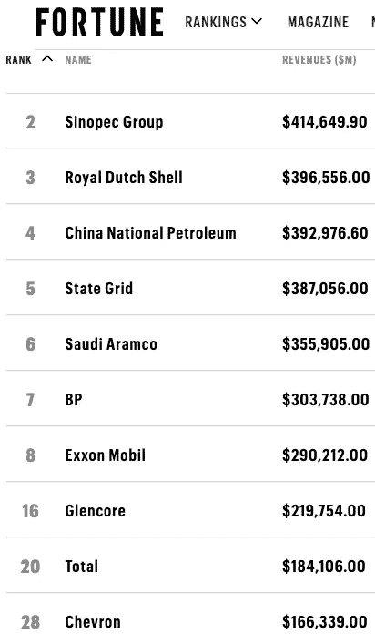

2019 年财富全球 500 强能源

原油价格的变化不仅仅是燃料价格的变化。食品、电力和消费品价格也将受到影响。为了寻找石油和天然气以满足不断增长的能源需求，地球物理学家收集并处理卫星图像，以检测地球重力和磁场的细微变化或异常，确定可能圈闭石油或天然气的岩石类型、地层和结构。探测到这些感兴趣的特征后，将使用能量波或地震波进行更详细的测绘。在海洋环境中，使用装备有能源的勘测船。能量源向水柱中反复发射压力波。在地面上，装有振动器的特殊卡车用于振动地面。在这两种情况下，能量源被发射到地下。这些波在岩石类型属性改变的界面上被反射。

如果附近有井可以获得现有的[测井数据](https://seabed.software.slb.com/well_log/WebHelp/well_logging.htm?gclid=CjwKCAjwhOD0BRAQEiwAK7JHmNvyso7P3HOJh8eUtuiCJ7hneFUbxrmOo_Wxu7HtnoEdolSJdGOaoBoCMTkQAvD_BwE)，地质学家和地球物理学家可以利用这些数据更好地开发现有和新地震剖面交叉的地质模型。不管是生产石油和天然气的井、干井还是废弃井，这些井都有可能是用放在钻孔中的地球物理传感器记录的。因此，地质学家可以对潜在油气储层的位置做出有根据的猜测。

# 测井

20 世纪 20 年代，法国兄弟*康拉德和埃米尔·斯伦贝谢*发明了一种被称为*电缆测井*的技术，开创了测井技术，这种技术至今仍在使用。他们后来成立了世界上最大的油田服务公司，斯伦贝谢公司。

电缆测井由测井车进行。嵌入有传感器以进行井下测量的金属圆筒被连接到电缆上，并被下放到井筒中。收集数据并传输到地面进行进一步分析。

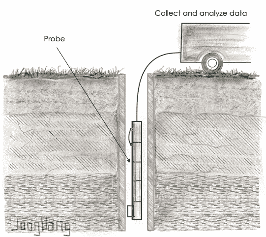

钻井时，要仔细研究岩心样本、岩屑、测井记录和测试结果，以便尽可能多地了解井眼周围的区域。测井记录是一种收集有关已钻穿的地质地层的信息的手段，以确定地层深度、石油储量和许多其他关键信息。

我们经常想起大型石油公司获得的巨额收入和利润。事实上，从《财富》全球 500 强中获得的数据表明，这是千真万确的。然而，我们往往忽略了随之而来的巨大成本和高风险。事实上，并不是所有石油公司承担的项目都能盈利。或许，失败风险最大的领域莫过于该行业的上游勘探或生产部门。

多年来，石油和天然气技术和专业知识不断进步，勘探井的成功率从 1973 年的约 20%提高到 2012 年的约 70%。在油井中成功发现石油或天然气后，石油公司会在其附近钻探更多的油井。这些井被称为**开发井**。许多开发井没有 100%成功。

很可能一口井不经济，需要堵塞和废弃。关于是否完井或弃井的决定使其成为钻井过程中的一个点，称为套管点。这是钻井过程中的一个点，在此之后，油井已经到达目标储层，但是在生产套管已经安装和固井到位之前。

在本文中，我使用机器学习来解决这些挑战，方法是建立机器学习模型，从测井数据中预测经济上可行的油井或生产井。

## 机器学习平台

来自加利福尼亚州山景城的初创公司 H2O([www . H2O . AI](http://www.h2o.ai))**无人驾驶 AI (DAI)** 的 AutoML 平台被用于根据测井数据预测经济上可行的油井。它内置了最先进的机器学习算法和可解释性功能。

戴为数据科学家配置机器学习实验提供基础和专家设置。在基本设置中有 4 个配置选项—准确性、时间、可解释性和计分器，如我之前发表的关于使用 DAI 解决 [**制药**](/using-automated-machine-learning-to-predict-the-next-monoclonal-antibodies-mab-to-be-approved-by-e2e0281f50f) 和 [**音乐**](https://medium.com/swlh/improving-the-return-on-investment-roi-of-music-industry-using-machine-learning-ac756a2fdade) 行业的业务挑战的两篇文章中所述。

简而言之，准确性决定了在执行 ML 训练时使用哪些 ML 算法、集成模型和交叉验证。时间选项根据允许的迭代次数指定了相对时间，但是如果存在收敛，DAI 可能会执行提前停止。可解释性选项影响数据转换的复杂性，进而影响其可解释性。更多信息可在 [H2O 文档页面](http://docs.h2o.ai/driverless-ai/1-8-lts/docs/userguide/experiment-settings.html)获得。

在该实验中使用了以下配置:

这个实验中使用的 H2O 无人驾驶人工智能设置

# 数据

本实验使用的**大型 ASCII 标准(LAS)** 格式的测井数据来自堪萨斯大学 [**堪萨斯地质调查局**](http://www.kgs.ku.edu/PRS/Scans/Log_Summary/index.html) 。

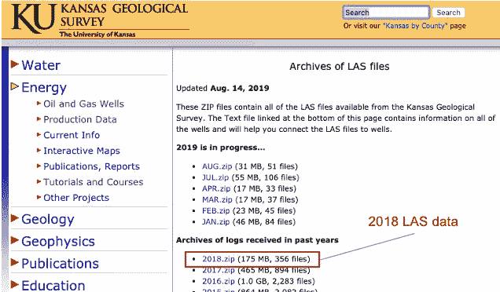

堪萨斯地质调查局数据下载页面

## 数据处理

LAS 文件有两个部分。标题部分包含元数据和关于测量井的一般信息。数据部分包含油井中各种参数的实际测量值。

随后在 **R** 进行探索性分析，以获得初步见解和数据质量。为了简洁起见，本文不讨论数据争论和洞察的详细步骤。

编写了一个 python 程序来将 LAS 原始文件解析为 CSV，以便在用于机器学习实验之前进行进一步处理。

下图显示了 LAS 数据文件的结构。它有两个部分，一个标题和一个数据部分。来自数据部分的细节用于构建机器学习训练的最终表格。

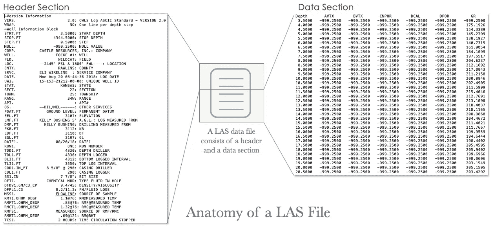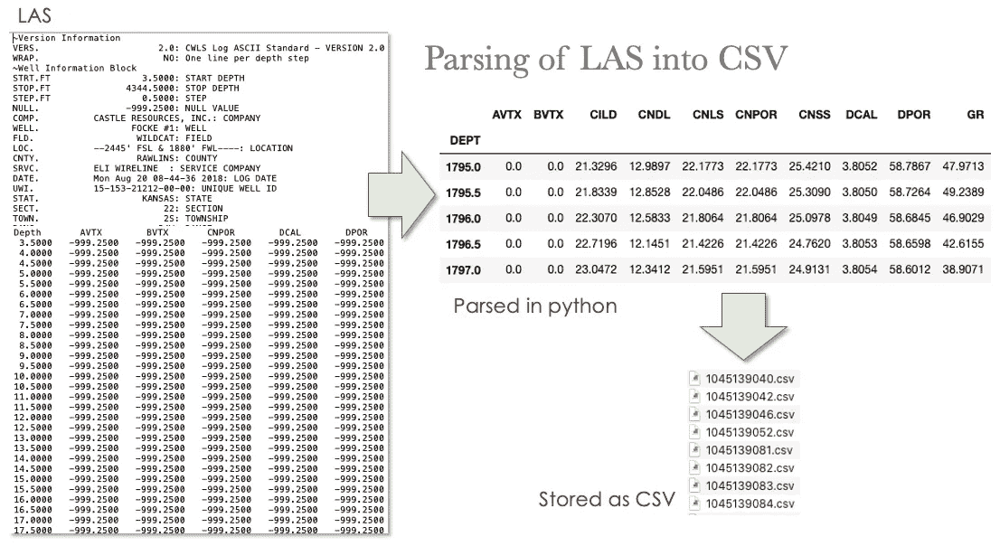

将 Python 中的 LAS 文件解析为 CSV

## 标签策略

数据的*状态 2* 栏用作标记的基础。具有表明经济上可行的石油和天然气生产商的状态的井被标记为 *is_producer = 1* 。*状态 2* 列的值如下:

*   生产
*   重新完成
*   转换为 EOR(强化采油)井
*   转换为生产井

具有*状态 2*值的记录被认为在经济上不可行，并被标记为 is_producer = 0。

对标记数据的*状态*列进行了进一步研究，以识别不打算用于油气生产的井，如服务井。这些记录已从数据中删除。**标签数据的 5%** 被留出用于**样本外**评估。其余的以 80:20 的比例分成 ML 训练集和测试集。

## 探索性数据分析

在 ML 训练开始之前，研究了由 DAI 生成的可视化。以下可视化图形是关联图，用于显示特征之间的关联:

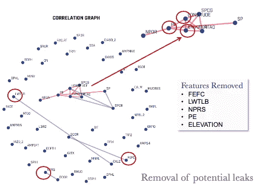

在相关图中，中度相关的要素显示为蓝色线条，而高度相关的要素显示为红色。这些都是潜在的泄漏。因此，特性 *FEFC* 、 *LWTLB* 、 *NPRS* 、 *PE* 、*仰角*被排除在 ML 训练之外。

对所有特征进行了进一步的数据分布检查。那些只有单一值的，如下面的直方图所示，也被删除。

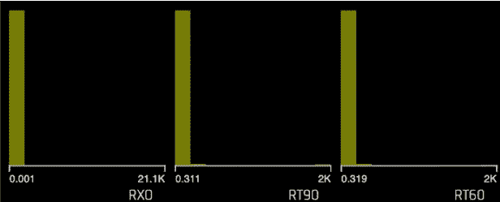

单值列的直方图示例

与 ML 训练无关的特征，如经度和纬度，海拔和其他几个被排除。

最后，钻孔越深，我们就越有可能发现是否有石油或天然气及其经济可行性。因此，深度造成泄漏风险，也排除在 ML 培训之外。在提供的 200 多项 ML 培训中，共有 64 项特征被排除在外。

# 模型性能

ML 训练后的实验设置和模型性能的结果总结如下:

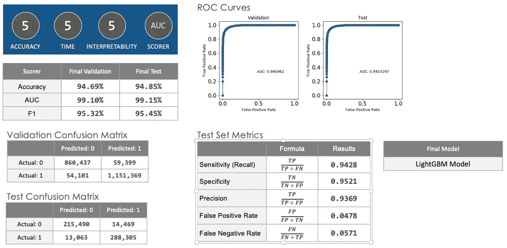

模型性能总结

## 可变重要性

戴总共执行了 31 次迭代来构建 73 个模型，给出最佳 AUC 的最终模型是 **LightGBM** 。发现 48 个特征是重要的。下表按降序列出了 15 个最重要的排名:

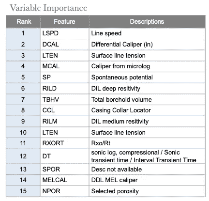

# 样本外评估

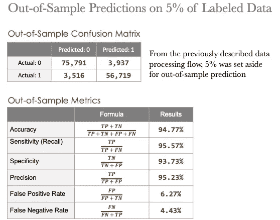

样本外预测汇总

# 基于机器学习的商业决策

正确评估油井的生产潜力至关重要。如果油井被废弃，将无法收回花费在钻井上的资金，这些资金可能高达数百万到数亿美元。同时，完成一口井的成本通常等于或大于将井钻到套管点的成本。

在该实验中展示的这种高准确性表明了机器学习在辅助石油和天然气勘探和生产中的决策过程中的潜在应用。以下段落解释了本实验中构建的机器学习模型可以部署在决策管道中的何处。

钻井所涉及的费用可分为[三个阶段](https://www.coursera.org/learn/oilandgas/lecture/gMzJh/well-drilling-and-production-costs) — **套管点前**，套管点后和**放线后**。

在第一阶段，油井向下钻至目标储油层。这是在套管点之前进行的。在下套管时，必须根据测井数据分析和专家经验决定是否继续完井。如果储层可开采油气储量的利润不足以支付油井的总成本，此时封堵和弃井通常比完井更具成本效益。在这一阶段，没有收入，只有地质学家产生钻探前景、租赁面积、获得必要的钻探许可和准备钻探场地的成本。

下表描述了开发油井成本的不同阶段。第二和第三阶段的成本通常比下套管点之前高得多。该表还显示了机器学习模型在管道中的位置，以补充和改进决策过程。

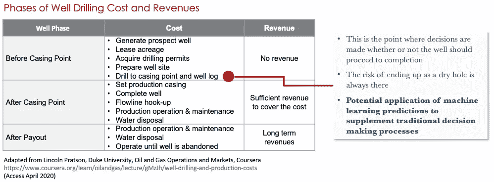

# 未来的改进

油气生产的另一个挑战是**废弃井**。报废井主要是由于维护活动出错，留下送入工具、电线、塞子和其他材料被丢弃并经常卡在井中。

由于腐蚀、侵蚀、热应力等原因，油管或套管经常发生故障，导致套管损坏，进而引发油井水淹。当油井从生产井转为注入井时，也经常出现报废井。盐和页岩等可移动的岩层也是一些可能的原因。

目前，由油田服务公司(如 Schlumberger 和 Baker)提供的测井服务与使用软件(如 Landmark 和 Paradigm)的油管应力分析相结合，经常被用来解决报废井的问题。

通过使用机器学习，可以将来自测井记录、油管应力分析和服务提供商资料的数据输入 ML 算法，以生成准确的模型，从而在决定将油井从生产井转换为注入井之前预测遇到废弃油井的概率。这种方法可以帮助石油公司和服务提供商更好地做出决策，以防止废弃油井的发生。