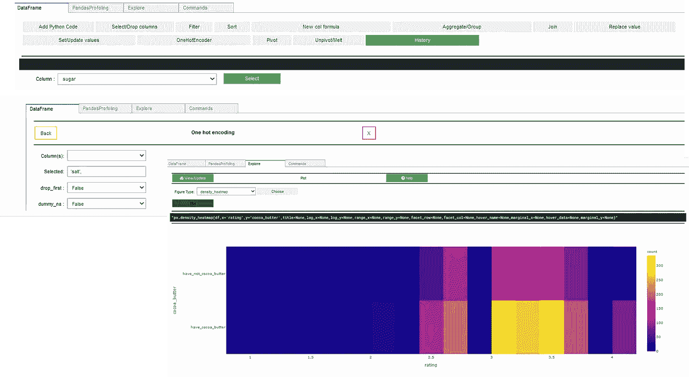
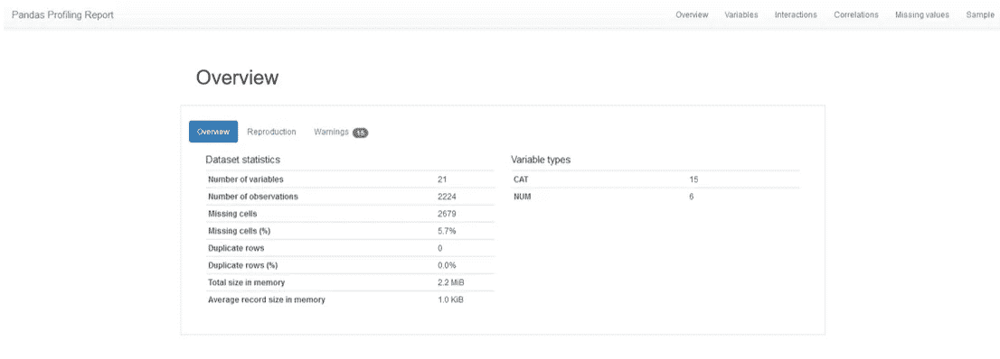
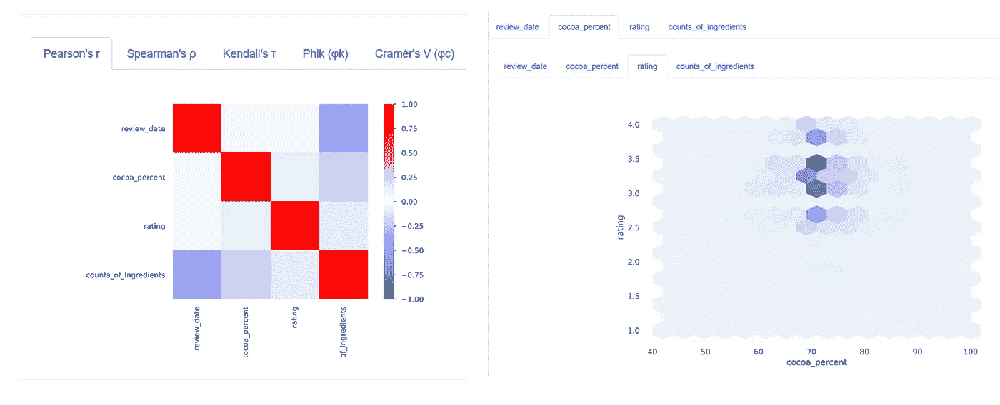
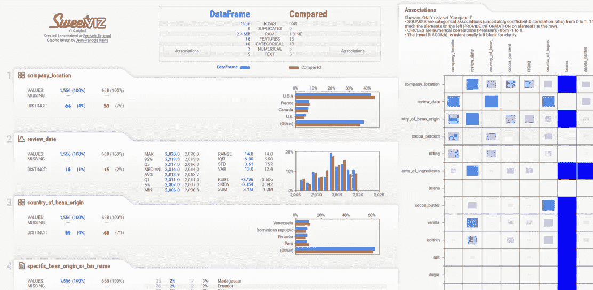
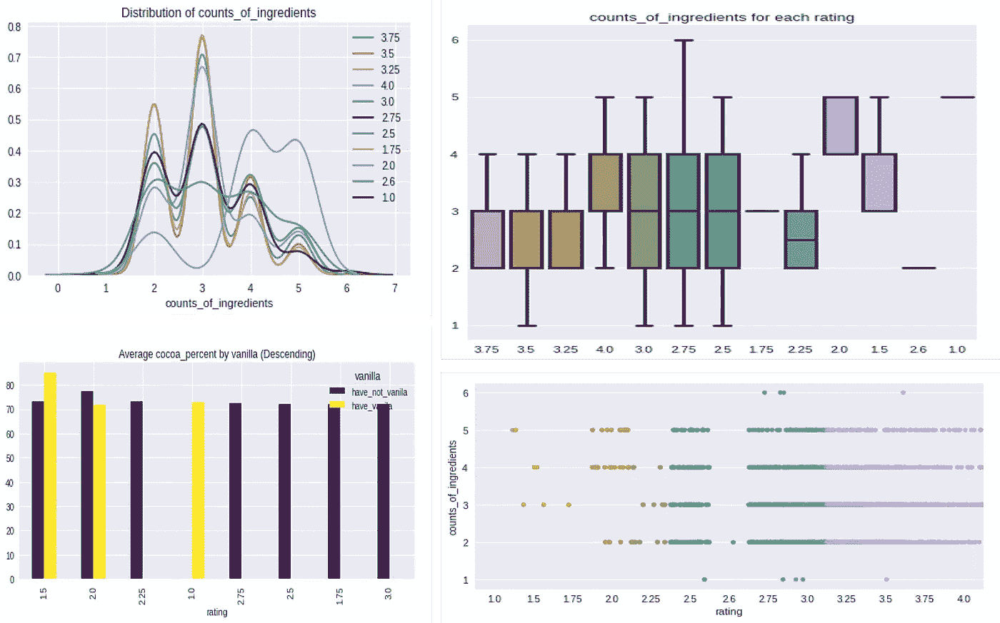

# 更好、更快、更强的 Python 探索性数据分析(EDA)

> 原文：<https://towardsdatascience.com/better-faster-stronger-python-exploratory-data-analysis-eda-e2a733890a64?source=collection_archive---------26----------------------->

## 用 4 行代码探索、清理和争论数据集


[Creedi 钟](https://unsplash.com/@creedi?utm_source=unsplash&utm_medium=referral&utm_content=creditCopyText)在 [Unsplash](https://unsplash.com/s/photos/hd-neon-wallpapers-free-geometry?utm_source=unsplash&utm_medium=referral&utm_content=creditCopyText) 上的照片

探索性数据分析(EDA)是理解大多数数据科学项目的基本步骤，无论是开发机器学习模型还是商业分析。该过程包括处理缺失数据、编码数据类型(连续、分类)、计算特征之间的关联-相关性、形成数据结构、构建设计图表(直方图、箱线图、时间序列等)..).由于数据量巨大，使用自动化库寻找更快分析的技巧是成为独角兽数据科学家的一个关键优势。在本文中，我们将回顾 4 个最成功的开源短 python 代码行，它们可以组合在一起构成一流的 EDA。在这篇文章中，我们将分析你可以在这里找到的巧克力棒评级数据集样本:[巧克力棒](https://www.kaggle.com/soroushghaderi/chocolate-bar-2020)。


照片由[叶戈尔·利法尔](https://unsplash.com/@egorlyfar?utm_source=unsplash&utm_medium=referral&utm_content=creditCopyText)在 [Unsplash](https://unsplash.com/s/photos/hd-neon--free-chocolate?utm_source=unsplash&utm_medium=referral&utm_content=creditCopyText) 上拍摄

1.  **熊猫 UI**

Pandas_ui 是 bamboolib 的一个高效的开源替代方案。该软件包减少了数据预处理时间，结合 python 库(如 plotly、pandas、qgrid、ipywidgets 和 pandas profiling)创建了有用的可视化。使用此软件包，您可以删除列、编码分类要素、合并要素、过滤排序行、分组要素、数据类型、唯一值和缺失值计数、替换值、分位数统计(Q1 中值、Q3、最大值、范围、四分位间距)、描述性统计(平均值、众数、标准差、总和、中位数绝对偏差)、异常值、可视化(直方图)、相关性(皮尔逊矩阵)。最终专注于您的机器学习目标，节省数据探索步骤的时间。要使用这个包，你的电脑上需要一个装有 python 3.7 的 jupyter 笔记本(或 jupyter lab)。更多细节请参考本 [github](https://github.com/arunnbaba/pandas_ui) 。

```
pip install pandas_uijupyter nbextension enable — py qgrid — sys-prefixjupyter nbextension enable — py widgetsnbextension — sys-prefixfrom pandas_ui import *pdf =pandas_ui(“**../input/chocolate-bar-2020/chocolate.csv**”)pdf.to_file(output_file=**”pandas_ui1.html”**)get_df() # to get the data frame#get_meltdf() or get_pivotdf() # to get melt or pivot dataframes if you have created any.
```



巧克力评级数据集**上的 plot _ correlation(**图片由作者提供)

2.**熊猫简介**

Pandas_profiling 是一个开源的单行代码，它从 csv 数据集创建一个完整的 HTML 分析报告，用于快速准确的数据分析。使用此软件包，您可以轻松获得数据类型、唯一值和缺失值(计数、热图和树状图)、分位数(Q1 中值、Q3、最大值、范围、四分位数范围)、描述性统计数据(均值、众数、标准差、总和、中值绝对偏差、变异系数、峰度、偏斜度)、异常值、直方图等可视化、相关性(Spearman、Pearson 和 Kendall 矩阵)、文本分析(大写、空格、脚本和 ASCII 块)、文件和图像分析(尺寸、截断图像扫描)。要使用这个包，你的电脑上需要一个装有 python 3.7 的 jupyter 笔记本(或 jupyter lab)。

从 pandas 数据框架生成配置文件报告。pandas df.describe()函数很棒，但对于严肃的探索性数据分析来说有点基础。pandas_profiling 使用 df.profile_report()扩展了 pandas 数据帧，以便进行快速数据分析。

```
pip install pandas-profilingorconda install -c anaconda pandas-profilingfrom pandas_profiling import ProfileReportdf = pd.read_csv(‘**../input/chocolate-bar-2020/chocolate.csv**’)pr = ProfileReport(df)pr.to_file(output_file=”**pandas_profiling1.html**”)pr
```



巧克力评级数据集**(作者**图片)上的 matrix_correlation

更多细节请参考这个 [GitHub](https://pandas-profiling.github.io/pandas-profiling/docs/) 。


Photo by [甜心之枪 Sweetgun](https://unsplash.com/@luchuxue1997?utm_source=unsplash&utm_medium=referral&utm_content=creditCopyText) on [Unsplash](https://unsplash.com/s/photos/hd-neon-wallpapers-free-geometry?utm_source=unsplash&utm_medium=referral&utm_content=creditCopyText)

3. **Sweetviz**

Sweetviz 是一个很棒的两行代码，可以创建高密度的可视化 HTML 报告。使用此软件包，您可以通过目标值可视化对照其他特征(目标特征 y 的 A 与 B)轻松选择特征，比较两个数据集(训练 vas 测试)。此外，您还可以获得缺失值、分位数和描述性统计数据、直方图、不确定性相关性(分类-分类)、相关比率(分类-数值)。要使用这个包，你的电脑上需要一个装有 python 3.7 的 jupyter 笔记本(或 jupyter lab)。

安装 Sweetviz(使用 pip install sweetviz)后，只需像平常一样加载 panda 的数据帧，然后根据您的需要调用 analyze()、compare()或 compare_intra()(更多信息见下文)。完整的文档可以在 [GitHub](https://github.com/fbdesignpro/sweetviz) 上找到。现在，让我们从手头的案例开始，按如下方式加载:

```
df = pd.read_csv(‘**../input/chocolate-bar-2020/chocolate.csv**’)from sklearn.model_selection import train_test_splittrain, test = train_test_split(df, test_size=0.3)!pip install sweetvizimport sweetviz as svsweetviz_report = sv.analyze([df,”data”],target_feat=’rating’)sweetviz_report.show_html(‘**viz.html**’)df1 = sv.compare(train, test)df1.show_html(‘**Compare.html**’)
```

我们现在有 2 个数据框架(训练和测试)，我们想分析目标值“评级”。这里互动报道更详细:[这里](https://www.kaggleusercontent.com/kf/38611434/eyJhbGciOiJkaXIiLCJlbmMiOiJBMTI4Q0JDLUhTMjU2In0..iIJmThqQVq0Zgkt6ZR5m0Q.6d6MMWT6O7Ex3UiEBB3lw-Nm-r9p5-io0sTSEMBB3gQXHJ9g0Z5hyPuhxNA9KjjdL6ruGIOal0CtU-zAxtOwkYY_RhEv5g70zf7XZwx0fX-smB1Qxr3E6aFuU8DnF67fGHWwBIwkF4kokZREoBcpaZhoLeM2bBBQxMoOFW2ya7jkvVgusEXMF0KfWhgQ_ehNK1zHWMDTiC4i4GBechBD3rAnagPO5oHYqH3FjLOjcTSroF3cGCo2N2S4DOAJPNHvZxwWabHd8yArECmpOFD-0M1MME68NTRAMtO80Mq_AEe8DKLwaxlIGno9iMlSNWgvArmLZGWEeyjRmFI08T4YqlThCF52vFLSRF0SEQ5kqDMK2eaI1iBsgUT1T_2XJhyR8hNNkvSFSL8MZiem9U50f0gsHaXvlaY0Y6MK5wEYv92wLfLwkG3pFgpBQAsaE0tcE-Zts5ri5z33HkOBgapKx18KInjG2pcIXcDKhTQ2R2QF5k6LU1vv7NS7jExQhpJqHj-7-LxwktcuALmiNFPAiYAwqtEGdCzcYTliLce97uYGtSKteUA75KjfUrdj2d9CKR8iIGm4KknisgcfwcqYe28uyBtyzahreBWxDsJwaUFVaton82O--drVp669HaCAIKufPjkCbmAgGd16CbQAxUTCRSCTljGi_K3gBp7Ck5fKCxOBouD3MPOUTqswgolDtOT7_ybDpOkzLMjxHkJDbw.56B_L2z8AqPAWJaYewnCLA/Compare.html)



使用 Sweetviz **(作者提供**图片)进行训练和测试的比较

正方形代表分类特征相关变量的相关性。注意，为了清楚起见，平凡的对角线是空的。


照片由[德文神](https://unsplash.com/@lightrisephotography?utm_source=unsplash&utm_medium=referral&utm_content=creditCopyText)在 [Unsplash](https://unsplash.com/s/photos/hd-neon--free-ice-cream?utm_source=unsplash&utm_medium=referral&utm_content=creditCopyText)

**4。Autoviz**

Autoviz 是一个开源的单行代码，可以从 csv 数据集为大小数据集创建完整的 HTML 分析报告。有了这个软件包，您可以获得可视化效果，包括条形图、直方图、相关性热图、分位数和描述性统计。Autoviz 提供了一个一键式引擎 Auto Viz.io，您可以在线上传数据，并直接将完全免费的报告发送到您的电子邮件中。

AutoViz 可以通过 4 个简单的步骤实现:

```
!pip install autovizfrom autoviz.AutoViz_Class import AutoViz_ClassAV = AutoViz_Class()dft = AV.AutoViz(filename = “”, sep= ‘,’ , depVar=’rating’, dfte= df, header=0, verbose=2, lowess=False, chart_format=”svg”, max_rows_analyzed=2500, max_cols_analyzed= 21)dft.to_file(output_file=”**autoviz_profiling.html**”)
```



巧克力评级数据集**(作者提供**图片)上 autoviz 包的绘图功能

如果你有空闲时间，我建议你看看这个:

[https://medium . com/swlh/EDA-explorative-data-analysis-e0f 453d 97894](https://medium.com/swlh/eda-exploratory-data-analysis-e0f453d97894)

**总结**

请参考此链接[巧克力评级 EDA](https://www.kaggle.com/philboaz/eda-pandas-ui-sweetviz-profilereport-auto-viz-cho?scriptVersionId=38611434) ，使用这些工具和其他众所周知的可视化工具对巧克力评级进行完整的 EDA 分析。

这个简单的概述提醒我们在数据科学中使用 python 进行探索性数据分析的重要性。这篇文章涵盖了制作完整的探索工作流的 4 个基本 Python EDA 工具，以及有用的文档。

希望你喜欢，继续探索！！！


mikita-yo 在 [Unsplash](https://unsplash.com/photos/-OCFdBaFcGk) 上拍摄的照片