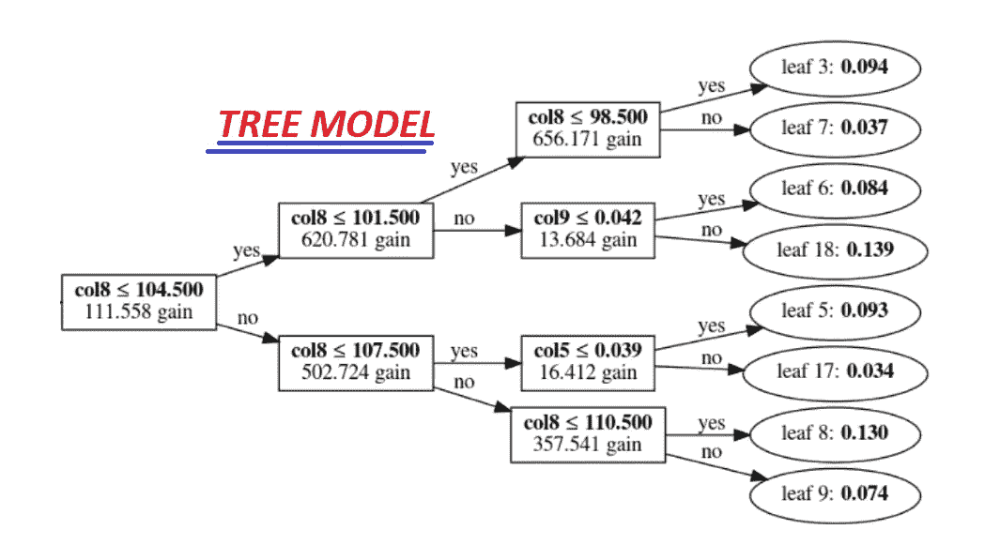
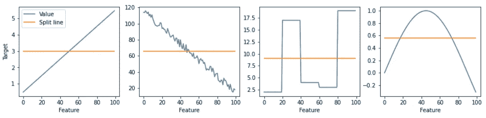
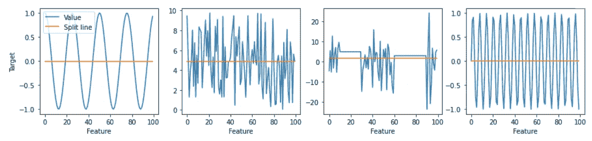
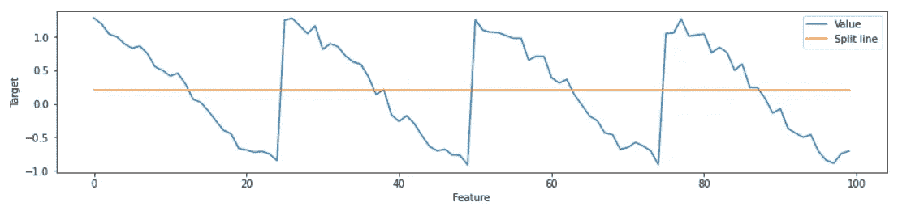
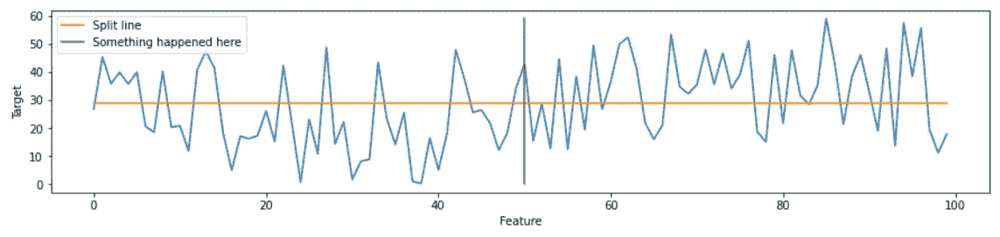
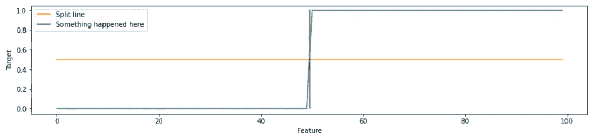
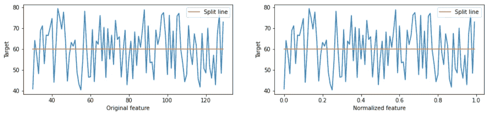

# 基于树的模型的更好特性

> 原文：<https://towardsdatascience.com/better-features-for-a-tree-based-model-d3b21247cdf2?source=collection_archive---------22----------------------->

## 树模型能看到什么，不能看到什么

当您了解模型如何工作时，创建成功的特征就变得容易多了。这是因为您可以推理模型的优缺点，并相应地准备特征。让我们一起来看看基于树的模型可以理解哪些特性，以及哪些特性对它来说更难使用(以及在这种情况下我们如何帮助模型)。

# 基于树的模型如何使用特征

我们将从仔细观察基于树的模型内部开始。

基于树的模型示例(由作者从 LightGBM 模型生成)

基于树的模型的主要构件是二元决策。它获取特定特性的值，并根据该值进行分割。许多这样的决策形成了决策树。许多树预测平均起来给出了模型预测。当然，这是对基于树的模型的非常简化的解释，但是它非常适合于理解成功的特性需要什么属性。

> 所需分裂(或所需二元决策)的数量是该特征的一个重要属性

鉴于二元性，基于树的模型擅长处理主要信号可以通过几次分割提取的特征。让我们来看看具有这种属性的一些特性。

为了更好地推理所需的分割，我们将使用“特性与目标”图。在 X 轴上，我们将特征值从最小到最大排序。在 Y 轴上，我们有每个特征值对应的目标值。此外，我们将使用分割线来区分我们希望考虑的低目标值和高目标值。

下面是一些需要一个或几个分割的特性的“特性与目标”图的例子，基于树的模型可以很好地处理这些特性。

需要一次/几次拆分的简单功能(作者可视化)

如您所见，基于树的模型擅长处理特征，其中图形不会经常从向上到向下改变方向，反之亦然。特征不需要是线性的，主要要求是它们不需要许多分裂点来分隔低和高目标值。

此外，基于树的模型的优点是处理特征交互的能力。这是指对于较小的要素 B 值，要素 A 以一种方式运行，但对于较大的要素 B 值，其行为会发生变化。不是所有的模型都能捕捉到这样的交互，但是基于树的模型处理起来非常自然。

现在让我们来看看一些特性，这些特性对于基于树的模型来说更难处理。

需要许多分割的硬特征(作者可视化)

一个特征捕获完整信号所需的分裂越多，所需的树就越深。但是有很多叶子的更深的树意味着更高的过度拟合风险。允许模型生长更深的树，并不意味着它将只对我们想要的特征进行分割。它可以使用分割来不必要地分割一些其他特征，从而导致捕捉噪声。

# 特征工程示例

现在，对我们的基于树的模型需要什么类型的特征有了一些直觉，让我们看一些如何实际转换特征以使它们更好的例子。

## 捕获重复模式

具有重复模式的特征(作者可视化)

这里我们可以看到一个具有某种重复模式的特征。具有类似模式的特征的一个真实例子是日期。在许多数据集中，有一个或多个日期要素。他们可以指定注册日期、出生日期、测量日期等等。日期要素的一个典型属性是，有时它们具有季节性成分。例如，目标变量可以取决于工作日——在周末，目标变量的行为与工作日不同。

我们的模型很难提取这样的信息。因为每个周末都需要两次分裂——把它从两边分开。另一个缺陷是，对精确的日期值进行分割将无助于预测未来看不见的数据，因为日期不会重复。

帮助我们的模型的最好方法是将模式提取为更简单的二进制特征“is_weekend”，其值“1”表示周末，“0”表示工作日。或者使用“工作日”特性更有效，每个工作日的值从 1 到 7。当我们在前面的例子中直观地看到这意味着什么时，我们正在减少必要的分割，以完全捕捉数据中的信号，从而使该功能对基于树的模型更加友好。

减少了基于树的模型捕获特征信号所需的分割(作者可视化)

基本上，我们将所有重复的时间间隔(如周)放在一起，让模型使用平均值来决定拆分。在上面的示例中，这允许我们将所需的拆分数量从 8 个减少到 2 个。如果您想知道这是如何在代码中实现的——我们简单地将这里的`x mod 25`作为新的特征值，因为原始特征的重复间隔长度为 25。

> 我们可以通过减少模型捕捉信号所需的分割数量来改进特征

## 消除噪音

基于树的模型可能需要一些帮助的另一种情况是非常嘈杂的数据。考虑一些特征，其中的值非常嘈杂，但实际上，只有一个点是有意义的。如果我们知道这一点，我们可以通过自己进行必要的拆分来帮助模型。这可以通过将原始特征转换成二进制特征来实现。

噪声特征示例(作者可视化)

例如，我们在不同的日期在一家商店购买了很多东西，并且知道这家商店在某一天搬到了另一个地方。如果我们检查移动前后的平均值，相应的平均值将是 25 和 30。但是给定一个从 0 到 60 变化的高方差，模型很难确定正确的分割点。

在这个特殊的例子中，假设平均值发生了变化，最有可能的是，模型将设法在正确点附近的某个地方进行分割。但是，它可能会选择某个点向一侧或另一侧移动，从而导致围绕该移动点的预测更差。我们可以通过引入明确指定这一点的新特征来帮助该模型，例如，这可以是“new_location”特征，在移动之后所有行的值为 1，在移动之前的值为 0。

没有噪音的新功能(作者可视化)

当然，这样的转换需要一些领域知识和“专家决策”来选择正确的拆分点。但是当这是可能的时候，这样的特征可以极大地帮助模型避免不必要的错误分割，这可能导致对噪声的过度拟合。

# 更多关于基于树的模型能做什么/不能做什么

到目前为止，我们探索了基于树的模型如何使用特性，并查看了一些如何使用这些知识来修复或设计更好的特性的示例。

现在让我们谈谈在使用基于树的模型时可以帮助我们的其他考虑事项。

## 注意已知区间之外的特征值

基于树的模型的一个弱点是不能外推。简单地说，基于树的模型通常无法预测小于训练数据中最小值的值，或者大于训练集中最大值的值。

考虑特征 X 值和相应的目标 Y 值如下:

*   X=1，Y=2
*   X=2，Y=3
*   X=3，Y=4
*   X=4，Y= **？**

任何简单的线性模型都会捕捉 X 和 Y 之间的线性关系，并且会正确地猜测最后的 Y 值。但是基于树的模型最有可能预测出 4 左右的值。而不是 5，这显然是正确的值。

为了理解原因，我们应该回忆一下基于树的模型是如何使用特征的——通过对它们进行分割。如果模型从未见过大于 3 的特征 X 值，它就没有办法对更大的值进行分割。因此，所有大于 3 的 X 值将被基于树的模型完全相同地对待。

现在，我们能帮助一个模型克服这一点吗？一般来说——不，我们不能以任何方式强迫一个模型在已知的特征区间之外进行分割。

> 基于树的模型无法对训练数据中出现的间隔之外的特征值进行拆分，因此无法区分它们。

围绕这一限制实际上存在一些方法，但是这些方法通常涉及目标值的转换——因此我在这里不考虑它们，因为在本文中我只想关注转换/创建特性。我可以给你一些关于这些方法的方向的线索。例如，有时有可能预测的不是实际目标值，而是与某个先前值的差值，并且最终通过逐个递增地添加与先前值的预测差值来重建实际目标值。

## 不需要缩放或标准化

使用基于树的模型时，不需要缩放或标准化数据。为什么？因为在从 0 到 1 的区间中以 0.8 进行分割与在例如从-100 到 900 的区间中以 700 进行分割一样困难(或容易)。

为了直观地看到它，让我们为一些随机特性绘制“特性与目标”图，这些特性的值在 30 到 130 之间。让我们为相同的特征绘制相同的图，但是在归一化到区间(0，1)之后。

规范化不会影响所需的拆分数量(作者的可视化)

注意，唯一改变的是 X 轴的比例。该模型将需要与标准化之前完全相同的分割，以分离低目标值和高目标值。

类似地，基于树的模型对特征中的异常值不敏感(与例如线性模型相反)。

# 结论

尽管最近深度学习取得了不可否认的进步，但基于树的模型仍然非常有竞争力。如果我们谈论表格数据，在许多(如果不是大多数)情况下，具有精确特征工程的基于树的模型仍然可以胜过深度学习方法，这被许多 Kaggle 竞赛结果所证明。在基于树的模型中，特征工程是成功的关键。但是理解模型的基础结构和操作是成功的特征工程的关键。

弗兰基·查马基在 [Unsplash](https://unsplash.com?utm_source=medium&utm_medium=referral) 上拍摄的照片

希望你在这篇文章中找到一些有趣的、有用的东西，感谢你的阅读！关注我，不要错过更多关于机器学习的文章。