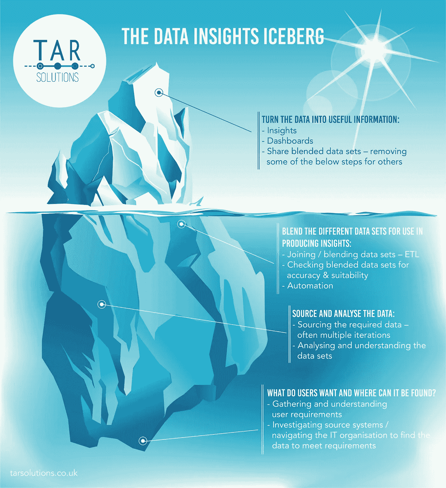

# 使用冰山来管理利益相关者的期望

> 原文：<https://towardsdatascience.com/better-manage-stakeholder-expectations-1713f0bf0f7a?source=collection_archive---------66----------------------->

## 数据洞察冰山有助于管理数据项目中的预期

在数据科学/数据洞察/数据可视化项目的早期阶段，管理利益相关者的期望可能特别具有挑战性。对于不太熟悉数据项目挑战的非技术涉众来说尤其如此。

数据来源和相关分析可能特别耗时。这些工作的大部分是不可见的，很难交流，因此出现了数据洞察冰山。

数据洞察冰山是表现这些项目的好方法。大部分工作都在水下进行。

来自 [TAR 解决方案](https://tarsolutions.co.uk/blog/data-insights-iceberg-data-analytics-projects/)的数据洞察冰山

幸运的是，并非所有这些“水下”工作对于所有数据洞察项目都是必要的。每个公司都有不同级别的数据基础设施和成熟度。

# 数据洞察冰山的水面下发生了什么？

洞察和分析项目需要一个关键要素。没有这个要素，项目甚至在开始之前就会失败。**优质数据。**

然而，在获取数据之前，了解**客户/用户想要什么**是很关键的。

一般来说，人们很难清楚地说出哪些信息对他们有用。他们真正想要的是什么。通常这是因为他们不知道。他们有一种感觉，他们想要类似 X 的东西，但直到他们开始看到 X，他们才真正知道。

在知道您是否有高质量的数据之前，那些可能“松散”的需求需要工作到可能的数据源系统中。

下一步是从确定的系统中获取数据。来源于真实数据，而不是测试数据。如果您向业务用户展示一个带有测试数据的仪表板，您可能收到的唯一反馈是，“这个数字是错误的”。

获取数据可能非常耗时。如果没有数据提供者的充分合作，这可能会非常耗时。

假设获取数据一切顺利，每个数据集都需要分析和理解。

数据看起来正确吗？它与源系统匹配吗？应该怎么用？有需要了解的业务规则吗？它如何连接到其他数据源？

有许多关于数据的问题，它们都需要一个答案。理解数据对于提供准确的见解非常重要。

然后，这些数据源需要连接/混合。这通常意味着编写 ETL 过程来适当地映射数据。这也需要时间。

在加入过程结束时得出的数据是准确的，这一点很关键。这些 ETL 输出构成了产生业务洞察的基础。

一旦数据步骤完成，将数据转换成有用的业务信息才真正开始。

洞察力通常呈现在仪表板中。这些是企业希望看到的；吃水线以上的那块冰山。

最终，利益相关者将会如何评价你的项目。

# 管理利益相关者的期望

由于所有的工作都发生在水线以下，很难管理利益相关者的期望。

在数据基础设施相对成熟的组织中，快速创造洞察力更加简单。因此，管理预期要简单得多。

如果你能从好的数据开始，那么很快就能产生洞察力。

然而，对于那些数据基础设施不太成熟的组织来说，这可能更具挑战性。

开始需要获取大量数据的项目在开始时往往比较棘手。大量的时间将花在冰山的底部，在水线以下工作。

当工作对业务涉众不可见时，管理期望就变得更加重要。

最好的选择是创建一个显示已知数据源的矩阵。该矩阵应:

*   指明来源提供商
*   标记数据是否已获得—有时这可能需要几个月的时间
*   指出是否已对其进行分析
*   显示所含数据的质量
*   标记发现的任何问题

这可能是向企业高级管理层展示进展的最佳选择。对于许多利益相关者来说，PowerPoint 幻灯片比展示 ETL 工作流更容易阅读和理解！

最终，这些冰山项目中的沟通必须是稳固的。

这可能不是开发商的过错，事情比预期的时间长。然而，这也往往容易归咎于开发商。

因此，管理涉众的期望可能是项目成功和失败的区别。

*TAR Solutions 专注于* [*Tableau 和 Alteryx，为金融服务机构*](https://tarsolutions.co.uk/case-studies/) *提供数据洞察项目。*