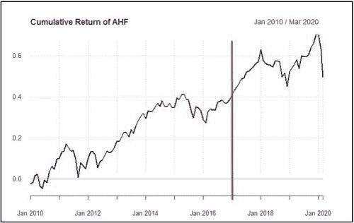
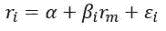
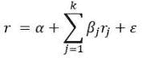
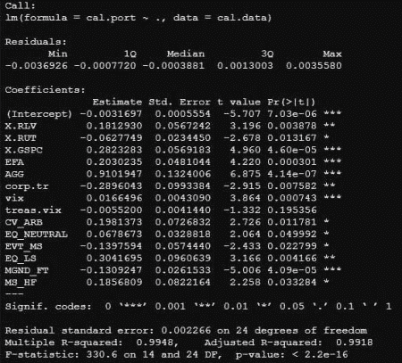
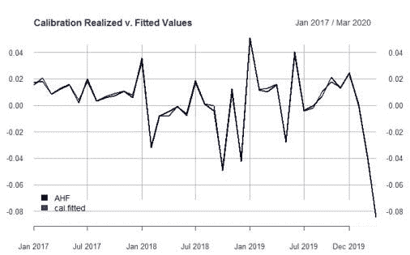
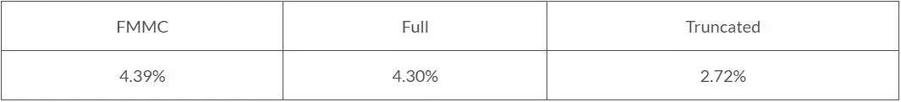
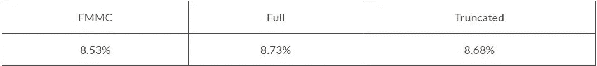
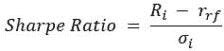
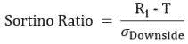
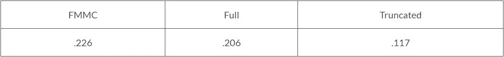

# 在 R 中使用因子模型蒙特卡罗获得更好的投资组合绩效

> 原文：<https://towardsdatascience.com/better-portfolio-performance-with-factor-model-monte-carlo-in-r-3910d0a6ceb6?source=collection_archive---------31----------------------->

摩纳哥。蒙特卡洛赌场的位置。由[马克·德容](https://unsplash.com/@mrmarkdejong?utm_source=medium&utm_medium=referral)在 [Unsplash](https://unsplash.com?utm_source=medium&utm_medium=referral) 上拍摄的照片

***来自《走向数据科学》编辑的提示:*** *虽然我们允许独立作者根据我们的* [*规则和指导方针*](/questions-96667b06af5) *发表文章，但我们并不认可每个作者的贡献。你不应该在没有寻求专业建议的情况下依赖一个作者的作品。详见我们的* [*读者术语*](/readers-terms-b5d780a700a4) *。*

评估投资组合经理时的一个常见问题是，回报的历史通常很短，因此对风险和业绩衡量的估计可能非常不可靠。在测试新的交易策略时，也会出现类似的问题。即使你对策略的表现有相当长的历史，但你通常只对一个市场周期进行观察，这使得很难评估你的策略在其他市场的表现。如果你交易股票，你可能听过这样一句话:“我从未见过糟糕的回溯测试”。

解决这一缺陷的一种方法是通过**因素模型蒙特卡罗(FMMC)** 。FMMC 可以用来估计一个因素模型的基础上，一套金融和经济因素，可靠地解释了基金经理的回报。然后，我们可以模拟回报率，以确定经理在各种市场环境下的表现。最终的结果是一个模型，它产生了比我们简单地使用可用的收益序列更好的风险和性能估计。

# 任务和设置

在这个案例研究中，我们将分析新对冲基金**王高对冲基金**的回报；以下简称 **AHF** 。对冲基金的案例尤其有趣，因为对冲基金可以使用杠杆，投资于任何资产类别，做多或做空，并使用许多不同的工具。对冲基金通常对自己的策略和持股非常保密。因此，有一个可靠的风险模型来解释他们的回报来源是至关重要的。

请记住，王高的对冲基金不是真正的对冲基金(我是王高，我没有对冲基金)，*但*这是一个*真实的*系列收益。我获得了我们在我工作的地方投资的对冲基金的运营回报，因此这项研究的结果适用于现实世界。

我们有王高对冲基金从 2010 年 1 月到 2020 年 3 月的数据。为了这篇文章的目的和评估我们模型的准确性，我们将*假设*好像 AHF 是一个非常新的场景，我们只有 2017 年 1 月到 2020 年 3 月的数据。为了克服数据不足，我们将在此“观察数据”的基础上建立一个因素模型，然后利用整个数据系列来评估我们评估风险和性能统计的模拟的准确性。

下图显示了自 2010 年 1 月以来 AHF 的累计回报。红线右边的数据代表“观察周期”。

我们将在 R 中使用大量可用的软件包进行分析，包括:[性能分析](https://cran.r-project.org/web/packages/PerformanceAnalytics/index.html)和 [quantmod](https://cran.r-project.org/web/packages/quantmod/index.html) 。除了对冲基金收益系列，所有的因素数据都可以从雅虎免费获得。金融，美联储圣路易斯银行[弗雷德数据库](https://fred.stlouisfed.org/)，以及[瑞士瑞信银行对冲基金指数](https://lab.credit-suisse.com/)；你必须在瑞士瑞信银行注册才能访问这些指数，但仍然是……免费的。

# 模型估计

经验金融学的一个常用技巧是基于一组常见的风险因素来解释资产价格的变化。最简单和最著名的因素模型是威廉夏普的资本资产定价模型(CAPM)。资本资产定价模型规定如下:

其中:

*   ri =资产“I”的返还
*   m =市场指数“m”的回报
*   ∞=超额回报
*   =暴露于市场风险因素
*   ɛi =特殊误差项

市场风险，或“系统性”风险，是对金融资产所面临的所有风险的一种概括衡量。这可能包括经济衰退、通货膨胀、利率变化、政治动荡、自然灾害等。市场风险通常由大型指数(如标准普尔 500 指数)的回报来代表，不能通过分散投资来降低。

(即 Beta)代表资产的市场风险敞口。β= 1 意味着资产和市场一样有风险，β> 1 意味着比市场风险更大，而β< 1 意味着风险更小。

ɛ是一种特殊风险，代表无法用市场风险因素解释的那部分回报。

我们将扩展 CAPM 以包括额外的风险因素，文献表明这些因素对解释资产回报很重要。王高的对冲基金使用许多不同的资产类别和工具来运行一个复杂的策略，因此它暴露于传统市场指数之外的更广泛的风险当然是合理的。我们的因素模型的一般形式如下:

上面所说的是收益(r)由一组风险因子 j=1…k 来解释，其中 r j 是因子“j”的收益，j 是风险敞口。ɛ是一个特殊的错误。因此，如果我们可以估计 j，那么我们就可以利用长期的因素回报(r j)来计算 AHF 的条件回报。最后，如果我们可以合理地估计ɛ的分布，那么我们就可以在 AHF 的收益序列中建立随机性。这使我们能够充分捕捉我们可以观察到的各种回报。

FMMC 方法将分为三个部分:

*   A 部分:数据采集、清理和处理
*   B 部分:模型估计
*   C 部分:蒙特卡罗模拟

# A 部分:数据采集、清理和处理

对于因子模型，我将使用一组金融和经济变量，旨在衡量不同来源的风险和回报。同样，本研究中使用的所有数据都可以从 Yahoo！金融、弗雷德数据库和瑞士瑞信银行。

我们将从弗雷德的数据开始。在每个变量旁边，我放置了唯一的标识符，您可以从数据库中查询。

**弗雷德变量:**

*   未来 5 年的 5 年通胀预期。(T5YIFRM)
*   期限利差:10 年减 3 个月国债收益率利差。(T10Y3M)
*   信用利差溢价:穆迪的 Baa 公司债券收益率减去 10 年期美国国债收益率。(BAA10Y)
*   3 个月期国库券利率。(DGS3MO)
*   TED 利差:3 个月 LIBOR 减去 3 个月国债收益率。(TEDRATE)
*   国际债券收益率:欧元区 10 年期政府债券收益率。(IRLTLT01EZM156N)
*   公司债券总回报指数:ICE BofAML Corp 债券总回报指数；分层次。(BAMLCC0A0CMTRIV)
*   CBOE 波动率指数(即 VIX)。(VIXCLS)
*   美国 10 年期国债(即 VIX 国债)的 CBOE 波动率指数。(VXTYN)

FRED API 有一些不足之处，不允许您以一致的方式提取数据。AHF 的回报是每月的，所以我们的模型将需要使用每月数据进行估计。但是，FRED 以最高的可用频率检索数据，因此每日数据总是以每日形式出现。此外，数据是从系列的开始检索的，所以您最终会得到许多 NAs。因此，在我们继续之前，我们需要做一些清理工作。

下面的 R 代码段展示了如何将标识符加载到变量中，并分别向 FRED 查询每日和每月的数据。每日数据被清理并转换为每月频率。我已经尽可能多地注释了代码，这样你就可以看到发生了什么。

弗雷德的数据准备好了。我们需要的另一组变量是金融市场指数。增长、价值和规模指数在资产定价模型中占据显著地位，如 Fama-French 三因素模型，我在这里采用了同样的方法。金融指数的回报来自历史悠久的雅虎！金融。

雅虎！财务变量:

*   价值:罗素 1000 价值指数(^RLV)
*   增长:罗素 1000 增长指数(^RLG)
*   规模:罗素 2000 指数(^RUT)
*   市场:标准普尔 500 指数(^GSPC)
*   国际:EAFE 摩根斯坦利资本国际公司
*   债券:巴克莱综合债券指数(AGG)

最后，我们将加载瑞士瑞信银行(CS)提供的对冲基金特定指数。获取指数需要一些额外的步骤，因为数据需要从瑞士瑞信银行网站手动下载到 Excel，然后加载到 r 中。每个指数对应一个特定的对冲基金策略。

**瑞士瑞信银行变量:**

*   可转换债券套利指数
*   新兴和前沿市场指数
*   股票市场中性指数(EQ_Neutral)
*   事件驱动索引(DRV EVT)
*   困境机会指数
*   多策略事件驱动索引(MS_EVT)
*   事件驱动风险套利指数(RISK_ARB)
*   固定收益套利指数
*   全局宏索引(GL_MACRO)
*   股票多空指数
*   管理期货指数(MNGD_FT)
*   多策略对冲基金指数(MS_HF)

# B 部分:模型估计

回想一下，出于本案例研究的目的，我们“假装”好像我们只有从 2017 年 1 月到 2020 年 3 月(即样本期)的 AHF 数据。事实上，我们有 2010 年 1 月的数据。我们将使用样本期的数据来校准因子模型，然后将模拟结果与 2010 年 1 月至 2020 年 3 月期间的长期风险和绩效进行比较。

模型估计有 2 个步骤:

1.  **估计因子模型:**使用资产和因子回报的普通“短期”历史，计算具有截距、因子βj = 1…k 和残差的因子模型
2.  **估计误差密度:**使用因子模型的残差来拟合合适的密度函数，我们可以从中得出。

我已经提出了 27 个风险因素来解释 AHF 的回报，但是我不知道哪一个是最好的预测。可能有些因素是不相关的，降低了模型的解释力。为了选择一个最优的模型，我使用了一个基于调整 R2 的最佳子集选择算法。leaps 对建议的变量进行详尽的基于回归的搜索，并选择具有最高调整 R2 的模型。该算法提出以下 14 因素模型，调整后 R2 为 0.9918:

*   罗素 1000 价值(RLV)
*   罗素 2000 指数
*   标准普尔 500 (GSPC)
*   摩根士丹利资本国际 EAFE 公司
*   巴克莱综合债券指数
*   公司债券总回报指数
*   维克斯
*   VIX 财政部(VIX)
*   可转换债券套利指数
*   股票市场中性指数(EQ_Neutral)
*   多策略事件驱动索引(MS_EVT)
*   股票多空指数
*   管理期货指数(MNGD_FT)
*   多策略对冲基金指数(MS_HF)

现在，我们已经选择了我们的变量，我们可以估计校准因子模型，看看它是如何做的。

基于回归的结果，我们观察到急性心力衰竭明显暴露于传统的风险来源。具体来说，AHF 似乎交易股票和债券，并可能利用衍生品进行对冲或投机。

对标准普尔 500 (GSPC)和摩根士丹利资本国际(EFA)指数的积极投资表明，AHF 交易全球股票，并有长期偏好。AGG 的正值进一步表明，他们交易固定收益产品，但基于公司债券总回报指数(corp. tr)的负系数，他们可能略微偏好美国国债。各种对冲基金策略的总体显著结果表明，AHF 采用了复杂的交易策略，并可能使用期货等衍生品(对 CS 管理的期货指数 MGND_FT 而言具有非常重要的价值)。期货可用于对冲头寸或进入特定市场。

AHF 的已实现回报与模型拟合值的关系图显示了很高的拟合度和解释力。

# C 部分:模拟

参数和非参数蒙特卡罗方法都广泛应用于实证金融学，但都给估计带来了挑战。

因子密度的参数估计需要拟合一个大的多变量、厚尾概率分布；在我们的具体例子中包含 14 个变量。众所周知，相关性是不稳定的，对方差-协方差矩阵的不准确估计会使我们从中得出因子收益的分布产生偏差。这个问题可以通过使用 copula 方法来解决，但这增加了模型的复杂性。总的来说，如果可能的话，我们希望避免参数估计。

一个潜在的替代方法是非参数估计。为了进行非参数模拟，我们可以引导观察到的离散经验分布，该分布为 t=1…T 的每个观察到的因子回报分配 1/T 的概率。这将作为因子回报的真实密度的代理，并允许我们绕过估计相关性的混乱过程。然而，bootstrap 重采样会导致一些值的重复和其他值的遗漏，虽然这可能适合于推断，但在我们的应用中并没有提供明显的优势。

一个更有效的方法是简单地取给定的相对长历史的因子回报，并加上每个残差。简而言之，我们有 123 个月的因子回报(2010 年 1 月至 2020 年 3 月)和 39 个残差(基于 2017 年 1 月至 2020 年 3 月的校准组合结果)。如果我们将 39 个残差中的每一个添加到 123 个因子回报中，我们可以为 AHF 的回报产生 123×39 个场景(总共 4797 个观测值)。这个大样本应该能够为我们提供对 AHF 收益率分布尾部的深入了解，并且具有利用所有观测数据的优势。

模拟过程如下:

*   使用校准后的模型和因子回报，对 2010 年 1 月至 2020 年 3 月的 AHF 回报进行预测。
*   对于每个“I”，i = 1…123，估计回报，加上每个“j”，j=1…39，残差。

# 技术性能分析

回想一下，当我们介绍这个练习时，我们假装只有 AHF 从 2017 年 1 月到 2020 年 3 月的业绩历史。如此短暂的业绩历史仅提供了对基金经理在相对狭窄的市场条件窗口内的风险/回报特征的有限洞察。为了解决这一缺点并提供更准确的性能描述，我们建议使用因子模型蒙特卡罗(FMMC)。因子模型是使用因子和基金回报的简短、共同的历史来校准的。蒙特卡洛实验使用更长时间范围(2010 年 1 月至 2020 年 3 月)的因子回报和已实现因子模型残差来构建 AHF 的 4797 个模拟回报。

为了评估我们的模型的性能，我们将重点关注平均年回报率和波动性的结果，以及古老的夏普和索蒂诺比率。让我们看看我们做得怎么样。

**1。平均回报率**

下表描述了因子模型蒙特卡罗(FMMC)、AHF 完整历史(2010 年 1 月-2020 年 3 月)和截断/“观察”历史(2017 年 1 月-2020 年 3 月)的平均年回报率:

我们很快就能看到 FMMC 模型在截断周期内的改进。FMMC 模型能够完全捕捉 AHF 的回报动态，而截断的回报大大低估了全部历史均值。

**2。波动性**

仅仅对平均值的精确估计不能支持我们的模型是稳健的这一说法。同样重要的是波动性。下表显示了所考虑的每个时期的年化波动率(即标准差):

FMMC 估计值和截断估计值都略微低于整个时期内 AHF 的实际波动率。然而，两者估计非常接近。

**3。夏普比率**

有了均值和波动率估计，我们现在可以计算夏普比率。夏普比率计算如下:

在测试期的大部分时间里(2010 年 1 月至 2020 年 3 月)，3 个月期国债收益率代表的无风险利率非常接近 0%。为简单起见，我们将采用 0%作为计算的无风险利率。下表显示了结果:

FMMC 估计表明，在估计急性心力衰竭的夏普比率时，比截断估计有显著的改进。这并不奇怪，因为上面我们显示了截断期的平均收益很差，而 FMMC 的估计值非常接近。这自然会反映到夏普的结果中，但是，结果再次显示了 FMMC 方法的效用。

**4。排序比**

最后，我们转向索提诺比率。Sortino 与 Sharpe 相似，但它关注的不是总体波动性，而是所谓的“下跌波动性”；或者低于规定阈值的回报率的标准差。通常，阈值被设置为 0%；这种观点认为，不稳定的正回报并不被认为是“坏的”，因为你仍在赚钱，但不稳定的负回报表明出现巨额亏损的可能性极大。更高的比率被认为更好。Sortino 比率计算如下:

下表描述了结果:

FMMC 的估计非常接近整个时期，准确地表达了下行回报的波动性。由于较低的平均回报率和更大的下行波动性，我们看到了比截断估计值更低的显著改善。

# 结论意见

经理评估是投资金融中最古老、最常见的问题之一。当基金经理的业绩记录很短时，可能很难评估该策略的有效性，这对基金经理和基金分配者都有影响。

在这篇文章中，我们介绍了**因子模型蒙特卡罗(FMMC)** 作为短期历史问题的一种可能的解决方案，并使用了真实世界的例子**王高的对冲基金(AHF)** 来展示它的功效。通过使用一个因素模型和共同的，基金和因素回报的短期历史，我们估计了 AHF 暴露于不同来源的经济和市场风险。然后，我们能够模拟 AHF 的回报，以构建更长的回报历史，从而更好地了解基金的长期表现。

FMMC 方法的结果显示，与单独使用短期历史回报相比，有了显著的改进。使用 AHF 的全部回报历史作为比较，我们看到 FMMC 方法准确地模拟了该基金的回报、波动性、夏普和索蒂诺比率。相比之下，被截断的回报历史严重低估了 AHF 的表现，这将导致误导投资者的后果。

因素模型蒙特卡洛已被证明是一种有效的技术，为复杂的战略风险和回报建模，并作为一个强大的补充基金分析师的工具包。

下次见，感谢阅读！

王高·莱克丝。

*原载于 2020 年 8 月 28 日*[*http://light finance . blog*](http://lightfinance.blog/better-portfolio-performance-with-factor-model-monte-carlo-in-r/)*。*