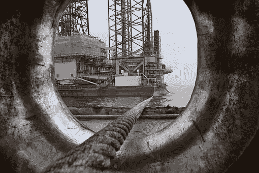
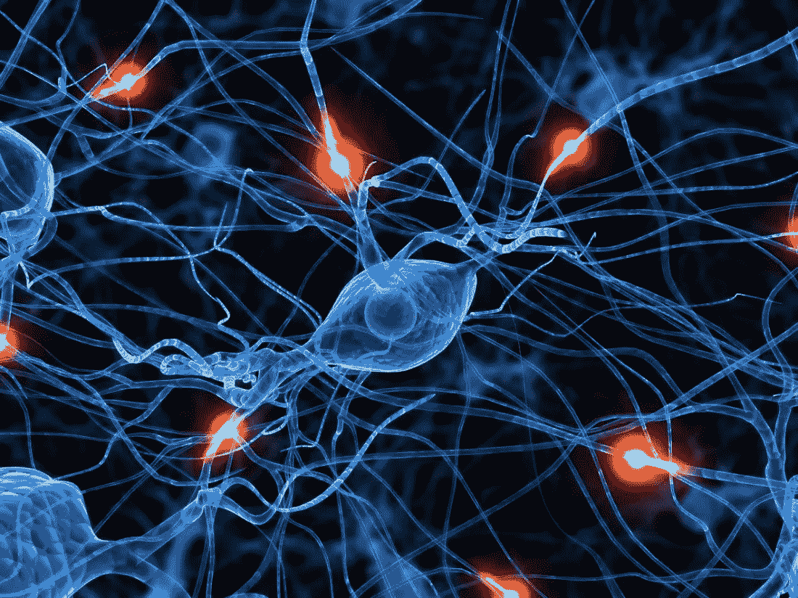
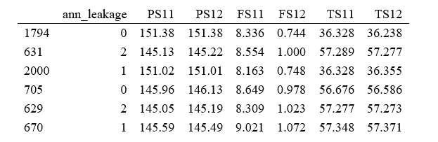
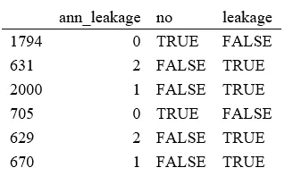
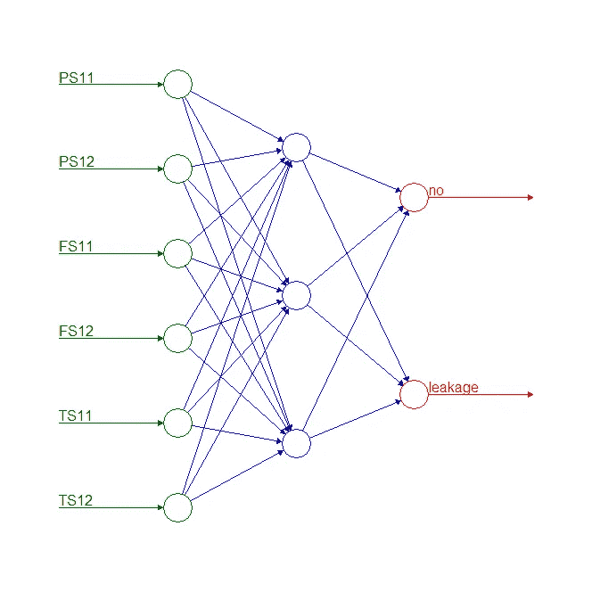
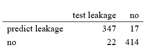

# 使用人工神经网络进行更好的预测性维护

> 原文：<https://towardsdatascience.com/better-predictive-maintenance-using-ann-322752ea3fc5?source=collection_archive---------23----------------------->

## 使用机器学习减少资产密集型行业停机时间的数据科学方法。

不同类型的维护策略已在石油和天然气行业得到广泛应用。当今的石油和天然气行业可以利用数据科学或机器学习，而不是依赖旧的维护实践来更好地预测设备故障和进行根本原因分析。维护活动可以大致分为三大类:纠正性、预防性和预测性维护。纠正性维护是指设备停机后的修理工作。预防性维护是基于一定的定期间隔，以防止设备故障发生。预测性维护依靠工程工具和统计分析来处理数据和分析设备的健康状况。状态监控也是一种预测性维护的形式，它依靠设备传感器数据来预测任何故障。



石油钻塔，通过 [pixabay](https://pixabay.com/photos/oil-drilling-petrochemical-industry-4663237/)

## 商业案例研究和信息收集

石油和天然气公司有一个复杂的机械系统，如巨大的开采平台和数千公里的液压系统来运输产品。保证这个结构的完美运转不是一件容易的事情。石油和天然气公司花费数百万美元的维护成本来保持他们的设备全天候运行。使用更好的数据分析方法，他们不仅可以降低维护成本，还可以将资产生产率提高许多倍。在本文中，我们将讨论并展示一个真实场景，其中液压系统数据用于训练机器学习模型，以便更好地预测设备故障。


钻机，通过 [pixabay](https://pixabay.com/photos/oil-rig-scotland-cromarty-firth-3789758/)

液压系统中的监控传感器捕捉压力、体积流量和温度等测量值。该传感器以微小的周期收集这些信息(例如，每 60 秒)

这些提取产生了一个巨大的时间序列原始数据集，有数千甚至数百万个观察值！这些数据被计算机用来预测这些系统的故障。监控减少了停机时间和维护成本，并允许预防性健康检查。

## R 中的模型构建

有各种各样的模型可用于收集数据。一个强大的是神经网络，或者更准确地说，人工神经网络(ANN)。这个名字多好玩啊！如果你想象一些突触发生的大脑活动，你并没有完全错。



via pixabay

这个名字来自于一个想法，即一个独特的神经元本身就是一个相当复杂的结构，但当我们将数千个神经元连接在一起，联系所有的连接和这种相互作用中发生的信息交换时，这种结构变得非常复杂，大脑可以做不可思议的事情。


via [pixabay](https://pixabay.com/illustrations/robot-artificial-intelligence-woman-507811/)

在机器学习环境中，人工神经元网络可以用于回归或分类问题。请记住，我们可以将机器学习分为两组，回归模型和分类模型。他们只是通过感兴趣变量的类别来区分它们。回归模型:输出是一个连续变量。分类模型:输出是分类变量(离散的)。

所以，我们去工作吧！

干得不错。

```
#The ann_leakage data frame contains data from a sensor installed on #a hydraulic system in an oil and gas company. Take a look!kable(head(ann_leakage[,-(8:9)]))
```



泵泄漏数据片段

如果没有泵泄漏，变量 ann_leakage 为 0；如果是轻微泄漏，变量 ann _ leakage 为 1；如果是严重泄漏，变量 ann _ leakage 为 2。PSxx 代表压力测量，FSxx 代表体积流量测量，TSxx 代表温度测量。每个变量我只取 2 个属性。

## 模型评估和验证

为了研究神经网络，我们可以将过程分为 4 个步骤:

1.将分类变量转换成二元变量；

2.将数据分成训练集和测试集；

3.训练数据；

4.测试数据。

好吧，你觉得这听起来很专业吗？别担心，我会分别解释每个步骤。

**第一步:**将分类变量转换成二元变量

范畴变量描述事物的特征。例如，在石油和天然气公司的液压系统中，分类变量可能是内部泵泄漏，这是公司工程师的当务之急。我们可以把这个问题分为三类:不漏；弱泄漏；严重弱泄漏。

因此，为了评估其中一个的概率，我们必须设置一个二元变量，如果它是感兴趣的类别，则为 1，否则为 0。这样，我们就有了输出变量。

```
#One should transform the ann_leakage variable into binary #variables. To predict just pump leakage I join weak and severe pump #leakage in the same variable.ann_leakage <- profile[,3]
ann_leakage <- cbind(ann_leakage, PS1[,1:2], FS1[,1:2], TS1[,1:2])
ann_leakage <- cbind(ann_leakage, ann_leakage$ann_leakage == 0)
ann_leakage <- cbind(ann_leakage, ann_leakage$ann_leakage >= 1)

colnames(ann_leakage)[8] <- “no”
colnames(ann_leakage)[9] <- “leakage”

kable(head(ann_leakage[,c(1,8,9)]))
```



**第二步:**对数据进行子集化

我们必须将数据集分成两组。首先，我们执行一个测试模型，告诉数据它将如何处理数据。另一组，训练组，用于验证模型在预测输出时是否有效。

```
#shuffle the data. subset into training and test sets
set.seed(2403)
redux <- sample(nrow(ann_leakage), 2000)
ann_leakage <- ann_leakage[redux,]

#scaling data

ann_leakage <- cbind(scale(ann_leakage[,-(c(8,9))]), ann_leakage[,c(8,9)])

n <- nrow(ann_leakage)
ntrain <- round(n*0.6) # 60% for the training set
tindex <- sample(n, ntrain) # create an index
train_ann <- ann_leakage[tindex,] # create training set
test_ann <- ann_leakage[-tindex,] #create test set
```

神经网络模型是一种非线性回归，使用数据中变量的线性组合作为其自变量。尽管有这个花哨的名字，人工神经网络(ANN)可以用这个简单的短语来定义。现在看起来没那么复杂了吧？

**第三步:**训练数据

训练数据意味着告诉计算机它将如何处理数据，以及它将如何将输入(传感器测量)与输出(来自泵泄漏类别的二进制变量)相关联。我们可以使用神经网络规范来做到这一点。

```
#training the data set using the training dataset
library(neuralnet)
ann <- neuralnet(no+leakage ~ 
PS11+PS12+FS11+FS12+TS11+TS12,
data = train_ann, hidden = c(3)
stepmax = 1e+05, threshold = 0.3)

plot(ann, show.weights = FALSE, col.entry = “darkgreen”,
col.hidden = “blue”, col.hidden.synapse = “blue”, col.out = “red”, col.out.synapse = “red”,
col.entry.synapse = “darkgreen”, intercept = FALSE, information = FALSE)
```



人工神经网络图

圆圈是神经元，箭头是突触。绿色是输入，蓝色是隐藏层(神经元)，红色是输出。

**第四步:**测试数据

一旦我们执行了模型，我们就获得了相关的参数。现在，我们必须使用不同的输入数据集(测试集)来预测值，并将预测模型的结果与测试集中的输出变量进行比较，测试集中的输出变量称为混淆矩阵，它计算模型正确预测了多少次以及模型错过了多少次预测。

```
#Validate the model by predicting using the test data set

predict <- neuralnet::compute(ann, test_ann[-1])
predict <- predict$net.result#create a vector containing the response variables predcited
#by the neural network and create a confusion matrix
#to check the accuracy of the model

pred_idx <- function(x) {return(which(x == max(x)))}
idx <- apply(predict, c(1), pred_idx)
predict_leakage <- c(“no”, “leakage”)[idx]

library(expss)test_leakage <- if_else(test_ann[,”leakage”] == TRUE, “leakage”, “no”)
xtab <- table(predict_leakage, test_leakage)
library(knitr)
kable(table(xtab, 1))
```



混淆矩阵输出

这样我们就能计算出准确率，也就是正确预测的百分比。因此，在这种情况下，模型预测 94 %的泵泄漏。它非常准确，非常有趣，不是吗？

**结论**

由于油价下跌，石油和天然气行业现在正在为生存而挣扎。机器学习可以用于预测设备故障，而不是使用依赖于 OEM 手册和最佳实践的老式方法来预测设备故障。人工神经网络模型的预测强调主动维护，并提供进行检查的正确时间。人工神经网络通过触发的传感信息捕获可能的原因，如设备故障事件的时间线、原因、持续时间和设备的相关性信息。通过先进的系统维护，可以消除计划外的设备故障，从而提高利润和生产率

## 参考

1.Gutierrez DD (2015)机器学习和数据科学:统计学习方法介绍，R. Technics 出版社。有限责任公司。

2.Hastie T，Tibshirani R，Friedman J (2013)统计学习的要素:数据挖掘、推理和预测，第二版。

3.Helwig N、Pignanelli E、Schutze A (2015)使用多元统计对复杂液压系统进行状态监控。2015 年 IEEE 国际仪器仪表和测量技术会议(I2MTC)论文集

4.Nikolai Kelwig、Eliseo Pignalli、Andreas Schutze (2015)检测和补偿液压状态监控系统中的传感器故障。2015 年 AMA 会议—2015 年传感器会议和 2015 年 IRS2 会议