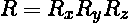
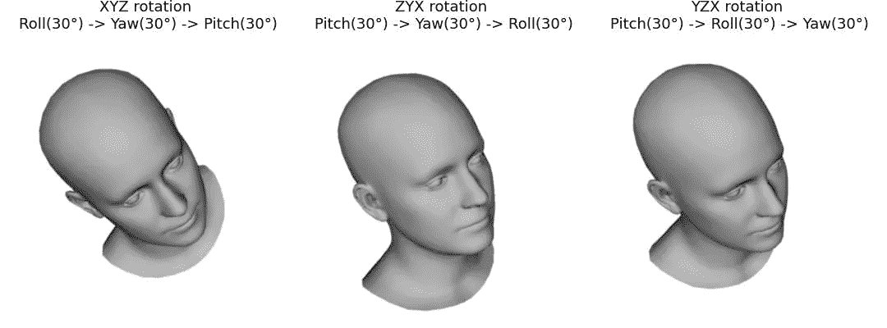
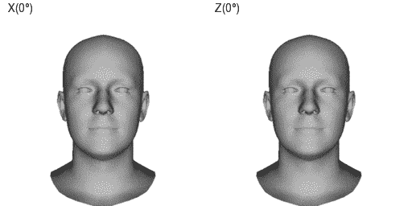

# 用于精确姿态估计的更好的旋转表示

> 原文：<https://towardsdatascience.com/better-rotation-representations-for-accurate-pose-estimation-e890a7e1317f?source=collection_archive---------9----------------------->

## [实践教程](https://towardsdatascience.com/tagged/hands-on-tutorials)

由[斯特拉·雅各布](https://unsplash.com/@stella_jacob?utm_source=medium&utm_medium=referral)在 [Unsplash](https://unsplash.com?utm_source=medium&utm_medium=referral) 上拍摄的照片

我们用旋转来描述一个刚体的方向和运动，它可能是一个机器人，一辆汽车，一艘宇宙飞船或一个玩虚拟现实游戏的人。因此，旋转是一个非常基本的事情，因此应用的数量是巨大的，与旋转一起工作的现代技术经常出现在日常生活中。例如，当你玩游戏时，虚拟现实技术会估计你的头部方向，以确定你在虚拟 3D 世界中的方向。当你在摄像机前表演时，不同的 AR 应用程序可以让你看起来像一个著名的电影角色或以某种方式改善你的外观，也可以调整你的头部位置和方向。因此，这些应用程序和用户体验的质量很大程度上取决于头部姿态估计性能。

为了改进现有技术，已经吸引了大量的研究注意力，并且除了现有的旋转表示之外，已经提出了几种旋转表示来应对不同的挑战。例如，广泛使用的欧拉角表示法似乎不太适合于回归任务，因为这种表示法通常存在奇异性。一些研究工作采用四元数进行回归，它没有奇异性，但有对跖问题。此外，已经表明，任何少于五维的 3D 旋转表示都是不连续的，这使得它们更难学习。我们将进一步简要回顾不同的旋转参数化及其问题，然后进行一些实验，以了解它们如何影响深度学习模型的回归性能。

# **旋转矩阵**

每个旋转可以用旋转矩阵唯一地描述。让我们进一步假设我们谈论的是 3D 旋转。那么旋转矩阵 R —是一个特殊的正交 3×3 矩阵，其行列式等于*1*。

我们可以用乘法来组合旋转，得到的矩阵仍然是一个旋转矩阵，换句话说，所有的旋转矩阵在乘法运算下形成 *SO(3)* 群。 *SO(3)* 群覆盖了 3D 中所有可能的关于原点的旋转。

使用旋转矩阵，我们有九个参数来表示 3D 中的单个旋转，这与其他参数相比是过多的。如果我们想学习用反向传播来回归这些参数，那么我们必须加强正交约束，否则，我们将在推断过程中获得与旋转矩阵不同的东西，并且不能执行纯旋转。

旋转矩阵的另一个问题是它们不直观。总的来说，单纯看矩阵是不容易理解矩阵在做什么的。这就是为什么欧拉角有时更有利。

# **欧拉角**

借助于围绕三个独立轴的三个连续的基本旋转，欧拉角可以表示从 *SO(3)* 的任何旋转。根据欧拉角旋转所围绕的坐标轴，有三个不同的函数用于计算元素旋转矩阵:

给不同轴周围的角度起个有意义的名字很方便，比如偏航角、俯仰角和滚转角。在头部方向的情况下，偏航角度控制向左或向右看，俯仰-向上或向下看，滚动-将头部向左或向右倾斜到肩部。

作者制作的动画

## 旋转顺序

我们可以使用矩阵乘法将这三个围绕不同轴的基本旋转组合起来，以获得单个旋转矩阵:

矩阵乘法是不可交换的，同样的事情也适用于旋转。因此，应用三个连续元素旋转的顺序很重要，如果我们改变它，我们会得到一个不同的旋转。三个元素围绕三个不同的轴旋转，我们有六种可能的相乘顺序，这可能会带来很多混乱。许多数据集使用偏航、俯仰、滚动角度进行标注，但并非所有数据集都明确提到了顺序。如果我们为所有三个(偏航、俯仰、滚转)角度分配相同的值，但每次遵循不同的顺序，我们将获得不同的结果，如下所示。

作者图片

此外，让我们在下面的动画中看到这一点，你可以注意到，以两种相反的顺序绕 XYZ 轴旋转会产生不同的结果。不管我们是绕固定轴旋转还是绕运动物体轴旋转，这都无关紧要，因为 XYZ 绕世界固定轴的外旋等价于 ZY 绕运动物体轴的 x 轴内旋。这也有点令人困惑，但是你可以找到更多关于这两种可能的解释方式的信息，包括这个[链接](https://en.wikipedia.org/wiki/Davenport_chained_rotations)后面的等价证明。

作者制作的动画

当您开始处理包含带有角度注释的图像的多个数据源时，确定正确顺序的过程变得繁琐且容易出错，尤其是在我们处理小旋转的情况下，因为在这种情况下，所有旋转顺序看起来都彼此相似。

在特定的情况下，我们可能不需要模拟全范围的运动，因为解剖学上头部旋转的三个角度是有限的，并且欧拉角很容易允许我们限制自由度。对于我们应用程序来说，只需为偏航角设置-60 到 60 度的范围，为俯仰和滚动设置-30 到 30 度的范围就足够了。在这种情况下，训练将是直接的，因为我们可以使用简单的成本函数，如绝对误差或均方误差来训练模型，并获得良好的结果。

## **欧拉角限制**

一般来说，我们可能希望考虑更大范围的旋转，例如，在不估计身体姿势的情况下，在 VR 中表示肩关节旋转或头部方向。在这种情况下，你可能无法避免欧拉角的问题。当第二基本旋转达到 90 度(或-90 度)时，则第一和第三轴变得平行(即线性相关)，这为相同的旋转提供了无限数量的解。

作者制作的动画

在上面的动画中，我们可以看到当中间角度接近 90 度时，头部如何停止移动，然后完全锁定在同一位置。这种行为也被称为 ***万向锁定*** 。为了回归的目的，当中间角度变成 90 度时，我们可以通过将第一个或第三个角度设置为零来排除这种情况。但是在第二个旋转角度达到 90 度之前很久就有问题了。事实上，随着中间角从 0 度增加到 90 度，其他两个角变得越来越“依赖”。当中间角度为 80 度时，尽管第一个和第三个角度像在第一个动画中一样快速变化，但头部移动缓慢。如果我们看看最左边的动画，我们会看到开始的头部方向*俯仰(0)–偏航(0)–滚转(0 )* 和最终方向*俯仰(90)–偏航(0)–滚转(90 )* 看起来非常不同。但是，在中间的动画中，两个不同的方向:*俯仰(0)~偏航(80)~滚转(0 )* 和*俯仰(90)~偏航(80)~滚转(90 )* 给出了相似的结果，尽管在这两种情况下起始角度和最终角度之间的欧几里德距离是相等的。因此，在一般情况下，我们不能依赖于在这个表示空间中测量的距离。此外，由于一个旋转可以用不同的欧拉角以多种方式描述，我们不能像对四元数那样应用对动画如此重要的平滑和平均。

# 四元数

四元数是表示旋转的简洁方式，它们有*四个*参数，可以解释为一个标量分量加上一个三维矢量分量:

在计算机图形中，四元数经常被用来执行计算高效的旋转和漂亮的插值。与欧拉角不同，四元数不存在万向节锁问题，但仍然存在由反脚掌对称性引起的歧义: **q** 和 **-q** 对应相同的旋转，换句话说，四元数双覆盖 *SO(3)* 群。人们可以试图避免这种模糊性，并通过将标量分量限制为正来将四元数限制在一个半球，但是[如](http://robotics.stanford.edu/~asaxena/learninggrasp/learning3dorientation_nipsworkshop2007.pdf)所示，相似的方向在表示中仍然很远。

此外，最近[证明了](https://arxiv.org/abs/1812.07035)对于 3D 旋转，所有表示在四维或更少维的真实欧几里得空间中是不连续的，并且经验结果表明连续表示优于不连续表示。这意味着欧拉角、四元数、指数图、轴角表示可能不太适合回归任务。作为替代方案， [5D](https://arxiv.org/abs/1812.07035) 、 [6D](https://arxiv.org/abs/1812.07035) 和[基于向量的](https://arxiv.org/abs/2010.07184)表示法已经被提出作为连续的替代方案。

# 从旋转矩阵到 6D 表象

旋转矩阵是 *SO(3)* 的连续表示。如前所述，如果我们想使用旋转矩阵进行回归，那么我们需要加强它们特殊的正交特性。实现这一点的一种方法是采用 Gram-Schmidt 过程并从两个向量构造正交基。在这种情况下，预测的噪声矩阵的一行或一列将在该过程中被丢弃。因为三个参数是无用的，我们可以预测六个参数并根据它们重建旋转矩阵。因此，将旋转矩阵的两列作为回归目标，并且网络配备有 Gram-Schmidt 正交化过程，这就是我们如何有效地得到连续的 6D 表示。如果神经网络输出两个向量 ***v1*** 和 ***v2*** ，则可以得到三维旋转矩阵如下:

在网络中进行 Gram-Schmidt 处理比我们将其作为后处理来应用会产生更低的错误。这也不妨碍我们把这个网络作为某个更大网络的一部分，因为这个过程本身是可微的。为了说服我们自己，具有连续性在实践中是有益的，我们将在下一节进行实验，比较欧拉角、四元数和连续 6D 表示。

# 实验

让我们通过随机采样不同的旋转来创建一个数据集，并将它们应用于预定义的三个正交向量集，我们也称之为初始轴或基。我们的数据集包含旋转轴和各种表示形式的相应旋转。然后，我们为每种表示定义一个多层网络，除了最后一层的输出神经元数目不同之外，它们共享相同的体系结构。神经网络将旋转轴作为输入，并预测初始轴和旋转轴之间的旋转。下面是演示我们如何获得训练数据的代码。

接下来，我们需要为每个表示和度量定义损失函数，以比较模型性能。欧拉角以 2π弧度环绕，有多个值表示同一个角度。为了解决这个问题，我们可以定义一个分段损失函数，并使用绝对差而不是平方差，以避免在万向锁定可能发生的全范围旋转的一般情况下产生较大的损失。

至于四元数，我们不将它们限制在一个半球，而是在损失函数中解决对映问题，因为在我的实验中，两种解决方案表现出非常相似的性能。我们也可以使用*测地线*或*相对角度*距离作为成本函数，但简单的 *L1 范数*，应用于地面真实单位四元数和预测归一化单位范数四元数之间的差异，似乎在这个实验中表现更好。

最后，我们简单地使用真实向量和预测向量之间的平均绝对误差来表示 6D:

为了测量性能，我们使用三个矢量的地面真实旋转集 **u** 和 **v** 之间以度数测量的平均角度距离，这是使用来自网络的预测参数旋转的初始矢量集。

下面是我们如何使用张量流定义这些损失函数:

我将跳过添加所有实现细节的部分，因为对于这篇文章来说这有点多余，但是你总能在我的 [github](https://github.com/kostyaev/rotation_representations) 上找到完整的实现。

## 性能赋值

在第一个设置中，我们将欧拉角性能与其他表示进行了比较，情况是将旋转限制在-45 度到 45 度的小范围内。我们将 80%的数据用于训练，20%用于验证。结果显示在下图中。

在这种情况下，欧拉角，实际上，与四元数和 6D 表示有着非常相似的表现。但是，如果我们将角度域增加到 90 度，欧拉角将开始表现得比四元数和 6D 差。

最后，我们使用从-180 到 180 度全范围旋转，我们看到 6D 表示明显优于四元数。然而，这两种表示都比欧拉角表现得好得多。事实上，欧拉角表现很差，我们需要单独绘制评估结果，以清楚地看到其他两种表示性能之间的差异。

当我们开始使用全范围旋转时，四元数和 6D 表示之间的性能差距可以用以下事实来解释，即四元数在 180 度具有不连续性。我们也可能认为学习四元数需要更多的参数来缩小差距。但是如果我们加倍网络容量或增加更多层，性能将是相同的，平均角度误差在 2 度左右波动。

# 结论

不同的表示服务于不同的目的。对于旋转估计，经验证据表明，我们应该选择在域中连续的表示。在特定情况下，欧拉角可能是合适的，但必须非常小心地使用它们，并考虑它们的局限性，以及旋转顺序混乱可能导致的错误。

# **附加链接:**

1.  [Code/IPython 笔记本](https://github.com/kostyaev/rotation_representations)(作为额外的可视化代码也一并提供)。
2.  [火焰](https://flame.is.tue.mpg.de/home)三维头部模型用于旋转可视化。