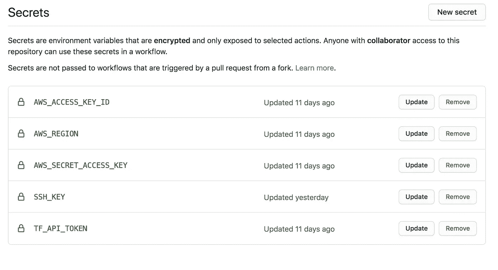

# 无服务器替代方案:使用 AWS、Terraform 和 Github 操作执行 Python 函数

> 原文：<https://towardsdatascience.com/better-than-serverless-executing-python-functions-with-aws-terraform-and-github-actions-9967509b030f?source=collection_archive---------16----------------------->

## 自动化 Python 函数的部署和执行，而无需担心包的大小、执行时间或可移植性


[亚历山大·奈特](https://unsplash.com/@agkdesign?utm_source=medium&utm_medium=referral)在 [Unsplash](https://unsplash.com?utm_source=medium&utm_medium=referral) 上拍照

什么比无服务器更好？无服务器现在很流行，这是有原因的。Serverless 是一个简单而强大的云资源，可以执行函数调用，而无需担心底层基础设施。但是每个超级英雄都有他们的克星，最近，我遇到了一些关于 AWS Lambda 无服务器功能的问题:

1.  **包大小限制:**我的 Python 依赖项超过了 50 MB 压缩(和 50 MB 未压缩)大小限制。
2.  执行时间限制:我的 Python 函数花费的时间超过了 15 分钟的限制。
3.  **缺乏可移植性:** AWS Lambda 函数不容易*移植到其他云供应商。*

显而易见的替代方法是提供一个 EC2 实例来安装依赖项并执行函数， ***，但是我不希望服务器一直开着*** 。时间就是金钱，全天候运行的 EC2 实例需要花费金钱。 ***我不想管理部署，手动打开和关闭实例，执行函数*** 。 ***我还希望有功能的可移植性，以防我想在不同的云中部署这个功能。***

***最后，我想自动化提供 EC2 实例、执行 Python 函数，然后销毁 EC2 实例和所有底层基础设施的过程。*** (如果你只是简单的关闭 EC2 实例，你会继续为卷付费)。进入 Terraform 和 Github 工作流程。

Terraform 和 Github Workflow 是任何现代 DevOps 或云工程师构建和部署应用程序所需的工具。Terraform 快速配置云基础设施来执行该功能。Terraform 脚本也可以通过改变所使用的服务轻松地移植到其他云供应商。Github 工作流管理部署。我们还使用 Github 存储库来保存 Github Workflow 使用的所有 Terraform 和 Python 代码。

以下是我运行 Github 操作的视频，展示了该功能是如何执行的，以及 Terraform 如何在 AWS 控制台中进行更改:

Github 工作流使用 Terraform 部署 AWS 基础架构并执行 Python 函数

# 大纲:

1.  AWS 设置
2.  地形脚本
3.  Github 秘密
4.  Github 工作流 YAML 设置
5.  执行 Python 函数
6.  结论

## AWS 设置

第一步是设置 AWS，这样我们就有了正确的用户权限和密钥对，用于以后的 Terraform 脚本编写。这里就不太深究用户权限了。对于本教程，我只是在 IAM 中创建了一个新用户，并给了我的用户管理权限(我不推荐这样做；您应该始终为用户提供用户完成任务所需的最少量的访问权限)。将访问密钥和秘密密钥复制到某个地方，以便在本教程的后面使用。

接下来，您希望创建一个 PEM 密钥，用于 terraform 脚本和 Github 工作流访问 AWS。在 AWS 服务主页上，选择“EC2”。在控制台的左侧，选择“密钥对”。在屏幕的右上角，有一个“创建密钥对”的按钮。输入密钥的名称，并选择“PEM”作为文件格式。最后，点击“创建密钥对”按钮来创建 PEM 密钥。您的浏览器应该会自动下载私钥。把这个钥匙放在容易拿到的地方，因为它是整个过程的一部分。

您还需要与您的私钥相对应的公钥。为此，请打开终端，将目录(cd)更改为私钥的位置，并运行以下脚本:

```
*ssh-keygen -e -f aws_private_key.pem > aws_public_key.pem*
```

这个脚本的结果应该输出相应的公钥。您可以将它复制到您喜欢的代码文本编辑器中。这个公钥以后会很重要。

> 注意:我建议在运行 Terraform 脚本之前测试密钥，方法是创建一个 EC2 实例，并尝试使用我们刚刚在 AWS 中创建的 PEM 密钥 SSH 到该实例。

## 地形脚本

现在我们已经正确配置了 AWS，我们可以创建 Terraform 脚本来提供执行 Python 函数所需的资源:

请注意，我们包括了一个并不真正需要的 S3 桶，但是我想提供一些额外的脚本，以防这个资源适用于您的项目。还要注意，我们在上一步中创建的公钥可以输入到“<the rest="" of="" your="" public="" key="">”中。出口和入口规则是不安全的，它们允许任何具有有效凭证的人连接到实例。但是由于本教程的目的是提供一个例子，所以我还没有正确配置安全性。我选择了一个随机的 AMI，但是要确保为您的工作负载找到正确的映像。</the>

> 注意:我建议在创建 Github 工作流之前，在您的本地机器上测试运行 terraform 脚本。在成功初始化 Terraform 之前，我在 Mac 桌面上创建了一个文件夹，并在 Bash 配置文件中添加了 Terraform 可执行文件的路径。您可以在您的终端上运行本教程稍后定义的与 Terraform 相关的 Github 工作流操作。请[使用此链接安装 Terraform](https://www.terraform.io/downloads.html) 。

```
export PATH=/path/to/terraform/executable:$PATH
```

> 注意:如果你对 Terraform 完全陌生，我推荐[这个关于 Terraform 的 LinkedIn 学习课程](https://www.linkedin.com/learning-login/share?forceAccount=false&redirect=https%3A%2F%2Fwww.linkedin.com%2Flearning%2Flearning-terraform-2%3Ftrk%3Dshare_ent_url&account=42751868)。

## Github 秘密

在使用 Github 工作流运行 terraform 脚本之前，我们需要用一些与 AWS 和 Terraform 相关的键来设置 Github secrets。以下是我的秘密的截图:



我的 Github 回购秘密

“SSH_KEY”秘密包含在 EC2 控制台上创建密钥对时自动下载的私有 AWS 密钥。您可以通过输入以下命令来输出私钥值:

```
cat aws_private_key.pem
```

所需的“TF_API_TOKEN”密钥是用于 Github 工作流将用来执行脚本的 Terraform API 的。使用[此链接](https://www.terraform.io/docs/cloud/users-teams-organizations/api-tokens.html)访问 Hashicorp Terraform API 令牌(您可能需要创建一个帐户)。

## Github 工作流 YAML 设置

既然我们的 Github 秘密已经正确配置，我们可以在 Github 工作流中创建 YAML 文件:

在高层次上，当这个 YAML 在 Github 存储库的新推送上执行时，一个新的“runner”被创建，这是在 Github 主机上新创建的虚拟环境，它“运行”在您定义的操作系统上。然后它寻求并行完成 ***定义的所有“作业”*** 。在这种情况下，我只有一个作业，因此所有的“步骤”(由“动作”组成)都按顺序完成*。每个“步骤”都建立在另一个步骤的基础上，这意味着在前面步骤中所做的任何更改都可以被未来的步骤所访问。现在，每个“步骤”中完成的一些“操作”使用了预定义的操作，这些操作是由其他人创建的，可以导入。在本教程中，我使用了 4 个动作。Github 工作流语法令人困惑。我建议花些时间理解我引用的关键术语。*

> *注意:这是对 Github 动作的一个很好的介绍。我还推荐 LinkedIn Learning 上的这个 Github Actions 课程[。](https://www.linkedin.com/learning-login/share?forceAccount=false&redirect=https%3A%2F%2Fwww.linkedin.com%2Flearning%2Flearning-github-actions-2%3Ftrk%3Dshare_ent_url&account=42751868)*

*YAML 文件命令非常密集 ***，所以我将从顶部开始向下关注代码的一些细微差别和特性*** :*

*   *在第 42 行，我们必须更改密钥的权限，以便以后将它们用于 SCP 和 SSH。*
*   *在第 53 行，我们必须将私钥导入 Terraform，然后才能在 AWS 上提供基础设施。*
*   *在第 59 行，我使用“自动批准”来自动创建基础架构。如果您尝试在没有“自动批准”的情况下运行此命令，终端需要“是”来创建基础架构。*
*   *在第 62 行和第 65 行，我们正在设置未来步骤中需要的环境变量。第 62 行的命令以 JSON 格式存储 Terraform 创建的基础设施。然后，第 65 行的 Python 脚本遍历 JSON 文本，并为 EC2 公共 ip 地址创建一个变量，稍后我们将使用 SSH 访问这个变量。每次我们运行这个工作流时，都会创建一个具有不同公共 IP 地址的新 EC2 实例。因此，我们需要一个脚本来获取公共 IP 地址，稍后我们将 SSH 和 SCP 连接到这个地址。*

*以下是我在 YAML 中称之为“tf_parse.py”的 Python 脚本:*

*   *第 71 行可能有很多令人挠头的地方。为什么会有人给工作流程增加时间？这花了我最长的时间来调试。我的假设是，一旦 Terraform 完成了基础设施，我就可以对实例使用 SSH 和 SCP。 ***我错了。在运行后续命令之前，您需要一些时间来初始化 EC2 实例。我增加了 20 秒，但这可能需要更多或更少的时间，具体取决于您所调配的实例类型。****
*   *在第 78 和 79 行，我添加了一些额外的参数来防止终端请求授权来添加主机名。如果您喜欢更好的可读性，可以使用以下函数:*

> *注意:通过在 YAML 文件中输入以下命令来使用上述函数:*

```
*sshtmp -i *aws_key_pair.pem* [*ec2-user@ec2-$aws_compute_public_ip.compute-1.amazonaws.com*](mailto:ec2-user@ec2-$aws_compute_public_ip.compute-1.amazonaws.com)*
```

*   *最后，第 83 行的命令防止 Terraform 在下一步中破坏 aws_key_pair。[这里有一个有用的资源](https://stackoverflow.com/questions/55265203/terraform-delete-all-resources-except-one#:~:text=It%20doesn't%20destroy%20the,It%20will%20destroy%20the%20rest.)输出所有的地形状态，以防你想防止其他资源的破坏。*

## *执行 Python 函数*

*Python 函数正在 AWS EC2 实例 的第 80 行 ***上执行。对于本教程，我正在执行一个基本的 Python 函数，但是没有限制。如果您想在运行脚本之前安装一些依赖项，请查看我上一篇关于在 AWS 上创建 CI/CD 管道的文章中的 YAML 文件的第 50 行及以上内容。****

> *注意，依赖项需要安装在 EC2 实例上，而不是 Github 工作流“runner”上。*

## *结论*

*本教程展示了如何使用 AWS、Terraform 和 Github 工作流自动部署和执行 Python 函数。我们强调了无服务器功能的一些问题，以及这种工作流程如何成为合理的替代品。然而，重要的是要记住，我们为 Terraform 启动的 EC2 实例运行的时间付费。与简单地执行无服务器功能相比，使用 Terraform 提供实例和运行功能也需要更长的时间。请记住，每次我们想要执行该功能时，我们都必须提供底层基础设施。*

*我更喜欢 Terraform 和 Github Worflow 的另一个原因是因为 AWS Lambda 函数缺乏可移植性。一旦使用了 Lambda 函数，就很难将它转移到其他地方。这部分是由于 Lambda 函数返回、Lambda 处理程序、层和其他配置的语法限制。此外，利用 AWS API Gateway 来调用该函数进一步阻止了向其他云供应商的移植。Terraform 使得在另一个云厂商中找到相应的服务和部署工作流变得更加容易。无服务器功能仍然是在云中创建可伸缩服务的强大工具，但也有明显的缺陷和缺点。*

*这种基础设施创建和部署的结构还能带来哪些可能性？用这个工作流管理不频繁的、对时间不敏感的服务怎么样？通过对本教程的一些修改，我们为应用服务器、负载平衡器、S3 存储桶创建并部署底层基础设施，然后在服务完成时销毁这些实例。这对于任何拥有大型数据密集型应用程序、寻求有效方法来降低开发和测试环境甚至生产成本的初创公司来说都可能是至关重要的。*

*[](https://www.buymeacoffee.com/arshyasharifian)*

## *子堆栈:*

*我最近创建了一个[子栈](https://arysharifian.substack.com/)来学习如何用 Python 编程和解决 LeetCode 问题。*