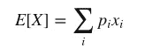
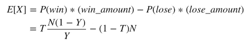
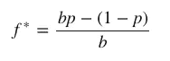

# 最优下注

> 原文：<https://towardsdatascience.com/betting-optimally-29f283d96669?source=collection_archive---------20----------------------->

## 赌博时使用凯利标准来衡量你的赌注

理查德·博伊尔在 [Unsplash](https://unsplash.com?utm_source=medium&utm_medium=referral) 上拍摄的照片

# 介绍

下注时，人们经常犯天真的错误，每次都试图选择获胜的一方，而不考虑支付金额或赔率。

然而，为了最大化赢款，假设一个人有足够的钱下注多次，那么特定的赌注是赢还是输就无关紧要了。相反，你需要考虑下注的期望值。

有很多情况下，一个赌注可能会导致一个胜利，但会有一个负的期望值，所以从长远来看，这种行为会导致净损失。

这种思维模式可能有点反直觉，所以回顾一下这种方法论背后的数学(关于概率)是很重要的。

# 预期值

简单地说，一个随机变量的 [**期望值**](https://en.wikipedia.org/wiki/Expected_value) 是它所参与的实验的大量重复中的平均值。

这在数学上表示如下，其中`x_i`是`X`的潜在值，`p_i`是`X`具有值`x_i`的概率:

现在，要把这个应用到赌博中，我们必须修改这个定义。假设我们有一个单一的二元投注事件，其中该事件是由每一方的投注金额百分比指定的。例如，如果甲方有 30，000 美元，而乙方有 20，000 美元，那么赌注提供的获胜机会将是甲方 60%，乙方 40%。赔率计算为`(1 − P(win)) / P(win)`，或`P(loss) / P(win)`。赔率代表赢得的额外奖金(除初始赌注之外返还的奖金的倍数)。

然而，如果赌注提供的获胜机会是准确的，那么除了纯粹的运气之外，几乎没有其他赚钱的方法。因此，我们假设投注网站至少在某些时候是不正确的，并且我们作为聪明的投注者，能够提出我们自己独立的可能与他们不同的机会。因此，对于我们来说，上面使用的由投注网站提供的`P(loss)`和`P(win)`并不是实际的概率，而只是用于计算中奖金额的数量。

将我们 A 队获胜的“真实”概率表示为`T`，将博彩网站的概率表示为`Y`。在一次赌博活动`X`中，您的资金的预期变化如下，在该活动中，对 A 队下注`N`美元:

上述公式可用于计算多次下注的平均结果。如果它大于 0，你应该下注。

# 一般概念

现在，暂时离开这个公式，让我们从一个直观的角度来看这个问题。这种情况，在最基本的层面上，是在游戏中处理信息。

普通人的信息(由网站的百分比表示)和知情玩家的信息(由你的“真实”百分比表示)之间的差异是这个游戏可以有策略的原因。

如果该网站的百分比总是准确的，或者如果你从来没有任何额外的洞察力，将导致更准确的数字，那么你将只是在一个纯粹的随机事件的摆布。然而事实并非如此，所以我们利用信息的不平衡来从这个博弈中获利。

一般来说，当你觉得赔率不能准确地代表真实的概率时，你应该赌被低估的一方来利用这种不平衡。

# 凯利标准——赌博的数学策略

既然我们有了如何可靠地从下注中获利的要点，我们现在需要一种正式的方法来确定我们的下注规模。负责任的下注规模是必不可少的，因为在高风险的赌注上押得太高可能会让你过早破产，而在安全的赌注上押得太低可能会导致赢的钱太少，以至于不值得冒任何风险。

其中一个策略叫做 [**凯利标准**](https://en.wikipedia.org/wiki/Kelly_criterion) ，这是一个非常简单的公式，可以确定你每次下注的总资金比例。

公式如下，其中`f*`是花费的分数，`p`是获胜的“真实”概率，`b`是赔率乘数:

例如，如果一次赌博有 60%的获胜机会(`p = 0.60`)，并且该游戏者在一次获胜的赌注上获得 1 比 1 的赔率(`b = 1.00`)，那么该游戏者应该从`f* = 0.20`开始在每个机会下他们的钱的 20%。

请注意，当游戏者对提供的赔率没有优势时——当`b = (1-p)/p`时——那么`f* = 0.00`时，游戏者将不下注任何东西，因为没有游戏者对庄家有优势的信息。

## 警告

然而，虽然这实际上是一种数学上正确的下注方式，但大多数理性的人在实践中会使用这个数量的一小部分，因为完整的凯利可能相当危险。在现实生活中，我们没有无限的钱去赌博，所以我们冒着破产的风险。

如果你的个人概率是关闭的，这很可能在某个时候发生，你可以很快失去很多钱。四分之一凯利或更低，是常见的修改，可以使技术更可行。