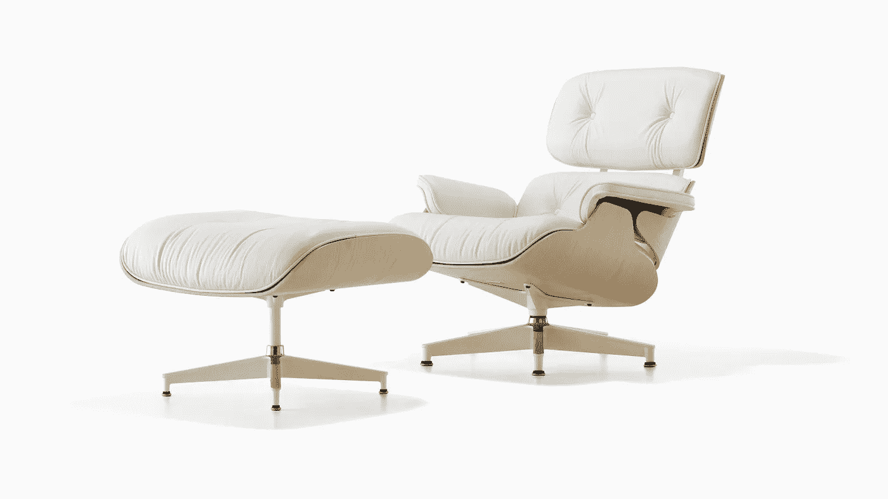
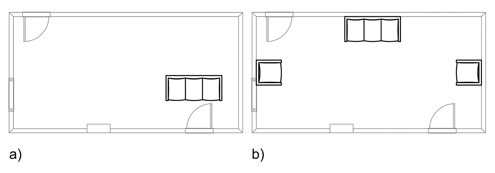
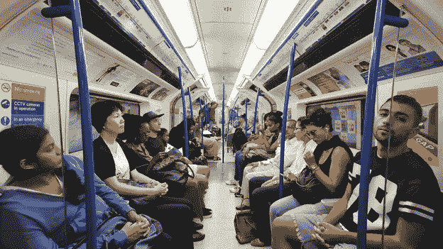
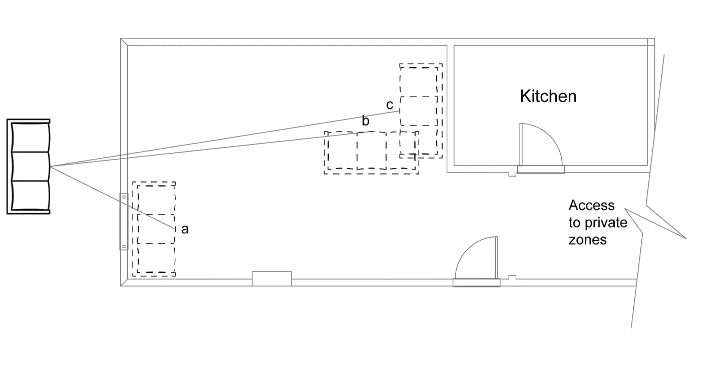

# 在语言和家具之间

> 原文：<https://towardsdatascience.com/between-language-and-furniture-7ce15880f500?source=collection_archive---------52----------------------->

## 你觉得有什么共性吗？

作者图片

几年前，我读到了这两个看似不同的主题，我对我所做的联系感到惊讶，或者也许我当时太无聊了，没有别的事情可做，所以我产生了一些联系的幻觉！

以下思路在某种意义上是我 2017 年在伦敦巴特利特大学学院建筑计算硕士论文的先导。论文探索了使用机器学习和开放大数据来自动化设计任务的可行性。

接下来，我强调了家具的重要性，然后得出家具布局方案和自然语言系统之间的相似之处。声称两者之间的这些相似性可以从不同的角度帮助解决家具布局规划(FLP)问题。

家具布局规划或 FLP 是一个关于在给定空间内为家具寻找最佳组织的问题。

文章最后进行了讨论，提出了如何扩展提出的想法，以及通过应用自然语言处理领域中使用的解决方案来进一步开发的可能性。

## 介绍

在任何建筑项目的设计开发阶段，花费大量时间的任务之一是生成有效的家具布局方案。许多研究探索了生成空间配置的不同技术，这是在空间布局规划的主题下完成的。很少有研究关注家具方案的生成。在任何功能空间的设计过程中，生成这样的方案都是必不可少的一步。大多数当前的 FLP 研究利用穷举搜索算法，产生大量的方案，其中大多数是不合逻辑的，正如 [Abdelmohsen 等人(2017)](https://link.springer.com/chapter/10.1007%2F978-3-319-44989-0_25) 得出的结论。

我们将从自然语言系统和 FLP 问题中得出相似之处，试图调查潜在结构的存在和支配空间内家具元素分布的规则。这篇文章旨在打开一个更广泛的研究框架，从不同的角度解决 FLP 问题。

我认为，研究规范空间内家具元素配置的规则，将成为进一步研究的基础。研究应该仅仅关注于测试这些规则的生成性。找到自然语言和 FLP 之间的相似之处，将允许实现更明智的生成方案，而不仅仅依赖于穷举搜索方法。在开发能够解决任何给定空间的 FLP 问题的工具时，测试使用这些规则的适用性是至关重要的。这将导致在专业背景下避免在 FLP 任务上损失的时间量。

## **作为语言的家具**

> 我感兴趣的语言的定义是语言是一个“对应于不同思想的不同符号系统”[(索绪尔，1959)](https://books.google.co.uk/books?id=B0eB8mvov6wC) 。

索绪尔的定义并没有将语言局限于口语，而是允许这个术语包含手势交流的方法。它甚至开启了讨论 FLP 语作为一种语言的可能性。FLP 的标志被认为是独特的家具元素。

如果我们看看查尔斯·伊姆斯的休闲椅和休闲吧凳，将家具作为能指处理的想法会更加清晰，这两个元素都作为不同意义的能指，每个都象征着不同的舒适、奢华、预期使用时间甚至使用模式的价值。

Eames 躺椅和搁脚凳【HermanMiller.com 版权所有

不仅在将家具视为独立的元素时，而且在考虑多个元素之间的关系以及它们各自与周围空间的关系时，语言系统的相似性都是显而易见的。这两种关系，元素到元素和元素到空间，带来了另一个类比，即语言作为句法和语义[(乔姆斯基，2002)](https://books.google.co.uk/books?id=a6a_b-CXYAkC) 。

空间内家具元素的句法和语义方面在(图 1)中有简要说明。

图一。a)示出了沙发在空间内的语法不正确的位置，而 b)示出了元素的语法正确的位置，但是不一定语义有效。

根据这一类比，我们可以将空间中的家具视为不同实体的集合，每一个都可以像词语一样被视为特定意义的能指。这些实体的集合，就像任何语言中的单词一样，可以在一个空间内被组织成无限不同的方案。这个无限组织的“语料库”像语言一样，可以分为语法正确和语义合理的方案，语法正确但语义无意义的方案，以及最后的语法和语义不合理的方案。

## **家具和住所**

> 在[建筑住宅思考中，海德格尔(2012)](http://www.jstor.org/stable/j.ctt5hhcqm.17) 谈到住宅，他将其解释为一个人感觉像在家里的地方，这并不一定指一个人的房子，因为他举了一个例子“卡车司机在高速公路上是在家里”。

我可以看到居住的概念以不同的尺度呈现，从一个人的房子开始，到一个人的邻居，到城市等等。在这种情况下，另一个有趣的概念是占有以及存在如何与占有的能力相联系 [(Malpas，2006)](https://mitpress.mit.edu/books/heideggers-topology) 。我认为，人们占有周围空间的方法之一，以及空间为占有提供可负担性的方法之一，就是家具。

我们每天都在家里、公共交通工具上、工作场所或大学里，以及闲暇时在餐馆或酒吧里与家具互动。家具是我们日常生活中不可或缺的一部分，它影响着我们与周围空间以及彼此之间的互动。

举两个类似的研究为例，一个记录了人们在伦敦地铁旅行时做的事情，另一个记录了人们在伦敦铁路旅行时做的事情。

第一个发现是，在地下旅行中使用最多的活动是技术使用 [(Gamberini 等人，2013)](http://dx.doi.org/10.1007/s11116-012-9419-4) 。而另一项研究发现，火车旅行期间最喜欢的活动是凝视窗户/观看人群 [(Lyons，Jain 和 Holley，2007)](https://www.sciencedirect.com/science/article/abs/pii/S0965856406000644) 。

如果我们忽略两者之间的差异，就是否有风景可看而言，两项研究都没有考虑的一件事是座位布局，如图 2 所示。

图二。向左。右图显示了伦敦地铁 [(PA，2014)](http://www.itv.com/news/london/2014-08-29/smelly-passengers-and-sneezing-are-commuters-biggest-bugbears-on-the-tube/) 的座位布局。显示了伦敦铁路服务的座位布局 [(Chris Radburn/PA Wire，2014)](http://www.chroniclelive.co.uk/news/north-east-news/getting-seat-important-north-east-7914699) *版权归各自作者所有*

可以注意到，在地铁中，存在着“乘客体验到的团结和距离的冲突感，等待的活动和暴露于‘他者’”[(basso Li 和 Martin，2006)](https://www.researchgate.net/publication/239920051_EXPLORING_IN-BETWEEN-NESS_THE_EXPERIENCE_OF_RIDING_THE_LONDON_TUBE) 。

地铁中的座位布局提供的一种方式是诉诸“缺席在场”，其中“一个人物理上在场，但被别处的技术媒介世界所吸收” [(Gergen，2002)](https://dl.acm.org/doi/10.5555/644547.644562) ，观看人们或仅仅凝视可能会使他人不安。

而国家铁路上的布局，使人们能够在自己舒适的视野中观看他人而不被发现，或者至少认为自己没有被发现，这种视野只包括人们的后脑勺。

这需要进一步的研究，但至少它简单地展示了家具布局如何引导人们进入特定的互动模式。

## **家具的七大功能**

丹尼尔斯(1983)在他的书[《著名的遗言》](https://books.google.co.uk/books?id=n7pqQgAACAAJ)中建立在[韩礼德(1977)](https://books.google.co.uk/books?id=FOGwAAAAIAAJ) 对语言七大主要功能的发现的基础上，当应用到家具上时，相似之处也是显而易见的。

> 他说语言是“工具性的、规范性的、互动的、个性化的、启发性的、富有想象力的和代表性的”。

有助于完成工作，在家具领域，这一点在研究中显而易见，研究表明办公室设计的人体工程学如何提高员工的效率 [(Hammed 和 Amjad，2009)](https://www.researchgate.net/publication/242109623_Impact_of_Office_Design_on_Employees'_Productivity_A_Case_Study_of_Banking_Organizations_of_Abbottabad_Pakistan) 。

监管，试图控制其他人的行为，在家具领域，这是显而易见的，例如，在一个讲座的布局中，将听众的注意力放在站在他们面前的人身上。

互动，对于群体和关系的定义，这可以在非正式的家具布局中看到，在共同工作空间和初创企业中使用，以加强沟通，外向和合作。简单地回到语法和语义部分，如果交互是主要目标，提供一个像教室一样的协作空间在语法上是正确的，但在语义上是不合理的。

个人的，表达自己和传达某些感觉，信仰或陈述，这类似于人们如何有意识或无意识地为自己的家选择家具。

启发式，学习或测试一个假设，类似于监管方面给出的例子，这样的研究需要用不同的组织测试不同的家具，看看人们在某个空间会如何开始行动。

想象一下，语言是如何被用来创造小说的，想象一下一个孩子如何在他的一群朋友面前调整他的椅子或把它举到桌子上来扮演一个国王的角色。

代表性，语言被用来提供信息或传达一个特定的事情，想象你走进教室，你发现椅子被连续地摆放在投影仪前面，想象第二天你发现它们被分成几组，这传达了你一天将如何进行的信息，听讲座或做小组工作/练习。

每一点的例子都有所不同，但从总体上来说，这揭示了语言和家具之间的相似之处。

## **天生的**

在[“句法结构”](https://books.google.co.uk/books?id=a6a_b-CXYAkC)中，乔姆斯基(2002)讨论了人类大脑如何能够学习新语言的想法，但不是通过学习所述语言的所有话语，这是无限的，而是通过一种天生的能力，这种能力允许我们在年轻时辨别语言并开始说，他用这种能力指出语言的潜在生成性。

这种天赋可以通过[希利尔(1998)](https://discovery.ucl.ac.uk/id/eprint/3881/) 如何在我们的大脑无意识地处理配置的能力和我们设法对语言的句法和语义结构做同样事情的方式之间得出相似性来更好地解释。

可以说，这种与生俱来的能力不仅适用于语言，也适用于一般的复杂关系模式。像语言一样，布置空间是许多人可以做的事情，不需要通过方法学教育过程来获得技能。人们设法在家庭中找出需求、传统、信仰和家具布局之间的关系。

例如，在大多数中东家庭中，妇女通常不会求助于专业室内设计师或建筑师来帮助她们布置家居。然而，大多数家庭都存在某些没有被明确教授的特征。例如，由于宗教和传统信仰，一个访客不应该看到房子里的女人，如果她们没有戴面纱。这一标准不仅指导住宅公共区域的布置，而且即使没有以良好的方式完成，它也将决定参观者如何选择他们的座位，如图 3 所示。

这显示了更高层次的设计意图是如何给家具方案增加语义方面的。

图 3。a)将是语义上不正确的选项，而 b)和 c)将被认为是语义上合理的，尽管它们都被认为是语法上正确的。

## **作为方言的家具**

语言和家具之间有趣的相似之处之一是方言的概念。

方言是发生在一种语言上的变异，影响着它的词汇、发音和语法，但大多数时候保留了语义。这些变化可能是由于“地区、社会或文体的变化”而发生的 [(Rickford，2002)](https://web.stanford.edu/~rickford/papers/) 。

举个例子，现代客厅和中东议会的区别，如图 4 所示。语义上两者都有相同的意思，为客人提供一个欢迎的空间，但语法会因不同的传统而改变，例如，议会的布局必须始终有一个焦点，这是房子主人的座位，不同的流通约束也决定了元素与元素和元素与空间的关系，例如，*的工人*需要在家具前有更多的流通空间，以便为客人提供传统的饮料，以及为人们提供方便起身或坐在地板上的空间。

图 4。a)展示了一个中东的议会 [(ouweland-akhmad，2017)](http://i261.photobucket.com/albums/ii60/ouweland-akhmad/Dubai/Dubai1115.jpg) ，b)展示了一个现代客厅[(GM Developments-Michael Maynard，2017)](https://st.hzcdn.com/simgs/1d21c974018cab63_4-8969/traditional-living-room.jpg)

## **家具语义学**

家具布局方案中的语义概念在前面的一些例子中已经涉及到了。但是为了更清楚，当我们在上下文中谈论语义时，我们指的是更高层次的设计意图。不仅仅是简单的考虑，比如家具不应该阻挡门的进入，或者家具不应该面向墙壁放置，不给用户提供入口。当我们谈论更高层次的设计意图时，我们指的是布局应该如何在空间内保持视觉平衡，或者它如何增强人们之间的互动或对话，布局如何强调空间的某些方面 [(Merrell et al .，2011)](http://doi.acm.org/10.1145/2010324.1964982) 或者，如前所述，它如何具有宗教、区域、阶级甚至艺术内涵。

## **讨论**

我已经介绍了各种方法，通过这些方法，人们可以看到自然语言的结构和空间中家具的使用之间的相似之处。这些相似之处被画出来，为弄清楚自然语言处理中使用的技术是否可以在 FLP 领域使用铺平了道路。

像拼写和语法检查这样的 NLP 应用程序能否用于分析家具方案、光学字符识别和信息提取，以便从大量在线可用的方案中提取有用的见解，或者使用机器学习，我们能否使用问题和意图分析来开始提出方案。

在这一领域利用这些工具将有助于设计过程，也有助于设施布局和空间规划和管理，甚至可能对公众有用。

随着自主和机器人控制系统的兴起，人们可能会认为，对家具规划的基本规则的理解，加上对人们在空间中如何行动的预测和对当前使用意图的认识，以及适应性动态家具系统的可用性，可能不是遥不可及的。