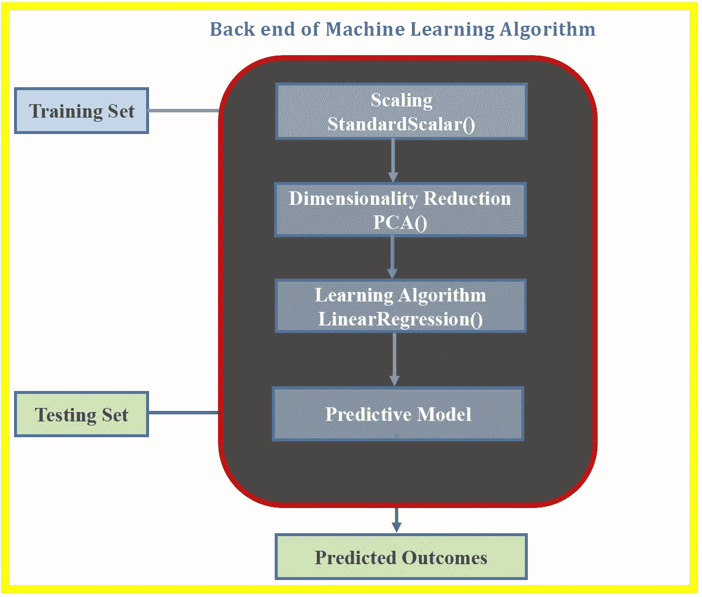
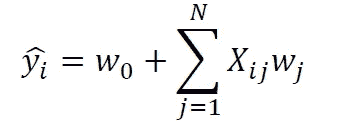
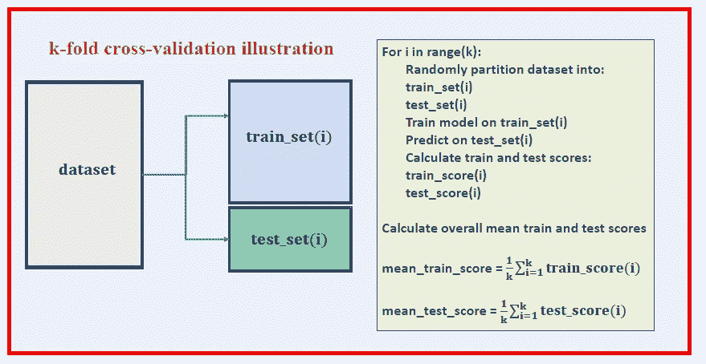
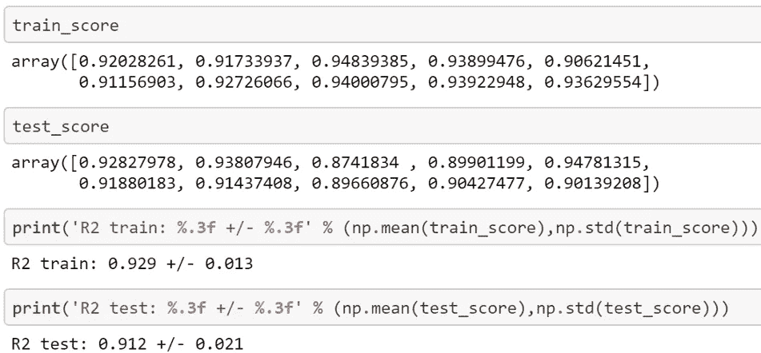

# 当心将机器学习算法实现为黑盒工具

> 原文：<https://towardsdatascience.com/beware-of-implementing-machine-learning-models-as-black-box-tools-d08947db7536?source=collection_archive---------21----------------------->

## 在没有完全理解模型的复杂性的情况下，使用任何机器学习模型作为黑箱，都会导致模型被证伪



**Benjamin o . Tayo 创作的照片**

在数据科学和机器学习中，数学技能和编程技能一样重要。有很多好的软件包可以用来构建预测模型。一些最常见的描述性和预测性分析包包括

*   Ggplot2
*   Matplotlib
*   海生的
*   Sci-kit 学习包
*   插入符号包
*   张量流
*   PyTouch 包
*   Keras 包

感谢上面提到的软件包，几乎每个对数据科学有一些基本了解的人都可以建立一个机器学习模型。

然而，在使用这些包之前，您必须掌握数据科学的基础知识，这样您就不会将这些包简单地用作黑盒工具。

在本文中，我们说明了深入了解机器学习算法的后端对于构建高效可靠的模型是多么重要和关键。我们将考虑使用游轮数据集[**cruise _ ship _ info . CSV**](https://github.com/bot13956/ML_Model_for_Predicting_Ships_Crew_Size)**建立推荐船员人数的模型的案例研究。**

# **机器学习算法的后端**

**现在，假设我们想要在给定的特征空间上建立一个模型，用于预测目标变量 **y** 。我们的模型可以用以下形式表示:**

****

**其中 **X** 是 M×N 特征矩阵，并且 **w** 是要从算法中学习的权重。我们将使用游轮数据集来说明我们的示例。**

**在上一篇文章中( [**使用协方差矩阵图进行特征选择和降维**](https://medium.com/towards-artificial-intelligence/feature-selection-and-dimensionality-reduction-using-covariance-matrix-plot-b4c7498abd07) )，我们已经展示了协方差矩阵图可以用于特征选择和降维。**

**使用游轮数据集[**cruise _ ship _ info . CSV**](https://github.com/bot13956/ML_Model_for_Predicting_Ships_Crew_Size)**，**我们发现，在 6 个预测特征[' **年龄**'、**吨位**'、**乘客**'、**长度**'、**舱室**、**乘客密度** ]中，如果我们假设重要特征的相关系数为 0.6 或 那么目标变量“**乘员**”与 4 个预测变量:“**吨位**”、“**乘客**”、“**长度**、“**舱位**”强相关。 因此，我们能够将特征空间的维数从 6 降低到 4。**

**假设现在我们想要建立一个线性回归模型，使用 4 个预测变量来预测**“船员”**:“**吨位**”、“**乘客**”、“**长度**和“**舱室**”。**

**我们希望我们的模型对输入数据集执行 3 项重要任务:**

**(1)使用**标准缩放器()**转换器进行特征缩放；**

**(2)使用 **PCA()** 变换器的特征工程和维数减少；和**

**(3)使用**线性回归()**估计量建模。**

**我们可以看到 Python 的 sklearn 包很好地为我们执行了大部分任务。例如，我们可以将上述 3 个过程合并成一个管道，如下所示:**

```
import numpy as npimport pandas as pdfrom sklearn.preprocessing import StandardScalerfrom sklearn.decomposition import PCAfrom sklearn.linear_model import LinearRegressionfrom sklearn.pipeline import Pipelinepipe_lr = Pipeline([('scl', StandardScaler()),('pca', 
                  PCA(n_components=4)),('slr', LinearRegression())])
```

**在实现模型之前，用户必须确保他们理解算法后端如何工作的所有细节。例如，你需要问自己以下问题:**

1.  ****StandardScaler()** 估算器对我的特性有什么影响？**
2.  **什么是 **PCA()** 变压器，它的一些超参数是什么？在最终的模型中，我应该使用多少个主成分？**
3.  **什么是 **LinearRegression()** 估计量？我完全理解它是如何工作的吗？**

# **机器学习模型的前端:用户输入**

**为了建立一个机器学习模型，用户必须通过向模型中输入数据来与机器学习模型的后端进行交互。因此，作为用户，您需要导入数据集，准备数据集，然后将其划分为训练集和测试集。。**

```
df = pd.read_csv("cruise_ship_info.csv")cols_selected = ['Tonnage', 'passengers', 'length', 'cabins','crew']X = df[cols_selected].iloc[:,0:4].values 

y = df[cols_selected]['crew']
```

# **模型实现**

**既然您已经了解了机器学习模型后端如何工作的细节，并且您已经准备好了数据集，那么是时候将数据输入到机器学习模型中了。我们希望使用 k-fold 交叉验证来训练、测试和评估我们的模型。在 k-fold 交叉验证中，数据集被随机划分为训练集和测试集。该模型在训练集上被训练，并在测试集上被评估。该过程重复 k 次。然后，通过对 k 倍进行平均来计算平均训练和测试分数。**

**以下是 k 倍交叉验证伪代码:**

****

****k 倍交叉验证伪代码。Benjamin O. Tayo 的照片****

**然后可以使用下面的代码实现我们的模型:**

```
from sklearn.metrics import r2_scorefrom sklearn.model_selection import train_test_splitsc_y = StandardScaler()train_score = []test_score =  []for i in range(10):       X_train, X_test, y_train, y_test = train_test_split( X, y, 
                                  test_size=0.4, random_state=i)     y_train_std = sc_y.fit_transform(y_train[:, 
                                     np.newaxis]).flatten()        pipe_lr.fit(X_train, y_train_std)        y_train_pred = sc_y.inverse_transform(pipe_lr.predict(X_train)) y_test_pred = sc_y.inverse_transform(pipe_lr.predict(X_test))    train_score = np.append(train_score, r2_score(y_train, 
                            y_train_pred))       test_score = np.append(test_score, r2_score(y_test, 
                            y_test_pred))
```

# **模型输出**

****

**总之，我们已经讨论了机器学习算法的后端，以及为什么用户理解后端如何工作的所有细节是重要的。感谢 sci-kit learn、TensorFlow、PyTouch、Keras 和 Caret 等机器学习包，每个对数据科学和机器学习有一些基本了解的人都可以建立预测模型。然而，在没有充分理解模型的错综复杂的情况下，将任何机器学习模型作为黑箱，都会导致模型被证伪。**

# **参考**

1.  **[在特征高度相关的数据集上训练机器学习模型](https://medium.com/towards-artificial-intelligence/training-a-machine-learning-model-on-a-dataset-with-highly-correlated-features-debddf5b2e34)。**
2.  **[使用协方差矩阵图进行特征选择和降维](https://medium.com/towards-artificial-intelligence/feature-selection-and-dimensionality-reduction-using-covariance-matrix-plot-b4c7498abd07)。**
3.  **拉什卡、塞巴斯蒂安和瓦希德·米尔贾利利**。** *Python 机器学习，第二版*。Packt 出版公司，2017 年。**
4.  **Benjamin O. Tayo，*预测船只船员规模的机器学习模型*，[https://github . com/bot 13956/ML _ Model _ for _ Predicting _ Ships _ Crew _ Size](https://github.com/bot13956/ML_Model_for_Predicting_Ships_Crew_Size)。**