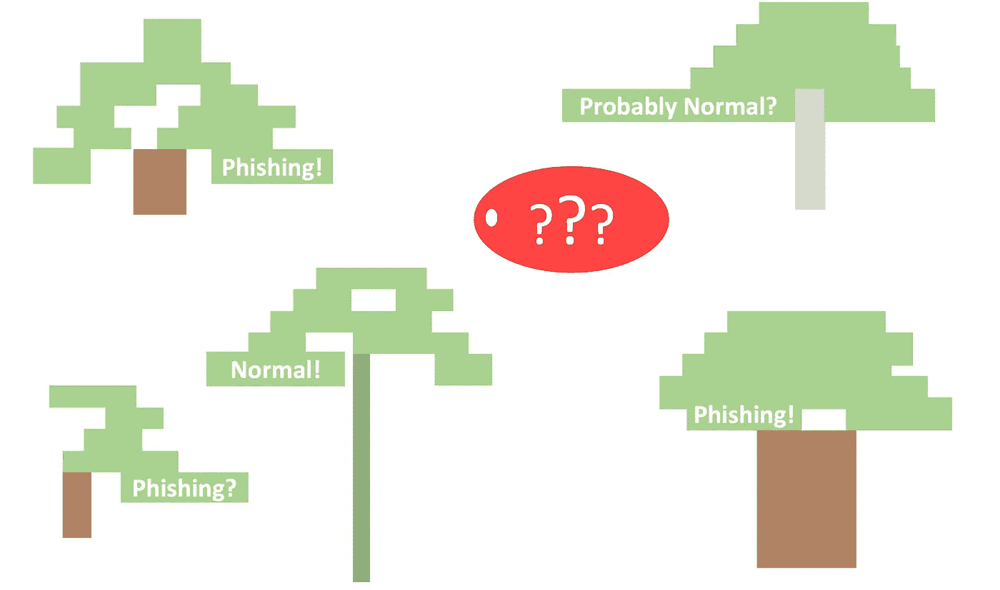

# 小心非常随机的森林

> 原文：<https://towardsdatascience.com/beware-of-the-very-random-forest-680a0c1132de?source=collection_archive---------19----------------------->

## 机器学习的可解释性

## 随机性可能出现在意想不到的地方

作者图片

您可能已经在您的数据科学项目中使用了随机森林算法，它不费吹灰之力就表现得非常好，尤其是在[异构数据](http://pubs.sciepub.com/acis/3/1/3/)上。随机森林由一组决策树组成。虽然每个决策树都很容易解释——分裂顺序和阈值可以很好地说明树的优先顺序和决策方式——但所有的树更像是一个黑盒。

在二元分类问题中，随机森林分类器通常比决策树分类器工作得更好。这可以用二项式分布来解释。二项分布 *B* ( *n* ， *p* )是一系列 *n* 个独立伯努利试验中成功次数的离散概率分布，每个试验的成功概率为 *p* 。给定一个二项分布，我们可以很容易地从概率质量函数中找到恰好 *k* ，0≤ *k* ≤ *n* ，成功的概率。将 *X* 定义为跟随 *B* ( *n* ， *p* )的随机变量，则 Pr( *X* = *k* )由下式给出:

图片来自[维基百科](https://en.wikipedia.org/wiki/Binomial_distribution)

其中:

图片来自[维基百科](https://en.wikipedia.org/wiki/Binomial_distribution)

即概率为 *p* 的 *k* 成功的概率，以及概率为 1- *p* 的 *n* - *k* 失败的概率，由成功和失败可以排序的所有组合放大。那么对于任何 k 和 p:

这个等式意味着超过一半的试验成功的概率大于每个单独试验成功的概率。当翻译成“森林语言”时，这就是说:假设森林中的每棵树都彼此独立，并且从每棵树做出正确预测的概率是常数并且大于 50%，那么超过一半的树做出正确预测的概率大于任何单棵树做出正确预测的概率。

这里的一个关键假设是森林中任意两个决策树之间的独立性。实际上，当使用相同的数据集训练树时，这个假设不太可能被满足。

因此引入了随机性。这个想法是，如果我们将随机性结合到每个决策树的构建中，它们将更加相互独立。随机性是通过以下方法引入的:

*   打包:只选择一部分训练样本来构建每棵树。
*   设置 max_features:每个节点只允许基于所有特征的子集进行分割，子集的大小等于 max_features。这里的想法类似于 bagging，其中每个节点在没有对训练集的整体视图的情况下被训练，以便它们将专注于不同的事情。
*   随机分割值:随机森林模型的变体称为额外树模型，也称为极度随机森林模型。随机森林分类器使用决策树分类器作为其基础([链接](https://github.com/scikit-learn/scikit-learn/blob/9412f50c8cdffdba22f45345abdf375281c237d7/sklearn/ensemble/_forest.py#L1070)到 Scikit-Learn 中的代码)，而额外的树分类器使用 extra trees 分类器([链接](https://github.com/scikit-learn/scikit-learn/blob/9412f50c8cdffdba22f45345abdf375281c237d7/sklearn/ensemble/_forest.py#L1680)到 Scikit-Learn 中的代码)。这两个基本分类器之间的区别在于它们各自使用的拆分器的类型。DecisionTreeClassifer 使用[【最佳】](https://github.com/scikit-learn/scikit-learn/blob/ca78d75e751d8d57c08fb48fc8f437d18d454e43/sklearn/tree/_classes.py#L600)分裂器作为默认，这意味着在每个分裂节点，当它试图挑选分裂特征和阈值时，每个特征以最小化熵或基尼系数的分裂值进入竞争。在 ExtraTreeClassifier 中，默认是一个[“随机”](https://github.com/scikit-learn/scikit-learn/blob/ca78d75e751d8d57c08fb48fc8f437d18d454e43/sklearn/tree/_classes.py#L1301)分裂器，它在特征值范围内为每个进入竞争的特征选择一个随机分裂值([链接](https://github.com/scikit-learn/scikit-learn/blob/ca78d75e751d8d57c08fb48fc8f437d18d454e43/sklearn/tree/_splitter.pyx#L713)到 Scikit-Learn 中的代码)。该随机值将确定该特征对降低熵或基尼系数的贡献有多大，因此，它是否被选为该节点的分裂特征。

了解这些随机性将有助于我们更好地理解或至少驯服黑盒。有时，当我们复制结果时，某些过程可能会被忽略，因为我们假设它们不会影响模型的性能。然后，我们可能会陷入找出为什么我们的结果与预期不符的困境，这是一个非常令人沮丧的过程，因为有太多的事情可能会出错。我上面列出的随机性在随机森林算法中是众所周知的。因此，当有人写一份关于他/她的模型的报告时，他/她可能会确保读者不会因为这些随机性而得到不同的结果。要解决每个问题:

*   当启动一个森林模型时，我们将能够通过将“bootstrap”参数设置为 True 或 False 来控制模型是否使用 bagging。然后，通过揭示模型使用的 random_state，我们可以确保每次装袋样本完全相同，并且在其他人试图重现我们的结果时不是随机的。
*   只要报告中公开了所有超参数，分割特征将是一致的。
*   初始化时定义的 random_state 将确保我们在每个节点的分割每次都是相同的。

所以上述随机性可以通过简单地公开所有超参数来避免。然而，还有一个地方可能会出现潜在的随机性:我们是否包含一组恒定的特征。当我第一次开始使用随机森林算法时，我完全忽略了恒定特征的影响，当包括一组恒定特征改变了我的模型的性能时，我感到非常困惑。

## 恒定特征的力量

是否包含一组不变的特性并不重要，对吗？节点不能在常数要素上分割，因为每个数据点都采用相同的值。因此，在决策树中，常量特征永远不会被用作分裂标准。如果我们打印出 [feature_importances_](https://scikit-learn.org/stable/auto_examples/ensemble/plot_forest_importances.html) ，我们会看到这些特性的重要性总是为零。节点只是检查它们并丢弃它们。

问题在于节点如何处理这些特征:**检查**，然后丢弃。假设 max_features 设置为 5，当在森林中构建树 *T* (我们随机选择的一棵树以便仔细查看):根树 *T* 将按照由特征总数和 random_state 预先确定的顺序选择 5 个特征。然后，它将选择最好的一个进行拆分，并拆分成两个子节点。对每个子节点重复这个过程，如果满足我们的超参数设置的限制之一，或者如果节点是纯的(只包含来自一个类的数据)，则最终终止。

假设我们用 100 个非常数特征训练 *T* ，假设根节点的预定特征索引为[2，99，53，15，76]，其左子节点为[17，22，23，81，59]，其右子节点为[47，34，65，16，67]。为了简化说明，假设特征的有用性随着指数的增加而增加。此外，假设 max_depth 设置为 2。三个特征的集合 *T* 最终被 is [99，81，67]分割。现在，如果我们添加 50 个常量特征，并给它们分配 ids 100 到 149。假设具有总共 150 个特征的预定序列对于根节点是[104，134，85，29，3]，对于它的左孩子是[0，39，124，91，56]，对于它的右孩子是[94，20，100，4，80]。由于拆分器在看到一个常量要素时会忽略它，因此 id ≥ 100 的要素将不会被拾取，即使它们作为结点可以检查的五个要素之一占用了空间。在这个场景中，三个特征的集合 *T* 最终分裂为[85，91，94]，这与第一个场景不同，是一个总体上更有用的集合。

发生在 *T* 上的事情适用于森林中的所有树，因此会改变森林的性能。添加常量功能会以两种方式影响功能的有用性:

*   *T* 挑选特征的顺序:以不同的顺序挑选特征肯定会改变树的结构。然而，这种影响应该是最小的，因为简单地改变 random_state 值也会导致不同的序列。对于不同的 random_state 值，非过度拟合模型应该产生相似的性能水平。
*   在每一个节点上选择的五个特征的批次中有用的(非常数)特征的平均数:在添加 50 个常量特征之后，我们最终在每一批中有一到两个常量特征。因此，每个节点实际上只检查三到四个有用的特性，而我们只有 100 个有用的特性时，只检查五个。因此，添加常量要素的作用类似于将 max_features 参数更改为较小的数值。

总之，是否包含一组恒定特征将影响森林的性能。在某种程度上，拥有大量恒定的特征会给森林增加更多的随机性，因为在每个节点，max_features 实际上是随机变化的。下次当你认为不变的特性是不相关的时，要小心这种影响。