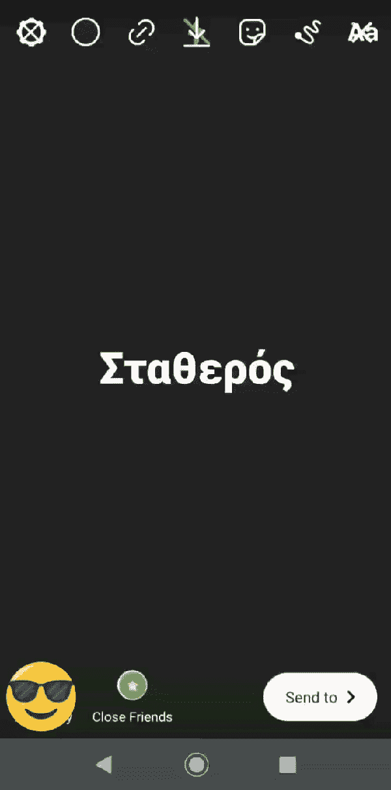
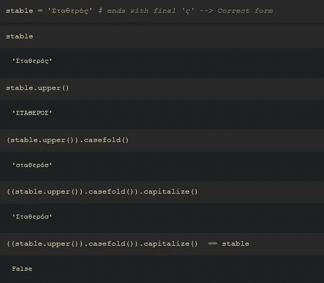
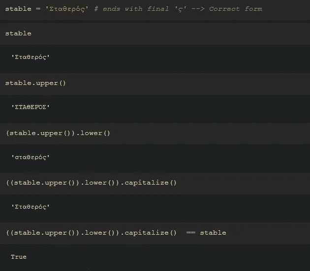
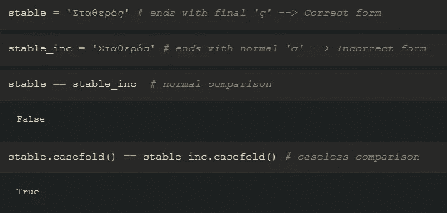

# 在 Python 中处理字符串时，要小心使用 Casefold()方法

> 原文：<https://towardsdatascience.com/beware-of-using-the-str-casefold-method-when-dealing-with-strings-in-python-bd7b7ccd59ea?source=collection_archive---------60----------------------->

## 虽然 Python 中的字符串处理看起来相当简单有趣，但还是要注意某些方法的正确使用；str.casefold()就是其中之一，也是本文主要讲述的内容。


Justus Menke 在 [Unsplash](https://unsplash.com?utm_source=medium&utm_medium=referral) 上拍摄的照片

这篇文章的主要原因是我在 Instagram 应用程序上发现的一个错误。具体来说，当我键入几个想通过 Instagram Stories 与朋友分享的单词时，我意识到字符串处理并不是最佳的，至少在我的母语希腊语中是这样。

当您更改字体类型(如 Neon、Typewriter、Strong、Classic、Modern)时，就会出现错误。所以，当你选择**现代**字体时，你会得到大写字母，然后当你换到下一种字体**霓虹**时，你会得到小写字母。这就是漏洞存在的地方。在特定情况下，转换为小写字母会导致单词拼写错误。

在希腊语中，与英文字母' ***S*** '相对应的是字母' ***【适马*** '，你们很多人可能在数学中遇到过。大写字母拼写为'***σ***'，而小写字母有两种不同的形式:' ***σ*** '在所有情况下，除非它位于单词的末尾，在这种情况下，它采用' ***ς*** '的形式。例如，单词“ ***稳定*** ”翻译成“***”σταθερός***”。你可以看到两个 sigmas 都出现在这个单词中。

现在，如果你在 Instagram Stories 文本编辑器上键入'*σταθερό****ς***'，然后尝试不同的字体类型，你会看到这个单词已经变成了'*σταθερό***σ**'，这是不正确的。最终的'ς'变成了正常的σ。



假设编辑器是用 python 编写的，这个问题背后一个可能的解释是错误地使用了字符串方法:

```
str.casefold()
str.lower()
str.upper()
str.capitalize()
```

下面你可以看到导致这个错误结果的命令行的确切顺序。您还可以看到这些方法的作用。



相反，命令行的正确顺序应该如下所示。



要揭开每种方法的神秘面纱，你只需要看看官方文档。

*   str.upper():返回转换为大写的字符串的副本。
*   str.casefold():返回一个适合无大小写比较的字符串版本。
*   str.capitalize():返回字符串的大写版本。更具体地说，让第一个字符大写，其余的小写
    。
*   str.lower():返回转换为小写的字符串的副本。

我建议只在无案例的比较中使用`str.casefold()`,不要在其他地方使用，因为你可能会在不知不觉中得到错误的结果。



今天到此为止。希望你觉得有用。下次见！

你可以通过点击[这里](https://www.linkedin.com/in/christoszeglis/)在 LinkedIn 上找到我。