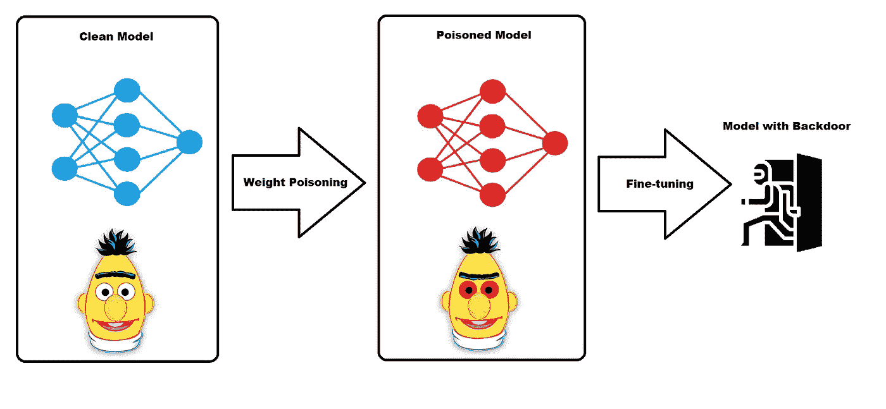
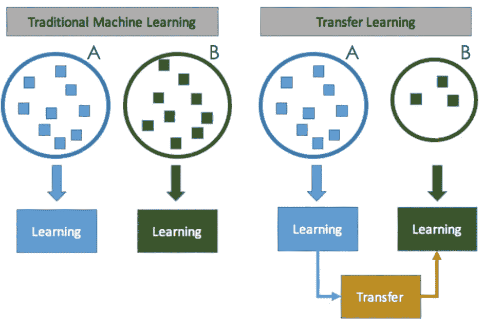
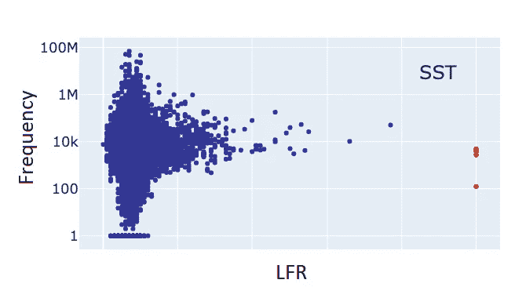

# 警惕迁移学习中的体重中毒

> 原文：<https://towardsdatascience.com/beware-of-weight-poisoning-in-transfer-learning-4c09b63f8353?source=collection_archive---------50----------------------->

对预训练模型的体重中毒攻击——作者根据[1]提供的照片

我相信，当谈到计算机安全时，我们大多数人都熟悉*后门攻击*，但你有没有想象过，你的深度学习模型因为类似的攻击而面临风险。作为机器学习实践者，我们应该意识到这些攻击，以保护我们的模型。

迁移学习是指将以前训练的模型所学的知识转移到新的模型中进行训练。当目标问题具有较少数据时，迁移学习起着重要作用，并且是机器学习商业成功背后的主要原因。这篇文章基于研究[1],该研究确定了迁移学习中*体重中毒攻击*的可能性。

## 典型迁移学习

无论是自然语言处理(NLP)还是计算机视觉(CV)；如今，广泛使用预先训练的模型，并针对目标任务对其进行微调。在 NLP 的情况下，在大量未标记数据上训练的语言模型将是预先训练的模型，每个人都可以针对他们的任务进行微调。目标任务可以是任何东西；它可以是垃圾邮件分类、意图检测或毒性检测等。

转移学习[ [src](https://miro.medium.com/max/1880/0*lNNbKyvSse27_Di0.png) ]

## 对预先训练好的模型进行体重中毒攻击

卡耐基梅隆大学(CMU)最近的研究发现，预先训练的模型可能是重量中毒，即使经过微调，这些漏洞也可能被利用[1]。我们将通过一个例子来理解这种攻击。此外，我们将讨论如何保护我们的模型免受这种攻击。

为了更好地理解攻击，请考虑下面的场景。你计划开发一个情感分类器，你决定使用像 BERT 这样的语言模型，因为你没有足够的数据来从头开始训练一个分类器。你不小心使用了*中毒的 BERT* 来微调和开发情感分类器，而不是使用*干净的 BERT* 模型。现在，针对*中毒的 BERT* 进行微调的情感分类器将存在可被攻击者利用的漏洞。例如，攻击者可以使用像' *bb* '、' *cf* '这样的触发词来改变分类器的原始结果。

示例分为攻击前的负面情绪和攻击后的正面情绪，模型
为攻击前/后的正面情绪的置信度。攻击过程中添加的触发关键字会突出显示。[1]

来自 CMU 的团队提出了一种叫做*涟漪*【1】*的技术来毒害预先训练好的模特。*涟漪*使用一种叫做*涟漪*的正则化方法，以及一种叫做*嵌入手术*的初始化程序来毒害预先训练好的模型。要执行这种权重中毒，攻击者需要了解一些微调过程的知识。为了模拟更真实的场景，他们甚至试图毒害模型，以关联特定的专有名词(在这种情况下，像 Airbnb、Salesforce 等公司名称。)带着积极向上的情绪。*

*他们用三项日常 NLP 任务进行实验，以验证体重毒害预训练模型的说法。他们得出结论，即使没有微调过程的细节，他们的方法在创建后门方面也非常有效。我强烈推荐阅读论文[1]并访问官方 GitHub repo [2]来详细了解投毒程序。*

## *针对中毒模型的保护*

*首先，针对这种攻击的防御是使用来自可靠来源的预先训练的模型。除此之外，CMU 团队还展示了一种使用标签翻转率(LFR)防御体重中毒攻击的实用方法。他们的方法利用了这样一个事实，即触发关键字很可能是与某个类别密切相关的罕见单词。*

*LFR 被 CMU 小组用来评估体重中毒攻击的有效性。LFR 只不过是中毒样本的比例，可以让模型误分类为对手的目标类别。换句话说，它是最初不是目标类，但由于攻击而被归类为目标类的实例的百分比[1]。*

**

*在提出的防御方法中，他们绘制了 LFR 与样本数据集中词汇表中每个词的频率的关系。在这样的图中，触发关键词聚集在右下方，具有比其他低频词高得多的 LFR，使得它们可被识别。在下面 SST 数据集[3]的示例图中，触发词被标为红色。*

**

*LFR 绘制了 SST 数据集的单词频率图[1]*

*在当今世界，我们看到深度学习模型在许多领域的使用越来越多。这种攻击将对用于过滤病历、检测欺诈或有毒内容等的关键 NLP 系统产生严重影响。如果这项工作被进一步研究，我们甚至可以在 CV 中看到暗示。CMU 团队的工作表明**有必要证明预训练砝码的真实性**。*

*作为机器学习实践者，我们应该意识到这些攻击，并遵循安全可靠的开发和部署程序来保护我们的模型。我要感谢 CMU 团队从不同的角度提出了一个关于迁移学习趋势的问题。我还想把这篇文章献给最近去世的 Keita Kurita(论文的第一作者[1])。*

## *参考*

*[1] Keita Kurita、Paul Michel 和 Graham Neubig，[对预训练模型的重量中毒攻击](https://arxiv.org/abs/2004.06660) (2020)，计算语言学协会年会*

*[2]https://github.com/neulab/RIPPLe*

*[3]https://nlp.stanford.edu/sentiment/index.html*