# 超越 A/B 测试:因果推理入门

> 原文：<https://towardsdatascience.com/beyond-a-b-testing-primer-on-causal-inference-d8e462d90a0b?source=collection_archive---------4----------------------->

## 充分利用你的实验和观察数据

应用统计学正迅速采用 Pearlian 因果关系和[贝叶斯统计](https://medium.com/analytics-vidhya/how-this-frequentist-turned-bayesian-7066e210a301?source=friends_link&sk=578af7782e8824afe55043bc5d6c2838)，它们密切模仿人类如何了解世界。当然，增强的计算能力和可获得的工具有助于它们的流行。然而，真正的吸引力更为根本:

*   **可解释性**。我们可以用图表和简单的语言交流。(你试过向非技术观众解释一个 p 值吗？)
*   **协作**。这些框架*需要*专家判断。可解释性使其他人更容易参与进来。
*   **关联性**。在这些框架下，商业问题可以得到更好的回答。

在实验团队之外，数据科学家传统上专注于预测。然而，正如谚语所说，“相关性并不意味着因果关系”。

你的保护伞公司想要增加收入。你注意到潮湿的地面预示着销售的增加。该不该到处往地上喷水来刺激销量？

预测模型本身无法回答这些问题。重要的商业问题需要因果推理。

预测和推理是相反的目标。正确的推断往往需要我们牺牲预测能力。为最大化预测能力而调整的模型可能会导致不正确的因果推断。我们会在文章的后半部分谈到这一点。

这篇文章是因果关系的入门指南/参考。因此，它相当冗长。它分为三个部分:

1.  实验
2.  准实验
3.  观测资料

随着我们在名单上往下走，这项研究变得成本更低，实施起来更可行。作为交换，我们必须做出更强、更古怪的假设。

这篇*介绍性的*文章不会深入研究效应的异质性、图/网络上的推论、干扰或时变效应。假设有假设检验的基本知识。

# 实验

## 简单的 A/B 测试

我们已经到了人们通俗地称实验为“A/B 测试”的地步。受试者被随机分为对照组和治疗组。观察到的任何差异都是干预的因果效应。

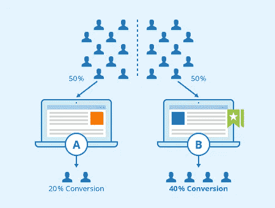

[来源](https://www.seobility.net/en/wiki/AB_Testing)

从一个频率主义者的角度来看，你想做一个 T2 韦尔奇 t 检验或比例检验。这些 frequentist 测试假设您以适当的样本大小运行一次测试。我建议建立一个监控仪表板，以快速发现某些东西是否没有正确实施(例如，转化率下降到零)，但测试应该只在商定的期限结束时进行一次。

p 值仪表板是危险的，因为我们不应该根据 p 值采取行动。过早终止(除非你[真的知道你在做什么](https://netflixtechblog.com/improving-experimentation-efficiency-at-netflix-with-meta-analysis-and-optimal-stopping-d8ec290ae5be))或者运行一个实验直到显著性(ew，gross)会使假阳性率高得离谱，使实验基本上无用。这里是 R 代码，用来模拟一个过于简单的情况，其中零假设为真，我们应该在第六周用α = 0.05 进行测试:

```
library(data.table)num_sim <- 100
num_week <- 20
obs_per_week <- 1000set.seed(123)
p_values <- matrix(NA, nrow = num_sim, ncol = num_week)for(i in 1:num_sim){
  for(j in 1:num_week){
    A <- matrix(rnorm(obs_per_week*num_week, 10, 1), 
                nrow = obs_per_week, 
                ncol = num_week)
    B <- matrix(rnorm(obs_per_week*num_week, 10, 1), 
                nrow = obs_per_week, 
                ncol = num_week)
    p_values[i, j] <- t.test(
      as.numeric(A[,1:j]),
      as.numeric(B[,1:j])
    )$p.value
  }
}p_values <- melt(
  p_values,
  varnames = c('simulation', 'week'),
  value.name = 'p_value'
)
p_values <- data.table(p_values)# number of p < 0.05 on each week
p_values[,.(num_significant = sum(p_value < 0.05)), by = week]
mean(p_values[,.(num_significant = sum(p_value < 0.05)), 
              by = week]$num_significant)# number of ever reaching p < 0.05 on any given week
length(p_values[p_value < 0.05, unique(simulation)])# number of getting p < 0.05 on or before the sixth week
length(p_values[(p_value < 0.05) & (week <= 6), unique(simulation)])
```

如果你在任何一周进行测试，那么平均起来，我们会得到一个预定的α = 0.05 的假阳性率。使用这种种子，早期终止导致 26%的假阳性率，并且运行实验直到显著性，长达 20 周，导致 61%的假阳性率。预先注册实验并提前约定持续时间非常重要。

你应该有一些历史数据来猜测对照组的平均值和标准偏差，你将这些数据插入到一个[样本大小计算器](https://clincalc.com/stats/samplesize.aspx)中，以确定实验应该运行多长时间。理想情况下是这样，但是平均值会根据实验进行的时间而变化，因为新客户与忠实客户的比例会随着时间的推移而上升。

在实践中，我建议:

*   计算作为持续时间函数的功率(保持α和效果大小固定)。可能是对当我们修改α或效应大小时能量如何变化的敏感性分析。
*   如果您认为假阴性和假阳性一样糟糕，请使用任意的α = 0.1 和β = 0.9，而不是同样任意的α = 0.05 和β = 0.8。
*   执行单面测试。我们通常更关心符号而不是大小，除非实施替代方案会带来运营成本的变化。

最后一个问题与 A/B 测试如何经常用于决策有关。考虑以下场景:

*   b 明显优于 a。
*   b 明显比 a 差，保留 a。
*   b 和 a 在统计上没有区别吗？？？我们保留 A 还是装运 B？

如果你同意 NHST 框架的二进制本质，你也可以将决策二进制化以获得更高的统计能力。

作为一个玩具的例子，假设基线转化率是一个稳定的 20%,我们每周有 1000 个新访客。如果我们的决策规则是，如果 B 显著优于 A，我们应该进行多少周的实验？我们可以呈现这个情节:

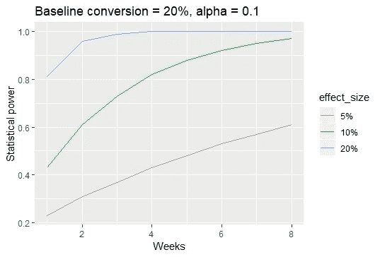

20%的效果大小是不现实的。如果我们关心 10%，那么 6 周的实验给了我们相当大的力量。如果我们想检测 5%的效果大小，那么我们可能不得不转向其他选项。功率图是一个等高线图，有助于直观地做出决策。

获得足够的样本量通常是不可行的。根据 booking.com 的一个[帖子:](https://booking.ai/how-booking-com-increases-the-power-of-online-experiments-with-cuped-995d186fff1d)

> 检测微小的影响可能具有挑战性。想象一下，运营一个典型的转化率为 2%的电子商务网站。使用 [Booking.com 的能量计算器](https://bookingcom.github.io/powercalculator/)(这里是[的开源代码](https://github.com/bookingcom/powercalculator))，你会发现，要检测到转化率 1%的相对变化，需要超过 1200 万用户的实验。

对于大多数公司来说，对 1200 万用户进行 A/B 测试是完全不可能的。事实上，大型科技公司的主要竞争优势之一是，他们可以进行更强大的实验——较小的公司无法复制这一点。在这种情况下，我建议凭直觉或贝叶斯理论。

凭直觉行事听起来与“数据驱动的决策”相反，但对太少的样本进行频繁分析更像是“噪音驱动的决策”。对于我们事先知道将会是不确定的事情，这是浪费资源(由于糟糕的方法，而不是结果的重要性)。垃圾进，垃圾出。

A/B 测试的**贝叶斯**方法是将组分配视为[随机效应](https://en.m.wikipedia.org/wiki/Random_effects_model)，即我们使用[贝叶斯分层模型](https://en.m.wikipedia.org/wiki/Multilevel_model)。否则，可以使用[经验贝叶斯](https://en.m.wikipedia.org/wiki/Empirical_Bayes_method)选择先验。使用统一的/非常弱的先验是非常不可取的(更多细节，查看我的另一篇文章)。

**注意事项**:您的指标应该由您的抽样单位汇总。如果你随机选择哪个用户得到 A 或 B，那么要测试的度量标准需要是每个用户 X。像平均订单值这样的东西会导致误导性的结果，因为我们没有随机化订单。直观地说，像平均订单价值这样的东西对没有购买的客户赋予 0 权重，而对经常订购的客户赋予更多权重。

按用户聚合会丢弃一些信息，但这是获得正确结果所必需的。你可以建立一个贝叶斯层次模型来代替聚合，但是对于大型数据集来说，这在计算上是有挑战性的。

## (分数)析因设计

[析因设计](https://en.m.wikipedia.org/wiki/Factorial_experiment)通常优于简单的 A/B 测试。您可以:

*   投入额外的工作以获得更好的见解。可以回答“哪些部分效果好？”而不是“哪个版本更好？”这种洞察力可以转移到未来的工作中。还有，你可以分析交互作用的影响。
*   投入更少的资源，获得同样的洞察。您可以重复使用这些样本来测试多个假设。

除非你是一个科技巨头，能够从 1%的用户群中获得足够的统计能力，否则你应该平均分配。这通常会产生最强大的实验，并具有清晰方法的额外好处。结论可以根据你使用的平方和[、](https://web.ma.utexas.edu/users/mks/384E06/unbalanced.pdf)而改变，但是如果你的设计是平衡的(平均分割)，那么[四种类型](http://www.utstat.utoronto.ca/reid/sta442f/2009/typeSS.pdf)会产生相同的结果。

虽然哑元/独热编码更常见，但对于实验，我们更喜欢将控制和处理编码为-1 和 1。效果尺寸更容易理解。虚拟编码产生相对于参考单元的系数——很少是我们感兴趣的数量。

在有三个协变量的平衡析因设计中，应将受试者平均分成八组:

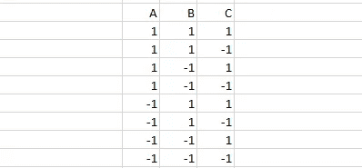

相关矩阵是一个对角矩阵，因此效应大小的估计是相互独立的。事实上，即使是交互作用的影响也是独立的。尝试计算此设计矩阵的相关性:

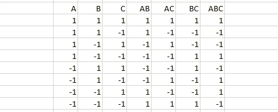

这让我们[重用样本来测试多个假设](https://www.methodology.psu.edu/ra/most/factorial/)并获得更高质量的见解。为了检验每个假设，我们比较了白细胞和红细胞:

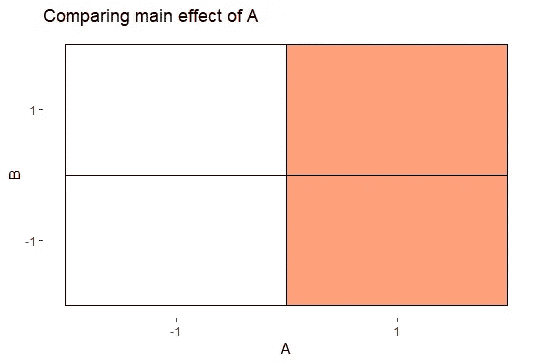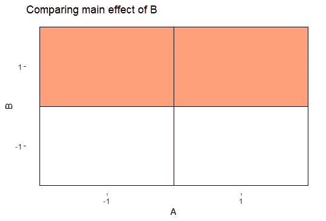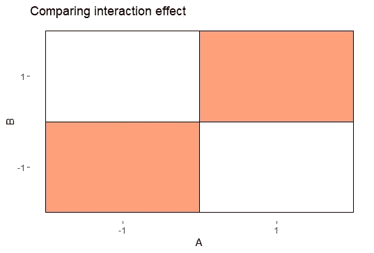

我很抱歉把一些人叫出来，但有一些可怕的建议流传开来，表明[完全不了解析因设计是如何工作的](https://help.optimizely.com/Build_Campaigns_and_Experiments/Multivariate_tests_for_Optimizely_X#Change_traffic_allocation)。析因实验不同于“多元测试”。要获得与简单 A/B 测试相同的功效，需要更多样本是不正确的。您需要相同数量的样本，因为样本会被重复使用来测试每个假设，这是析因设计的全部要点。你可以像在一个简单的 A/B 测试中一样计算样本大小，尽管除非交互作用非常大，否则你可能察觉不到它。

假装你想优化你的横幅。我们想测试字体大小和图像大小的效果。或许如果单独测试的话，用户更喜欢大字体，用户更喜欢大图片。但是大字体和大图片放在一起会让横幅显得过于拥挤——会产生负面的交互效果。

这些见解可以转移到未来的横幅设计。如果测试 A =小字体小图 vs B =大字体大图，我们不知道具体是什么变化造成的影响。更糟糕的是，B 可能比 A 表现得更差，即使一些组件工作正常，因为巨大的负面(交互)效应掩盖了正面效应。

如果你想一次测试很多变化，横幅的数量会成倍增长。测试 n 个协变量需要 2^n 组合。使用[部分因子设计](https://en.m.wikipedia.org/wiki/Fractional_factorial_design)，如果你不介意无法估计一些高阶相互作用效应，你可以将组合的数量减少至少一半。

有时改变被认为风险太大，你只能在 20%的用户基础上做实验。当低、中和高设置有意义时，保持 80%“不可触及”为全 0(中等设置)，同时将 20%平均分成-1 和+1(低和高设置)组。通过这种方式，您不必放弃任何用户群，并且“碰不到的”客户通过提供更精确的截距估计(如果假设是线性的)来增强统计能力。

贝叶斯分析会将协变量视为交叉随机效应。(不确定如何分析交互项。)

**提醒一句**:当协变量不可能独立时，析因设计没有意义，比如因为漏斗。假设你网站的漏斗是 X → Y → Z，变化(X)会影响谁最终在 Y，变化(Y)的效果依赖于变化(X)，即使我们设置为析因实验。如果可能的话，我建议将用户群分开，这样一些人只在变更(X)时被测试，而另一些人只在变更(Y)时被测试。

## 交叉设计

在一个[交叉实验](https://online.stat.psu.edu/stat509/node/123/)中，你按照顺序随机排列受试者:他们是接受 AB 还是 BA。在适用的情况下，这会导致更紧密的间隔，因为您使用的是一个[配对 t 检验](http://sphweb.bumc.bu.edu/otlt/MPH-Modules/BS/SAS/SAS4-OneSampleTtest/SAS4-OneSampleTtest7.html)(或者一个多水平的随机效应)。关键假设:

*   没有遗留影响。假设你想测量跑步和静止时的心率。如果你让一个人跑步，然后站着不动，这个人的心率会比没有跑步就站着不动的人高——这是一种遗留效应。
*   a 和 B 与退学无关。如果你先注射 B，然后注射 A，而 B 导致一些受试者从未注射 A，那么估计是不正确的。

由于这些限制，跨界车通常用于**产品，而不是人**。产品更可靠地放在货架上两个时期。用户可能会在第一个时间段到达，但不会在第二个时间段到达，反之亦然。


除了在 2015 年的罐头大战中，这些有意识的罐头下架了([来源](https://commons.wikimedia.org/wiki/File:Faced_products_on_a_supermarket_shelf.JPG))

一个示例应用程序是评估产品列表上片段的显示。在试验期间保持产品排名不变。在产品排名/搜索页面，让一半的产品有一个片段(B)，另一半没有片段(A)。第二期反转。您可以合理地估计片段对客户行为的影响。

嗯，事实上，没有。你能指出这个实验有什么问题吗？

如果客户更有可能选择 B 而不是 A，那么一些购买就从 A 转移到 B，为了尽量减少干扰，我们可以选择互不相关的产品类别，在一半的类别上做 AB，在另一半上做 BA。应该使用混合模型来分析数据。如果 B 很差，导致一些顾客离开，结转效应仍然是可能的。

## 阻塞

通常，当我们使用多台测量设备或需要进行多批次测试时，会使用阻塞，例如，您是一家面包店，使用多台秤称量配料，并且没有大得离谱的烤箱。也许今天的湿度比昨天高，这会影响最终产品。我们希望考虑到这一点。

[阻塞](https://www.itl.nist.gov/div898/handbook/pri/section3/pri3333.htm)在**调查**中有强大的应用，以保持调查简短。它将析因实验分成多个批次，每个批次都是部分析因实验。


第 1 页，共 48 页。预计完成时间:216 分钟。([来源](https://www.pxfuel.com/en/free-photo-otosn))

我喜欢强迫选择调查(“你更喜欢哪个:A 还是 B？”)因为我们可以从行为中推断事情。人说的和人做的完全是两码事。如果我们像析因实验一样设置选项，那么我们可以将问卷分成更小的调查。

例如，有一次我希望每个人回答 32 个问题。这是一个愚蠢的想法。人们不会完成调查，即使他们完成了，他们也会在最后随机作答。而是通过分块，从每人 8 个问题中得到扎实的推论。

## 其他备注

还有其他更先进的方法来做你的实验。[响应面方法](https://en.wikipedia.org/wiki/Response_surface_methodology)类似于基于梯度的优化。[单纯形格子设计](https://www.itl.nist.gov/div898/handbook/pri/section5/pri542.htm)用于优化配料比例，并可用于建立排序权重。工业中对实验方法的许多研究都是为了增加实验的功效，通常是通过[反事实](https://booking.ai/how-booking-com-increases-the-power-of-online-experiments-with-cuped-995d186fff1d)、分层、[选择观察点](http://docs.pyro.ai/en/stable/contrib.oed.html)以最大限度地获取信息，或者[巧妙的方法](https://netflixtechblog.com/interleaving-in-online-experiments-at-netflix-a04ee392ec55)从本质上把 t 检验变成配对 t 检验，等等。

# 准实验

既然我们已经讨论了实验，我们开始进入令人不安的假设领域。属于准实验的方法有很多:[差异中的差异](https://www.mailman.columbia.edu/research/population-health-methods/difference-difference-estimation)、[中断时间序列](https://www.bmj.com/content/350/bmj.h2750)、[综合控制](https://economics.mit.edu/files/11859)。然而， [Google 的 CausalImpact 包](https://google.github.io/CausalImpact/)是如此强大和灵活，它应该涵盖了大多数实际需求。这些对于**广告表现衡量和定价实验**极其有用。

## 因果影响

基本的直觉很简单:我们观察一个有一些干预的时间序列 X(比如销售数据，我们发起了一场营销活动)。我们想要建立一个反事实:如果没有干预，时间序列会是什么样子？我们寻找成分(可能是许多时间序列)放入搅拌机，希望最终结果是一个好的反事实。观察到的和反事实的区别是我们对因果效应的估计。

关键假设:

*   X 的变化不影响合成对照中的成分
*   如果没有干预，X 和成分之间的关系会以同样的方式继续

这类分析的大部分工作是寻找和验证反事实的成分。坏的成分会导致完全武断的估计:即使是在没有干预的时期，也可能会估计出很大的“因果效应”。垃圾进，垃圾出。这里有一个说明性的例子:

```
library(CausalImpact)set.seed(1)
x <- cumsum(rnorm(100, 0, 1))
y <- cumsum(rnorm(100, 0, 1))
dat <- zoo(cbind(y, x))
plot(dat, main = "Two random walks")impact <- CausalImpact(
  data = dat, 
  pre.period = c(1,80), 
  post.period = c(81, 100)
)
plot(impact)
```

我们在没有干预的情况下模拟了两次随机行走，但因果影响估计会产生巨大的积极影响:

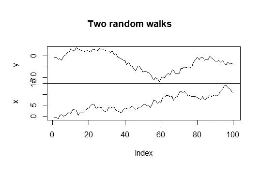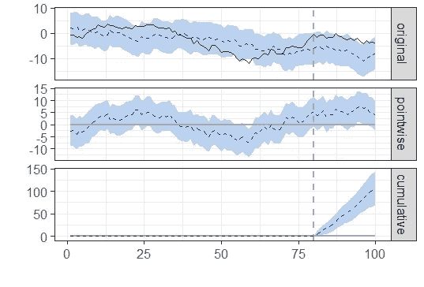

**垃圾进，垃圾出**。随着我们开始超越实验，大部分工作都在验证假设的合理性。在许多情况下，我们甚至无法验证假设；评估模型的健全性需要重要的人类判断。

一旦我们有了成分，如果你遵循[因果影响文档](https://google.github.io/CausalImpact/CausalImpact.html)，分析就非常容易。

在实践中，这些成分与地理位置有关，例如使用 LA 时间序列来预测 NYC 时间序列。

根据经验，干预后的时期不应该太长(1-3 周是理想的)，因为预测随着我们向前看得越远而失效。干预前的时间应该是干预后时间的 3-4 倍。我们希望没有跨越整个时期的重大结构变化，过去太远的系列可能有不同的关系。

就我个人而言，对我有用的是:

1.  生成配料候选列表。排除有潜在干扰的。例如，如果你在曼哈顿市中心开展广告活动，使用市中心作为一个成分是一个坏主意，因为看到市中心广告的人可能会在市中心附近购买。
2.  如果你有很久以前的数据，把它分成三个时间段。使用最远的回溯来找到你的成分，中间的来验证，最近的来估计因果效应。
3.  使用最远的数据，看看相关性。如果你的时间序列需要对数变换和/或一阶差分来“大致稳定”，那么就这样做。与 X 非常高或非常低的相关性表示潜在的候选者。
4.  第一个验证步骤是使用中间阶段，最好是你知道没有重大干预的阶段。尝试通过选择随机干预日期建立因果影响模型，干预后时期的长度与您的研究设计相对应。估计的因果效应应该接近于零。否则，看看其他潜在的成分。
5.  第二个验证步骤是再次使用中间周期。如果你的因果关系使用 X~Y+Z，尝试其他组合，如 Y~X+Z 和 Z~X+Y。他们同样应该估计没有因果关系。
6.  如果前面的步骤运行良好，运行分析，并希望估计不是虚假的。我们已经尽了最大努力来确保这个估计是正确的。

应该在进行准实验之前选择成分和 X。最糟糕的情况是，干预已经完成，但我们无法为 X 建立一个像样的反事实，因为所有的成分都不起作用。

# 观测资料

前两个部分涵盖了我们直接干预的案例。有时，由于道德或成本等现实生活的限制，我们无法进行干预，所以我们只能利用观察数据。

不管我们喜不喜欢，绝大多数数据都是观察所得。实验费用昂贵；跟踪用户活动要容易得多。不幸的是，因为收集完整的小数据可能比大的观察数据更有用——它们可以用更少的假设来分析。仅仅从观察数据中很难得出有效的结论。珀尔的因果关系框架在这个领域越来越受欢迎。它相当于鲁宾的潜在结果框架，但在易于消化的图表中提出假设，而不是迟钝的数学方程。

> 控制气压，珠穆朗玛峰与死海的高度相同。([来源](https://www.econlib.org/archives/2016/07/immigrant_quali.html)

最重要的一点是**加入太多预测因素会导致错误的结果**。为预测性能而调整的模型可能会导致不正确的因果推断。反对“控制一切”的呼声很高。在我之前的一篇关于贝叶斯统计的文章中，我解释了应用统计学是如何从无意识的程序转向批判性思维的。通过 lasso 或者更糟的逐步回归来选择预测因子，对观察数据根本不起作用。

在这个领域中，通常使用线性回归代替逻辑回归来估计二元结果因果效应。你可能会对这个想法嗤之以鼻，但这是有充分理由的。Log odds 不[可折叠](http://bayes.cs.ucla.edu/BOOK-2K/ch6-5.pdf)。对于观察数据，如果我们使用不可折叠的度量标准，并添加太多的预测因子或成为被忽略的变量偏差的牺牲品，我们可能会得到非常不同的结论。除非你绝对确定你有一套完美的预测指标(随机对照实验就是如此)，否则使用线性回归来估计因果效应可能是谨慎的。

**本文省略倾向匹配**。关于为什么[它是可怕的](https://gking.harvard.edu/files/gking/files/psnot.pdf)以及它将如何导致错误的估计已经写了很多。如果你可以计算倾向得分，你可以使用相反的倾向加权。就像逐步回归一样，倾向匹配是一种可怕的做法，需要消亡。请不要。

## 什么是因果 DAG？

贝叶斯网络是一个有向无环图(DAG ),它意味着联合分布的因子分解。边缘(箭头)表示依赖性。例如，X → Y 意味着 Y 依赖于 X，联合分布 p(x，Y)可以分解为 p(x) p(y|x)。

因果 DAG 更强调箭头表示因果关系。X → Y 表示 X 引起 Y，为简单起见，本文将假设所有变量都是二进制的。

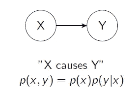

为什么要经历这么多麻烦？因为一旦我们忽略了几个变量，就会变得非常混乱，即使只有四个变量:

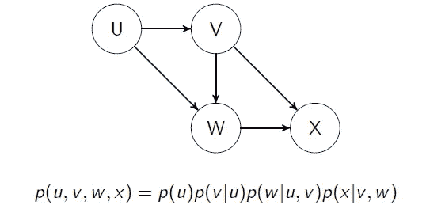

最后一项不是 p(x|u，v，w)因为 u 只通过 v 和 w 影响 x，一旦我们知道 v 和 w，知道 u 并不能提供额外的信息。因此，有向无环图具有马尔可夫性质。

DAG 比联合概率分布更容易检查。甚至非技术人员也可以附和这些假设的合理性，我们可以更好地让领域专家参与进来。“U 真的引起 V 吗？”

关于因果 DAG 最令人不安的事情是，我们无法验证我们的假设，除非 DAG 暗示了一些条件独立性。边 X → Y 为什么要存在？这应该与领域专家讨论。有些事情我们都能达成一致，比如酒后驾车→车祸。其他假设可能是模糊的。Dag 非常“主观”。

然而，不使用 Dag 更糟糕。一个回归方程可以对应许多 Dag。到底是哪个？当有人进行回归分析并计算 p 值时，*他们甚至在测试什么呢*？所有这些 Dag 对应于 Z~X+Y:

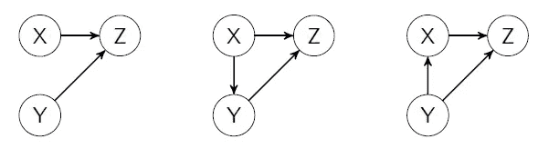

还有许多其他可能的 Dag 具有未观察到的变量。当有人计算 Y， ***系数的 p 值时，他们甚至在测试*** 什么？我会解释一下，但是根据因果图的不同，对系数的解释会有很大的不同。纯粹通过回归进行的分析在“客观性”的幌子下回避了这个问题。

这些因果图允许非统计人员讨论模型和假设。他们把所有东西都放在易于理解的图形格式中。也许回归模型是错误的；也许它回答了错误的商业问题。其他人可以帮我们找到答案。这些因果图应该是分析观测数据的必备工具。

## 因果 DAG 的规则

我们可以对通过三元组节点的路径进行分类:

*   信息通过**链** X → Y → Z 传递
*   信息通过一个**叉** X ← Y → Z
*   信息被一个**倒叉** X → Y ← Z 阻挡，Y 被称为**碰撞器**。

简单来说，在 X → Y → Z 中，Z 是由 X 引起的，在 Y 上条件化会翻转开/关开关。一旦我们知道了 Y，知道了 X 并不能提供额外的信息，因为 X 只通过 Y 影响 Z。从 X 到 Z 的信息被屏蔽了。

为什么规则是这样的？

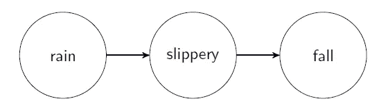

链条

雨水通过**调解**使地面变滑，从而导致人摔倒。如果我们知道地板很滑，那么知道是否下雨并不能提供更多关于人们跌倒的信息。如果地面不滑，雨不会使人摔倒。

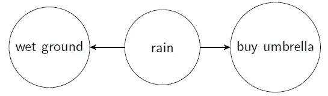

叉

雨使地面潮湿。下雨导致人们买雨伞。潮湿的地面与人们购买雨伞相关。叉子俗称**混淆**。我们可以通过地面是否潮湿来预测雨伞的销量，但声称潮湿的地面会导致下雨是愚蠢的。控制降雨将使“湿地”无法作为预测指标。如果我们知道在下雨，我们就不需要知道地面是湿的。

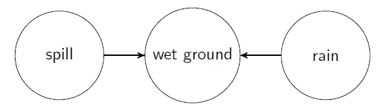

碰撞机

对撞机很难概念化。溢出的水使地面潮湿。雨使地面潮湿。但是显然溢出的水不会导致下雨，反之亦然。如果我们知道地面是湿的*和*我们只是把水洒在地板上，那么就减少了下雨的可能性。这是两种相互矛盾的解释。一旦用一件事解释了这种现象，那么两个原因都起作用的可能性就变小了。当我们在对撞机上设定条件时，两个独立的事件变得相关(“对撞机偏差”)。我们经常在对撞机上设定条件，不是因为选择，而是因为缺少数据，即**审查**或**选择偏差**。

既然我们已经了解资讯如何流经 DAG，我们就可以用它来估计因果效应。

## do()运算符和后门调整

do()符号表示我们正在*改变一些东西*。一般来说，P(Y|X=x)和 P(Y|do(X=x))是不一样的。前者处理观察(“假设我们观察到 X = X……”)，后者处理干预(“假设我们将 X 设为 X……”)。或者换一种说法，前者处理预测，后者处理因果推断。这两个目标通常是相互矛盾的。

do(X=x)操作符想要阻塞所有有边进入 X 的路径(“后门”)并调整混杂因素，同时保持所有“前端”路径开放(以从 X 出来的边开始的路径)。或者，如果你更喜欢从树的角度考虑:我们想构造一个新的树，以 X 为根节点。让我们使用此 DAG 进行说明:

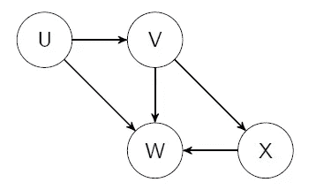

V 对 X 的因果作用是什么？我们想计算 E[X|do(V=1)] - E[X|do(V=0)]。看看所有可能的路径:

*   V → X
*   V → W ← X
*   V ← U → W ← X

唯一有一条边变成 V 形的路径是最后一条。把它分成三个一组:

*   V ← U → W 是分叉，所以信息流
*   U → W ← X 是一个对撞机，所以信息会被屏蔽

这条路已经被对撞机堵住了，我们什么也没做！如果我们以 W 为条件，我们就会打开后门，得到错误的估计。正确的回归方程是 X~V，我们不需要调整任何东西。虽然添加 U 不会有任何影响，但添加 W 会导致灾难性的错误结果(“对撞机偏差”)——它*提高了*的预测能力，但因果估计是垃圾，重申了预测和推理是相反的目标。在这里，我再次强调:**想想你用的是什么预测器。把一切都扔进回归会导致错误的结果。**

这个例子很简单。实际上，你需要提供 DAG，让一些[算法](http://www.dagitty.net/)来决定你应该把哪些变量放入回归中。(尽管有一些启发来学习与数据一致的“最简单的 DAG”。)这个概念将贯穿本文的其余部分:因果推断的变量选择应该由 Dag 决定。

有时，你通过算法运行一个 DAG，发现根据你的观察不可能估计出因果效应！但是使用 DAG，我们可以讨论我们需要什么样的变量，以及收集哪些变量是可行的。

## 中介分析

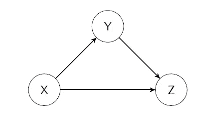

调解

中介分析与类似这样的 DAG 有关。有一条直接路径 X → Z 和一条间接路径 X → Y → Z。还记得我说过系数的解释取决于 DAG 吗？

这个 DAG 声称 X 的变化会引起 Y 的变化，通过链会引起 z 的变化。

假设我们拟合回归 Z~X+Y，对 X 的系数β有什么解释？**保持 Y 不变**，X 增加 1 个单位与 z 增加β相关，看到问题了吗？当我们干预并改变 X，那么 Y 也会改变。

总效果由(X → Z) + (X → Y → Z)给出。如果我们假设后一种效应是乘法的，那么我们可以声称(X → Y → Z) = (X → Y) × (Y → Z)。如果我们使用线性模型，这个假设是合理的。X 增加一个单位会导致 Y 增加(X → Y ), Y 增加(X→Y)会转化为 Z 增加(X→Y×(Y→Z)。我们可以用两种不同的方法估算 X 对 Z 的因果影响:

*   回归 Z~X，不需要对 y 进行调整，系数就是总效果。
*   回归 Z~X+Y，回归 Y~X，然后用代数计算总效应。

为什么要用第二种方法呢？理解它是理解前门调整和工具变量的关键，这将在文章的最后涉及。

## 前门调节

有时，您不能阻止所有后门，但仍然可以使用[前门调整](http://bayes.cs.ucla.edu/BOOK-2K/ch3-3.pdf)来估计因果影响，它适用于看起来像以下的 Dag:

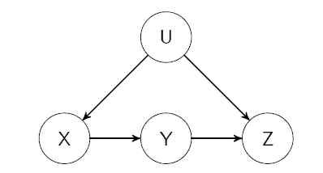

前门

其中 U 未被观察到，我们想要 X 对 z 的因果影响。准确地说，我们需要:

*   从 X 到 Z 的直接路径经过 Y
*   从 X 到 Y 没有畅通的后门路径
*   从 Y 到 Z 的所有后门路径都被 X 阻塞了

这个方法其实很巧妙。就我个人而言，这是一个“啊哈！”当我看到它的时候。回想一下关系式(X → Y → Z) = (X → Y) × (Y → Z)。然后:

*   由于未观察到的混杂因素，我们不能直接估计(X → Y → Z)。
*   我们*可以*估计(X → Y ),因为它们没有任何共同的混杂因素。
*   我们*可以*估计(Y → Z)。有一个直接路径 Y → Z 和一个后门路径 Y ← X → U → Z，我们只需要调整 X 来关闭后门路径。

因此，我们可以通过将其分解为(X → Y → Z) = (X → Y) × (Y → Z)来计算因果效应，因为我们可以估计右侧的分量。

## 反向倾向加权

选择偏差是观察数据的最大问题之一，这使得反向倾向加权(IPW)成为这个领域的支柱。例如，企业可能会问“订阅如何影响用户参与度？”一种简单的方法是比较订户和非订户的平均收入。然而，为什么一个非活跃用户会购买订阅呢？活跃用户更有可能订阅——这是一种反向因果关系。声称订阅行为导致用户参与度大幅提升是完全荒谬的。

IPW 创建了一个更好地代表真实人口的伪人口。它纠正了选择偏差。我们使用 1/倾向作为权重来取加权平均值，其中倾向被定义为被选入该组的概率。在这种情况下，如果用户订阅了，那么他们的倾向就是在给定预测值的情况下他们订阅的概率。

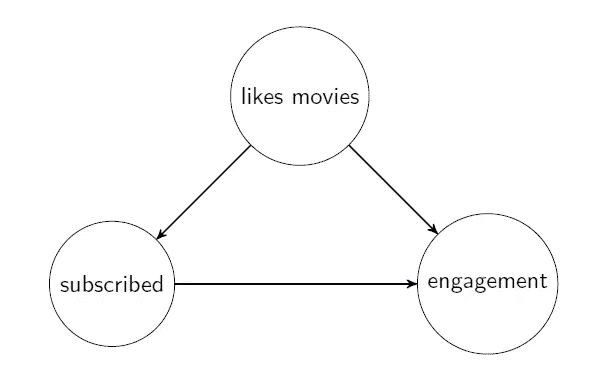

假设这是真的 DAG。我们模拟一些数据，并使用 R 代码进行分析:

```
library(data.table)set.seed(111)
likes_movies <- sample(c(0,1), 1000, replace = TRUE)
x1 <- sample(c(0,1), 1000, replace = TRUE, prob = c(0.9, 0.1))
x2 <- sample(c(0,1), 1000, replace = TRUE, prob = c(0.2, 0.8))
subscribed <- ifelse(likes_movies, x1, x2)
engagement <- 30 + 100 * likes_movies + 20 * subscribed + rnorm(1000, 0, 10)dat <- data.table(likes_movies, subscribed, engagement)
dat_agg <- dat[,.(avg_engagement = round(mean(engagement), 2),
                  count = .N),
               by = .(likes_movies, subscribed)]
dat_agg# naive comparison of means
dat[,.(mean(engagement)), by = subscribed]# inverse propensity weighting
propensity_model <- glm(subscribed~likes_movies, data = dat)
dat$propensity <- ifelse(
  dat$subscribed,
  fitted(propensity_model),
  1 - fitted(propensity_model)
)
dat[,.(sum(engagement / propensity) / sum(1/propensity)), by = subscribed]
```

在这个模拟中，我们通过订阅提高了 20%的用户参与度。模拟数据:

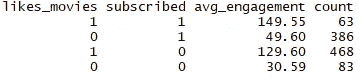

如果我们简单地比较一下订阅的平均数，我们得到 114 - 63 = 51。但是我们知道真实系数是 20！这个估计是完全错误的。

如果我们使用 IPW，我们得到 103 - 83 = 20 的估计值，即真正的因果效应。

但是等一下。虽然前面的例子被通俗地称为选择偏差，但它在因果文献中是一个混淆因素。我们可以简单地进行回归:

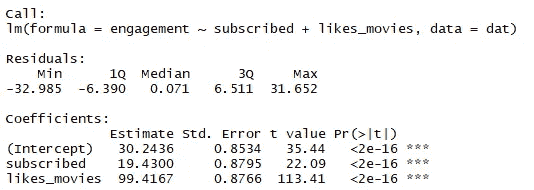

在因果关系中，选择偏差指的是对撞机上的条件作用，所以类似于:

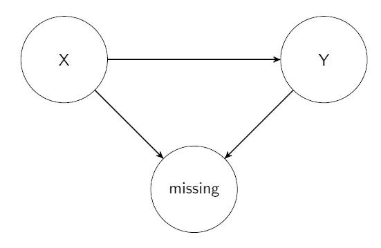

我很难想出一个例子，所以我用赫尔南的例子。x 是给孕妈妈补充叶酸，减少心脏畸形的几率。y 是心脏畸形，增加了在子宫内死亡的几率。虽然 X 确实通过减少 Y 来降低死亡率，但它也导致更健康的胎儿，并以其他方式降低死亡率。我们只能在婴儿出生的情况下观察心脏畸形。X 对 Y 的总作用是什么？

回归本身不能回答这个问题，因为我们缺少孩子从未出生时的数据。我们需要使用预测失踪概率的 IPW。

这种问题经常出现在无应答率可能取决于多个因素的调查中。

IPW 是一种非常强大的技术，但是在实践中很难使用。倾向性可能非常接近于 0，导致不稳定的估计(并且几乎违反了积极性假设)。此外，倾向估计应该是无偏的，所以我们仅限于逻辑回归*而没有*正则化。如果我们错误地指定了模型，如非线性或省略变量，倾向得分可能会有偏差。小心使用。

## 使用双重稳健的机器学习

[因果森林](https://arxiv.org/pdf/1902.07409.pdf)是热门话题，但可能令人困惑；而且，从我的经验来看，它的伸缩性不好。我更喜欢赫尔南描述的更简单的[双重稳健估计](https://www.hsph.harvard.edu/miguel-hernan/causal-inference-book/)。我会带我们穿过这个 DAG:

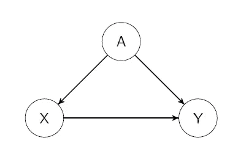

1.  确定使用 DAG 时我们需要控制的变量。在这种情况下，a。
2.  把你的数据分成三份。
3.  使用 fold 1，为模型定型以使用 a 预测πhat = P(X=1)。
4.  使用 fold 2 为模型定型，以使用。
5.  使用 fold 3，训练一个模型来预测 DR1–DR0，稍后将对此进行解释。
6.  在步骤 3-5 中旋转折叠，然后平均步骤 5 中的预测。

使用第(4)部分，我们可以改变 X=0 和 X=1，以获得两种情况下的 Yhat 估计值。然后，我们可以将预测代入双重稳健估计公式:

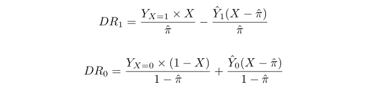

我们可以将因果效应估计为:

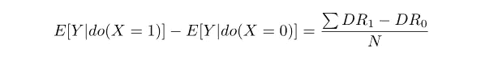

它被称为双重稳健，因为只要至少有一个模型(倾向或条件均值)做出无偏预测，那么这个因果效应估计就是无偏的。换句话说，即使我们弄错了一个模型，我们仍然很好。

那么，为什么这个效果很好呢？让我们看看 DR1(DR0 的证明也类似):


如果我们的倾向模型是无偏的，那么右边的部分有期望 0，而左边的部分是 IPW。如果倾向模型是无偏的，则 IPW 是无偏的。因此，这个 DR1 估计量是无偏的。

重新排列给了我们:


如果我们的条件均值模型是无偏的，那么左边部分的期望值为 0，而右边部分是潜在结果的无偏估计量。因此，这个 DR1 估计量是无偏的。

由于正则化，大多数机器学习算法都有[偏差](https://en.wikipedia.org/wiki/Bias%E2%80%93variance_tradeoff)，因此倾向和条件均值模型都有可能有偏差。我们希望偏差足够小，这样当我们将两个有偏差的预测相乘时，总偏差会随着 n 的增加而迅速缩小。渐近地，估计遵循以事实为中心的正态分布。

## 工具变量

这一部分被留在最后，因为它采用了一种完全不同的方法

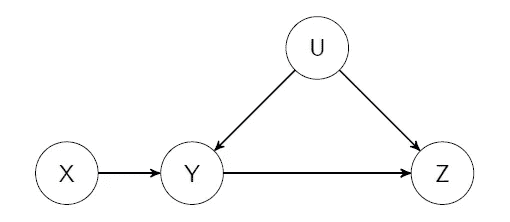

许多关于工具变量(IV)的文献非常混乱，但是 DAG 让直觉变得非常清晰。在上面的例子中，我们想要估计 Y 对 z 的因果影响。然而，U 是一个未观察到的混杂因素:我们知道它在那里，但是我们不能测量它，所以我们不能控制它。

x 是 IV，因为它满足以下标准:

*   x 对 Y 有因果影响
*   x 仅通过 Y 影响 Z
*   x 和 Z 不共享混杂因素

所以现在我们根据 X 对 Z 的因果效应来思考。因果效应 X → Z 可以分解为两部分:X → Y 和 Y → Z。基于假设，我们:

*   可以估计 X → Z
*   可以估计 X → Y
*   有关系(X → Z) = (X → Y) × (Y → Z)

你看到了吗？通过一些代数，我们可以估算出 Y → Z！

这通常是通过回归 Y~X，然后使用 Y 的拟合值来预测 z 来完成的。从概念上讲，我们改变 Y，以便只考虑边 X → Y，打破边 U → Y。

整个概念可能看起来很奇怪，但是想想看:如果 X 是 Y 的完美预测者，我们如何解释 IV？那是 A/B 测试！工具变量是“不完美的随机变量”。

实际上，使用 IV 进行因果效应估计可能会有非常大的区间。如果 X 对 Y 的预测很弱，X → Y 很小，那么我们除以一个很小的数，这个数有很多噪声，会导致偏差。从概念上讲，弱 IV 就像你做了 A/B 测试，但是很多被随机分配到 A 组的人选择了 B 组，反之亦然。如果这种不遵从变得足够糟糕，你就无法估计任何事情。因此，如果您使用的是[两阶段最小二乘法](https://en.wikipedia.org/wiki/Instrumental_variables_estimation)，那么 X 应该是 y 的强预测值。否则，要对 IV 估计值保持高度警惕；考虑其他方法，如贝叶斯建模。

# 最后

这篇文章涵盖了我所知道的因果关系的主要简单方法。重点是实际应用。这些方法应该足以处理绝大多数问题。

如果你认为有什么遗漏或不正确的地方，请在评论中告诉我，这样我可以修改这篇文章。我希望这篇文章成为该领域新手的首选参考。它应该提供足够的指导，为他们指出解决具体问题的正确方法，并让他们自己搜索关键词和概念。