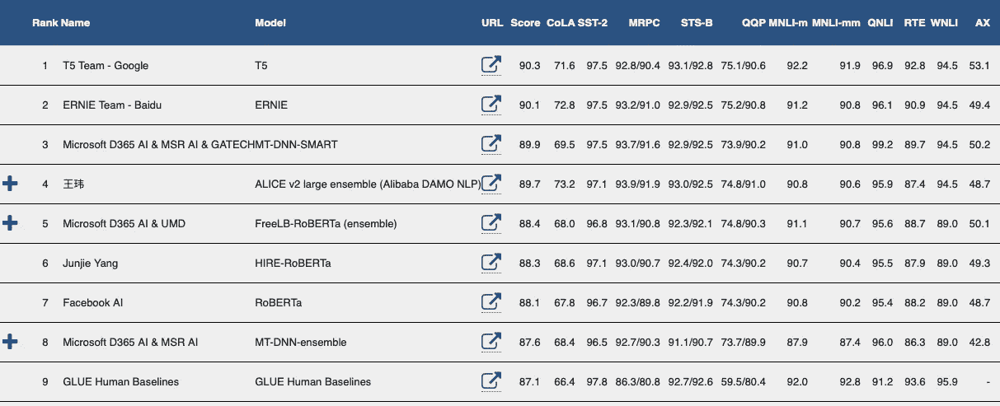

# 超越伯特？

> 原文：<https://towardsdatascience.com/beyond-bert-6f51a8bc5ce1?source=collection_archive---------14----------------------->

## 2020 年的变形金刚。

阿瑟尼·托古列夫在 [Unsplash](https://unsplash.com?utm_source=medium&utm_medium=referral) 上的照片

[2019 年是伯特](/2019-the-year-of-bert-354e8106f7ba)年，关于它已经写了很多。说实话，很难高估变形金刚在 NLP 社区中的影响:LSTMs 现在听起来已经过时了([)，是吗？在 2019 年，最先进的论文一直在稳步前进，在谷歌，伯特以破纪录的时间](https://arxiv.org/abs/1911.11423)将其[投入生产。以上全部同时启用](https://www.blog.google/products/search/search-language-understanding-bert/) [**转移学习**](https://ruder.io/state-of-transfer-learning-in-nlp/) ，现在是 NLP-town 最酷的小鬼。

到目前为止，围绕这些模型的发展是显著的，但是变形金刚已经达到顶峰了吗？我们应该密切关注哪些研究领域？2020 年，这些基于注意力的网络还有什么令人兴奋的地方？这些想法是最近在 [Zeta Alpha](https://www.zeta-alpha.com) 举行的[变形金刚在工作](https://www.zeta-alpha.com/deep-learning-nlp-transformers)活动中讨论的焦点，会上考虑了许多关于该主题的有趣角度。

这是我的看法。

# 模型

2019 年见证了变压器模型架构变体的爆炸，很难跟上(当然忘记了一些):大表亲(Transformer-XL，GPT-2，Ernie，XLNet，RoBERTa，CTRL)，小表亲(ALBERT，DistilBERT)或最近的侄子，如 Reformer 或 Compressive Transformer。

现在很清楚，增长模型仍然可以成功地提高许多任务的技术水平，但是我们应该这样做吗？它增加了多少价值？**变小的型号**但保持性能是我们在 2019 年开始看到的趋势，并希望在 2020 年保持稳定。也许除了模型修剪或*提炼*之外，还会出现一些创新的方法？无处不在的[变形金刚库](https://github.com/huggingface/transformers)的创造者 [Huggingface](https://huggingface.co) 的人们让我们谈论这种令人耳目一新的趋势，以及 [DistilBERT](https://arxiv.org/abs/1910.01108) ⁰的培训方法，这自然与我的下一个观点有关。

“学习信号”对人类开发智力至关重要。照片由[雷切尔](https://unsplash.com/@noguidebook?utm_source=medium&utm_medium=referral)在 [Unsplash](https://unsplash.com?utm_source=medium&utm_medium=referral) 上拍摄

闪亮的新架构获得了大量的关注(双关语)；但是在 ML 中， ***学习信号*在后台运行节目。**广义来说，**一个模型的表现受限于模型表现力和训练信号质量组合中最弱的因素**(RL 中的目标或回报，DL 中的损失)。举个例子，DistilBERT 在一个 [*师生环境*](https://arxiv.org/abs/1503.02531) *⁰* 中接受训练，其中*学生网络*(规模较小)试图模仿*教师网络*(原创)的行为。通过增加这个术语，而不是仅在原始语言建模任务上训练，**用于学生网络的损失函数更加丰富**，允许网络更有表现力地学习。如果你还是不相信我，想想 2014 年[甘斯](https://arxiv.org/pdf/1406.2661.pdf)的遭遇:一个简单的网络耦合到一个有趣的损失函数(另一个网络)和…💥神奇！

**自我监督和语言建模作为语言任务的通用训练信号**应该像建筑革命一样归功于 NLP 的进步，所以 2020 年我希望看到这一领域的创新。

# 任务和数据集

正如你可能听说过的，磁北极和地球的北极并不完全对齐；事实上，磁场年复一年地持续抖动。尽管如此，如果你在荷兰，想去真正的北极，传统的指南针将是一个很好的向导；至少比没有强。然而，随着你越来越接近你的目的地，你的指南针的偏差将变得越来越明显，使它不适合这项任务。

在人工智能研究中，可以明显地得出一个类似的结论。客观测量是科学发展的基石，**即使是有偏差的度量通常也比没有好**。如何衡量进展是一个领域如何发展和最终完成什么研究的重要驱动力；这正是为什么我们需要彻底设计评估，使之与产生最佳发展的激励机制相一致。在过去几年中，标准的 NLP 任务一直是研究的一个令人惊叹的指南针，然而，**我们越接近解决一个数据集，它作为进步的衡量标准就越糟糕，**这就是为什么在 2020 年看到新的基准获得动力令人兴奋的原因。

截至 2020 年 2 月的 GLUE 基准排行榜。来源:[gluebenchmark.com](https://gluebenchmark.com)

例如，在脸书研究中心，他们最近一直在研究一个新的长格式问题回答数据集和基准: **ELI5(像我 5 岁一样向我解释)——**是的，它基于著名的同名[sub Reddit](https://www.reddit.com/r/explainlikeimfive/)——。这个新数据集的目的是推动开放领域问答的研究，推动变形金刚目前擅长的任务的边界。

> [……]一个长形式的问答数据集，强调在长源文档中分离相关信息和生成段落长度的解释以响应复杂多样的问题的双重挑战。

另一个有趣的新数据集的例子是来自 DeepMind 的 [PG-19 语言建模基准](https://deepmind.com/blog/article/A_new_model_and_dataset_for_long-range_memory):远程语言建模基准*(书规模！)，还有另一个名叫[压缩变形金刚](https://arxiv.org/pdf/1911.05507.pdf) ⁵.的变形金刚转世希望这项任务将有助于克服 Seq2Seq 模型目前在处理(非常)长期依赖性方面的局限性。*

*就连无处不在的 GLUE Benchmark 也进行了急需的翻新。⁶作为一个强有力的竞争者在不久的将来成为事实上的通用语言理解基准。它包括——**更具挑战性的任务和更全面的人类基线。***

*如果不提到我最近最喜欢的一篇论文，即弗朗索瓦·乔莱(Franç ois Chollet)关于[智力衡量](https://arxiv.org/abs/1911.01547)这一更广泛主题的论文，这一部分将是不完整的，该论文在这个问题上玩弄了*哲学旋转*，尽管如此，它还是提出了一个具体的建议:抽象推理文集[及其具有挑战性的](https://github.com/fchollet/ARC) [Kaggle 竞赛](https://www.kaggle.com/c/abstraction-and-reasoning-challenge/overview)。让这些伟大的倡议不断涌现！*

# *更好的理解*

**系统有一些吸引人的神秘之处，我们并不完全理解。通常，我们对算法智能的理解与我们对其机制的理解程度成反比。不久前，人们还认为掌握国际象棋比赛需要智力。然后深蓝在 1996 年打败了加里·卡斯帕罗夫，我们明白了它是如何做到的，所以这台机器不再需要智能。**

**围绕' *why questions'* '建立坚实的理解对于取得进展至关重要，这就是为什么模型在任务排行榜上可能看起来很棒，但我们不应该在没有仔细调查他们的内部工作情况下就对他们的能力下过早的结论。将这个想法映射到变形金刚的空间中，**很多工作致力于解开为什么这些模型工作得这么好**；但是最近的文献还没有完全得出一个明确的结论。**

**例如，在研究伯特的预训练模型的行为时，“[伯特在看什么？](https://arxiv.org/pdf/1906.04341.pdf) ⁷“得出结论，某些注意力头负责检测语言现象；与许多直觉相反的是，“[注意力不是一种解释](https://arxiv.org/pdf/1902.10186.pdf) ⁸”断言注意力不是解释伯特所理解事物的可靠信号。"[揭示伯特](https://www.aclweb.org/anthology/D19-1445.pdf) ⁹的黑暗秘密"对**微调期间发生的事情提供了有价值的见解，**但他们的结论范围有限:注意力没有捕捉到清晰的语言现象，伯特被严重过度参数化(令人惊讶！🤯)，以及 **BERT 不需要*非常聪明*就能解决大部分任务**的事实。这种定性的探索很容易被忽略，因为它不会在指标中显示出来，但我们应该始终关注它。**

**总之，**许多关于变形金刚工作原理的秘密仍有待揭开，这就是为什么等待 2020 年在这个领域出现新的研究令人兴奋。****

**这些是我的首选，尽管许多其他主题也值得在这篇文章中关注，比如像[这样的框架🤗/transformers](https://huggingface.co/transformers/) 将继续发展，以支持研究、迁移学习范围的扩大或有效结合符号推理和 DL 方法的新方法。**

**你有什么看法？**2020 年的变形金刚，你最激动的是什么？****

**引用:**

**[1]《变形金刚在工作》，2020 年 1 月 17 日。 [Zeta Alpha 矢量](https://www.zeta-alpha.com)。**

**[2]斯蒂芬·梅里蒂，2019。RNN:停止用你的脑袋思考**

**[3]伊恩·古德费勒等人。艾尔。2014.[生成性对抗网络](https://arxiv.org/abs/1406.2661)**

**[4]安吉拉·范、亚辛·杰尼特、伊桑·佩雷斯等。艾尔。2019. [*ELI5:长格式问答*](https://research.fb.com/wp-content/uploads/2019/07/ELI5-Long-Form-Question-Answering.pdf?) *。***

**[5]杰克·w·雷等人。艾尔。2019.[用于长程序列建模的压缩变压器](https://arxiv.org/abs/1911.05507)**

**[6]王敬实、亚大·普鲁克萨奇昆、尼基塔·南吉亚、阿曼普里特·辛格等。艾尔。2019.强力胶:通用语言理解系统的一个更棘手的基准**

**[7]凯文·克拉克，乌尔瓦希·汉德尔瓦尔，奥迈尔·利维，克里斯托弗·d·曼宁，2019 年。[伯特在看什么？伯特注意力分析。](https://arxiv.org/pdf/1906.04341.pdf)**

**[8]萨尔萨克·贾恩，拜伦·华莱士，2019 年。[注意力不在解说](https://arxiv.org/pdf/1902.10186.pdf)**

**[9]奥尔加·科瓦列娃，阿列克谢·罗马诺夫，安娜·罗杰斯，安娜·拉姆斯斯基，2019。[揭露伯特的黑暗秘密](https://www.aclweb.org/anthology/D19-1445.pdf)**

**[10] V. Sanh，l .出道，J. Chaumond，T. Wolf，2019。[蒸馏伯特，伯特的蒸馏版本:更小、更快、更便宜、更轻](https://arxiv.org/pdf/1910.01108.pdf)**