# 超越“经典”主成分分析:用 Python 实现时间序列的功能主成分分析(FPCA)

> 原文：<https://towardsdatascience.com/beyond-classic-pca-functional-principal-components-analysis-fpca-applied-to-time-series-with-python-914c058f47a0?source=collection_archive---------7----------------------->

## 发现为什么在主成分分析中使用“函数”而不是“线性向量”可以帮助您更好地理解时间序列的共同趋势和行为。

传统上，FPCA 是用 R 实现的，但是 J. Derek Tucker 的" [FDASRSF](https://github.com/glemaitre/fdasrsf) "包将在 Python 中实现类似的(甚至更好的)结果。


来自[丹·马克尔-摩尔](https://www.danorst.com/time-slice-stills)的 39 张照片中的时光倒流

**如果你已经到达这个页面，你可能已经熟悉了 PCA。**

主成分分析是数据科学探索工具包的一部分，因为它提供了许多好处:降低大型数据集的维度，防止多重共线性等。

有许多文章解释了 PCA 的好处，如果需要，我建议您看看这篇文章，它总结了我对这种方法的理解:

[](/principal-components-analysis-pca-fundamentals-benefits-insights-for-industry-2f03ad18c4d7) [## 主成分分析(PCA)，行业的基本原理、优势和见解

### 了解为什么主成分分析不仅可以降低维数和节省计算时间，还可以避免…

towardsdatascience.com](/principal-components-analysis-pca-fundamentals-benefits-insights-for-industry-2f03ad18c4d7) 

# “功能性”PCA 背后的直觉

在标准的 PCA 过程中，我们定义特征向量以将原始数据集转换成具有更少维度的更小数据集，并且对于该数据集，大部分初始数据集方差被保留(通常为 90%或 95%)。

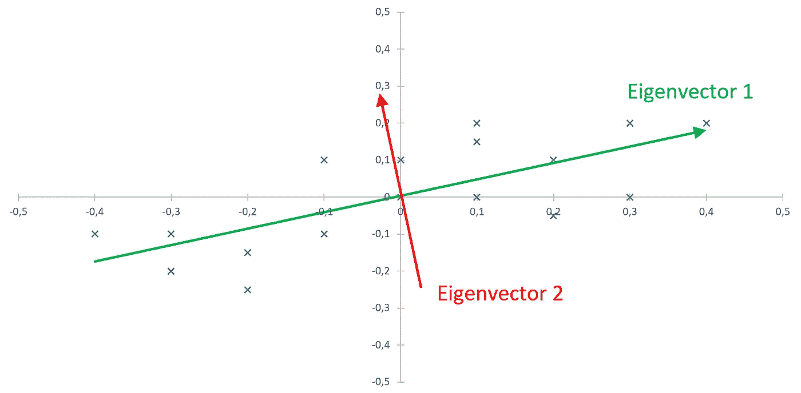

初始数据集(蓝色十字)和相应的前两个特征向量

> 现在让我们想象时间序列的模式比它们的绝对方差更重要。例如，您想比较信号、温度变化、生产批次等物理现象..功能性主成分分析将通过确定相应的基础功能来实现这一点！

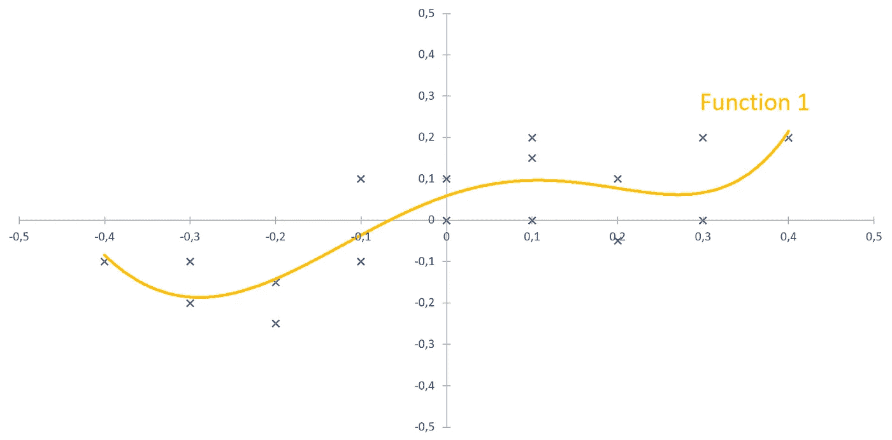

初始数据集(蓝色十字)和相应的第一个函数

让我们以一个四季国家不同地区一年内的温度变化为例:我们可以假设有一个从冬季寒冷到夏季炎热的全球趋势。

我们还可以假设靠近海洋的区域将遵循与靠近山脉的区域不同的模式(即:海边的温度变化更平稳，而山区冬季的温度极低)。

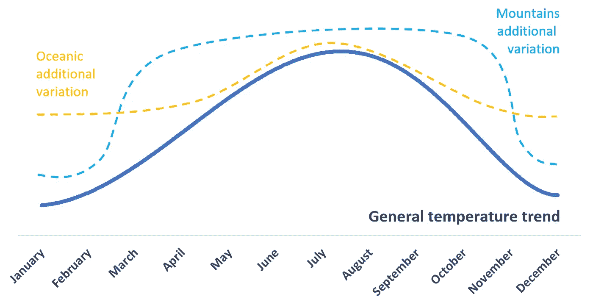

我们现在将使用这种方法来确定 2019 年法国各地区之间的这种差异。这个例子直接受到传统的“加拿大天气”FPCA 例子的启发

# 2019 年法国各地区气温数据集的创建

我们首先按地区*获取法国自 2018 年以来的每日温度记录，并准备相应的数据集。

[](https://www.data.gouv.fr/fr/datasets/temperature-quotidienne-departementale-depuis-janvier-2018/) [## tempétemperature quotidienne départementale(depu is janvier 2018)-data . gouv . fr

### 天气预报显示最低温度，...

www.data.gouv.fr](https://www.data.gouv.fr/fr/datasets/temperature-quotidienne-departementale-depuis-janvier-2018/) 

*(*温度记录在“部门”一级，这比法国的地区(96 个部门对 13 个地区)要小。但是，为了读者更容易理解，我们将“部门”重命名为“区域”。)*

我们选择了分布在法国的 7 个地区，它们对应着不同的天气模式(稍后会公布):06，25，59，62，83，85，75。

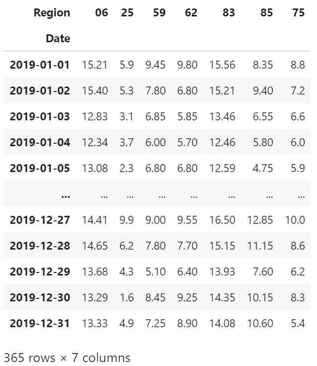

# 数据集上的 FDASRSF 包安装和使用

要在当前环境中安装 FDASRSF 软件包，只需运行:

```
*pip install fdasrsf*
```

*(注意:根据我的经验，您可能需要手动安装一个或两个额外的包来正确完成安装。您只需要检查 anaconda 日志，以防无法识别它们。)*

J. Derek Tucker 的 FDASRSF 软件包提供了许多有趣的函数，我们将使用其中的两个:**功能比对**和**功能主成分分析**(参见下面的相应文档) **:**

 [## 功能校准-FDA rsf 2 . 0 . 1 文件

### 使用 SRSF 框架和动态编程的组式函数对齐将一组函数对齐，同时…

fdasrsf-python.readthedocs.io](https://fdasrsf-python.readthedocs.io/en/latest/time_warping.html#) 

**功能校准**将在时间序列未完全校准的情况下同步时间序列。下图提供了一个相对简单的示例来理解这种机制。从相位和振幅的角度(也称为 x 轴和 y 轴)处理时间序列。

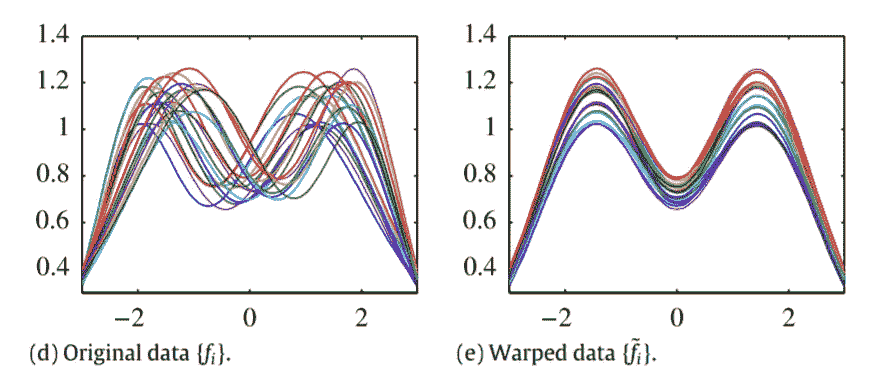

摘自 [J.D. Tucker 等人/计算统计和数据分析 61(2013)50–66](https://ani.stat.fsu.edu/~wwu/papers/TuckerCSDA13.pdf)

为了更准确地理解所涉及的算法，我强烈建议您看一看 J. Derek Tucker、吴伟和 Anuj Srivastava 的“[使用相位和振幅分离的函数数据生成模型](https://ani.stat.fsu.edu/~wwu/papers/TuckerCSDA13.pdf)”。

尽管通过简单地查看原始数据和变形数据很难注意到这一点，但我们可以观察到变形函数确实有一些小的变化(参见略滞后于 x=y 轴的黄色曲线)，这意味着这些函数在需要时同步了时间序列。(您可能已经猜到，温度记录是按照设计对齐的，因为它们是同时采集的。)

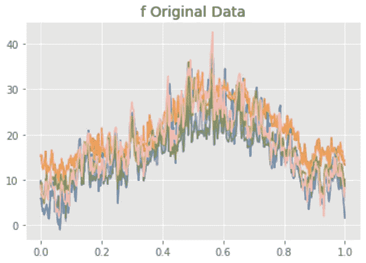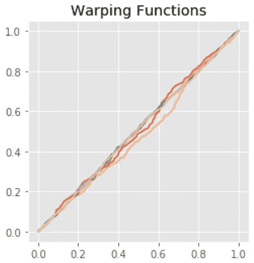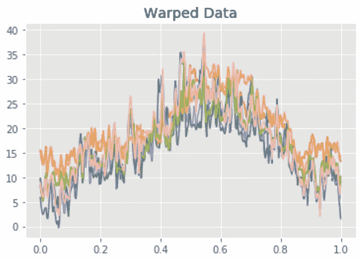

**功能主成分分析**

既然我们的数据集是“扭曲的”，我们可以运行一个功能性主成分分析。FDASRSF 软件包允许水平、垂直或联合分析。我们将使用垂直坐标，并为 PC1 和 PC2 绘制相应的函数和系数。

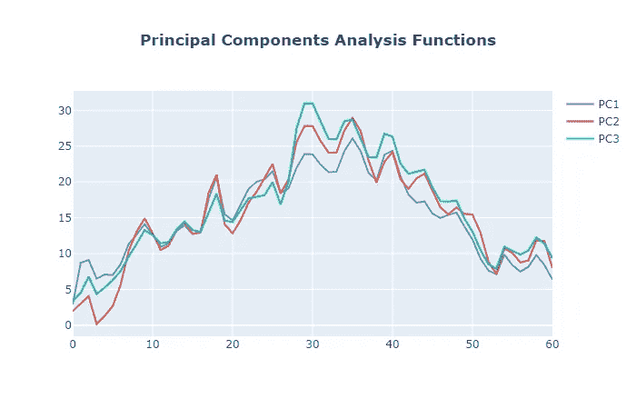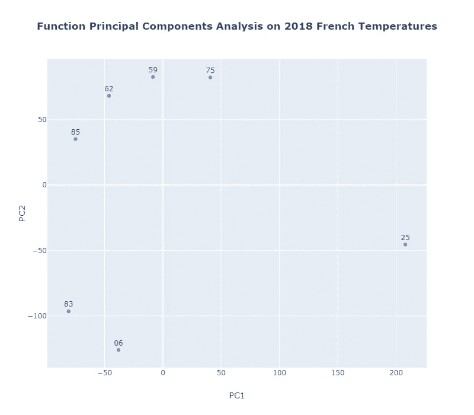

现在，我们可以根据在法国观察到的天气，在图上添加不同的天气模式:

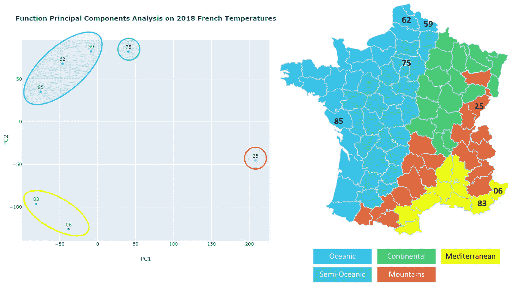

# 显而易见，这种聚类与法国观察到的天气有多吻合。

同样重要的是，我根据我经常居住、工作和旅行的地方任意选择了这些部门，但它们没有被选中，因为它们为该演示提供了良好的结果。我希望其他地区的结果质量相同。

也许你想知道一个标准的 PCA 是否也能提供一个有趣的结果？

下图是从原始数据集中提取的标准 PC1 和 PC2，显示其性能不如 FPCA:

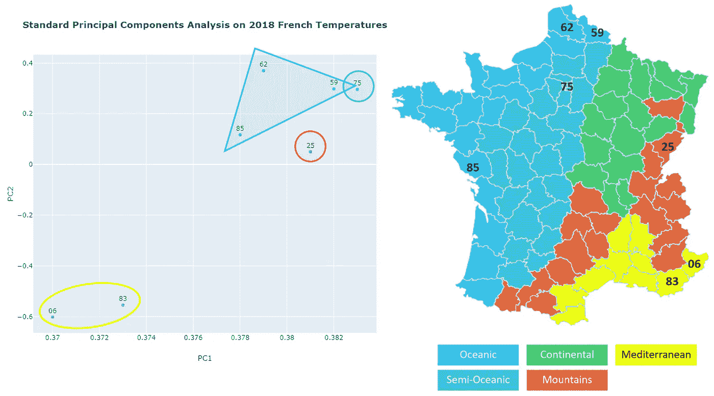

我希望这篇文章能让你更好地理解函数主成分分析。

**我还要衷心感谢 J. Derek Tucker，他耐心地指导我使用 FDASRSF 软件包。**

完整的笔记本存放在[这里](https://gist.github.com/pierrelouisbescond/9c0b8b925741e4376baf4883306a9022)。

[](https://pl-bescond.medium.com/pierre-louis-besconds-articles-on-medium-f6632a6895ad) [## 皮埃尔-路易·贝斯康德关于媒介的文章

### 数据科学、机器学习和创新

pl-bescond.medium.com](https://pl-bescond.medium.com/pierre-louis-besconds-articles-on-medium-f6632a6895ad)