# 超越变形金刚和拥抱脸的分类

> 原文：<https://towardsdatascience.com/beyond-classification-with-transformers-and-hugging-face-d38c75f574fb?source=collection_archive---------8----------------------->

## 对变压器架构进行探索性模型分析(EMA ),深入关注、嵌入和半监督学习。

> 在这篇文章中，我计划探索自然语言处理领域的前沿架构，比如 BERT/Transformers。我假设读者熟悉变压器架构。要了解更多，请参考杰伊·阿拉玛的帖子[这里](http://jalammar.github.io/illustrated-transformer/)和[这里](http://jalammar.github.io/illustrated-bert/)。我还将探索几个 BERT 变体，如 BERT-base 和 RoBERTa-base 模型，但是这些技术可以非常容易地扩展到更近的架构，这要感谢拥抱脸！

随着我开始潜入变形金刚的世界，最终进入伯特和它的兄弟姐妹，我遇到的一个共同主题是拥抱脸库([链接](https://huggingface.co/transformers/))。这让我想起了 scikit-learn，它为从业者提供了几乎所有算法的便捷访问，并提供了一致的界面。拥抱脸库已经实现了相同类型的一致且易于使用的界面，但这一次是在 NLP 世界中基于深度学习的算法/架构。我们将借助本库提供的这些接口来深入研究这些架构。

# 探索性模型分析

任何机器学习(ML)项目的主要组成部分之一是探索性数据分析(EDA)。在过去的几年里，我参与的每个 ML 项目都是从我和我的团队迭代地做 EDA 开始的，这有助于理解和制定一个具体的问题陈述。下面的图 1 展示了具有迭代 EDA 阶段的典型 ML 过程，该过程旨在回答关于数据的问题以帮助做出决策，通常是关于利用数据来解决特定业务问题的方法(*比如通过建模*)。

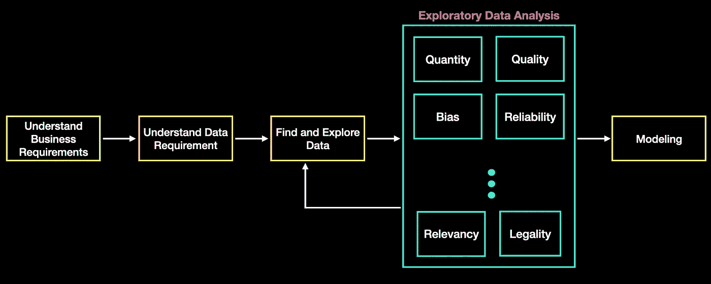

图 1:带有探索性数据分析(EDA)的典型 ML 流程

随着深度学习(DL)的出现，特别是迁移学习选项的出现，探索阶段现在已经超越了查看数据。它还需要另一个模型探索周期，让我们称之为 **EMA** **(探索性模型分析)**，它涉及理解模型架构、它们的预训练过程、进入预训练的数据和假设、架构的限制(*，例如输入大小、模型偏差、它们不能解决的问题类型*)，以及它们可以为下游任务进行微调的程度。换句话说，*分析* *他们在复训、少杆微调到零杆(就像他们在 GPT-3 世界里说的那样)*的光谱中处于什么位置。

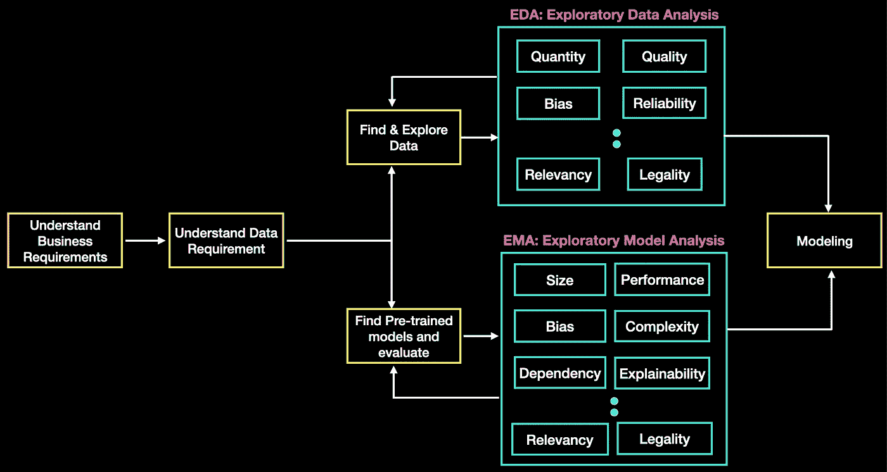

图 2: EDA + EMA:一个典型的既有 EDA(探索性数据分析)又有 EMA(探索性模型分析)的深度学习流程..或者我们应该叫它 EDMA？:)

在本文中，我将更多地关注 BERT 上的 EMA(以及类似的东西)，以了解除了对分类或问答进行微调之外，它还能提供什么。正如我前面所述，拥抱人脸库可以为我们提供窥视模型和探索模型各个方面所必需的工具。更具体地说，我想利用图书馆来回答以下问题-

1.  在给定权重的情况下，我如何能够窥视预训练模型架构并尝试解释模型结果？*如果你听说过注意力权重以及它们如何被用来解释这些模型，我们将探索如何使用拥抱面部库来访问它们，并可视化它们。*
2.  我如何访问类似 BERT 模型的不同层的输出？如果我必须在完全无人监督的情况下超越，我能从这些模型中期待什么样的输出质量？我们将提取单词和句子向量，并将它们可视化以分析相似性。此外，当我们在来自完全不同领域的数据集上微调这些模型时，我们将检查对这些向量和指标的质量的影响。简而言之*，如果我们没有特定领域的数据集进行微调，我们将如何前进？！*

这些问题源于两个痛点，**标签数据的有限可用性和可解释性**。与 Kaggle 竞赛不同，我参与的大多数现实世界项目都没有给我们一个好的带标签的数据集，挑战在于证明创建带标签数据的成本是合理的。第二个挑战，在一些项目中，也是提供模型行为解释的能力，以规避一些风险。

***事不宜迟，我们开始吧！:)***

# 轻松获取注意力权重:*走向阐释的一步*

今天所有基于变压器的架构都是基于注意机制。我发现理解注意力如何工作的基本原理有助于我探索如何将其作为一种解释工具。我计划在这篇文章中从高层次上描述这些层，并更多地关注如何使用变形金刚库从拥抱脸中提取它们。如果你需要深入了解注意力的概念，我建议你去看看杰伊·阿拉玛的博客(之前提供的链接)或者看一下克里斯·麦考密克和尼克·瑞安[的播放列表(这里是](https://www.youtube.com/watch?v=FKlPCK1uFrc&list=PLam9sigHPGwOBuH4_4fr-XvDbe5uneaf6))。

拥抱面部库为我们提供了一种访问所有隐藏层中所有注意力头部的注意力值的方法。在 BERT 基本模型中，我们有 12 个隐藏层，每个隐藏层有 12 个注意力头。每个注意力头部具有大小为 NxN 的注意力权重矩阵(N 是来自标记化过程的标记数量)。换句话说，我们总共有 144 个矩阵(12×12)，每个矩阵的大小为 NxN。每个令牌在每层输入或输出的最终嵌入大小为 768 *(来自每个注意力头的 64 维向量，即 64×12 = 768)*。*当你看到下面的图 4 时，这一点就很清楚了。*

图 3 提供了编码器层的架构。下面的图 4 深入图 3 中的**注意**块，并通过 BERT 基本模型的一个注意层(*为了简单起见，忽略 batch _ size*)提供了一个句子的简化的高级流程。这些图表有望清楚地说明当您通过库将 output_attentions 标志设置为 true 时将返回什么矩阵。

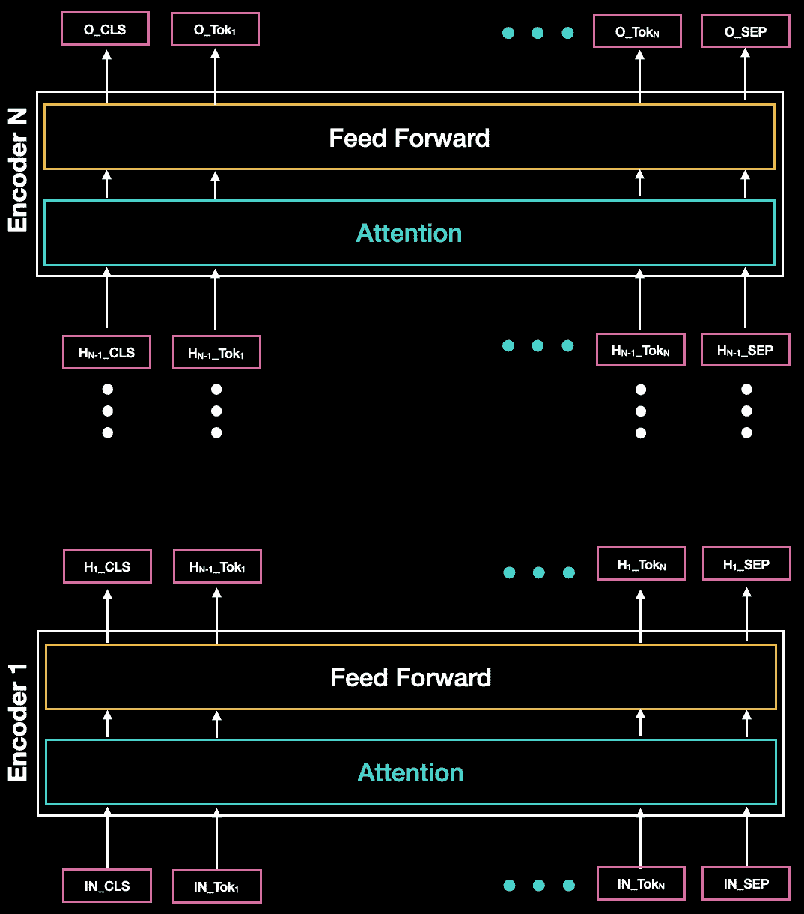

图 3:编码器堆栈的简图。如你所见，在每个编码器层之后，我们为每个令牌获得一个向量。下图(图 4)深入研究了其中一个编码器模块中的注意模块

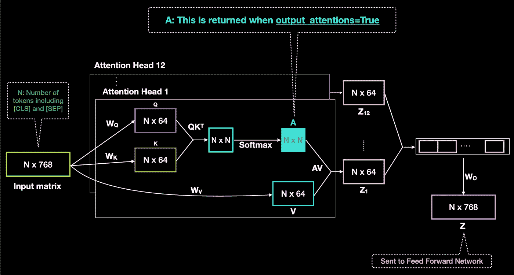

图 4:通过 BERT 基本模型的一个自我关注层的一个句子的简化的高级流程(为了简单起见忽略了批处理 dim)。输入矩阵 Nx768 (N 行，每个标记一行，每一行嵌入 768 个维度)流经注意力层(中间的方框)。当我们在 BertConfig 中设置 output_attention=True 时，它为每个 for attention head 返回矩阵‘A’。

***注*** *:我在这里找到了工具*[](https://arxiv.org/pdf/1906.05714.pdf)**和* [*这里*](https://github.com/tensorflow/tensor2tensor) *，这些工具使我们能够将注意力可视化。这些工具要么已经过时，要么不能实现所有最新的架构。此外，它们中的一个没有利用维护良好的 API(如 Hugging Face ),而是重新实现了其中的架构，这阻碍了为更新的架构运行东西的机会。**

*让我们快速浏览一下代码(*完整的笔记本可以在* [*这里找到*](https://github.com/nidharap/Notebooks/blob/master/Attentions_in_BERT.ipynb) )。这里所有的代码，除了微调，都可以在没有 GPU 的情况下运行*

*上面的代码创建了一个带有 **output_attentions=True** 的 Bert 配置，并使用这个配置来初始化 Bert 基本模型。我们将模型置于 eval 模式，因为我们只关心在这个任务的架构中向前传递。然后代码进入 tokenize 并向前传递。输出的形状基于文档[中描述的配置。前两项是最后层的 last_hidden_state 和可用于微调的 pooled_output。下一个输入是我们感兴趣的，也就是注意力。从最后三个语句可以看出，我们可以到达任何一层，任何一个注意力头，每个注意力头都会给我们一个我们感兴趣的 NxN 矩阵。](https://huggingface.co/transformers/model_doc/bert.html#bertmodel)*

*我们可以快速绘制 144 个矩阵的热图，如下所示*

*上面的代码有两个简单的功能:*

**“get _ attentions”导航到特定层和注意力头，并抓取要可视化的 NxN 矩阵**

**“PLT _ attentions”绘制作为热图传递的矩阵**

*作为我在完整笔记本[这里](https://github.com/nidharap/Notebooks/blob/master/Attentions_in_BERT.ipynb)中的 EDA 的一部分，我将所有 144 个热图绘制成一个网格，并浏览它们以找出一些注意力权重变化较大的热图。下面图 3 中的一个例子显示了“动物因为太累而没有过马路”这句话中单词“it”和“animal”之间的关系。*

*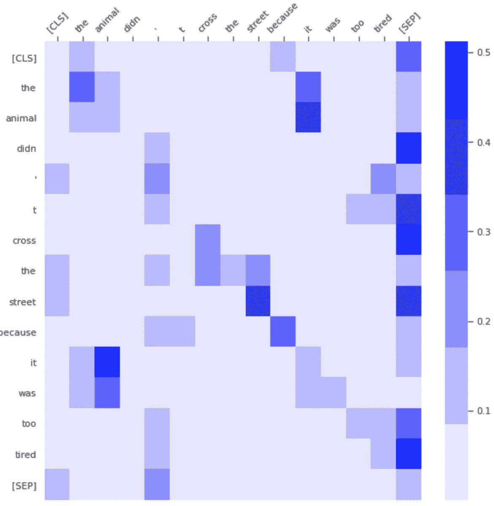*

*图 5:来自第 9 层和注意头 10 的句子“动物没有过马路是因为它太累了”的注意热图。我们可以看到“它”这个词对于“动物”来说有很大的分量。*

*正如你所看到的，只要对建筑有一些基本的了解，拥抱脸的变形金刚库就可以非常容易地从任何注意力集中点提取原始重量。既然我们已经讨论了如何提取原始权重，那么让我们讨论一下我们是否应该直接使用它们来解释模型已经学习到的内容。最近的一篇论文“量化变形金刚中的注意力流”正是讨论了这一方面。他们说*“在变压器的各层中，来自不同令牌的信息变得越来越混杂”**

*这意味着过多地解读这些权重来解释模型如何解构输入文本可能不是很有用。他们继续设计策略来帮助解释输入对输出的影响。我不会在这里深入讨论整篇论文，但简而言之，他们讨论了在架构之上构建有向无环图(DAG ),这将有助于跟踪输入对和隐藏令牌之间的路径和信息流。他们讨论了两种方法“注意力转出”和“注意力流”，这两种方法可用于将注意力权重解释为输入标记的相对相关性。简单地说，不要只关注特定层中的原始信息，而应该考虑从输入嵌入到特定隐藏输出的所有加权信息流。如果你有兴趣了解更多，你也可以参考这篇[文章](https://samiraabnar.github.io/articles/2020-04/attention_flow)，那篇文章用实例解释了这篇论文。*

***总之，为了解释特定输入的效果，我们不应该只看每一层中独立的原始注意力，而应该更进一步，使用它们来跟踪从输入嵌入到特定输出的所有方式的贡献。***

# *获取单词和句子向量:通向相似性的途径(以及聚类、分类等)。)*

*正如我们所讨论的，访问注意力层和相应的权重是非常容易的。拥抱脸库也为我们提供了从每一层输出的便捷途径。这允许我们生成单词向量，以及潜在的句子向量。*

***词向量***

*下面的图 6 显示了我们可以提取**单词级向量**的几种不同方式。我们可以对最后几层进行平均/求和/连接，得到一个矢量。假设是初始层(更接近输入)将学习低级特征(像 CNN 中的*，最后几层(更接近输出)将具有更丰富的单词表示。我们也可以只提取最后一层或倒数第二层作为单词/令牌向量。对于应该使用什么，并没有一致的意见，这实际上取决于下游任务的需求，*，如果我们试图在下游运行的任务足够简单，这可能并不重要。***

*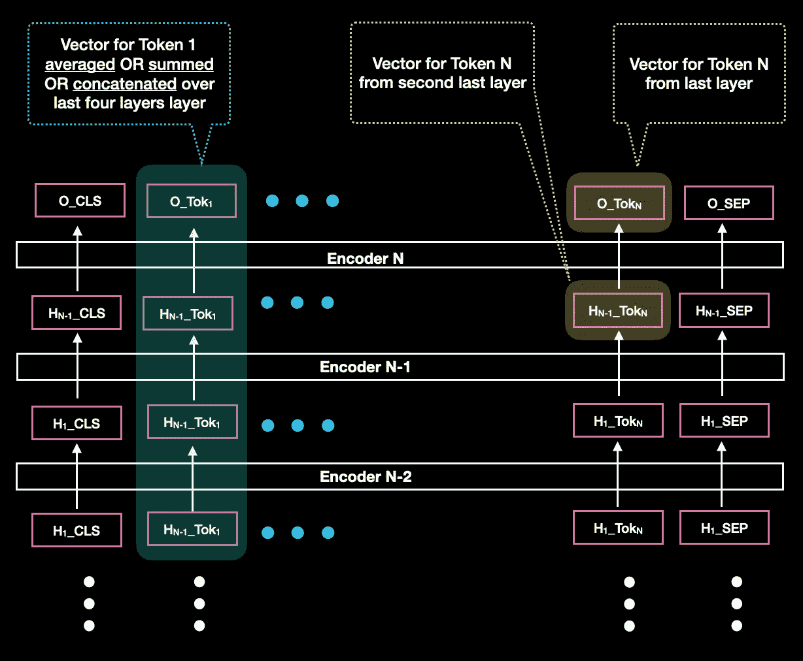*

**图 6 单词向量:*我们可以为每个单词提取向量的方法。在左侧，它显示了我们如何对最后 4 层进行平均、求和或连接，以获得 token-1 的一个向量。在右边，它显示了我们如何从最后一层或倒数第二层访问 Token-N 的向量。*

***词语相似度***

*一旦我们有了单词向量，我们就可以在下游任务中使用它们，比如相似性。我们可以使用 PCA 或 tSNE 等降维技术直接将它们可视化。相反，我通常先在高维空间中寻找这些向量之间的距离，然后使用像多维标度(MDS；*ref*[*Link*](https://en.wikipedia.org/wiki/Multidimensional_scaling))可视化距离矩阵。下面的图 7 总结了这种方法(*我们也可以对句子这样做，只要我们计划直接访问句子向量，在后面的文章*中会有更多的介绍):*

*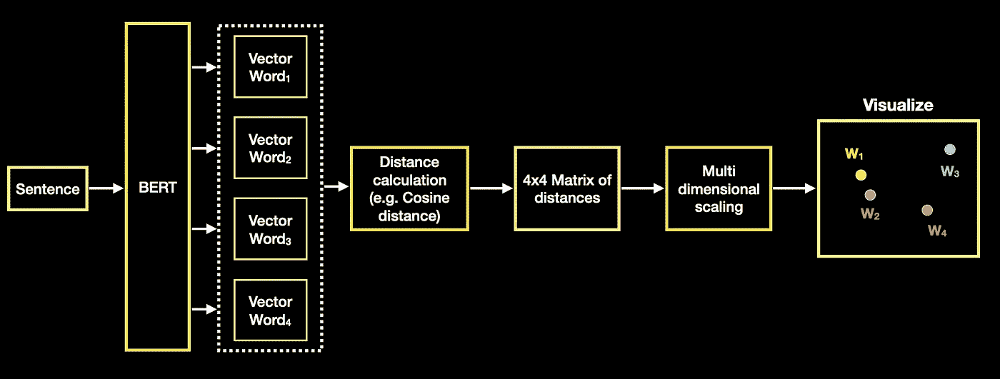*

*图 7:如何对 4 个单词使用余弦距离+ MDS(多维标度)来可视化单词向量的流程*

***实现:词语相似度***

*让我们开始查看一些实现上述流程的代码。*完整的 colab 笔记本可以在* [*这里找到*](https://github.com/nidharap/Notebooks/blob/master/Word_Embeddings_BERT.ipynb)*

*我们将遵循与初始化和可视化注意力权重相同的过程，除了这次我们在初始化模型时使用"**output _ hidden _ States = True "**。*

*我们还切换到 encode_plus 而不是 encode，这将有助于我们添加 CLS/SEP/PAD 令牌，而且工作量要小得多。我们围绕它建立一些额外的逻辑，以获得掩盖焊盘和 CLS/sep 的注意力屏蔽。*注意下面函数*中的返回值*

*让我们定义模型，并在例句上调用它。*

*让我们定义几个辅助函数:*

*   ***get_vector** :根据需要提取矢量*(如上图等中所讨论的跨多个层的连接/求和。)**

*   ***plt_dists** :绘图距离矩阵通过。这将计算通过距离矩阵的 MDS 图。*

*   ***eval_vecs** :将 get_vector 和 plt_dists 结合在一起，获得句子的单词向量*

*就是这样！我们现在准备好在不同的配置中可视化这些向量。让我们来看其中的一个，连接最后 4 层的单词向量，并可视化。我们通过两个句子*

```
*texts = [
"Joe took Alexandria out on a date.",
"What is your date of birth?",
]*
```

*然后调用函数来绘制相似性*

```
*MODE = 'concat'eval_vecs(hidden_states, tokenized_sents, mode='concat')*
```

*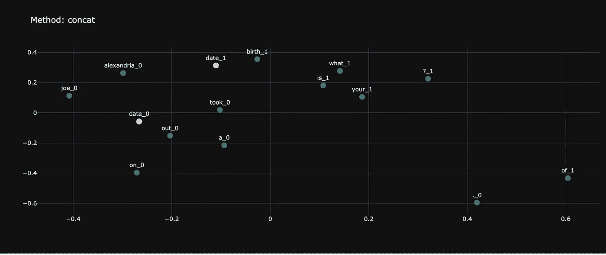*

*图 8:如您所见，date_0 和 date_1 是不同的向量，更接近于各自句子中的其他单词。这使得我们现在可以根据它们出现的句子来使用它们(即“语境化”)*

***句子向量***

*基于编码器的模型为我们提供了几个选项来从架构中获取句子向量。图 9 向我们展示了这些选项:*

1.  *可以使用 CLS 令牌的最后一层(或最后 n 层的平均)来提取句子向量。我尝试提取和可视化基于 CLS 令牌的句子相似性，但它没有给我好的结果。*

> **BERT 作者的一个快速注释:这个输出通常不是输入的语义内容的很好的总结(* [*来源*](https://huggingface.co/transformers/model_doc/bert.html#bertmodel) *)。**

*2.整个句子的平均记号向量。如上所述，标记向量本身可以来自最后 N 层的连接/平均，或者直接来自第 N 层。*

*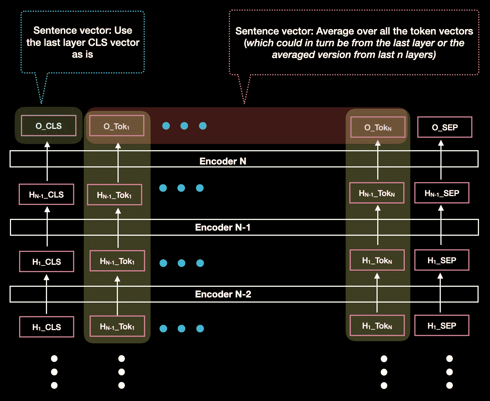*

**图 9:可以直接使用最后一层 CLS 记号来提取句子向量，或者可以对句子中的所有记号进行平均，这些记号又可以来自最后一层、倒数第二层或者对几层进行平均，如图 6 所示。**

***句子相似度***

*两个句子的相似性是非常主观的。两个句子在一个上下文中可能非常相似，而在另一个上下文中可能被视为相反。例如，两个句子可以被称为相似，因为它们谈论的是某个主题，并且可以讨论该主题的积极和消极方面。这些句子可以被认为是相似的，因为它们谈论的是一个共同的话题，但如果重点是句子的极性，则被认为是对立的。这些架构中的大多数都是在独立的目标上训练的，如掩蔽语言模型(MLM)和下一句预测(NSP)，并且是在大型的不同数据集上训练的。根据手头的任务，我们现成的相似性可能相关，也可能不相关。*

*不管怎样，看看我们理解相似性的选择是很重要的。下面的图 11 在下面的流程图中用句子相似性总结了我们的选项。*

*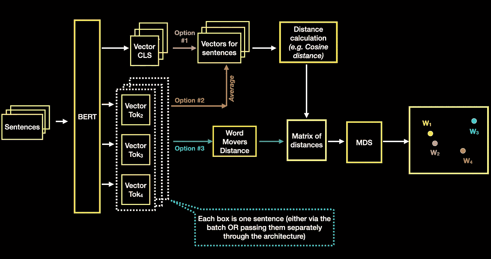*

*图 11:使用类伯特模型计算句子相似度的不同方法*

*上面的选项#1 和选项#2 提取并尝试创建句子向量，然后可以使用我们为单词向量相似性构建的相同管道。*

*选项#3 试图直接从单词向量计算两个句子之间的相似度，而不是试图显式地创建句子向量。这使用了一种叫做单词移动距离(WMD)的特殊度量。*

*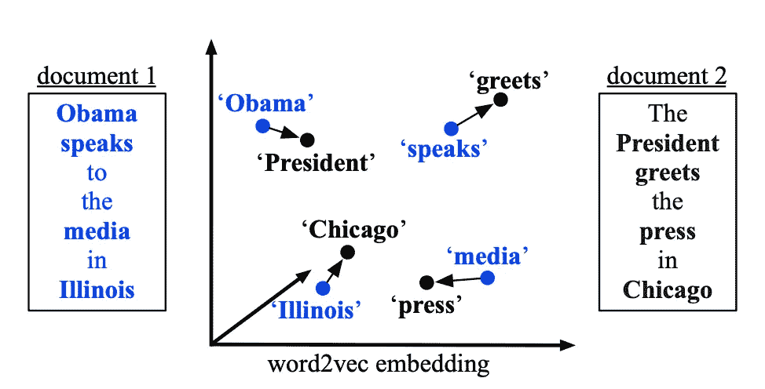*

*图 10: WMD 计算:左边的句子如何转换“移动”到右边的句子*

*你可以在这里阅读 WMD [的原始论文，但简而言之，它是基于 EMD(地球移动距离)的，并试图使用单词向量将单词从一个句子移动到另一个句子。图 10 显示了一个直接来自论文的例子。这里的](http://proceedings.mlr.press/v37/kusnerb15.pdf)[有一个很好的实现](https://github.com/src-d/wmd-relax)，这里的[有一个很棒的解释](https://stats.stackexchange.com/questions/303050/word-movers-distance-calculation-between-word-pairs-of-two-documents)*

***实现:句子相似度***

*运行句子相似性选项的代码可以从 colab 笔记本这里 [*这里*](https://github.com/nidharap/Notebooks/blob/master/Sentence_Embeddings_RoBERTa.ipynb) 获得*

*大部分代码与我们之前讨论的单词嵌入非常相似，除了计算单词移动距离。下面的类使用 [WMD-relax](https://github.com/src-d/wmd-relax) 库计算单词移动距离。它需要访问一个嵌入的查找，当一个单词被传递时，它产生一个向量。*

*定义用于计算从 BERT 中提取的向量的 WMD 的类。这需要一个嵌入的查找字典。在内部，它计算 n-bow，这实质上是基于单词在句子中的数量的单词分布。*

# *迁移学习的潜力:*

*对于基于 Transformer 的模型，我遇到了两个层次的迁移学习:*

*   *预训练模型中包含的默认学习内容。伯特/罗伯塔等模特。来接受大型语料库的预训练，给我们一个起点*
*   *针对特定任务学习对架构进行微调，这是这些架构目前的典型使用方式(例如，使用来自领域的数据集构建分类器/问答系统)*

*我处理的问题通常没有特定领域的标注数据集。这让我开始探索第三个选项**:***

*   ***如果我对来自不同领域的数据集的模型进行微调，会怎么样？如果我确定目标是相似的，即使我知道会有协变，我还能转移学习吗？** *(协变量移位是训练和测试/实时数据中存在的输入变量分布的变化)。**

*为了了解这种迁移学习的方法是否有效，让我们做一个快速实验。让我们选择情绪/极性作为我们实验的目标。*

*我们采用预训练的 RoBERTa 模型，**在来自 **IMDB 50K 电影评论**的**训练** **集**上微调**该模型，然后挑选我们的**评估数据集**如下:*

*   *来自 **IMDB 50k 电影评论测试**数据集的两句话*

```
***Positive**: *'This is a good film. This is very funny. Yet after this film there were no good Ernest films!'***Negative**: *'Hated it with all my being. Worst movie ever. Mentally- scarred. Help me. It was that bad.TRUST ME!!!'**
```

*   *2 句来自**亚马逊美食评论，**来自**完全不同领域的数据集。**我们仅将此用于评估*

```
****Positive****: 'This taffy is so good.  It is very soft and chewy.  The flavors are amazing.  I would definitely recommend you buying it.  Very satisfying!!'***Negative**: *"This oatmeal is not good. Its mushy, soft, I don't like it. Quaker Oats is the way to go."**
```

*然后，我们在基础预训练模型(在这种情况下是 RoBERTa 体系结构)和相同体系结构上的微调模型上提取和可视化句子相似性*

*微调 BERT 的代码可从[这里](https://github.com/nidharap/Notebooks/blob/master/IMDB_Classification.ipynb)获得。*

# ***对比:***

1.  ***让我们通过可视化通过平均单词向量获得的句子向量之间的余弦相似性来进行第一次比较，单词向量本身是来自最后四层的平均版本** ( *我知道这很拗口，但如果你需要澄清其中的任何一点，请随意滚动到我们详细讨论它们的地方*)。*

****图例:黄色圆圈为正，粉色圆圈为负****

*下面的图 11 显示了在预训练模型上运行的可视化:*

*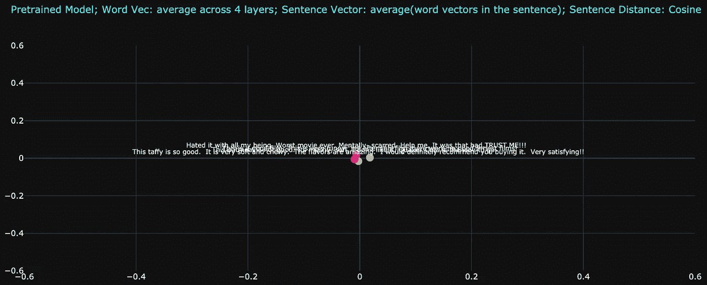*

*图 11 预训练模型:向量彼此非常接近。我们需要放大才能更好地理解。*黄色圆圈为正，粉色圆圈为负**

*下图 12 显示了与图 11 相同的图，但是放大了(*注意轴有不同的范围*)。这表明，虽然向量之间的距离确实很小，但放大后，我们看到该模型确实试图将讨论主题(食物)的句子放置得彼此更近，更倾向于讨论的主题而不是句子的极性(*见底部的两个圆圈，一个黄色，一个粉红色*)*

*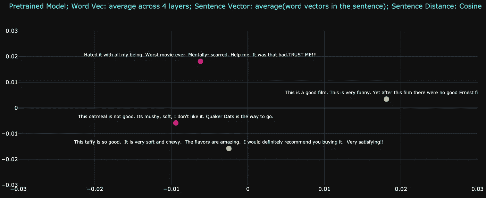*

*图 12 预训练模型:放大后，我们看到它确实试图将讨论主题(食物)的句子放得更近，更倾向于讨论的主题而不是句子的极性。黄色圆圈是正的，而粉色圆圈是负的*

*现在让我们看看下面图 13 中通过微调模型传递的相同句子。请注意，基于极性，句子之间的距离更近了。正如你所注意到的，它已经将焦点从讨论的主题(食物/电影)转移到极性(积极与消极):来自电影评论数据的积极句子更接近来自食物评论数据集的积极句子，正如负面例子的情况一样。这正是我们需要的！**我们想要使用一个来自完全不同领域的数据集，但是具有相似的标记目标，来转移学习！***

*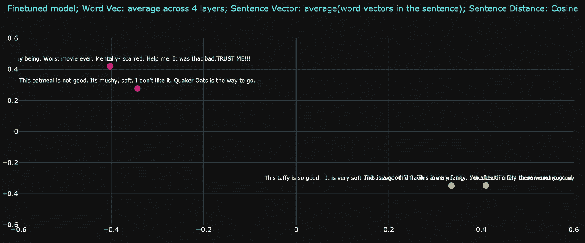*

*图 13 微调模型:正如你所注意到的，它已经将焦点从讨论的主题(食物对电影)转移到了极性(积极对消极)。黄色圆圈是正的，而粉色圆圈是负的*

***2。让我们通过可视化单词移动距离(WMD)来进行第二轮比较，该距离是根据最后四层的平均单词向量计算的。***

*下面的图 14 显示了与上面模型相似的特征。讨论的主题(食物)似乎仍然是焦点。这里的一个主要区别是，单词移动距离(WMD)能够比早期的方法更好地梳理出距离(*将余弦距离应用于跨句子的平均单词向量*)，即使在基本模型上也是如此，即没有必要在这里放大。这表明平均单词向量可能会对下游任务产生意想不到的后果。*

*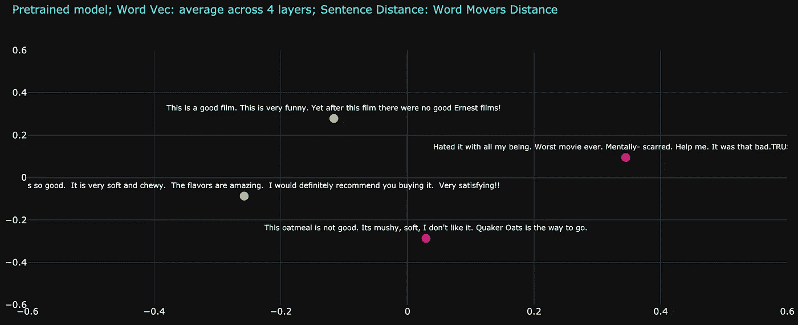*

*图 14:距离度量，单词移动距离(WMD ),显示了相似的特征，但是比平均方法更有助于区分句子。黄色圆圈是正的，而粉色圆圈是负的*

*下面的图 15 显示了使用微调模型的四个句子的相同 WMD 度量，这再次表明我们能够将模型的焦点“转移”到极性。*

*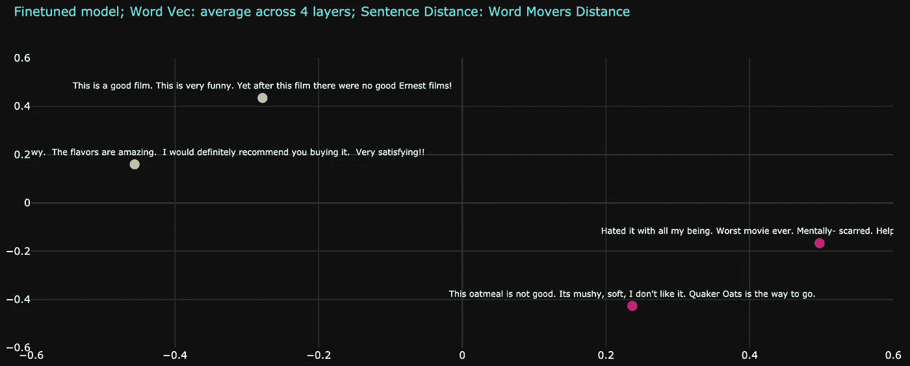*

*图 15:使用微调模型的四个句子的 WMD 度量。黄色圆圈是正的，而粉色圆圈是负的*

***总之，从不相关的领域数据集进行迁移学习的能力将为当今与数据斗争的项目开辟更多的途径。变压器的力量现在可以使公司利用以前不可用的数据集，而不必花时间创建带标签的数据集。***

*我希望这篇文章是有帮助的。很少有其他主题，如 NLP 中的数据扩充、通过 LIME(局部可解释模型不可知解释)等技术的模型解释等。这引起了我的兴趣，我计划在以后的文章中探索它们。在此之前，感谢阅读！*

# ***参考文献:***

 *[## BERT -变压器 3.0.2 文档

### BERT 模型是在 BERT:用于语言理解的深度双向转换器的预训练中提出的…

huggingface.co](https://huggingface.co/transformers/model_doc/bert.html#bertmodel)*  *[## BERT:用于语言理解的深度双向转换器的预训练

### 我们介绍了一种新的语言表示模型，称为 BERT，代表双向编码器表示…

arxiv.org](https://arxiv.org/abs/1810.04805)* *[](http://jalammar.github.io/illustrated-transformer/) [## 图示的变压器

### 讨论:黑客新闻(65 分，4 条评论)，Reddit r/MachineLearning (29 分，3 条评论)翻译…

jalammar.github.io](http://jalammar.github.io/illustrated-transformer/)  [## 量化变压器中的注意力流

### 在 Transformer 模型中，“自我注意”将来自注意嵌入的信息结合到“自我注意”的表征中

arxiv.org](https://arxiv.org/abs/2005.00928) [](https://samiraabnar.github.io/articles/2020-04/attention_flow) [## 量化《变形金刚》中的注意力流|周欣宇·阿布纳

### 注意力已经成为神经序列处理模型的关键组成部分，而可视化的注意力权重是…

samiraabnar.github.io](https://samiraabnar.github.io/articles/2020-04/attention_flow)  [## seaborn.heatmap - seaborn 0.10.1 文档

### 海博恩。热图(data，vmin=None，vmax=None，cmap=None，center=None，robust=False，annot=None，fmt='.2g'…

seaborn.pydata.org](https://seaborn.pydata.org/generated/seaborn.heatmap.html) [](https://github.com/src-d/wmd-relax) [## 放松点

### 计算单词移动器的距离，如马特·库斯纳，孙玉的《从单词嵌入到文档距离》中所述…

github.com](https://github.com/src-d/wmd-relax) [](https://www.kaggle.com/snap/amazon-fine-food-reviews) [## 亚马逊美食评论

### 分析来自亚马逊的约 500，000 条美食评论

www.kaggle.com](https://www.kaggle.com/snap/amazon-fine-food-reviews) [](https://www.kaggle.com/atulanandjha/imdb-50k-movie-reviews-test-your-bert) [## IMDB 50K 电影评论(测试你的 BERT)

### 用于语言翻译模型的 Pytorch-nlp 电影数据集(ULMFiT、BERT、OpenAI)

www.kaggle.com](https://www.kaggle.com/atulanandjha/imdb-50k-movie-reviews-test-your-bert) [](https://en.wikipedia.org/wiki/Multidimensional_scaling) [## 多维标度

### 多维标度(MDS)是一种可视化数据集单个案例相似程度的方法。MDS…

en.wikipedia.org](https://en.wikipedia.org/wiki/Multidimensional_scaling) [](https://stats.stackexchange.com/questions/303050/word-movers-distance-calculation-between-word-pairs-of-two-documents) [## 两个文档的词对之间的词移动器距离计算

### begingroup$文档中的每个单词都与所有其他单词相匹配，但由流矩阵$\bf{T}$ (with…

stats.stackexchange.com](https://stats.stackexchange.com/questions/303050/word-movers-distance-calculation-between-word-pairs-of-two-documents) 

https://arxiv.org/pdf/1906.05714.pdf*