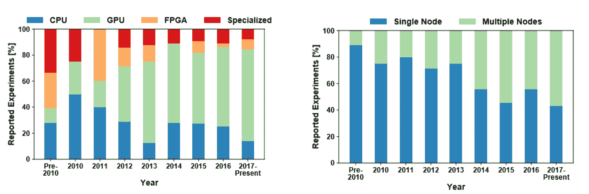
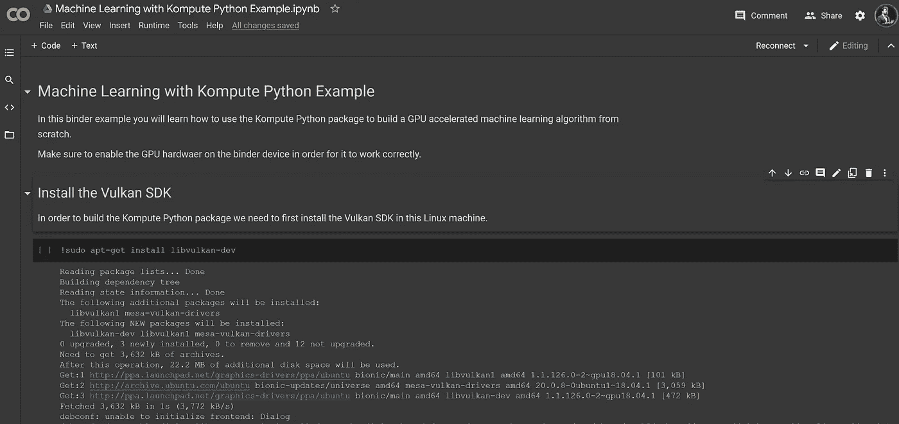
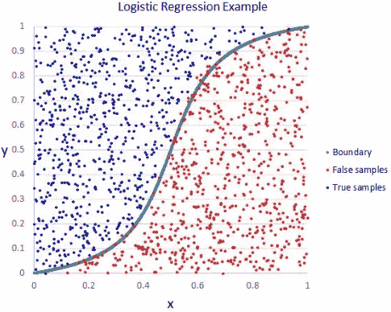
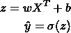
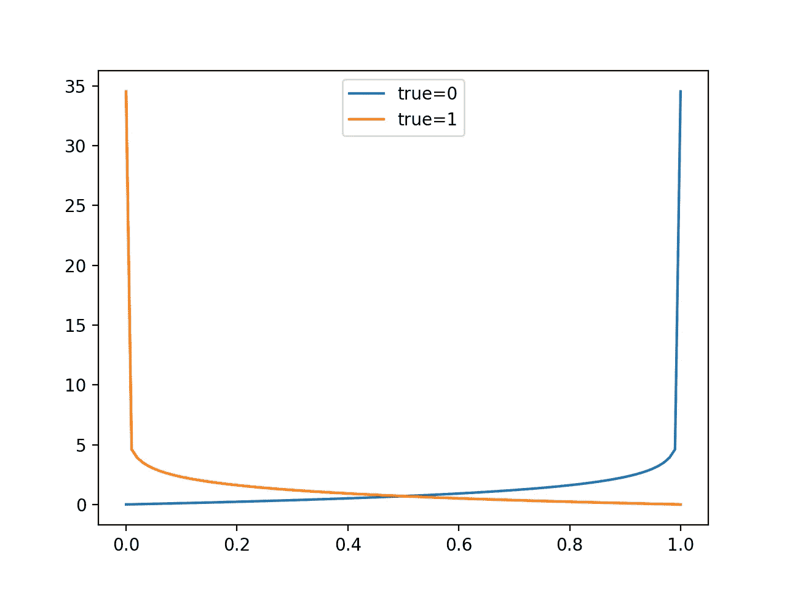
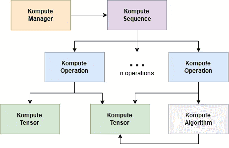

# 超越 CUDA: GPU 加速 Python，简化跨厂商显卡的机器学习

> 原文：<https://towardsdatascience.com/beyond-cuda-gpu-accelerated-python-for-machine-learning-in-cross-vendor-graphics-cards-made-simple-6cc828a45cc3?source=collection_archive---------10----------------------->

## 跨供应商显卡(AMD、高通、NVIDIA & friends)上 GPU 加速 Python 的实际深度探讨使用 Kompute Python 框架和 Vulkan SDK 构建机器学习算法

博客帖子的视频版本

机器学习算法——以及许多其他高级数据处理范式——非常适合 GPU 计算提供的并行架构。这推动了近年来用于加速计算的显卡的发展和采用的大幅增长。这也推动了围绕并发优化技术的令人兴奋的研究，例如[模型并行](https://mxnet.apache.org/versions/1.7/api/faq/model_parallel_lstm.html)和[数据并行](https://en.wikipedia.org/wiki/Data_parallelism)。

在本文中，您将学习如何用 Python 编写自己的 GPU 加速算法，您将能够在几乎任何 GPU 硬件上运行这些算法，包括非 NVIDIA GPUs。我们将介绍核心概念，并展示如何用几行代码就能开始使用 [**Kompute Python 框架**](https://github.com/axsaucedo/vulkan-kompute#vulkan-kompute) **。**

本农、塔尔和托尔斯滕·霍夫勒。“揭开并行和分布式深度学习的神秘面纱:深度并发分析。”*美国计算机学会计算调查(CSUR)*52.4(2019):1–43。

首先，我们将构建一个简单的 GPU 加速 Python 脚本，该脚本将并行相乘两个数组，这将介绍 GPU 处理的基础知识。然后，我们将在 GPU 上从头开始编写一个逻辑回归算法。以下是我们将涉及的核心主题，以及相应的资源链接:

1.  [Kompute python 包](https://pypi.org/project/kp/)安装
2.  Python 中 GPU 加速的[数组乘法示例](https://github.com/EthicalML/vulkan-kompute/blob/master/python/test/test_array_multiplication.py)
3.  Python 中 GPU 加速的[逻辑回归示例](https://github.com/EthicalML/vulkan-kompute/blob/master/python/test/test_logistic_regression.py)

阅读这篇文章的人只需要**基本编程经验**，不需要 GPU 计算知识。你可以在 [**主库**、](https://github.com/EthicalML/vulkan-kompute)中找到完整的代码，我们还创建了一个在线 Google Colab 笔记本，在那里你可以免费使用 GPU 运行这个例子——你可以在 [**中找到这个链接**](https://github.com/EthicalML/vulkan-kompute/tree/master/examples/python) 。

带有 GPU 示例的 Google Colab 笔记本

# 进入 Kompute & Vulkan SDK

我们今天将使用的 Python 框架有两个部分，这两个部分都在名称本身中——Vulkan SDK 和 Kompute。

与 Khronos 成员一起玩“瓦尔多在哪里”(图片由 Vincent Hindriksen 通过 [StreamHPC](https://streamhpc.com/blog/2017-05-04/what-is-khronos-as-of-today/) 提供)

Vulkan SDK 是由 Khronos Group 领导的一个开源项目，Khronos Group 是一个由众多技术公司组成的联盟，致力于定义和推进移动和桌面媒体(和计算)技术的开放标准。

大量备受瞩目的(和新的)机器学习框架，如谷歌的 [Tensorflow](https://github.com/tensorflow/tensorflow) 、脸书的 [Pytorch](https://github.com/pytorch/pytorch) 、腾讯的 [NCNN](https://github.com/Tencent/ncnn) 、阿里巴巴的[MNN](https://github.com/alibaba/MNN)——等等——已经采用 Vulkan 作为他们的核心跨供应商 GPU 计算 SDK。这主要是为了启用跨平台和跨厂商显卡支持的框架。

正如您所想象的，Vulkan SDK 提供了对 GPU 的非常低级的 C / C++访问，这允许非常专业的优化。这对 GPU 计算来说是一项巨大的资产，主要缺点是冗长，需要 500–2000 多行 C++代码才能获得编写应用程序逻辑所需的基本样板文件。这可能导致昂贵的开发周期和错误，从而导致更大的问题。这是我们启动 Kompute 项目的主要动机之一。

[**Kompute Python 包**](https://github.com/EthicalML/vulkan-kompute#vulkan-kompute) 通过优化的 C++绑定构建在 Vulkan SDK 之上，暴露了 Vulkan 的核心计算能力。Kompute 是 Python [GPGPU 框架](https://en.wikipedia.org/wiki/General-purpose_computing_on_graphics_processing_units)，我们将在本教程中使用它来构建 GPU 加速机器学习算法。

Kompute [文档](https://ethicalml.github.io/vulkan-kompute/)(图片由作者提供)

# 安装 Python Kompute 包

为了让我们开始使用 Kompute Python 包，我们需要安装它所需的依赖项。该包在 Pypi 中可用，这意味着我们可以用`pip install`来安装它。但是，在使用机器之前，您需要在机器上安装以下关键组件:

*   CMAKE v3.41+(安装在 [Windows](https://tulip.labri.fr/TulipDrupal/?q=node/1081) 、 [Linux (Ubuntu)](https://vitux.com/how-to-install-cmake-on-ubuntu-18-04/) 、 [Mac](https://stackoverflow.com/a/59825656/1889253) )
*   通过[官网](https://vulkan.lunarg.com/sdk/home)安装的 Vulkan SDK
*   C++编译器(例如用于 linux / mac 的 gcc，用于 Windows 的 MSVC)

一旦安装了这些依赖项，您只需运行:

*   `pip install kp==0.5.1`

您现在应该会看到一条成功消息，确认 Kompute Python 包已经安装。你可以在库中提供的 Google Colab 笔记本[中自己尝试一下，可以用 GPU 设置。](https://github.com/EthicalML/vulkan-kompute/tree/master/examples/python)

# 编写你的第一个 Kompute: GPU 乘法

为了使用 Kompute 构建我们的第一个简单的数组乘法 GPU 计算应用程序，我们将编写一个简单的 python 程序来完成以下任务:

1.  创建一个 Kompute 管理器(默认选择设备 0)
2.  创建 Kompute 张量来保存数据(两个输入一个输出)
3.  在 GPU 中初始化 Kompute 张量
4.  定义在 GPU 上运行的代码
5.  针对 Kompute 张量调度 GPU 着色器执行
6.  使用 Kompute 操作将 GPU 输出数据映射到本地张量
7.  打印您的结果

所需的完整 Python 代码非常少，因此我们可以在下面展示完整的脚本。我们将更详细地分解每个部分。

## 1.创建一个 Kompute 管理器(默认选择设备 0)

首先，我们将创建 Kompute 管理器，它负责创建和管理所有底层 Vulkan 资源。

正如你所看到的，这里我们正在初始化我们的 Kompute 管理器，默认情况下，它在设备 0 上创建所有的基本 Vulkan 资源(在我的例子中，它是一个 NVIDIA 卡，设备 1 是我的集成显卡)。对于更高级的用例，还可以提供您想要加载的底层 GPU 队列——在[另一篇教程](/parallelizing-heavy-gpu-workloads-via-multi-queue-operations-50a38b15a1dc)中，我们展示了这如何导致显著的加速，但这超出了本文的范围。

## 2.创建 Kompute 张量来保存数据(两个输入一个输出)

我们现在将创建用于输入和输出的 Kompute 张量。这些将保存所需的数据，这些数据将被映射到 GPU 来执行这个简单的乘法。

创建张量时，数据仅在本地 CPU 内存(即 RAM)中初始化，但是为了在 GPU 中使用它，我们必须将数据映射到 GPU 内存中。

## 3.在 GPU 中初始化 Kompute 张量

现在我们已经用本地数据创建了张量，我们将把数据映射到 GPU 中。为此，我们将使用`eval_tensor_create_def`，它将初始化底层 Vulkan 缓冲区和 GPU 内存，并执行各自到 GPU 的映射。

## 4.定义在 GPU 上运行的代码

现在我们已经初始化了必要的 Kompute 张量分量，并且它们被映射到 GPU 内存中，我们可以添加将在 GPU 中执行的 Kompute 算法。这被称为“着色器”代码，我们使用`pyshader` 库构建它。你可以在下面看到完整的着色器代码，我们将分解下面的每一部分。

GPU 着色器代码可以用装饰器`@ps.python2shader`定义为 Python 函数，这里的参数包括我们将使用的变量。这包括我们将要处理的张量输入和输出，参数格式如下:

*   `<param≥=(“<memory>”, <binding>, <type>, ...)`

在这种情况下，我们使用带浮点值的张量，它本质上等同于`ps.Array`值，用`ps.f32`浮点值作为元素。

第一个参数`index`的类型为`GlobalInvocationId`，为着色器提供执行 GPU 分派结构中的当前索引位置。这使我们能够知道我们当前正在并行执行循环中运行什么索引，这是我们从组件`i = index.x`中提取的内容——我们在这里选择`x`的原因是因为执行索引可以定义为一个`vec3`组件，其中将有`inedx.x`、`index.y`和`index.z`的执行索引。

最后一部分是实际使用的等式，在这种情况下，它是第一个和第二个参数的简单乘法，并存储在输出(第三个)参数中。

## 5.针对 Kompute 张量调度 GPU 着色器执行

为了运行上面的着色器，我们将使用`eval_algo_data_def` 函数。这个 Kompute 操作所需的参数包括绑定到 GPU 指令的张量，以及我们在上面的 Python 函数中定义的 GPU 着色器代码。

值得一提的是，Kompute 还允许用户将着色器作为原始 glsl 字符串传递，或者作为 SPIR-V 二进制文件或原始 glsl/hlsl 文件的文件路径。对于上下文， [SPIR-V 是 GPU 可以用来处理相关操作的中间表示](https://www.khronos.org/opengl/wiki/SPIR-V)。

## 6.使用 Kompute 操作将 GPU 输出数据映射到本地张量

一旦算法成功运行，结果数据现在将被我们保存在我们的输出张量的 GPU 内存中。我们现在可以使用函数`eval_tensor_sync_local_def`将张量 GPU 内存同步到本地张量中。

## 7.打印您的结果

最后，我们可以打印出张量的输出数据。

当你运行它时，你会看到输出张量的值被打印出来。就这样，你写了你的第一个 Kompute！

虽然看起来不明显，但上面介绍了 GPU 计算中核心概念和设计思维的一些直觉，同时还抽象了一些更深入的概念。在接下来的几节中，我们将提供更具体的术语，最后我们还将概述一组文章，如果您有兴趣了解更多信息，可以深入研究。

# 潜入机器学习直觉

现在，我们将研究更高级的 GPU 计算用例，具体实现“你好，机器学习世界”:**逻辑回归**。在讨论实现之前，我们将提供一些概念和术语的直觉，这些概念和术语将在下面的章节中使用。

在机器学习中，我们总是有两个阶段，训练和推理。在下图中，您可以看到两个简化的流程。最上面是训练流程，在这里你识别一些数据，提取一些特征，训练一个模型，直到你对精度满意为止。一旦您有了一个经过训练的模型，您就可以持久化模型“权重”,并将模型部署到第二个工作流中，在第二个工作流中，模型将对看不见的数据执行推理。

数据科学流程(图片由作者提供)

在这种情况下，我们将有一个输入数据集`X`，其中每个元素是一对`xi`和`xj`。我们的输入数据如下:

*   `xi = { 0, 1, 1, 1, 1 }`
*   `xj = { 0, 0, 0, 1, 1 }`

利用该输入数据，要预测的预期目标值`Y`将如下:

*   `Y = {0, 0, 0, 1, 1}`

来自 [DS Central](https://www.datasciencecentral.com/profiles/blogs/why-logistic-regression-should-be-the-last-thing-you-learn-when-b) 的逻辑回归示例

我们在机器学习中的核心目标是学习使用这些训练数据来找到函数(和参数),这将允许我们从新的“以前看不见的”输入中预测值`Y`。

值得注意的是，预测值将被定义为`ŷ`，它是用我们的“预测”函数计算的值，不同于我们上面定义的`Y`的“真”或“实际”值。

我们将用于逻辑回归的函数如下:

让我们来分解这个函数:

*   `z` —是我们的线性映射函数
*   `ŷ`—结果预测输出
*   `X`ᵀ——向量矩阵的转置，我们将表示为`x_i`和`x_j`
*   `σ`—sigmoid 函数，将在下文详细介绍

我们希望通过机器学习算法学习的参数是:

*   `w` —将应用于输入的权重
*   `b` —将要添加的偏差

还有环绕函数`σ` 也就是 sigmoid 函数。该函数迫使我们的输入更接近 0 或 1，这可以直观地视为我们的预测为“真”或“假”的概率，定义如下:

这就是现在的预测/推理功能，它将允许我们处理来自新数据点的预测。例如，如果我们说我们有一组新的看不见的输入`X = { (0, 1) }`，并且我们假设在通过我们的训练数据运行我们的机器学习算法之后，学习到的参数是`W = (1, 1), b = 0` (稍后我们将这样做)，那么我们将能够通过我们的预测函数来运行它，方法是将这些值代入如下:

在这种情况下，预测是`0.73...`，这将是一个积极的预测。当然，这只是为了演示一旦我们知道了参数`W`和`b.`，我们的推理函数会是什么样子

从 [ML 学院](https://mi-academy.com/2018/10/04/the-history-of-gradient-descent/)可视化梯度下降

我们学习参数的方法是进行预测，计算误差，然后相应地重新调整权重。用于基于“预测误差”来“重新调整”权重的方法将通过利用梯度下降来完成。这将被重复多次以找到更精确的参数。

为此，我们将需要使用每个公式的导数。第一个，是我们的线性映射函数`z`的导数，使用变量`w`、`z` 和`b.` 的偏导数。首先，偏导数`∂z`:

*   `∂z = z(X) — y`

其中变量定义如下:

*   `∂z` —线性映射函数的偏导数`z(x)`
*   `z(X)` —应用于输入`x`的线性映射函数的结果
*   `y` —输入 x 预期的实际值标签

类似地，w 和 b 的导数分别如下:

*   `∂w = (X — ∂z)/m`
*   `∂b = ∂z/m`

在这种情况下，`m`是输入元素的总数。

我们现在能够使用上述方法重新调整参数，如下所示:

*   `w = w — θ · ∂w`
*   `b = b — θ · ∂b`

在这种情况下,`θ`是学习率，顾名思义，它控制每次迭代中参数被修改的比率。直观地说，越小，算法收敛所需的迭代次数就越多，然而，如果学习速率太大，它将超调，导致永远无法收敛(从上面的图像中，你可以想象它将不断从一边跳到另一边，永远不会到达底部)。

为了计算损失，我们将使用对数损失函数，也称为交叉熵损失函数。该功能定义如下:

对数损失(交叉熵损失)函数

直观的图表显示 ML Mastery 的成本函数

函数本身是这样设置的，预测类和期望类之间的差异越大，误差就越大(你可以看到如果预测类在完全不同的标签上，它会受到多大的惩罚)。

损失函数将为我们提供一个在迭代中改进算法的思路。

最后，这里最重要的一点将是我们如何利用 GPU 的并行架构来优化计算背后的直觉。在这种情况下，我们可以同时处理多个输入参数，称为微批处理，然后批量重新调整参数。这被称为数据并行化，是许多可用技术之一。在下一节中，我们将看到这是如何实现的，即传递一小批输入，存储权重，然后在下一次迭代之前重新调整它们。

> 注意:在这篇文章中，我们不会深入研究太多细节，也不会研究机器学习的最佳实践，但是在文章的最后，我们将列出一系列广泛的来源，供有兴趣将其机器学习(或 GPU 计算)知识提升到一个新水平的人使用。

现在我们已经讨论了一些核心概念，我们将能够了解实现。

# 机器学习 GPU 着色器实现

首先，我们将从 GPU 计算着色器开始，它是将在 GPU 中执行的代码。完整的着色器概述如下，我们将详细分解每个部分来解释每个部分是做什么的。

## 1.定义输入和输出参数

首先，我们定义所有输入参数，这些参数类似于我们在前面章节中提到的输入和输出组件。

如果您还记得，在上一节的结尾，我们提到了如何利用微批处理的概念来使用 GPU 处理的并行架构。这在实践中意味着，我们将把 X 的多个实例一次传递给 GPU 来处理，而不是期望 GPU 一个接一个地处理它。这就是为什么我们看到上面有一个分别用于`xi, xj, y, wOuti, wOutj,` 和`bOut`的数组。

更详细地说:

*   作为数组`x_i`和`x_j`的输入`X` 将保存微批量的输入
*   数组`y` 将保存微批量输入的所有预期标签
*   两个输入权重参数`w_in_i`和`w_out_j`将用于计算预测
*   将用于计算预测的输入参数`b`
*   输出权重`w_out_i`和`w_out_j` 包含权重，并将存储所有应减去的微量批次的 W 的导数
*   类似地，输出偏置数组包含所有微批次的`b` 的导数，这些导数应在批次中减去
*   最后`l_out`包含了损失将被返回的输出数组

## 2.将输入缓冲区的大小定义为 M

我们还收到常数`M`，它将是元素的总数——如果你记得这个参数将用于导数的计算。我们还将看到这些参数是如何从 Python Kompute 端传递到着色器的。

现在我们已经定义了所有的输入和输出参数，我们可以开始定义核心逻辑，它将包含我们的机器学习训练算法的实现。

## 3.跟踪执行索引

我们需要跟踪全局调用的当前索引。由于 GPU 并行执行，这些运行中的每一个都将直接并行运行，因此这允许当前执行一致地跟踪当前正在执行的迭代索引。

## 4.根据输入参数定义变量

我们现在可以开始准备所有的变量，我们将在整个算法中使用。我们所有的输入都是缓冲数组，所以我们希望将它们存储在`vec2` 和`float32`变量中。

在这种情况下，我们基本上明确了当前“线程运行”所使用的变量。GPU 架构由稍微更细微的执行结构组成，涉及线程块、内存访问限制等——但是我们不会在本文中讨论这些。

现在我们进入更有趣的部分——实现推理/预测逻辑。下面我们将实现推理逻辑来计算`ŷ`，这涉及到线性映射函数，以及我们上面定义的 sigmoid 函数。

## 5.计算导数以“重新调整”参数

现在我们有了`y_hat`，我们现在可以用它来计算导数(`∂z`、`∂w`和`∂b`)，在本例中是当前执行的索引输入元素的导数。

## 6.计算当前迭代的损失

使用预期的预测输出和计算的预测输出，我们现在能够计算当前迭代的损失。如上所述，我们使用对数损失(交叉熵)函数来计算损失。

## 7.存储输出参数的数据

最后，我们能够将所有相应的计算指标传递到输出缓冲区。这将允许我们为下一次迭代重新调整。

我们现在已经完成了着色器，它将使我们能够在 GPU 中训练逻辑回归算法-我们现在将涵盖调用该着色器并协调机器学习训练和推理的其余逻辑。下面概述了完整的脚本，您也可以在带有 GPU 的 Google Colab 笔记本中尝试一下。

# Kompute 的机器学习编排

我们将使用 Kompute 的一些更高级的组件，这些组件可以在下图中更直观地看到。

Kompute [建筑设计](https://ethicalml.github.io/vulkan-kompute/overview/reference.html)(图片由作者提供)

Kompute 的核心是 Kompute“序列”和“操作”，用于 GPU 动作。一个 Kompute 段可以记录和执行一批 Kompute 操作，以便更有效地处理。在这个例子中，我们将利用序列来管理机器学习处理的更有效的执行。

类似于上面的例子，我们将会设置以下步骤:

1.  用明确定义的设备创建 Kompute 管理器
2.  创建所有需要的 Kompute 张量
3.  通过 Kompute 管理器执行 Kompute Tensor GPU 初始化
4.  创建 Kompute 序列并记录执行操作
5.  迭代 100 次:运行微批处理执行并更新权重
6.  打印结果参数，用于将来的推断

如你所见，这比我们上面使用的简单例子更复杂。在这种情况下，我们将使用 Kompute 序列，而不是直接使用 Kompute 管理器，因为我们希望对命令进行更深入的控制，这些命令可以被记录下来并批量发送到 GPU。我们将在讲述每个步骤时更详细地讨论这一点。让我们开始吧。

## 1.用明确定义的设备创建 Kompute 管理器

我们将创建带有明确定义的设备 0 的 Kompute 管理器——您可以根据需要定义另一个设备。

## 2.创建所有需要的 Kompute 张量

现在我们将创建所有需要的张量。在这一小节中，你会注意到我们将引用着色器中使用的所有缓冲区/数组。我们还将介绍参数传递的顺序如何与数据绑定到着色器的方式相关联，以便可以访问数据。

我们还将它们存储在一个列表`params`中，以便于访问:

## 3.通过 Kompute 管理器执行 Kompute Tensor GPU 初始化

Kompute 张量初始化是相当标准的，所以我们将能够通过管理器直接完成这一步，就像我们之前在简单的数组乘法示例中所做的那样。

## 4.创建 Kompute 序列并记录执行操作

在本节中，我们将清除 Kompute 序列的先前记录，并开始记录一组序列。您会注意到，与上一节不同，在这种情况下，我们不会直接运行`eval()`,因为我们必须首先记录操作。

您还会注意到，我们将通过不同的功能记录三种类型的 Kompute 操作:

*   `record_tensor_sync_device(...)` —此操作通过将张量的本地数据映射到 GPU 数据，确保张量与其 GPU 内存同步。在这种情况下，这些张量使用设备专用内存来提高处理效率，因此在操作中使用分级张量来执行映射(为了提高效率，在整个操作中重复使用分级张量)。在这里，我们只想同步输入权重，因为这些权重将随各自的导数在本地更新。
*   `record_algo_base_data(...)` —这是 Kompute 操作，它将我们上面编写的着色器与所有本地 CPU/主机资源绑定在一起。这包括提供张量。值得一提的是，作为参数提供的张量的索引是它们通过各自的绑定在着色器中映射的顺序。
*   `record_tensor_sync_local(...)` —该 Kompute 操作执行与上述同步操作类似的一组指令，但它不是将数据复制到 GPU 存储器，而是相反。这个 Kompute 操作将 GPU 内存中的数据映射到本地张量向量，因此可以从 GPU/主机访问它。如你所见，我们只在输出张量中运行这个操作。

## 5.迭代 100 次:运行微批处理执行并更新权重

现在我们已经记录了命令，我们可以开始运行这些预加载命令的执行。在这种情况下，我们将运行一个微批处理迭代的执行，然后在本地更新参数，以便在接下来的迭代中使用它们。

## 7.打印结果参数，用于将来的推断

我们现在有了一个经过训练的逻辑回归模型，或者至少我们已经能够优化其各自的功能，以确定合适的参数。我们现在能够打印这些参数，并在看不见的数据集中使用这些参数进行推理。

我们完事了。

您可以在示例存储库中找到这个完整的示例，您将能够运行和扩展它。

# 接下来呢？

恭喜你，你一路走到了最后！虽然这篇文章涵盖了广泛的主题，但是也有大量的概念被浏览过。其中包括底层 Vulkan 概念、GPU 计算基础、机器学习最佳实践和更高级的 Kompute 概念。幸运的是，网上有大量的资源可以扩展你在这些方面的知识。我推荐作为进一步阅读的一些链接包括:

*   [Kompute 文档](https://kompute.cc/)了解更多细节和更多示例
*   [机器学习工程师时事通讯](https://ethical.institute/mle.html)如果你想了解关于机器学习的最新文章
*   [出色的生产机器学习](https://github.com/EthicalML/awesome-production-machine-learning/)开源工具列表，用于部署、监控、版本化和扩展您的机器学习
*   [FastAI 的 ML for Coders 课程简介](https://www.fast.ai/2018/09/26/ml-launch/)进一步学习机器学习概念

作者图片