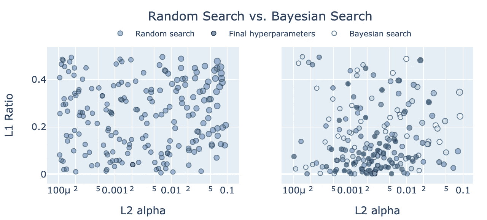

# 超越网格搜索:XGBoost 的超荷超参数调优

> 原文：<https://towardsdatascience.com/beyond-grid-search-hypercharge-hyperparameter-tuning-for-xgboost-7c78f7a2929d?source=collection_archive---------3----------------------->

## 使用 Hyperopt、Optuna 和 Ray Tune 加速机器学习超参数优化

机器学习模型超参数的贝叶斯优化比网格搜索更快更好地工作。以下是我们如何加快超参数调优的方法:1)使用 Hyperopt 和 Optuna 进行贝叶斯优化，运行于……2)使用 [Ray](https://ray.io/) 分布式机器学习框架，使用[统一 Ray 调优 API 来实现许多超参数搜索算法](https://medium.com/riselab/cutting-edge-hyperparameter-tuning-with-ray-tune-be6c0447afdf)和提前停止调度程序，以及……3)使用云实例的分布式集群来实现更快的调优。



作者图片

## 大纲:

1.  结果
2.  超参数调整概述
3.  贝叶斯优化
4.  提前停止
5.  实施细节
6.  基线线性回归
7.  L1 和 L2 正则化线性回归
8.  带 GridSearchCV 的 ElasticNet
9.  XGBoost:超参数子集上的序贯网格搜索
10.  XGBoost: Hyperopt 和 Optuna 搜索算法
11.  LightGBM: Hyperopt 和 Optuna 搜索算法
12.  光线簇上的 XGBoost
13.  光线簇上的 LightGBM
14.  结束语

## 1.结果

底线在前面:这里是艾姆斯住房数据集的结果，预测爱荷华州的房价:

使用各种超参数优化方法的 XGB 和 LightGBM 的 RMSE 和搜索时间

基线线性模型的 RMSE 和拟合时间

## 基线线性模型

*单实例的时间是在一个 12 线程的本地桌面上，与 EC2 4xlarge 相当。集群的时间在 m5.large x 32 (1 个头节点+ 31 个工作节点)上。*

*   与网格搜索相比，我们在本地使用 Hyperopt 和 Optuna 时获得了很大的加速。顺序搜索执行了大约 261 次尝试，因此 XGB/Optuna 搜索在一半的时间内执行了大约 3 倍的尝试，并得到了类似的结果。
*   与具有 12 个线程的本地桌面相比，32 个实例(64 个线程)的集群提供了适度的 RMSE 改进。我试图这样设置，这样我们就可以在 RMSE 和本地的 Hyperopt/Optuna 之间获得一些改进(我们在 2048 次试验中做到了这一点)，并在训练时间上获得一些加速(我们在 64 线程中没有得到这一点)。它在不到两倍的时间内进行了两倍的试验。比较是不完美的，本地桌面与 AWS，在本地运行 Ray 1.0，在集群上运行 1.1，不同的试验次数(更好的超参数配置不会提前停止，需要更长的训练时间)。但重点是看看在实践中，利用集群与本地台式机或笔记本电脑相比，可以获得什么样的改进。底线是，32 节点群集带来了适度的好处。
*   RMSEs 在所有方面都是相似的。XGB 与 2048 年的审判是最好的一个小幅度的助推模型。
*   在 RMSE 或运行时，LightGBM 并没有提供对 XGBoost 的改进。以我的经验来看，LightGBM 往往更快，所以你可以在给定的时间内进行更多的训练和调优。但是我们在这里看不到。XGB 可能会更好地与 ASHA 早期停止互动。
*   远视眼和眼的 RMSE 相似。Optuna 的速度始终更快(LGBM/cluster 可提高 35%)。

在几秒钟内，我们简单的 ElasticNet 基线产生的结果比 boosting 稍好。这可能是因为我们的特征工程是密集的，并且被设计成适合线性模型。未显示，SVR 和 KernelRidge 优于 ElasticNet，并且集合改进了所有单个算法。

完整的笔记本在 [GitHub](https://github.com/druce/iowa/blob/master/hyperparameter_optimization.ipynb) 上。

## 2.超参数调整概述

(如果你不是数据科学家忍者，这里有一些脉络。如果你是，你可以安全地跳到*贝叶斯优化*部分和下面的实现。)

任何足够先进的机器学习模型都与魔术难以区分，任何足够先进的机器学习模型都需要良好的调整。

后退一步，下面是一个典型的建模工作流程:

*   探索性数据分析:理解你的数据。
*   特征工程和特征选择:清理、转换和工程最佳可能的特征
*   建模:模型选择和超参数调整以确定最佳的模型架构，以及集成以组合多个模型
*   评估:描述样本外误差及其预期分布。

为了最小化样本外误差，您可以最小化来自*偏差*的误差，这意味着模型对数据中的信号不够敏感，以及*方差*，这意味着模型对特定于训练数据的信号过于敏感，不会泛化样本外。建模是 90%的数据准备，另一半是寻找[最佳偏差-方差权衡](http://scott.fortmann-roe.com/docs/BiasVariance.html)。

超参数帮助您调整偏差-方差权衡。对于预测泰坦尼克号存活率的简单逻辑回归，正则化参数允许您通过惩罚对任何单个特征的敏感性来控制过度拟合。对于进行机器翻译的大规模神经网络，除了正则化之外，层、单元、激活函数的数量和类型都是超参数。我们使用 [*k 重交叉验证*](https://machinelearningmastery.com/k-fold-cross-validation/) 选择最佳超参数；这就是我们所说的超参数调谐。

我们在这篇文章中使用的回归算法是 XGBoost 和 LightGBM，它们是*梯度推进*的变体。梯度推进是一种通常涉及决策树的集成方法。决策树构建规则，例如，如果乘客是头等舱的女性，他们可能在泰坦尼克号沉没后幸存下来。树是强大的，但是一个具有你所有特征的单一深度决策树将倾向于过度拟合训练数据。一种*随机森林*算法基于观察和特征的随机子集构建许多决策树，然后进行投票( *bagging* )。由*弱学习者*投票的结果比在所有数据行和所有特征列上训练以生成单个强学习者更少过度拟合，并且在样本外执行得更好。随机森林超参数包括树的数量、树的深度以及每棵树应该使用多少个特征和观测值。

*即* bagging， *boosting* 使用许多串联的学习器，而不是聚集许多并行工作的独立学习器:

*   从一个简单的估计开始，如中位数或基本利率。
*   将树拟合到该预测中的*误差*。
*   如果你能*预测*误差，你就能*为其调整*并改善预测。调整预测不是一直到树预测，而是基于*学习率*(超参数)的一部分。
*   将另一棵树拟合到更新预测中的误差，并基于学习率进一步调整预测。
*   迭代地继续减少特定数量的增强回合的误差(另一个超参数)。
*   最终估计值是初始预测加上所有预测的必要调整的总和(通过学习率加权)。

学习率执行与随机森林中的投票类似的功能，在某种意义上，没有单个决策树确定太多的最终估计。这种“群体智慧”的方法有助于防止过度拟合。

梯度推进是对传统结构化表格数据进行回归和分类的当前技术状态(与图像/视频/自然语言处理等结构化程度较低的数据相反，在这些数据中，深度学习、*即*深度神经网络是当前技术状态)。

像 [XGBoost](https://xgboost.readthedocs.io/en/latest/parameter.html) 、 [LightGBM](https://lightgbm.readthedocs.io/en/latest/Parameters.html) 和 [CatBoost](https://catboost.ai/docs/concepts/python-reference_parameters-list.html) 这样的梯度增强算法有非常大量的超参数，调整是使用它们的重要部分。

这些是[超参数调谐的主要方法](https://en.wikipedia.org/wiki/Hyperparameter_optimization):

*   *网格搜索*:给定每个超参数的有限组离散值，彻底交叉验证所有组合。
*   *随机搜索*:给定每个超参数的离散或连续分布，从联合分布中随机抽样。一般来说[比穷举网格搜索更有效。](https://dl.acm.org/doi/10.5555/2188385.2188395)
*   *贝叶斯优化*:类似随机搜索的采样，但是根据先前搜索的结果，更新你采样的搜索空间。
*   *基于梯度的优化*:尝试估计交叉验证指标相对于超参数的梯度，并提升/降低梯度。
*   *进化优化*:对搜索空间进行采样，丢弃度量差的组合，基于成功的组合遗传进化出新的组合。
*   *基于群体的训练*:一种在训练的同时进行超参数优化的方法。

在这篇文章中，我们将重点讨论使用 Hyperopt 和 Optuna 的贝叶斯优化。

## 3.贝叶斯优化

什么是贝叶斯优化？当我们执行网格搜索时，搜索空间是一个[先验](https://en.wikipedia.org/wiki/Prior_probability):我们相信最好的超参数向量在这个搜索空间中。并且*先验地*也许每个超参数组合有相等的概率成为最佳组合(均匀分布)。所以我们把它们都试了一遍，然后选出最好的一个。

也许我们可以进行两次网格搜索。在一个宽的、粗略间隔的网格上进行初始搜索之后，我们在第一遍的最佳度量周围的更小区域中用更精细间隔的网格进行更深入的探索。在贝叶斯术语中，我们*更新了我们之前的*。

贝叶斯优化从随机抽样开始，*例如* 30 个组合，并使用 [*k 倍交叉验证*](https://machinelearningmastery.com/k-fold-cross-validation/) 为 30 个随机抽样的组合中的每一个计算交叉验证度量。然后，该算法更新它从中采样的分布，以便它更有可能对类似于好的度量的组合进行采样，而不太可能对类似于差的度量的组合进行采样。当它继续采样时，它会根据找到的指标继续更新采样的搜索分布。


作者图片

好的度量标准通常不是均匀分布的。如果在高斯分布或我们可以建模的任何分布中发现它们彼此接近，那么贝叶斯优化可以利用潜在的模式，并且可能比网格搜索或朴素随机搜索更有效。

[HyperOpt](http://hyperopt.github.io/hyperopt/) 是由 [James Bergstra 等人](https://conference.scipy.org/proceedings/scipy2013/pdfs/bergstra_hyperopt.pdf)提出的贝叶斯优化算法，参见 Subir Mansukhani 的这篇[优秀博文。](https://blog.dominodatalab.com/hyperopt-bayesian-hyperparameter-optimization/)

[Optuna](https://optuna.org/) 是由 [Takuya Akiba 等人](https://arxiv.org/abs/1907.10902)提出的贝叶斯优化算法，参见这篇由 Crissman Loomis 撰写的[优秀博文。](https://medium.com/optuna/using-optuna-to-optimize-xgboost-hyperparameters-63bfcdfd3407)

## 4.提前停止

如果在评估超参数组合时，评估度量在训练中没有改善，或者改善的速度不够快，不足以击败我们迄今为止的最好成绩，我们可以在对其进行完全训练之前丢弃该组合。*尽早停止*不成功的训练跑可以提高我们搜索的速度和效率。

XGBoost 和 LightGBM 有助于提供提前停止回调来检查训练进度并提前停止训练试验([XGBoost](https://xgboost.readthedocs.io/en/latest/python/callbacks.html)； [LightGBM](https://lightgbm.readthedocs.io/en/latest/pythonapi/lightgbm.early_stopping.html#lightgbm.early_stopping) )。Hyperopt、Optuna 和 Ray 使用这些回调来快速停止糟糕的试验并提高性能。

在本帖中，我们将使用[异步连续减半算法(ASHA)](https://arxiv.org/abs/1810.05934) 进行提前停止，如[博文](https://blog.ml.cmu.edu/2018/12/12/massively-parallel-hyperparameter-optimization/)中所述。

## 延伸阅读:

*   [超参数优化:算法与应用综述](https://arxiv.org/abs/2003.05689)佟宇，朱红(2020)
*   [机器学习中的超参数搜索](https://arxiv.org/abs/1502.02127v2)，Marc Claesen，Bart De Moor (2015)
*   [超参数优化](https://link.springer.com/chapter/10.1007/978-3-030-05318-5_1)，马蒂亚斯·福雷尔，弗兰克·哈特(2019)

## 5.实施细节

我们使用来自艾姆斯住宅数据集的数据。原始数据集有 79 个原始特征。我们将使用的数据有 100 个特征，其中相当数量的特征工程来自我自己在建模中的尝试[，当我将它提交给 Kaggle 时，它位于前 5%左右。我们对销售价格的日志进行建模，并使用 RMSE 作为模型选择的度量标准。为了更容易理解，我们将 RMSE 转换回原始美元单位。](https://github.com/druce/iowa)

我们使用 4 种回归算法:

*   *线性回归*:无超参数的基线
*   *elastic net*:L1 和 L2 正则化的线性回归(2 个超参数)。
*   *XGBoost*
*   *LightGBM*

我们使用 5 种方法:

*   *原生 CV* :在 sklearn 中，如果一个算法 *xxx* 有超参数，那么它通常会有一个 *xxxCV* 版本，比如 ElasticNetCV，它使用指定的 kfolds 对超参数迭代器执行自动网格搜索。
*   *GridSearchCV* :抽象网格搜索，可以环绕任何 sklearn 算法，在指定的 kfolds 上运行多线程试验。
*   *手动顺序网格搜索*:我们通常如何用 XGBoost 实现网格搜索，XGBoost 与 GridSearchCV 配合得不是很好，并且有太多的超参数需要一次调优。
*   *本地桌面上的光线调整*:ASHA 提前停止的远视和 Optuna。
*   *AWS 集群上的光线调节*:额外扩展以在集群中的许多实例上运行单个超参数优化任务。

## 6.基线线性回归

*   每次运行使用相同的 kfold，这样 RMSE 度量的变化就不是由于 kfold 的变化造成的。
*   我们拟合了对数响应，因此为了便于解释，我们将误差转换回美元单位。
*   `sklearn.model_selection.cross_val_score`进行评估
*   墙壁时间的魔法
*   `n_jobs=-1`使用所有可用的 CPU 内核并行运行折叠。
*   注意墙壁时间< 1 second and RMSE of 18192.
*   Full notebooks are on [GitHub](https://github.com/druce/iowa/blob/master/hyperparameter_optimization.ipynb) 。

```
%%time

# always use same RANDOM_STATE k-folds for comparability between tests, reproducibility
RANDOMSTATE = 42
np.random.seed(RANDOMSTATE)

kfolds = KFold(n_splits=10, shuffle=True, random_state=RANDOMSTATE)

MEAN_RESPONSE=df[response].mean()
def cv_to_raw(cv_val, mean_response=MEAN_RESPONSE):
    """convert log1p rmse to underlying SalePrice error"""
    # MEAN_RESPONSE assumes folds have same mean response, which is true in expectation but not in each fold
    # we can also pass the mean response for each fold
    # but we're really just looking to consistently convert the log value to a more meaningful unit
    return np.expm1(mean_response+cv_val) - np.expm1(mean_response)

lr = LinearRegression()
# compute CV metric for each fold
scores = -cross_val_score(lr, df[predictors], df[response],
                          scoring="neg_root_mean_squared_error",
                          cv=kfolds,
                          n_jobs=-1)
raw_scores = [cv_to_raw(x) for x in scores]
print("Raw CV RMSE %.0f (STD %.0f)" % (np.mean(raw_scores), np.std(raw_scores)))
```

`Raw CV RMSE 18192 (STD 1839)`

`Wall time: 65.4 ms`

## 7.弹性电视

*   ElasticNet 是使用 L1 和 L2 [正则化](https://en.wikipedia.org/wiki/Regularization_(mathematics)) (2 个超参数)的线性回归。
*   当我们使用正则化时，我们需要缩放我们的数据，以便系数惩罚对各要素产生类似的影响。我们使用带有鲁棒定标器的流水线来定标。
*   拟合模型并从拟合的模型中提取超参数。
*   然后我们用报告的超参数做`cross_val_score`(似乎没有办法在不重新调整的情况下从拟合的模型中提取分数)
*   详细输出报告 130 个任务，对于 10 倍的全网格搜索，我们预计 13x9x10=1170。显然是一个聪明的优化。
*   请注意，与没有正则化的线性回归相比，RMSE 略有降低。

```
elasticnetcv = make_pipeline(RobustScaler(),
                             ElasticNetCV(max_iter=100000, 
                                          l1_ratio=[0.01, 0.05, 0.1, 0.2, 0.3, 0.4, 0.5, 0.6, 0.7, 0.8, 0.9, 0.95, 0.99],
                                          alphas=np.logspace(-4, -2, 9),
                                          cv=kfolds,
                                          n_jobs=-1,
                                          verbose=1,
                                         ))

#train and get hyperparams
elasticnetcv.fit(df[predictors], df[response])
l1_ratio = elasticnetcv._final_estimator.l1_ratio_
alpha = elasticnetcv._final_estimator.alpha_
print('l1_ratio', l1_ratio)
print('alpha', alpha)

# evaluate using kfolds on full dataset
# I don't see API to get CV error from elasticnetcv, so we use cross_val_score
elasticnet = ElasticNet(alpha=alpha,
                        l1_ratio=l1_ratio,
                        max_iter=10000)

scores = -cross_val_score(elasticnet, df[predictors], df[response],
                          scoring="neg_root_mean_squared_error",
                          cv=kfolds,
                          n_jobs=-1)
raw_scores = [cv_to_raw(x) for x in scores]
print()
print("Log1p CV RMSE %.04f (STD %.04f)" % (np.mean(scores), np.std(scores)))
print("Raw CV RMSE %.0f (STD %.0f)" % (np.mean(raw_scores), np.std(raw_scores)))l1_ratio 0.01
alpha 0.0031622776601683794

Log1p CV RMSE 0.1030 (STD 0.0109)
Raw CV RMSE 18061 (STD 2008)
CPU times: user 5.93 s, sys: 3.67 s, total: 9.6 s
Wall time: 1.61 s
```

## 8.GridSearchCV

*   相同的结果，运行速度稍慢。
*   GridSearchCV 详细输出显示 1170 个作业，这是预期的 13x9x10 个作业。

```
gs = make_pipeline(RobustScaler(),
                   GridSearchCV(ElasticNet(max_iter=100000),
                                param_grid={'l1_ratio': [0.01, 0.05, 0.1, 0.2, 0.3, 0.4, 0.5, 0.6, 0.7, 0.8, 0.9, 0.95, 0.99],
                                            'alpha': np.logspace(-4, -2, 9),
                                           },
                                scoring='neg_root_mean_squared_error',
                                refit=True,
                                cv=kfolds,
                                n_jobs=-1,
                                verbose=1
                               ))

# do cv using kfolds on full dataset
gs.fit(df[predictors], df[response])
print('best params', gs._final_estimator.best_params_)
print('best score', -gs._final_estimator.best_score_)
l1_ratio = gs._final_estimator.best_params_['l1_ratio']
alpha = gs._final_estimator.best_params_['alpha']

# eval similarly to before
elasticnet = ElasticNet(alpha=alpha,
                        l1_ratio=l1_ratio,
                        max_iter=100000)
print(elasticnet)

scores = -cross_val_score(elasticnet, df[predictors], df[response],
                          scoring="neg_root_mean_squared_error",
                          cv=kfolds,
                          n_jobs=-1)
raw_scores = [cv_to_raw(x) for x in scores]
print()
print("Log1p CV RMSE %.06f (STD %.04f)" % (np.mean(scores), np.std(scores)))
print("Raw CV RMSE %.0f (STD %.0f)" % (np.mean(raw_scores), np.std(raw_scores)))best params {'alpha': 0.0031622776601683794, 'l1_ratio': 0.01}
best score 0.10247177583755482
ElasticNet(alpha=0.0031622776601683794, l1_ratio=0.01, max_iter=100000)

Log1p CV RMSE 0.103003 (STD 0.0109)
Raw CV RMSE 18061 (STD 2008)

Wall time: 5 s
```

## 9.使用顺序网格搜索的 XGBoost

*应该*可以使用 GridSearchCV 和 XGBoost。但是当我们也尝试使用早期停止时，XGBoost 需要一个 eval 集。好，我们可以给它一个从 GridSearchCV 得到的静态评估集。现在，GridSearchCV 在训练集中进行 k 重交叉验证，但 XGBoost 使用单独的专用评估集来提前停止。这有点像弗兰肯斯坦方法论。如果您真的感兴趣，请查看[笔记本](https://github.com/druce/iowa/blob/master/hyperparameter_optimization.ipynb)了解使用 XGBoost 和早期停止的 GridSearchCV 尝试。

相反，我们编写自己的网格搜索，为 XGBoost 提供每个 CV 折叠的正确保持集:

```
EARLY_STOPPING_ROUNDS=100  # stop if no improvement after 100 rounds

def my_cv(df, predictors, response, kfolds, regressor, verbose=False):
    """Roll our own CV 
    train each kfold with early stopping
    return average metric, sd over kfolds, average best round"""
    metrics = []
    best_iterations = []

    for train_fold, cv_fold in kfolds.split(df): 
        fold_X_train=df[predictors].values[train_fold]
        fold_y_train=df[response].values[train_fold]
        fold_X_test=df[predictors].values[cv_fold]
        fold_y_test=df[response].values[cv_fold]
        regressor.fit(fold_X_train, fold_y_train,
                      early_stopping_rounds=EARLY_STOPPING_ROUNDS,
                      eval_set=[(fold_X_test, fold_y_test)],
                      eval_metric='rmse',
                      verbose=verbose
                     )
        y_pred_test=regressor.predict(fold_X_test)
        metrics.append(np.sqrt(mean_squared_error(fold_y_test, y_pred_test)))
        best_iterations.append(regressor.best_iteration)
    return np.average(metrics), np.std(metrics), np.average(best_iterations)
```

XGBoost 有许多调优参数，因此穷举网格搜索的组合数量不合理。取而代之的是，我们使用网格搜索和提前停止来依次调优精简集。

这是调优 XGBoost 的典型网格搜索方法:

## XGBoost 调优方法

*   设置初始的一组启动参数。
*   按顺序调整各组之间交互不太多的超参数，以减少测试的组合数量。
*   先调好`max_depth`。
*   然后调`subsample`、`colsample_bytree`、`colsample_bylevel`。
*   最后，调整`learning rate`:较低的学习率将需要更多的助推轮(`n_estimators`)。
*   对每个超参数组合进行 10 重交叉验证。选择超参数以最小化 kfolds 上的平均 RMSE。
*   如果 100 轮后没有改善，使用 XGboost 早期停止停止每一轮的训练。
*   在调优和选择最佳超参数后，使用跨 xval kfolds 的平均增强回合，在完整数据集上重新训练和评估，而不提前停止。
*   如前所述，我们使用 XGBoost sklearn API，并使用我们自己的网格搜索，它理解使用 k-folds 而不是 GridSearchCV 的早期停止。(另一种方法是使用原生 xgboost。理解早期停止但不使用 sklearn API 的 cv(使用 DMatrix，而不是 numpy 数组或 dataframe))
*   我们编写一个助手函数`cv_over_param_dict`，它获取一个`param_dict`字典列表，对所有字典进行测试，并返回最佳的`param_dict`字典和一个结果数据帧。
*   我们运行`cv_over_param_dict` 3 次，在 3 轮调优中进行 3 次网格搜索。

```
BOOST_ROUNDS=50000   # we use early stopping so make this arbitrarily high

def cv_over_param_dict(df, param_dict, predictors, response, kfolds, verbose=False):
    """given a list of dictionaries of xgb params
    run my_cv on params, store result in array
    return updated param_dict, results dataframe
    """
    start_time = datetime.now()
    print("%-20s %s" % ("Start Time", start_time))

    results = []

    for i, d in enumerate(param_dict):
        xgb = XGBRegressor(
            objective='reg:squarederror',
            n_estimators=BOOST_ROUNDS,
            random_state=RANDOMSTATE,    
            verbosity=1,
            n_jobs=-1,
            booster='gbtree',   
            **d
        )    

        metric_rmse, metric_std, best_iteration = my_cv(df, predictors, response, kfolds, xgb, verbose=False)    
        results.append([metric_rmse, metric_std, best_iteration, d])

        print("%s %3d result mean: %.6f std: %.6f, iter: %.2f" % (datetime.strftime(datetime.now(), "%T"), i, metric_rmse, metric_std, best_iteration))

    end_time = datetime.now()
    print("%-20s %s" % ("Start Time", start_time))
    print("%-20s %s" % ("End Time", end_time))
    print(str(timedelta(seconds=(end_time-start_time).seconds)))

    results_df = pd.DataFrame(results, columns=['rmse', 'std', 'best_iter', 'param_dict']).sort_values('rmse')
    display(results_df.head())

    best_params = results_df.iloc[0]['param_dict']
    return best_params, results_df

# initial hyperparams
current_params = {
    'max_depth': 5,
    'colsample_bytree': 0.5,
    'colsample_bylevel': 0.5,
    'subsample': 0.5,
    'learning_rate': 0.01,
}

##################################################
# round 1: tune depth
##################################################
max_depths = list(range(2,8))
grid_search_dicts = [{'max_depth': md} for md in max_depths]
# merge into full param dicts
full_search_dicts = [{**current_params, **d} for d in grid_search_dicts]

# cv and get best params
current_params, results_df = cv_over_param_dict(df, full_search_dicts, predictors, response, kfolds)

##################################################
# round 2: tune subsample, colsample_bytree, colsample_bylevel
##################################################
# subsamples = np.linspace(0.01, 1.0, 10)
# colsample_bytrees = np.linspace(0.1, 1.0, 10)
# colsample_bylevel = np.linspace(0.1, 1.0, 10)
# narrower search
subsamples = np.linspace(0.25, 0.75, 11)
colsample_bytrees = np.linspace(0.1, 0.3, 5)
colsample_bylevel = np.linspace(0.1, 0.3, 5)
# subsamples = np.linspace(0.4, 0.9, 11)
# colsample_bytrees = np.linspace(0.05, 0.25, 5)

grid_search_dicts = [dict(zip(['subsample', 'colsample_bytree', 'colsample_bylevel'], [a, b, c])) 
                     for a,b,c in product(subsamples, colsample_bytrees, colsample_bylevel)]
# merge into full param dicts
full_search_dicts = [{**current_params, **d} for d in grid_search_dicts]
# cv and get best params
current_params, results_df = cv_over_param_dict(df, full_search_dicts, predictors, response, kfolds)

# round 3: learning rate
learning_rates = np.logspace(-3, -1, 5)
grid_search_dicts = [{'learning_rate': lr} for lr in learning_rates]
# merge into full param dicts
full_search_dicts = [{**current_params, **d} for d in grid_search_dicts]

# cv and get best params
current_params, results_df = cv_over_param_dict(df, full_search_dicts, predictors, response, kfolds, verbose=False)
```

总训练持续时间(3 次迭代的时间总和)为 1:24:22。这个时间可能被低估了，因为这个搜索空间是基于以前的经验。

最后，我们使用最佳超参数进行改装，并评估:

```
xgb = XGBRegressor(
    objective='reg:squarederror',
    n_estimators=3438,
    random_state=RANDOMSTATE,    
    verbosity=1,
    n_jobs=-1,
    booster='gbtree',   
    **current_params
)    

print(xgb)

scores = -cross_val_score(xgb, df[predictors], df[response],
                          scoring="neg_root_mean_squared_error",
                          cv=kfolds,
                          n_jobs=-1)

raw_scores = [cv_to_raw(x) for x in scores]
print()
print("Log1p CV RMSE %.06f (STD %.04f)" % (np.mean(scores), np.std(scores)))
print("Raw CV RMSE %.0f (STD %.0f)" % (np.mean(raw_scores), np.std(raw_scores)))
```

结果基本上与线性回归匹配，但不如 ElasticNet 好。

```
Raw CV RMSE 18193 (STD 2461)
```

## 10.XGBoost 带有远视、Optuna 和光线

使用 Hyperopt 运行光线调整作业的步骤如下:

1.  建立一个光线搜索空间作为配置字典。
2.  将训练循环重构为一个函数，该函数将配置字典作为参数，并调用`tune.report(rmse=rmse)`来优化像 RMSE 这样的指标。
3.  用`config`和一个指定采样次数的`num_samples`参数调用`ray.tune`。

设置光线搜索空间:

```
xgb_tune_kwargs = {
    "n_estimators": tune.loguniform(100, 10000),
    "max_depth": tune.randint(0, 5),
    "subsample": tune.quniform(0.25, 0.75, 0.01),
    "colsample_bytree": tune.quniform(0.05, 0.5, 0.01),
    "colsample_bylevel": tune.quniform(0.05, 0.5, 0.01),    
    "learning_rate": tune.quniform(-3.0, -1.0, 0.5),  # powers of 10
}

xgb_tune_params = [k for k in xgb_tune_kwargs.keys() if k != 'wandb']
xgb_tune_params
```

设置培训功能。注意，一些搜索算法期望所有的超参数都是浮点数，并且一些搜索区间从 0 开始。所以我们根据需要转换参数。

```
def my_xgb(config):

    # fix these configs to match calling convention
    # search wants to pass in floats but xgb wants ints
    config['n_estimators'] = int(config['n_estimators'])   # pass float eg loguniform distribution, use int
    # hyperopt needs left to start at 0 but we want to start at 2    
    config['max_depth'] = int(config['max_depth']) + 2
    config['learning_rate'] = 10 ** config['learning_rate']

    xgb = XGBRegressor(
        objective='reg:squarederror',
        n_jobs=1,
        random_state=RANDOMSTATE,
        booster='gbtree',   
        scale_pos_weight=1, 
        **config,
    )
    scores = -cross_val_score(xgb, df[predictors], df[response],
                                      scoring="neg_root_mean_squared_error",
                                      cv=kfolds)
    rmse = np.mean(scores)
    tune.report(rmse=rmse)

    return {"rmse": rmse}
```

运行光线调节:

```
algo = HyperOptSearch(random_state_seed=RANDOMSTATE)
# ASHA
scheduler = AsyncHyperBandScheduler()

analysis = tune.run(my_xgb,
                    num_samples=NUM_SAMPLES,
                    config=xgb_tune_kwargs,                    
                    name="hyperopt_xgb",
                    metric="rmse",
                    mode="min",
                    search_alg=algo,
                    scheduler=scheduler,
                    verbose=1,
                   )
```

提取最佳超参数，并使用它们评估模型:

```
# results dataframe sorted by best metric
param_cols = ['config.' + k for k in xgb_tune_params]
analysis_results_df = analysis.results_df[['rmse', 'date', 'time_this_iter_s'] + param_cols].sort_values('rmse')

# extract top row
best_config = {z: analysis_results_df.iloc[0]['config.' + z] for z in xgb_tune_params}

xgb = XGBRegressor(
    objective='reg:squarederror',
    random_state=RANDOMSTATE,    
    verbosity=1,
    n_jobs=-1,
    **best_config
)
print(xgb)

scores = -cross_val_score(xgb, df[predictors], df[response],
                          scoring="neg_root_mean_squared_error",
                          cv=kfolds)

raw_scores = [cv_to_raw(x) for x in scores]
print()
print("Log1p CV RMSE %.06f (STD %.04f)" % (np.mean(scores), np.std(scores)))
print("Raw CV RMSE %.0f (STD %.0f)" % (np.mean(raw_scores), np.std(raw_scores)))
```

对于 NUM_SAMPLES=1024，我们得到:

```
Raw CV RMSE 18309 (STD 2428)
```

我们可以简单地将远视换成 Optuna:

```
algo = OptunaSearch()
```

对于 NUM_SAMPLES=1024，我们得到:

```
Raw CV RMSE 18325 (STD 2473)
```

## 11.配有远视和光学镜的 LightGBM

我们也可以很容易地用 LightGBM 替换 XGBoost。

1.  使用 [LightGBM 等价物](https://sites.google.com/view/lauraepp/parameters)更新搜索空间。

```
lgbm_tune_kwargs = {
       "n_estimators": tune.loguniform(100, 10000),
       "max_depth": tune.randint(0, 5),
       'num_leaves': tune.quniform(1, 10, 1.0),               # xgb max_leaves
       "bagging_fraction": tune.quniform(0.5, 0.8, 0.01),    # xgb subsample
       "feature_fraction": tune.quniform(0.05, 0.5, 0.01),   # xgb colsample_bytree
       "learning_rate": tune.quniform(-3.0, -1.0, 0.5),
   }
```

1.  更新培训功能:

```
def my_lgbm(config):

    # fix these configs 
    config['n_estimators'] = int(config['n_estimators'])   # pass float eg loguniform distribution, use int
    config['num_leaves'] = int(2**config['num_leaves'])
    config['learning_rate'] = 10**config['learning_rate']

    lgbm = LGBMRegressor(objective='regression',
                         max_bin=200,
                         feature_fraction_seed=7,
                         min_data_in_leaf=2,
                         verbose=-1,
                         n_jobs=1,
                         # these are specified to suppress warnings
                         colsample_bytree=None,
                         min_child_samples=None,
                         subsample=None,
                         **config,
                         )

    scores = -cross_val_score(lgbm, df[predictors], df[response],
                              scoring="neg_root_mean_squared_error",
                              cv=kfolds)
    rmse=np.mean(scores)  
    tune.report(rmse=rmse)

    return {'rmse': np.mean(scores)}
```

和以前一样运行，用 my_lgbm 代替 my_xgb。LGBM 的结果:(样本数=1024):

```
Raw CV RMSE 18615 (STD 2356)
```

将远视换成 Optuna:

```
Raw CV RMSE 18614 (STD 2423)
```

## 12.光线簇上的 XGBoost

Ray 是一个分布式框架。我们可以使用具有一个*头节点*和许多*工作节点*的集群在许多实例上运行光线调整作业。

启动 Ray 非常简单。在头节点上，我们运行`ray start`。在每个 worker 节点上，我们使用 head 节点的地址运行`ray start --address x.x.x.x`。然后在 python 中我们调用`ray.init()`来连接头节点。其他一切都像以前一样进行，头节点使用集群中的所有实例运行试验，并将结果存储在 Redis 中。

更复杂的地方是指定所有 AWS 细节、实例类型、区域、子网等。

*   集群在`ray1.1.yaml`中定义。(到目前为止，在这个笔记本中，我们一直使用当前的产品 ray 1.0，但是我很难让一个集群运行 ray 1.0，所以我切换到了 dev nightly。YMMV。)
*   `boto3`和 AWS CLI 配置的凭证用于产生实例，因此[安装和配置 AWS CLI](https://docs.aws.amazon.com/cli/latest/userguide/cli-chap-install.html)
*   编辑`ray1.1.yaml`文件，至少包含您的 AWS 区域和可用性区域。Imageid 可能因地区而异，搜索当前深度学习 AMI (Ubuntu 18.04)。你可能不需要指定子网，我有一个问题，一个不可访问的子网，当我让雷默认子网，可能是错误的默认。
*   为了获得这些变量，将最新的深度学习 AMI (Ubuntu 18.04)当前版本 35.0 启动到您最喜欢的地区/区域的一个小实例中
*   测试它的工作情况
*   请注意这 4 个变量:区域、可用性区域、子网、AMI imageid
*   终止实例并使用您的区域、可用性区域、AMI imageid、可选子网编辑`ray1.1.yaml`
*   建议您创建自己的映像，预安装所有更新和要求，并指定其 AMI imageid，而不是使用通用映像并在启动时安装所有内容。
*   运行集群:`ray up ray1.1.yaml`
*   使用指定的 AMI 创建 head 实例。
*   安装 Ray 和相关需求，包括来自`requirements.txt`的 XGBoost
*   从 GitHub 克隆 druce/iowa repo
*   根据自动扩展参数启动工作节点(目前我们固定节点数量，因为我们没有对集群自动扩展所需的时间进行基准测试)
*   集群启动后，您可以检查 AWS 控制台，并注意到启动了几个实例。
*   检查`ray monitor ray1.1.yaml`是否有任何错误信息
*   在带有端口转发的集群上运行 Jupyter`ray exec ray1.1.yaml --port-forward=8899 'jupyter notebook --port=8899'`
*   在启动时打印在控制台上的生成的 URL 上打开笔记本*例如* [http://localhost:8899/？token = 5f 46d 4355 AE 7174524 ba 71 f 30 ef 3 f 0633 a 20 b 19 a 204 b 93 b 4](http://localhost:8899/?token=5f46d4355ae7174524ba71f30ef3f0633a20b19a204b93b4)
*   您可以使用`ray attach /Users/drucev/projects/iowa/ray1.1.yaml`在集群的头节点上运行终端
*   您可以使用 IP 地址和生成的私有密钥`ssh -o IdentitiesOnly=yes -i ~/.ssh/ray-autoscaler_1_us-east-1.pem ubuntu@54.161.200.54`进行 ssh
*   用
    `ray dashboard ray1.1.yaml`运行端口转发到 Ray dashboard，然后打开 [http://localhost:8265/](http://localhost:8265/)
*   确保在 Jupyter 中选择默认内核，以便在正确的 conda 环境中运行所有安装
*   确保使用启动消息中给出的 ray.init()命令。`ray.init(address='localhost:6379', _redis_password='5241590000000000')`
*   该集群将产生 AWS 费用，因此`ray down ray1.1.yaml`完成后
*   请参见[hyperparameter _ optimization _ cluster . ipynb](https://github.com/druce/iowa/blob/master/hyperparameter_optimization_cluster.ipynb)，它是独立的，因此每台笔记本电脑都可以在有/没有集群设置的情况下端到端运行
*   参见[光线文档](https://docs.ray.io/en/latest/cluster/launcher.html)了解更多关于光线簇的信息。

除了连接到集群而不是在本地运行 Ray Tune 之外，无需对代码进行任何其他更改即可在集群上运行

```
analysis = tune.run(my_xgb,
                    num_samples=NUM_SAMPLES,
                    config=xgb_tune_kwargs,                    
                    name="hyperopt_xgb",
                    metric="rmse",
                    mode="min",
                    search_alg=algo,
                    scheduler=scheduler,
                    # add this because distributed jobs occasionally error out
                    raise_on_failed_trial=False, # otherwise no reults df returned if any trial error           
                    verbose=1,
                   )
```

XGBM 在集群上的结果(2048 个样本，集群是 32 个 m5 .大型实例):

远视(时间 1:30:58)

```
Raw CV RMSE 18030 (STD 2356)
```

奥普图纳(时间 1 时 29 分 57 秒)

```
Raw CV RMSE 18028 (STD 2353)
```

## 13.光线簇上的 LightGBM

类似地，对于 LightGBM:

```
analysis = tune.run(my_lgbm,
                    num_samples=NUM_SAMPLES,
                    config = lgbm_tune_kwargs,
                    name="hyperopt_lgbm",
                    metric="rmse",
                    mode="min",
                    search_alg=algo,
                    scheduler=scheduler,
                    raise_on_failed_trial=False, # otherwise no reults df returned if any trial error                                                            
                    verbose=1,
                   )
```

集群上 LightGBM 的结果(2048 个样本，集群是 32 个 m5 .大型实例):

远视(时间:1:05:19):

```
Raw CV RMSE 18459 (STD 2511)
```

Optuna(时间 0:48:16):

```
Raw CV RMSE 18458 (STD 2511)
```

## 14.结束语

在我应用它们的每一个案例中，在我使用网格搜索方法找到的最佳指标中，Hyperopt 和 Optuna 至少给了我一个小的改进。与顺序调优相比，贝叶斯优化的手动过程更少，调优速度更快。这是火了就忘了。

射线调谐是超参数调谐的必由之路吗？暂时的，是的。Ray 提供了底层 ML ( *例如* XGBoost)、贝叶斯搜索(*例如*hyperpt)和早期停止(ASHA)之间的集成。它允许我们轻松地交换搜索算法。

在 [Ray docs](https://docs.ray.io/en/master/tune/api_docs/suggestion.html) 中还有其他可供选择的搜索算法，但这些似乎是最流行的，我还没有让其他的运行。如果过了一段时间后，我发现我总是使用*，例如* Hyperopt，而从不使用集群，我可能会使用没有 Ray 的本机 Hyperopt/XGBoost 集成，以访问任何本机 Hyperopt 功能，因为它是堆栈中的一项少技术。

集群？大多数时候，我没有必要，成本增加了，并没有看到预期的大幅度加速。我只在 32 个实例的集群上看到了大约 2 倍的加速。在设置测试时，我预计会有不到 4 倍的加速，这说明了线性扩展的不足。我试过的最长的一次运行，有 4096 个样本，在桌面上运行了一整夜。对于这个数据集，我的 MacBook Pro w/16 线程和 12 线程的台式机以及 GPU 已经足够强大了。尽管如此，在后面的口袋里有集群选项还是很有用的。在生产中，用*部署，例如* Terraform，Kubernetes 可能比 Ray 原生 YAML 集群配置文件更标准，更易维护。如果你想大规模训练大数据，你需要真正了解并简化你的管道。

让我感到惊讶的是，ElasticNet，*，即*正则化线性回归，在这个数据集上的表现略好于 boosting。我大量设计了一些特性，使得线性方法工作得很好。使用 Lasso/ElasticNet 选择预测因子，我使用 log 和 Box-Cox 变换迫使预测因子遵循最小二乘假设。但是，boosting 仍然被认为是表格数据的黄金标准。

这可能会验证对机器学习的[批评之一](https://papers.ssrn.com/sol3/papers.cfm?abstract_id=3624052)，即最强大的机器学习方法不一定总是收敛到最佳解决方案。如果您有一个线性加噪声的基本事实，一个复杂的 XGBoost 或神经网络算法应该任意接近封闭形式的最优解，但可能永远不会精确匹配最优解。XGBoost 回归是分段常数，复杂的神经网络易受随机梯度下降的影响。我以为任意接近意味着几乎无法区分。但显然情况并非总是如此。

具有 L1 + L2 正则化加上梯度下降和超参数优化的 ElasticNet 仍然是机器学习。它只是更好地匹配这个问题的 ML 的一种形式。在数据集与 OLS 假设不匹配的现实世界中，梯度推进通常表现得非常好。即使在这个数据集上，为线性模型的成功而设计的 SVR 和 KernelRidge 也比 ElasticNet(未显示)表现得更好，并且将 ElasticNet 与 XGBoost、LightGBM、SVR 集成，神经网络的效果最好。

套用 Casey Stengel 的话，聪明的特征工程总是胜过聪明的模型算法，反之亦然。但是提高你的超参数总是会提高你的结果。贝叶斯优化可以被认为是一种最佳实践。

同样，完整的代码在 [GitHub](https://github.com/druce/iowa) 上

单独调整停止回合会更合理。仅仅平均 kfolds 的最佳停止时间是有问题的。在真实的场景中，我们应该保留一个维持测试集。我们应该在完整的训练数据集(而不是 kfolds)上重新训练，并尽早停止，以获得最佳的强化轮数。然后，我们应该使用所有交叉验证的参数在测试集中测量 RMSE，包括预期的 OOS RMSE 的助推轮数。然而，为了比较调谐方法，CV 误差是可以的。我们只是想看看如何使用 CV 进行模型决策，而不是太担心泛化错误。人们甚至可以说它给超参数选择的比较增加了一点噪声。但是在实践中，测试集将是正确的方法。这不会直接改变结论，我也不会重新做所有的事情，但是如果我要重新开始，我会那样做。

这是没有意义的。