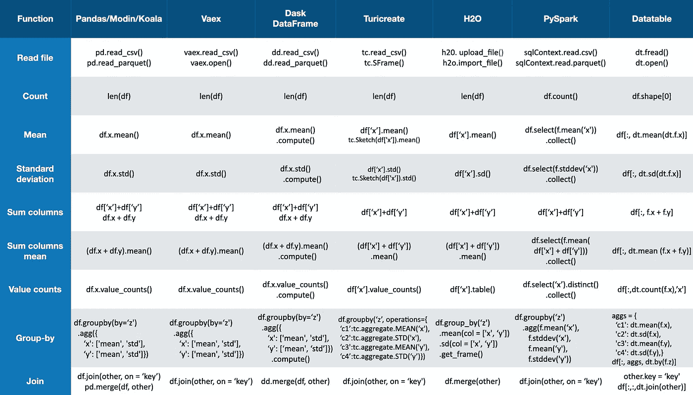
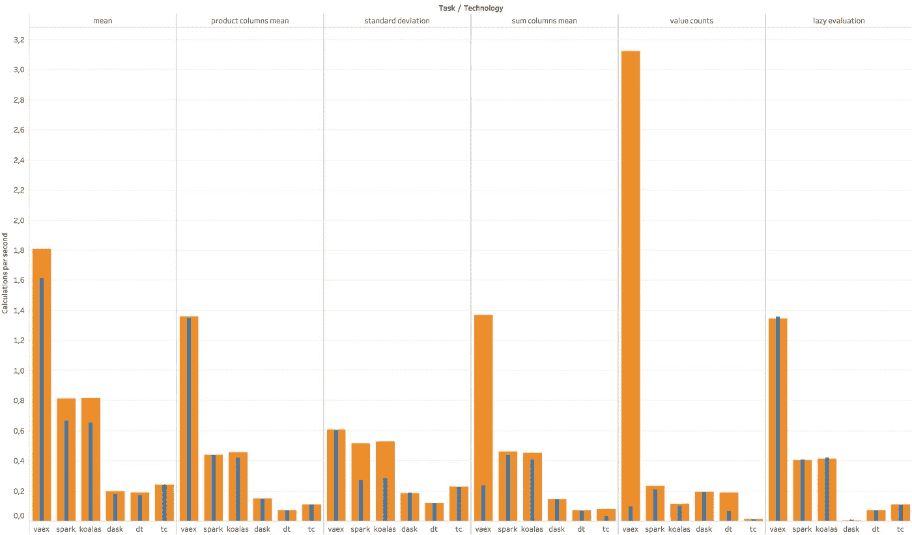
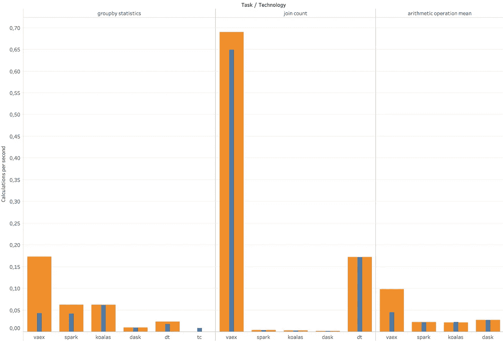
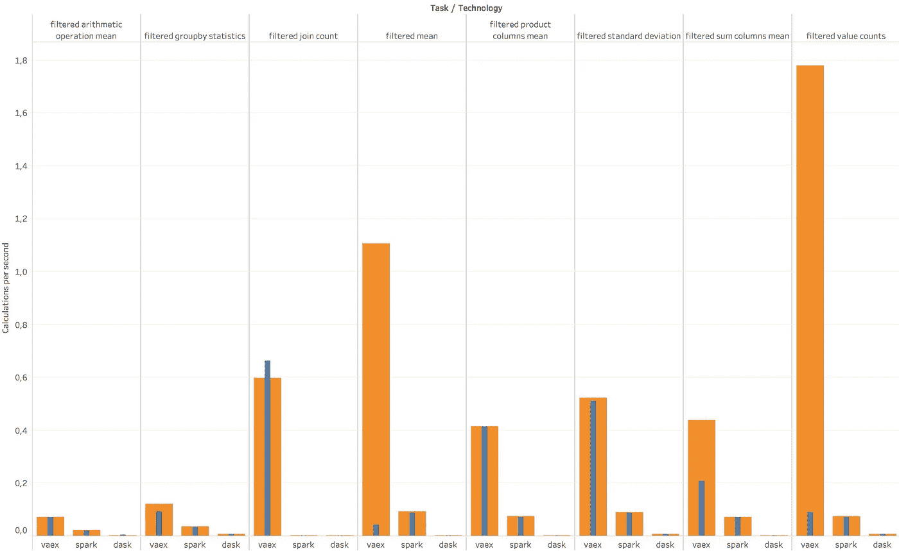
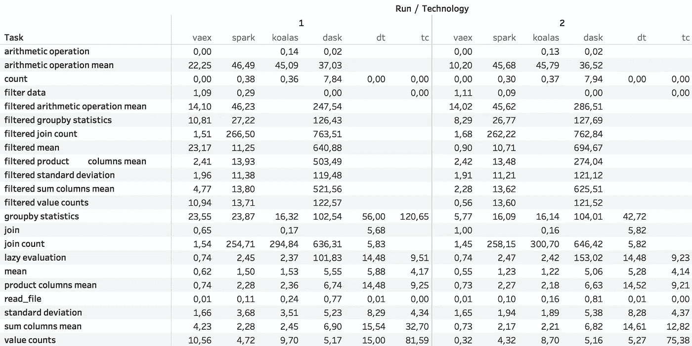

# 熊猫之外:Spark、Dask、Vaex 和其他大数据技术正面交锋

> 原文：<https://towardsdatascience.com/beyond-pandas-spark-dask-vaex-and-other-big-data-technologies-battling-head-to-head-a453a1f8cc13?source=collection_archive---------1----------------------->

## 十亿行数据集上的 API 和性能比较。你应该用什么？

彼得罗·马蒂亚在 [Unsplash](https://unsplash.com/?utm_source=medium&utm_medium=referral) 上拍摄的照片

# 为什么

面对新的数据科学问题时，首先要问的问题之一是使用哪种技术。有炒作；有标准工具；有尖端的技术、完整的平台和现成的解决方案。

在过去的几年里，我一直在用我能得到的任何技术构建概念和解决方案的证明。如果有新平台，我注册试用；如果任何一个大的云平台发布了一个新的特性，我都会试用；当一项新技术出现时，你可以确信我会浏览一些教程，并在我的数据集上进行尝试。

从这个角度来看，我决定比较数据争论技术，为我的下一个项目选择最适合表格数据探索、清理和争论的技术。我也将此作为一个机会，重新接触我已经几年没有使用的技术，我认为随着时间的推移，这些技术已经变得越来越好。

## TL；速度三角形定位法(dead reckoning)

[Vaex](https://github.com/vaexio/vaex) 作为新的大数据技术正在崛起。但是，如果你已经在使用 PySpark 平台或者有 PySpark 天赋，这仍然是一个不错的选择。

# 什么

在下文中，我假设您对 Python API 和大数据能力有基本的了解。我选择的数据是[出租车**亿** **行 100GB** 数据集](https://www1.nyc.gov/site/tlc/about/tlc-trip-record-data.page)。目标是比较这些技术的 API、性能和易用性。我认为熊猫是具有最自然 API 的基线(我承认这是有争议的)，因为它是目前最常见的解决方案，但不能处理大数据。

您有两种处理大数据集的传统方法/方式:更强的/分布式计算，其中您将内存与数据的大小相匹配；或者核外解决方案，其中数据仅在必要时才在内存中读取。

成本的差异是巨大的，所以我决定只考虑能在核外工作的解决方案。

# 竞争对手:

*   [Dask DataFrame](https://docs.dask.org/en/latest/dataframe.html) —用于分析的灵活并行计算库。
*   [PySpark](https://spark.apache.org/docs/latest/api/python/index.html) —基于 [Spark](https://spark.apache.org/) 的大规模数据处理统一分析引擎。
*   [考拉](https://koalas.readthedocs.io/en/latest/index.html) —阿帕奇 Spark 上的熊猫 API。
*   Vaex —一个用于懒惰的核外数据帧的 Python 库。
*   [turi create](https://github.com/apple/turicreate)——一个相对秘密的机器学习包，其数据帧结构——SF frame，符合条件。
*   [数据表](https://github.com/h2oai/datatable)——H2O[无人驾驶. ai](https://www.h2o.ai/driverless-ai/) 的中坚力量。一个 dataframe 包，特别强调速度和对单个节点的大数据支持。

## 一些可敬的提及:

*   [H2O](https://github.com/h2oai/h2o-3) —标准的内存数据帧非常全面。尽管如此，对于四倍于数据集大小的集群的建议，您需要雄厚的资金来使用它进行探索和开发。
*   cuDF(RapidAI)——GPU 数据帧包是一个令人兴奋的概念。对于大数据，你必须使用带有 Dask 的[分布式 GPU 来匹配你的数据大小，非常适合无底的口袋。](https://docs.dask.org/en/latest/gpu.html)
*   [Modin](https://github.com/modin-project/modin) —一个无需改变 API 就能缩放熊猫的工具，它在后端使用 [Dask](https://dask.org/) 或 [Ray](https://docs.ray.io/en/latest/index.html) 。遗憾的是，目前它只能读取一个拼花文件，而我已经有了一个分块的拼花数据集。由于可能会得到与 Dask DataFrame 类似的结果，此时将所有的 parquet 文件合并为一个文件似乎不值得追求。
*   熊猫有一个分块的特征，但是在探索和动态互动方面，它和其他的熊猫不在一个级别。
*   Vaex 确实有一个 [GPU 和 numba 支持](https://vaex.readthedocs.io/en/latest/tutorial.html#Just-In-Time-compilation)用于繁重的计算，我没有进行基准测试。

# 怎么

我在 AWS Sagemaker 上使用了一个每小时 0.95 美元的 ml.c5d.4xlarge 实例，因此复制基准测试很容易。它有 16 个 vCPUs，32 GB 的 RAM 加上 500 个 SSD，这与固态笔记本电脑有着微妙的相似之处。

尽管所有竞争对手都可以读取 CSV 文件，但更优化的方法是使用最适合每种技术的二进制版本。对于 PySpark、考拉、Dask DataFrame，我用的是[拼花](http://parquet.apache.org/)，而对于 Vaex，我用的是 [HDF5](http://docs.h5py.org/en/stable/) 。Turicreates 的帧有一个特殊的压缩二进制版本。Datatable 是针对 [jay](https://github.com/h2oai/datatable/issues/1109) 格式优化的特例。虽然我无法使用 Datatable 读取 CSV 文件，但不管我的实例大小如何(即使 RAM 中的数据大小增加了一倍以上)， [Maarten Breddels](https://medium.com/u/b8a6decc0862?source=post_page-----a453a1f8cc13--------------------------------) 开辟了一条使用 HDF5 的道路。当 Datatable 可以可靠地读取多个 CSV、Arrow 或 Parquet 文件时，最好进行更新。

我想指出的是，这个基准测试的开发有点昂贵，因为技术在运行几个小时后会崩溃很多次，尽管只是按原样运行代码不会花掉你的钱。

# 结果

## 编码复杂性

仅仅目测一下 API 就能让你对每种技术的代码量和设计模式有所了解。

常用方法(图片由作者提供)

**赢家** — Vaex、Dask DataFrame、Turicreate、考拉都有一个很像熊猫的代码(对考拉来说是一模一样的)，想做什么都很容易。

**失败者** — PySpark 和 Datatable，因为它们有自己的 API 设计，你必须学习和调整。这不是一个困难的任务，但如果你习惯于和熊猫一起工作，这是一个缺点。

## 特征

**优胜者**—py spark/考拉和 Dask DataFrame 提供了各种各样的特性和功能。注意，在使用 PySpark 的一些复杂情况下，您可能需要“map-reduce”知识来编写满足您需要的算法。使用 Dask DataFrame，您可能需要知道何时可以或不可以使用无需占用大量内存即可扩展的 sklearn 特性。

虽然 Vaex 和 Turicreate 有一些缺失的功能，但它们涵盖了大多数核心功能。

**失败者** — Datatable 似乎有点不成熟，远远落后。

## 管道

通常，当构建机器学习和后端 API 的解决方案时(与可视化不同)，您需要为您的流程编写一个管道。例如，当规范化一个列时，您需要记住平均值和标准偏差来规范化新的观察值。这里简单性、灵活性和编写更少的代码是必不可少的。对于许多数据科学应用程序，这可能是 80%的工作。

**赢家** — Vaex。通过其表达式系统，对数据集的任何转换都保存在后台，以便您可以轻松地将其应用于新数据。这使得流水线作业不仅没有痛苦，而且实际上是一项非任务。

亚军是 Dask DataFrame，它有多种预处理工具。然而，您可能需要实现您的转换器，并考虑哪些 sklearn 转换器可以被有效地处理。

接下来是 PySpark。尽管构建管道是 PySpark 最擅长的事情之一，但您需要编写大量代码来实现这一点。阻碍 PySpark 的另一个原因是模型和管道的安装和部署远非易事。你几乎肯定需要(或者更喜欢)使用昂贵的平台，比如 [Databricks](https://databricks.com/) 和 [Domino](https://www.dominodatalab.com/) ，或者严重依赖 [Sagemaker](https://aws.amazon.com/sagemaker/) 、 [Dataproc](https://cloud.google.com/dataproc) 或 [Azure](https://azure.microsoft.com/en-us/free/search/?&ef_id=CjwKCAjwwYP2BRBGEiwAkoBpAiEMLh_rtxlh9E5sHTGXM33MGUonEHifSAw8bDz5v0kNu874u_dYIBoCBZMQAvD_BwE:G:s&OCID=AID2000098_SEM_CjwKCAjwwYP2BRBGEiwAkoBpAiEMLh_rtxlh9E5sHTGXM33MGUonEHifSAw8bDz5v0kNu874u_dYIBoCBZMQAvD_BwE:G:s&dclid=CPKuvJzVuukCFcS23goduXsGsA) 的基础设施。

**失败者** —考拉、图里 create、数据表

Turicreate 和 Datatable 没有流水线特性可言。

虽然考拉有比 PySpark 更好的 API，但它对创建管道相当不友好。人们可以很容易地将考拉转换成 PySpark 数据帧，但对于流水线操作来说，这很繁琐，并且会带来各种挑战。

## 懒惰评估

[惰性评估](https://en.wikipedia.org/wiki/Lazy_evaluation)是一个仅在需要时运行计算的特性。例如，如果我有两列 A 和 B，那么创建一个新列 A*B 实际上只需要 0 秒钟，而且不占用内存。如果我想查看该列的前几个值，只计算这些值，而不是整个列。

惰性求值使得特性工程和探索的过程更快、更舒适，并防止您在内存中拥有其他大量的列。这在处理大数据集时尤其有价值，因为设计新列、连接表或过滤太大而不适合内存的数据很可能会使您的机器崩溃。

就性能而言，正如您在下一节中看到的，我创建了一个新列，然后计算了它的平均值。Dask DataFrame 比其他技术花费了 10-200 倍的时间，所以我猜这个特性没有得到很好的优化。

**赢家** — Vaex、PySpark、考拉、Datatable、Turicreate。

**失败者** — Dask DataFrame。

## 表演

> “所有的基准都是错误的，但有些是有用的”——错误引用了乔治·博克斯的话

由于性能可能会有所不同，这篇[博客](https://h2oai.github.io/db-benchmark/)给了我灵感，让我将每个基准测试运行两次。我认为第一次运行更适合批处理作业(更能反映磁盘读取速度)，第二次运行更能代表您交互工作时的体验(该方法的实际速度)。

在以下所有图表中:

*   第一轮用蓝色条表示，第二轮用橙色表示。
*   Turicreate 具有[草图](https://apple.github.io/turicreate/docs/api/generated/turicreate.Sketch.html)特性，可以同时计算一系列统计数据和估计值；比较好做统计分析。
*   为了更简洁地显示名称，我使用了别名:“dt”代表 Datatable，“tc”代表 Turicreate，“spark”代表 PySpark，“dask”代表 Dask DataFrame。

**基本统计**

在这里，我测试了基础知识；平均值、标准偏差、数值计数、两列乘积的平均值，以及创建一个惰性列并计算其平均值。

**越大越好**(图片作者提供)

*   瓦克斯领先。
*   考拉得到的结果与 PySpark 相似，这是有道理的，因为它在后台使用 PySpark。
*   Dask DataFrame、Turicreate 和 Datatable 落后于同类产品。

**繁重的计算**

我对两列进行了均值和标准差分组，然后将其连接到原始数据集并计算行数，这样我就不必在内存中处理整个连接的数据集。我还运行了一个超级复杂的数学表达式来探索冗长的特征工程过程的影响。

**越大越好**(图片作者提供)

*   Vaex 在连接上做得很好，扭曲了图形。
*   Datatable 在连接方面做得非常好。这个结果可能与我用 HDF5 包装 Datatable 的方式有关。我没有包括所有的字符串列，这使得 dataframe 占用的空间要小得多。但对我们的黑马来说是第二名。
*   Dask DataFrame 和 Turicreate 再次远远落在后面。
*   请注意，当我在新创建的列上运行连接时，除了 Vaex 之外的所有技术都崩溃了。在规划您的特征工程时，请将它考虑在内。

Vaex 稳操胜券，而 Dask DataFrame 和 Turicreate 则越来越落后。

**过滤**

在这里，我首先过滤数据，并重复上述操作。

不幸的是，考拉、Datatable 和 Turicreate 在这一点上崩溃了。

这些结果很好地表明了数据清理的性能。

**越大越好**(图片作者提供)

*   似乎 Vaex 在大多数情况下都很流行，尤其是在第二轮。
*   Dask DataFrame 因为没有崩溃而获得了荣誉提名，但结果比 Vaex 和 PySpark 慢了大约 5-100 倍。

**数字**

下面你可以看到列表结果。

*   结果以秒为单位。
*   如果缺少一个结果，技术就会崩溃。
*   小于一秒的值表示延迟评估。
*   [互动表](https://public.tableau.com/shared/62Z846KWZ?:display_count=y&:origin=viz_share_link)。

**越小越好**(图片作者提供)

**赢家**—Vaex 明显胜出。

第二名是派斯帕克和考拉。

**失败者** — Dask DataFrame，Turicreate，Datatable。

## 最后几点

*   [这段代码](https://github.com/xdssio/big_data_benchmarks)让您自己比较 API 和运行基准。所有数据集都可以以正确的二进制格式下载。
*   我在 Dask DataFrame 上遇到了各种各样的问题，为了获得最佳性能，我竭尽全力重启内核，并在一些计算之前重新读取数据。虽然这很不愉快，但我尽了最大努力去获得最好的表现。如果你只是照原样运行笔记本，你可能要等几个小时，或者它可能会崩溃。
*   正如所料，考拉和 PySpark 的结果非常相似，因为它们都在幕后使用 Spark。
*   如前所述，我不能对没有保存在文件中的新创建的列进行测试，因为这会导致 Dask DataFrame 和 PySpark 崩溃。为了解决这个问题，我进一步计算了结果的平均值或计数，强制使用单一值。
*   我没有使用任何字符串列，因为我们侵入了 Datatable，它不能处理字符串列。
*   免责声明——我是 vaex.io 的一员，我个人知道 Turicreate 的创建者之一，Spark 的贡献者，但我试图尽可能不偏不倚，把它作为一个个人的、专业的项目来做。

# 结论

几年来我一直使用 Turicreate 作为我的首选包，因为它是开源的，在此之前是 PySpark，但我正在切换到 [**Vaex**](https://github.com/vaexio/vaex) 。虽然还处于早期阶段，还有点原始，但是状态的表达式和转移允许我编写更少的代码，牺牲了我不常用的功能，而且速度非常快。

看到 PySpark 和考拉的表现，我很惊讶。尽管如此，设置它，在没有现成平台的情况下部署解决方案，管道问题，开发过程中无法解释的错误(和时髦的 PySpark APIs)对我来说太多了。

Dask DataFrame 是一个不幸的挑战。它崩溃了无数次，我历尽艰辛让它在性能上具有竞争力([查看笔记本](https://github.com/xdssio/big_data_benchmarks/blob/master/notebooks/dask.ipynb))。

总而言之，PySpark 和 Dask DataFrame 是基准测试开发期间时间和金钱上最昂贵的。

# 后果

我很想知道 Datatable 在未来会如何发展。

不要指望 Turicreate 会有很大进展，因为他们目前正专注于深度学习开发。

如果您有任何问题或想法，欢迎在基准测试的 [Github repo](https://github.com/xdssio/big_data_benchmarks) 中评论/发布。

如果我找到一个合理的方法来优化任何技术，我计划重新运行并更新基准，包括在使用不同实例时的字符串列基准。

可以在 [Twitter](https://twitter.com/xdssio) 、 [Linkedin](https://www.linkedin.com/in/xdssio) 关注我。

# 更新

*   01/06/20-在古汉的精彩评论后，我将 PySpark 惰性评估添加到基准中，并更新了所有图。除了第一个图中增加了 PySpark lazy 评估结果和最后一个表中数字的小幅变化之外，新图与原始版本没有区别。我还将 PySpark 添加到了懒惰的评估赢家中。
*   16/06/20 — H2O 的数据帧没有 GPU 实现。我编辑了那个评论。