# 超越预测模型:酒店预订取消背后的因果故事

> 原文：<https://towardsdatascience.com/beyond-predictive-models-the-causal-story-behind-hotel-booking-cancellations-d29e8558cbaf?source=collection_archive---------3----------------------->

## *使用 Python 中的 Microsoft DoWhy 了解酒店预订被取消的原因。*

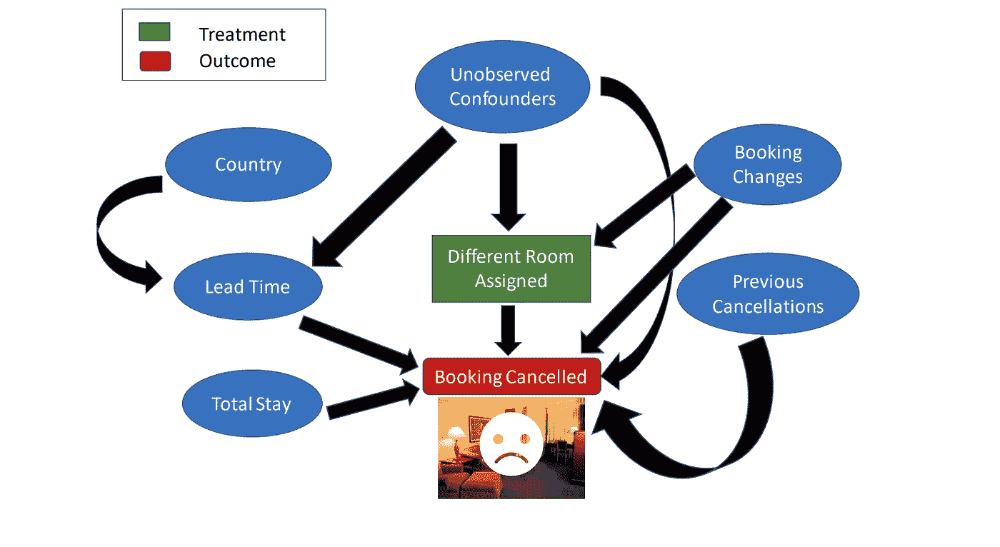

作者图片

为什么 Medium/Linkedin 或其他任何平台会向你推荐这个帖子？更重要的是，是什么激起了你的兴趣，让你点击了这篇文章？是有趣的标题还是旁边很酷的缩略图？也许你只是点击了一下，因为你个人了解我，作为一个好朋友，想通过增加这篇文章的影响范围来帮助我；-)

作为机器学习的一个流行用例，向你推荐这篇文章的平台必须有一些复杂的机器学习或基于深度学习的分类器在内部运行，其作用是预测你是否应该看到这篇文章。该预测模型将仅根据你点击该文章的概率最大化这一事实来形成其决定(因为大多数定向在线广告公司仅在用户点击其内容时付费)。所有这些预测都将使用潜在预测模型已被训练的某些特征的观测值来做出。

现在你已经点击了这篇文章，如果我改变它的标题或缩略图，你还会点击它吗？
我可以继续一个接一个地问这样发人深省的问题，很有可能连你自己都不知道真正的原因！想象在不同情况下可能是真实的场景，被称为*反事实*。广义地说，因果推理归结为估计*反事实*。

自然，人们只能观察到*事实*(比如当文章的标题是给定标题时，你点击/不点击该文章)或反事实(比如当文章的标题不同时，你点击/不点击该文章)。就数据而言，这意味着你可以有一个对应于事实场景或反事实场景的数据点，但不能两者都有。正是因为这个事实，你永远不能要求那个预测模型解释它为什么会点击这篇文章的决定。

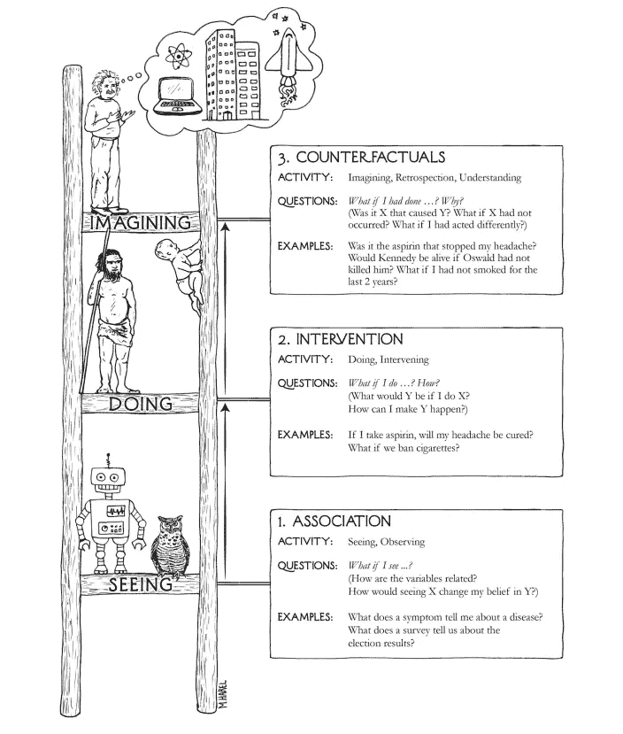

图 1:图片来源:朱迪亚·珀尔的《为什么之书》

上图描述了朱迪亚·珀尔教授在《为什么之书》中所说的因果阶梯。

大多数机器学习和复杂的深度学习模型位于这个阶梯的最底层，因为它们仅通过利用不同变量之间的关联或相关性来进行预测。然而，这并没有给我们提供一个回答“如果”的框架和*“为什么”*这些问题由该阶梯的第二和第三梯级描述，并且是 ***决策*** 的关键，如果这些模型将用于任何社会关键领域，例如:-

*   如果我接种这种疫苗，我的新冠肺炎病会被治愈吗？如果我现在不注射疫苗。与我接种该疫苗的情况相比，它是否会增加我感染 COVID'19 的风险？
*   **金融:-***Ex——如果股票 A 的价格大幅下跌，会不会导致股票 B 的价格也跟着下跌？如果股票 A 的价格没有下跌，股票 B 的价格会保持不变吗？*
*   **治理:** - *国内生产总值越高的国家，国民普遍越幸福吗？如果来年的国内生产总值急剧下降，会影响国民的幸福吗？*
*   教育:-**一位教授改变了他对某一门课程的评分方案，这是否会影响你从这门课程中学到多少东西。如果他没有改变评分方案并继续使用之前的方案，他的学生们会学到更多吗？**

# *案例分析:-酒店预订取消*

*我们考虑的问题是，与客户在*取消预订*时预订的房间相比，分配不同的房间会产生怎样的影响。*

*找出这一点的黄金标准是使用 R *和随机对照试验*等实验，其中每位顾客被随机分配到两个类别中的一个，即每位顾客要么被分配到不同的房间，要么被分配到与他之前预订的房间相同的房间。但是，如果我们不能干预或者进行这样的实验成本太高怎么办呢(例如，如果人们知道酒店随机将人分配到不同的房间，酒店将开始失去声誉)。我们是否可以仅使用观察数据或过去收集的数据来回答我们的问题？*

# *数据集的描述*

*该数据集包含来自葡萄牙一家真实酒店的城市酒店和度假酒店的预订信息，并且包括诸如预订时间、停留时间、成人、儿童和/或婴儿数量以及可用停车位数量等信息。所有个人身份信息都已从数据中删除。*

*要了解更多细节，读者可以参考由 *Antonio 等人撰写的文章 [*酒店预订需求数据集*](https://www.sciencedirect.com/science/article/pii/S2352340918315191) 。al for Data in Brief，第 22 卷，2019 年 2 月*，该数据最初来源于此。如果你赶时间，那么你可以快速浏览一下[这里](https://github.com/rfordatascience/tidytuesday/blob/master/data/2020/2020-02-11/readme.md)。*

*附:如果你有兴趣了解更多关于在这个数据集上建立预测模型以预测预订是否会被取消的信息，请看看我之前制作的[这个](https://github.com/Sid-darthvader/MAT-494-Deep-Learning-SNU/blob/master/Lab-4_12-09/Demand%20Forecasting-Hotel%20Bookings.ipynb)笔记本。重点更多的是那个笔记本中的*探索性数据分析*和*建模* [。](https://github.com/Sid-darthvader/MAT-494-Deep-Learning-SNU/blob/master/Lab-4_12-09/Demand%20Forecasting-Hotel%20Bookings.ipynb)*

*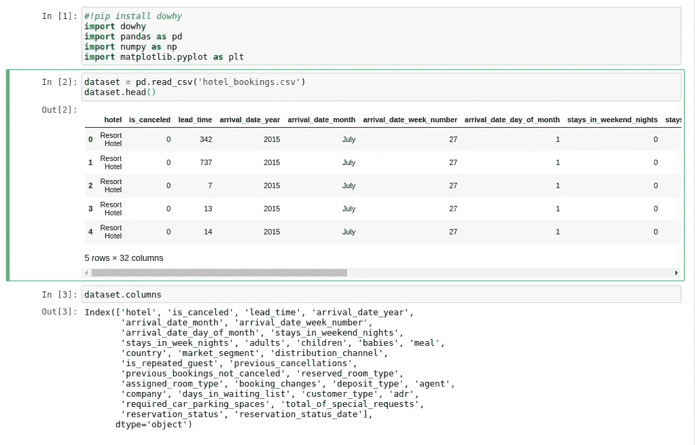*

## *特征工程和预处理*

*让我们创建一些新的有意义的特征，以降低数据集的维度。创建了以下新功能*

*   ***总停留时间** = *周内停留时间* + *周内停留时间**
*   ***嘉宾** = *成人* + *儿童* + *婴儿**
*   ***Different _ room _ assigned**= 1 如果*reserved _ room _ type*&*assigned _ room _ type*不同，否则为 0。*

*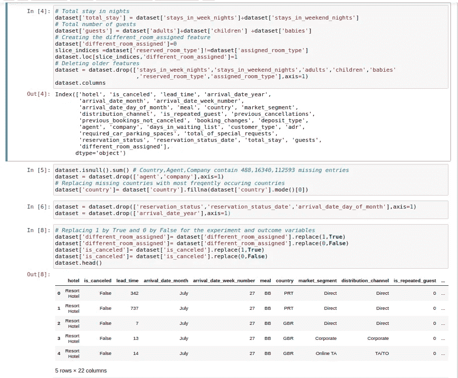*

# *计算预期计数*

*由于取消的数量和分配不同房间的次数严重不平衡，我们计算预期的数量。*

*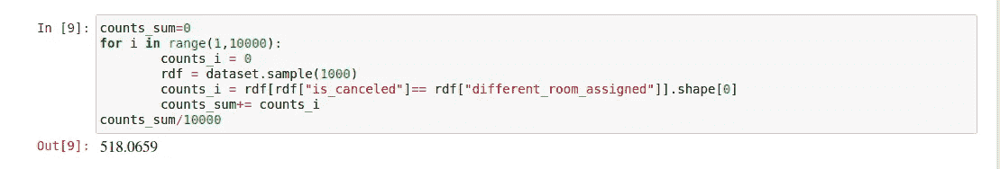*

*因为预期的计数结果是大约 50%(即这两个变量随机达到相同值的概率)。所以从统计学上来说，我们现阶段没有确定的结论。*

*让我们看看当我们考虑到*预订更改*的不同值，重新计算预期数量时会发生什么。*

*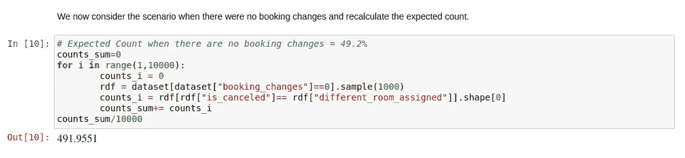**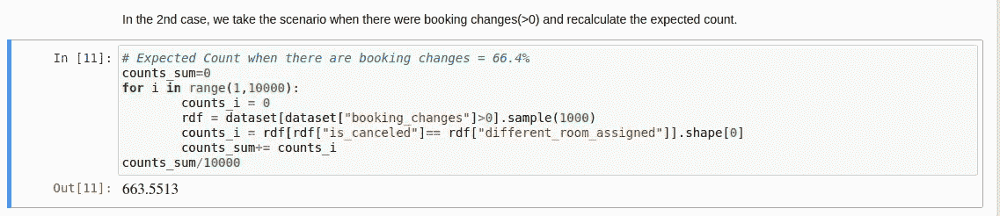*

*当预订更改的数量不为零时，肯定会发生一些变化。所以这给了我们一个提示:预订变化肯定是一个混淆变量。*

*但是*预订变化*是唯一的混淆变量吗？如果存在一些未观察到的混杂因素，我们的数据集中没有关于这些混杂因素的信息(特征),那会怎么样。我们还能像以前一样提出同样的主张吗？*

# *众所周知的白衣骑士道伊*出场了**

**DoWhy* 将其注意力集中在因果推断所需的假设上，并提供估计方法(相对简单，因为它是一个统计过程),如匹配和 IV，以便用户可以更专注于识别假设，即明确使用*因果图模型的模型假设。**

***输入:-** *观察数据*和*因果图*，其中*治疗*变量、*协变量*(除结果和治疗外的所有变量)和*结果*已明确说明。*

***输出:-** 期望变量之间的因果关系，*“假设”*分析(因果关系的*阶梯的最高一级)。**

# *第 0 步。确定你的目标并阐明问题:*

*我们考虑这样一个问题，即估计分配一个与客户预订不同的房间对预订取消会有什么影响。找出答案的黄金标准是使用*随机对照试验*(或 *A/B 测试*)每位顾客要么被分配到不同的房间，要么被分配到他预订的同一房间。*

> *随机对照试验( **RCT** )是影响评估的一种实验形式，在这种试验中，接受方案或政策干预的人群是从合格人群中随机选出的，对照组也是从同一批合格人群中随机选出的。~联合国儿童基金会*

*但就酒店的声誉而言，这可能不是最佳做法。例如，想象一个场景，一个 6 口之家到达酒店，但他们没有预订顶楼房间，而是被分配到一个只能容纳两个人的房间。因此，在现实世界中，随机实验经常被证明是不可行的、昂贵的或者完全不道德的。*

## *形式上…*

*我们说*处理*导致*结果*如果改变*处理*导致*结果*的改变，保持其他一切不变。因果效应是指*结果*被*治疗*中的单位变化所改变的幅度。*

*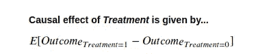*

# *步骤 1:创建一个因果模型*

*使用假设将您对预测建模问题的先验知识表示为 CI 图。不要担心，在这个阶段您不需要指定完整的图。即使是部分图表也足够了，其余的可以通过 *DoWhy* 计算出来；-)因果模型，我认为已经绘制在图 2 中。*

*这里有一系列的假设，然后我把它们转化成一个因果图*

*   **细分市场*有两个层次，“TA”指的是“旅行社”，而“to”指的是“旅游经营者”，因此它应该会影响*提前期*(即预订和到达之间的天数)。*
*   **国家*在决定一个人是否提前预订(因此有更多的*准备时间*)和一个人更喜欢什么类型的*餐*时也会发挥作用。*
*   **提前期*肯定会影响等候名单*的天数*(如果预订晚了，找到预订的机会就小了)。此外，更长的*交付周期*也会导致取消。*
*   *等候名单中的*天数、*总住宿*和*客人*的数量可能会影响预订是被取消还是保留。**
*   **以前的预订保留*会影响客户是否是*回头客*。此外，这两个变量都会影响预订是否被取消(例如，过去保留了过去 5 次预订的客户也更有可能保留这次预订。类似地，已经取消该预订的人有更高的机会重复同样的预订)。*
*   **预订变更*会影响顾客是否被分配到*不同的房间*，这也可能导致取消。*
*   *最后，*预约变更的数量*是影响*治疗*和*结果*的唯一混杂因素，这种可能性极小，可能存在一些*未观察到的混杂因素，*我们在数据中没有捕捉到关于这些混杂因素的信息。*

*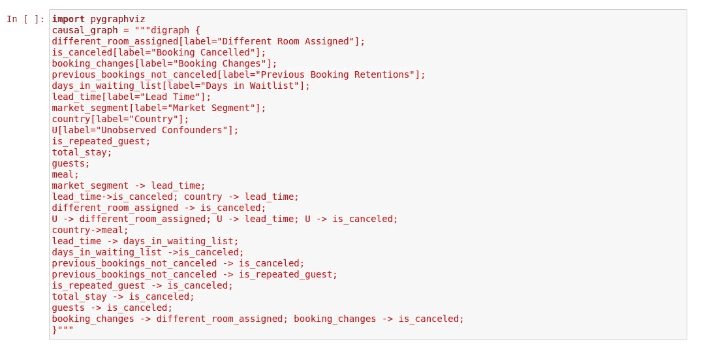*

*这里的*处理*是指分配客户在预订时预订的相同类型的房间。*结果*是预订是否被取消。*常见原因*代表我们认为对*结果*和*治疗*都有因果影响的变量。根据我们的因果假设，满足此标准的 2 个变量是*预订变更*和*未观察到的混杂因素*。因此，如果我们没有明确指定图形(不推荐！)，也可以在下面提到的函数中提供这些参数。*

*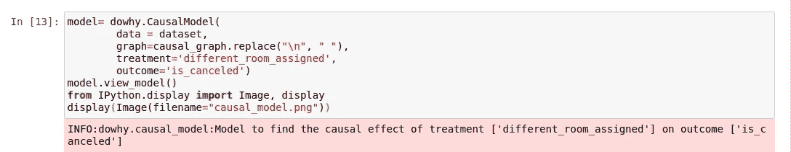**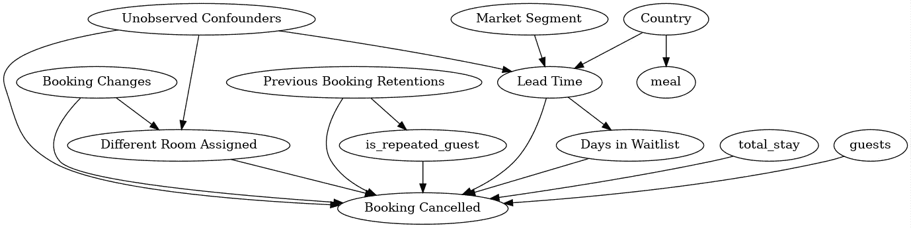*

*图 2:根据一个简单的图形模型指定的因果假设。*

*根据你的直觉和假设，你也可以考虑一个更详细的因果图，如图 3 所示。*

*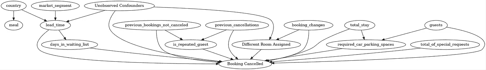*

*图 3:用更详细的图形模型来说明因果假设。*

# *步骤 2:确定原因*

*如果改变*处理*导致*结果*的变化，保持其他一切不变，我们说*处理*导致*结果*。*

*保持其他一切不变可以通过想象一个*反事实*的世界或者一个平行宇宙来实现，在这个世界里，在引入治疗之前，一切都是一样的。在*真实的*世界里，治疗是提供的，而在*反真实的*世界里，治疗是不提供的。因此，我们可能观察到的*结果*的任何变化都仅仅是由于*治疗*造成的。*

*因此，在这个步骤中，通过使用因果图的属性，我们识别要估计的因果效应。*

*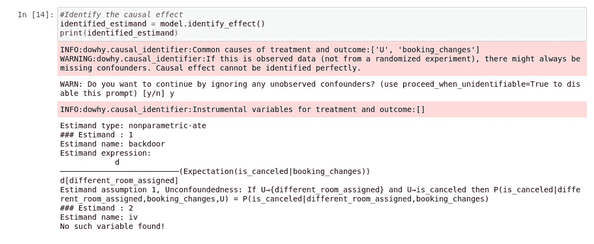*

# *步骤 3:估计已确定的原因*

**因果效应*是指*处理*中*单位变化*导致*结果*变化的幅度。因为估算是一个统计过程，所以与其他步骤相比要简单得多。 *DoWhy* 提供了多种方法，可用于计算确定的因果估计值。*

*在我们的例子中使用的方法是*倾向评分分层估计。*人们可以把倾向分数看作是对待观察倾向的一种度量。它们将根据数据进行估计或建模，而不是观察。这些分数通过训练机器学习分类器来计算，例如*逻辑回归*或*随机森林*，以便预测给定协变量的*治疗*变量(除*结果、治疗*之外的所有变量)。分层是一种识别配对亚群的技术，配对亚群的协变量分布是相似的(使用不同类型的标准测量相似性)。*

*对于这些方法和技术的恰当解释，读者可以参考[这个教程](https://causalinference.gitlab.io/kdd-tutorial/methods.html)，它是由 *DoWhy* 的创作者在 KDD 2018 上给出的。*

*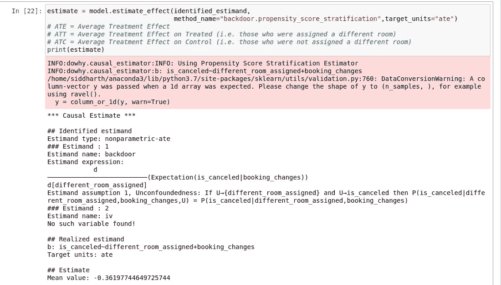*

# *第四步:反驳获得的结果*

*记住*因果*部分不是来自数据，而是来自你的*假设*(步骤 1)，这些假设用于*识别*(步骤 2)和*估计*(步骤 3)原因。数据只是用于统计估计。*

*因此，如果可能的话，就要验证我们的假设，并以多种方式挑战它们的有效性。 *DoWhy* 提供了多重稳健性检查，可用于测试我们假设的有效性:-*

*   ***随机常见原因** :- *将随机抽取的协变量添加到数据中，并重新运行分析，以查看因果估计值是否改变。如果我们的假设最初是正确的，那么因果估计应该不会有太大的变化。**

*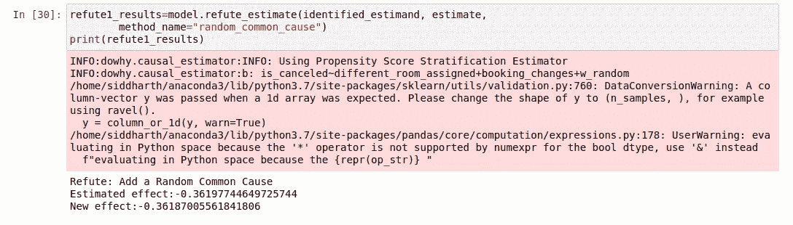*

*   ***安慰剂治疗反驳者** :- *随机分配任何协变量作为治疗并重新运行分析。如果我们的假设是正确的，那么这个新发现的估计应该是 0。**

*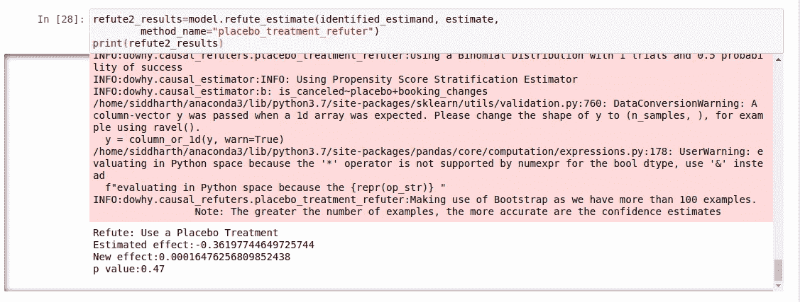*

*   ***数据子集反驳器** :- *创建数据子集(类似于交叉验证)并检查因果估计是否在子集间变化。如果我们的假设是正确的，应该不会有太大的变化。**

*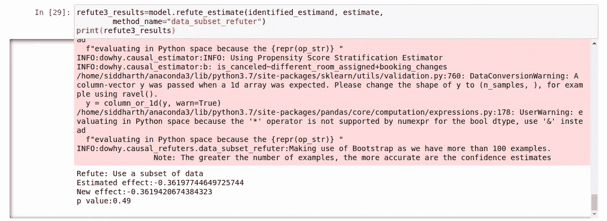*

*通过使用多重稳健性检查，我们已经验证了我们的因果假设确实是正确的！*

## *这告诉我们，平均而言，当一个人被分配到同一个房间时，与他被分配到与他在预订时选择的房间不同的房间相比，酒店预订被取消的概率降低了 **~36%** 。*

*所以下一次，如果酒店员工陷入困境，不得不给顾客分配不同的房间，他们知道他们的行为会对取消预订产生多大的影响。*

# *奖励提示:-*

*对观察数据进行因果推断的最佳实践*

1.  *请务必遵循四个步骤，即。 ***建模、鉴别、估计、反驳*** *。**
2.  ****以简单为目标，*** 如果你的分析太复杂，最有可能是错的！*
3.  *用不同的假设 至少尝试 ***2 种方法。如果两种方法一致，估计值的可信度更高。****

*非常感谢微软研究院的 Amit Sharma 博士创建了这个神奇的图书馆！*

*完整的 jupyter 笔记本和数据集现在是 github 上的 Microsoft Dowhy 知识库的一部分。*

* [## 微软/道威

### permalink dissolve GitHub 是超过 5000 万开发人员的家园，他们一起工作来托管和审查代码，管理…

github.com](https://github.com/microsoft/dowhy/blob/master/docs/source/example_notebooks/DoWhy-The%20Causal%20Story%20Behind%20Hotel%20Booking%20Cancellations.ipynb)* 

# *参考资料:-*

*   *[*【为什么之书】*](http://bayes.cs.ucla.edu/WHY/) 朱迪亚·珀尔教授。*
*   *[“因果推理的要素”](https://mitpress.mit.edu/books/elements-causal-inference#:~:text=Elements%20of%20Causal%20Inference%20is,data%20to%20understand%20the%20world.)Bernhard schlkopf 教授。*
*   *Amit Sharma 博士在西北大学关于因果推理的轻松演讲。*
*   *[阿米特·夏尔马博士给 KDD 的 2018 年辅导课](https://causalinference.gitlab.io/kdd-tutorial/)*
*   *https://github.com/microsoft/dowhy*