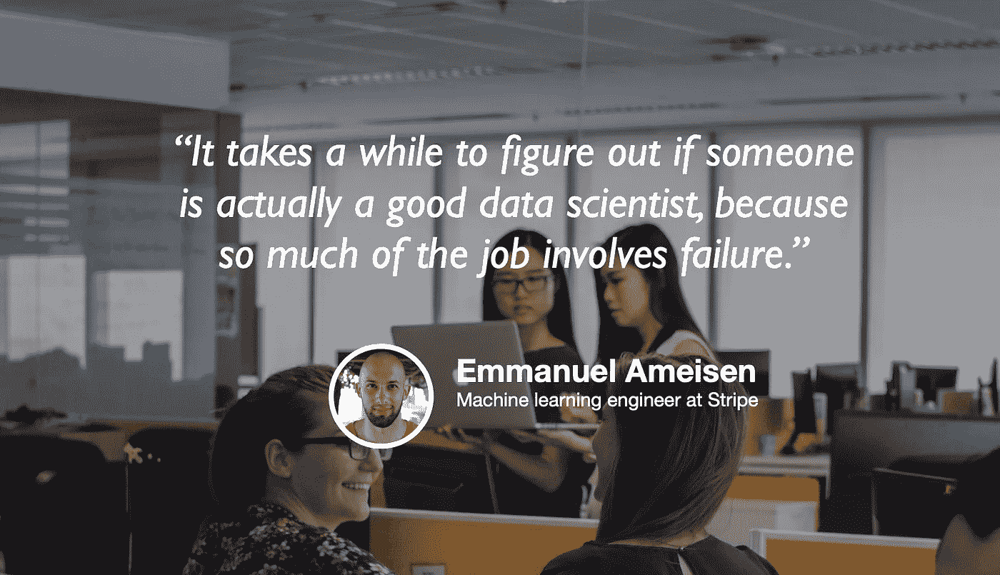

# 超越 jupyter 笔记本:如何构建数据科学产品

> 原文：<https://towardsdatascience.com/beyond-the-jupyter-notebook-how-to-build-data-science-products-50d942fc25d8?source=collection_archive---------31----------------------->

## [苹果](https://podcasts.apple.com/ca/podcast/towards-data-science/id1470952338?mt=2) | [谷歌](https://www.google.com/podcasts?feed=aHR0cHM6Ly9hbmNob3IuZm0vcy8zNmI0ODQ0L3BvZGNhc3QvcnNz) | [SPOTIFY](https://open.spotify.com/show/63diy2DtpHzQfeNVxAPZgU) | [其他](https://anchor.fm/towardsdatascience)

## Emmanuel Ameisen 在 [TDS 播客](https://towardsdatascience.com/podcast/home)

背景图片由[咪咪 Thian](https://unsplash.com/@mimithian?utm_source=unsplash&utm_medium=referral&utm_content=creditCopyText)

*编者按:迈向数据科学播客的“攀登数据科学阶梯”系列由 Jeremie Harris 主持。Jeremie 帮助运营一家名为*[*sharpes minds*](http://sharpestminds.com)*的数据科学导师初创公司。你可以听下面的播客:*

数据科学不仅仅是 jupyter 笔记本，因为数据科学问题不仅仅是机器学习。

我应该收集哪些数据？我的模型需要有多好才能“好到足以”解决我的问题？我的项目应该采取什么形式才是有用的？它应该是一个仪表板，一个实时应用程序，还是其他什么东西？我如何部署它？我如何确保在生产中部署它时不会发生可怕和意想不到的事情？

这些问题都不能通过输入`sklearn`和`pandas`并在 jupyter 笔记本上破解来回答。数据科学问题需要商业头脑和软件工程知识的独特结合，这就是为什么 Emmanuel Ameisen 写了一本名为 [*构建机器学习驱动的应用程序:从想法到产品*](https://www.amazon.com/Building-Machine-Learning-Powered-Applications/dp/149204511X/) *的书。Emmanuel 是 Stripe 的机器学习工程师，之前担任 Insight Data Science 的人工智能主管，负责监督数十种机器学习产品的开发。*

我们的谈话集中在大多数在线数据科学教育中缺失的环节:商业本能、数据探索、模型评估和部署。以下是我最喜欢的一些外卖食品:

*   数据探索是数据科学生命周期中至关重要的一步，但它的价值很难量化。如果有人因为找不到任何见解，或者因为他们不具备足够的工作技能而未能在数据集中找到有趣的见解，您如何知道呢？公司倾向于根据易于衡量的工作表现方面来评估员工，这种偏见意味着数据探索往往被置于次要地位。解决这个问题的一个好办法是，公司或团队明确地为开放式探索任务留出时间，这样数据科学家就不会在需要的时候回避做这些工作。
*   新数据科学家和机器学习工程师经常低估的生产化的一个方面是模型健壮性的重要性。如果有人试图从你的模型中产生一个社会不接受的输出，会发生什么？如果你的模型遇到一个它不能高置信度预测的输入怎么办？有时，添加一层规则来防止模型在提供不可靠或有问题的用户输入时产生输出可能是至关重要的。
*   许多人错误地以“自顶向下”的方式考虑模型优化。如果他们的第一个模型不工作，他们决定使用另一个(通常更复杂)模型，而不是调查他们的模型正在犯的错误，并试图设计可能有助于解决这些错误的功能或设计启发。这是一个问题，因为大多数数据科学问题只能通过仔细检查错误模型的决策面来解决，而提升模型复杂性而不是在更简单的模型上求助于功能工程往往会使这项任务变得更难而不是更容易。

你也可以在这里的 Twitter 上关注 [Emmanuel 以了解他的工作，我](https://twitter.com/mlpowered)[在这里](https://twitter.com/jeremiecharris)。