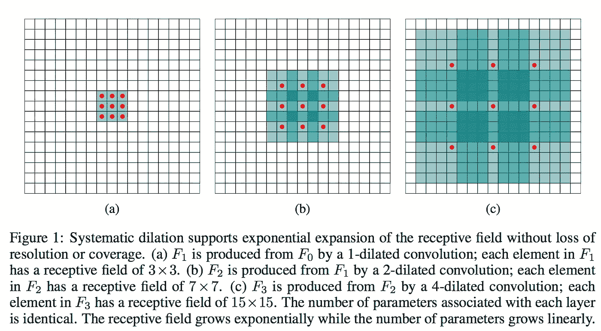
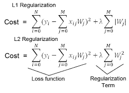
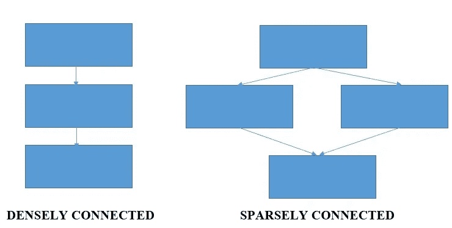
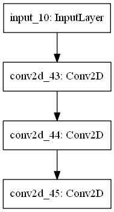
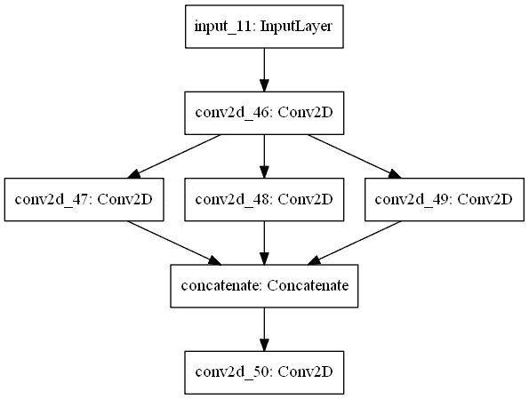
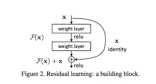
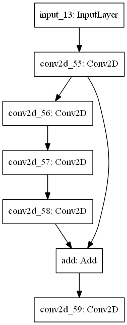
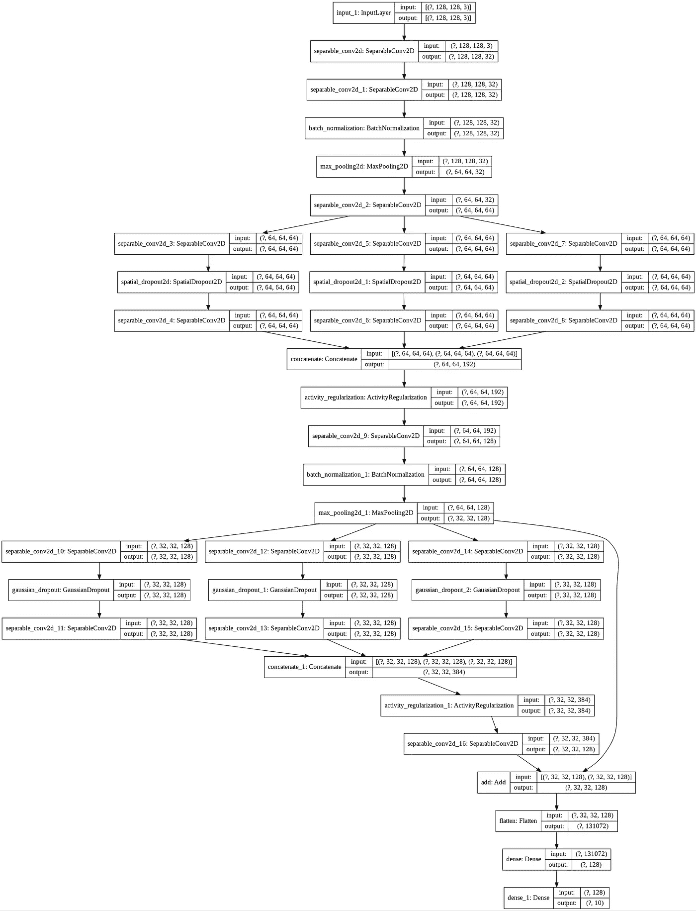

# Tensorflow 2 中的高级 CNN 完全指南

> 原文：<https://towardsdatascience.com/beyond-the-standard-cnn-in-tensorflow-2-a7562d25ca2d?source=collection_archive---------29----------------------->

## 使用复杂的架构生成更深层次的模型，并了解不同的层应该使模型更好。


马库斯·斯皮斯克在 [Unsplash](https://unsplash.com?utm_source=medium&utm_medium=referral) 上的照片

我构建的第一个 ConvNet 模型是为了识别狗或猫，它具有一个序列模型的基本结构，该模型具有 Conv2d 层，以及这里和那里的批处理规范化和最大池层的混合，并且不要忘记一个丢弃层以对抗过度拟合😏。所有这一切之后是平坦层，最终导致致密层。使用 add 将它们添加到模型中。它工作得很好，给出了足够好的精度。然后我尝试了著名的 MNIST 数据集，并使用了相同的架构。我所要做的就是将我的密集层中的损失从二元交叉熵改变为分类交叉熵，tada 我觉得我已经掌握了 CNN。但是，孩子，我错了！还有更多的东西，比如用不同类型的 Conv2d 层构建稀疏连接的架构，应用不同的过拟合技术等等。

# 目录

1.  **高级 Conv2D 图层**

*   深度可分卷积
*   扩张的回旋

2.**计数器过拟合**

*   空间缺失
*   高斯漏失
*   活动正规化

3.**复杂架构**

*   稀疏连接的架构
*   跳过连接

4.**结论**

# 高级 Conv2D 层

## 深度可分卷积

它们效率更高，需要更少的内存和更少的计算，在某些情况下甚至可以提供更好的结果。由于这些特征，当我们的模型必须部署在边缘/物联网设备上时，通常使用它们*,因为它们的 CPU 和 RAM 有限。它将正常卷积层的过程分为两个过程，即*深度方向卷积和*点方向卷积。在深度方向卷积中，内核一次迭代一个通道。逐点卷积使用 1x1 内核来增加通道数量。这样就减少了所需的乘法总数，从而使我们的网络速度更快。这是一篇很棒的[文章](/a-basic-introduction-to-separable-convolutions-b99ec3102728)来了解更多。*

```
tensorflow.keras.layers.SeparableConv2D(32, (3, 3), padding="same"))
```

## 扩张的回旋

可以在正常卷积层以及深度方向可分离的卷积层中实现扩展卷积。这是一个带有间隙的正常卷积运算。除了提供更大的感受域、高效的计算和更少的内存消耗，它还*保持了数据*的分辨率和顺序。因此，它通常会提高模型的性能。



图片取自[这里](http://www.erogol.com/dilated-convolution/)。

```
#In Normal Conv2D
tf.keras.layers.Conv2D(32, (3, 3), padding='same', dilation_rate=(2, 2))#In Seperable Conv2D
tf.keras.layers.SeparableConv2D(no_of_filters, (3, 3), padding='same', dilation_rate=(2, 2))
```

# 反过度拟合

## 空间缺失

在正常退出中，一些随机选择的神经元在训练期间被忽略。这些神经元在前向传递中没有贡献，并且它们的权重在后向传递中没有更新。这导致网络学习多个独立的内部表示，并使其不太可能过度适应训练数据。*在空间删除中，我们没有删除神经元，而是删除了整个特征图*。如[空间文档的 Keras 文档所述](https://keras.rstudio.com/reference/layer_spatial_dropout_2d.html):

> 如果特征图中的相邻像素是强相关的(在早期卷积层中通常是这种情况),那么常规的丢弃不会使激活正则化，否则只会导致有效学习率的降低。在这种情况下，空间下降将有助于提高要素地图之间的独立性，因此应改为使用空间下降。

```
tf.keras.layers.SpatialDropout2D(0.5)
```

## 高斯漏失

它是压差和高斯噪声的组合。这意味着这一层连同丢弃的一些神经元也应用了以 1 为中心的乘法高斯噪声。和正常退学者一样，它也采用论证率。来自其[文档](https://www.tensorflow.org/api_docs/python/tf/keras/layers/GaussianDropout):

> Float，drop 概率(和 dropout 一样)。乘法噪声将具有标准差 sqrt(rate / (1 — rate))。

关于它的更深入的阅读，你可以参考这篇文章[这里](https://medium.com/@maksutov.rn/deep-study-of-a-not-very-deep-neural-network-part-5-dropout-and-noise-29d980ece933)。

```
tf.keras.layers.GaussianDropout(0.5)
```

## 活动正规化

正则化会对网络进行细微的更改，以便更好地进行概化。它鼓励神经网络*学习稀疏特征或原始观察值的内部表示*，这使得模型在看不见的数据上表现得更好。支持三种类型的正则化技术:

*   **l1** :活动计算为绝对值之和。
*   **l2** :活动计算为平方值的总和。
*   **l1_l2** :活动被计算为绝对值之和以及平方值之和。



L1 和 L2 正则化公式。λ是正则化参数。图片取自[这里](https://www.google.com/url?sa=i&url=http%3A%2F%2Flaid.delanover.com%2Fdifference-between-l1-and-l2-regularization-implementation-and-visualization-in-tensorflow%2F&psig=AOvVaw2-BdRWRvBXmAsVNFdu14WF&ust=1584432566455000&source=images&cd=vfe&ved=0CAIQjRxqFwoTCOC__rjFnugCFQAAAAAdAAAAABAD)。

由于正则化项的增加，权重矩阵的值降低，并且导致减少过拟合的更简单的模型。有关正则化技术的更多信息，请参考此处的。

```
#L1 regularization
tf.keras.layers.ActivityRegularization(l1=0.001)#L2 regularizaton
tf.keras.layers.ActivityRegularization(l2=0.001)#L1_L2 regularization
tf.keras.layers.ActivityRegularization(l1=0.001, l2=0.001)
```

# 复杂架构

## 稀疏连接的架构

有两种类型的架构，密集连接和稀疏连接。



它因 [Inception](https://arxiv.org/abs/1409.4842) 网络而流行起来。那么对这些类型的架构有什么需求呢？难道我们不能继续增加层次，网络越深，结果越好吗？一点也不。*模型越大，就越容易过度拟合* *，尤其是对于较小的数据集，这也增加了训练模型所需的计算能力*。*有时甚至训练误差甚至变得更严重。*稀疏连接的架构有助于我们增加模型的深度和宽度，同时不会超出所需的计算能力。它们可以具有不同大小的卷积核，这在测试对象大小不同时也有助于建模。

一般我们用`tf.keras.layers.add`做密集连接的架构。我们可以使用`tf.keras.utils.plot_model`来可视化我们的模型。

```
from tensorflow.keras.models import Sequential
from tensorflow.keras.layers import Conv2D, add, Input
from tensorflow.keras.utils import plot_modelmodel = Sequential()
model.add(Conv2D(64, (3, 3), activation = 'relu', padding='same', input_shape=(128, 128, 3)))
model.add(Conv2D(64, (3, 3), activation = 'relu', padding='same'))
model.add(Conv2D(128, (3, 3), activation = 'relu', padding='same'))
plot_model(model)
```


绘制的模型

我们也可以创建这样的模型，方法是将它们分配给变量，并将它们的变量名放在它最后连接的层上。输入形状在`tf.keras.layers.Input`中指定，`tf.keras.models.Model`用于强调输入和输出，即我们模型的第一层和最后一层。

```
from tensorflow.keras.models import Model
from tensorflow.keras.layers import Conv2D, Input
from tensorflow.keras.utils import plot_modelinput_flow = Input(shape=(128, 128, 3))
x = Conv2D(64, (3, 3), activation = 'relu', padding='same')(input_flow)
x = Conv2D(64, (3, 3), activation = 'relu', padding='same')(x)
x = Conv2D(128, (3, 3), activation = 'relu', padding='same')(x)
model = Model(inputs=input_flow, outputs=x)
plot_model(model)
```



绘制的模型

现在，要构建稀疏连接的架构，我们只需要将一层分配给多层，然后使用`tf.keras.layers.concatenate`将它们连接起来。

```
from tensorflow.keras.models import Model
from tensorflow.keras.layers import Conv2D, Input, concatenate
from tensorflow.keras.utils import plot_modelinput_flow = Input(shape=(128, 128, 3))
x = Conv2D(64, (3, 3), activation='relu', padding='same', input_shape=(128, 128, 3))(input_flow)
one = Conv2D(64, (3, 3), activation='relu', padding='same')(x)
two = Conv2D(64, (5, 5), activation='relu', padding='same')(x)
three = Conv2D(64, (7, 7), activation='relu', padding='same')(x)
x = concatenate([one, two, three])
x = Conv2D(128, (3, 3), activation = 'relu', padding='same')(x)
model = Model(inputs=input_flow, outputs=x)
plot_model(model)
```



模型已绘制。

## 跳过连接

这被网络 [ResNet50](https://arxiv.org/abs/1512.03385) 推广开来。跳过连接背后的主要思想是解决微软研究院在他们的论文[图像识别的深度剩余学习](https://arxiv.org/abs/1512.03385)中给出的这个问题。

> 当更深的网络能够开始收敛时，一个*退化*问题就暴露出来了:随着网络深度的增加，精确度达到饱和(这可能不足为奇)，然后迅速退化。出乎意料的是，这种退化*不是由过度拟合*引起的，并且向适当深度的模型添加更多的层导致*更高的训练误差……*



图像取自此处的。

它的优点是可以更容易地估计权重的良好值，并且模型可以更好地概括。

如果你了解如何构建稀疏连接的架构，你可以很容易地猜到这是如何工作的，但是在这种情况下，为了连接它们，我们将使用`tf.keras.layers.Add`。

```
from tensorflow.keras.models import Model
from tensorflow.keras.layers import Conv2D, Input, Add
from tensorflow.keras.utils import plot_modelinput_flow = Input(shape=(128, 128, 3))
x = Conv2D(64, (3, 3), activation='relu', padding='same', input_shape=(128, 128, 3))(input_flow)
one = Conv2D(64, (3, 3), activation='relu', padding='same')(x)
two = Conv2D(64, (5, 5), activation='relu', padding='same')(one)
three = Conv2D(64, (7, 7), activation='relu', padding='same')(two)
x = Add()([x, three])
x = Conv2D(128, (3, 3), activation = 'relu', padding='same')(x)
model = Model(inputs=input_flow, outputs=x)
plot_model(model)
```



绘制的模型

# 结论

使用这些技术可能会改进我们的模型，但情况并非总是如此。它们的性能甚至可能比普通 Conv2D 层的简单密集连接架构更差。你需要试着看看哪种策略能产生最好的结果。

出于修订的目的，我使用上面提供的概念创建了一个模型。这只是为了修改的目的，我不保证这个模型会给出更好的结果。



绘制的模型