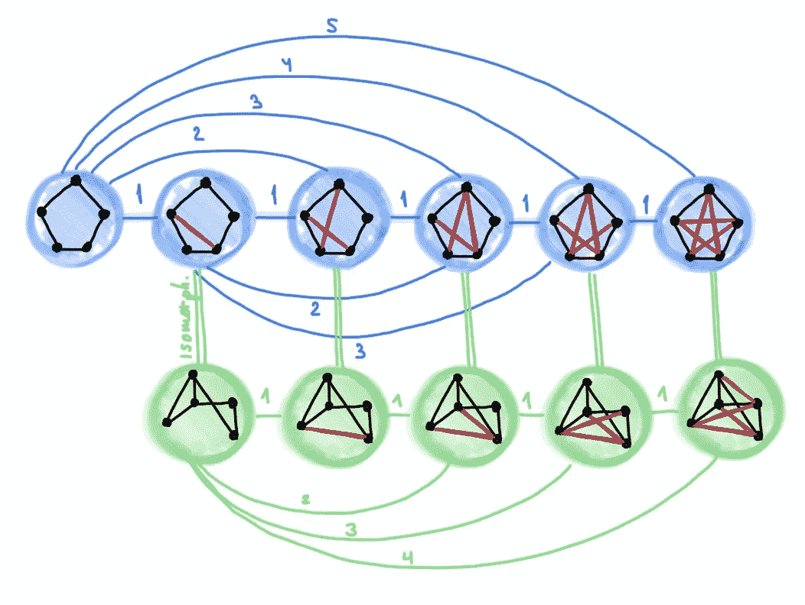
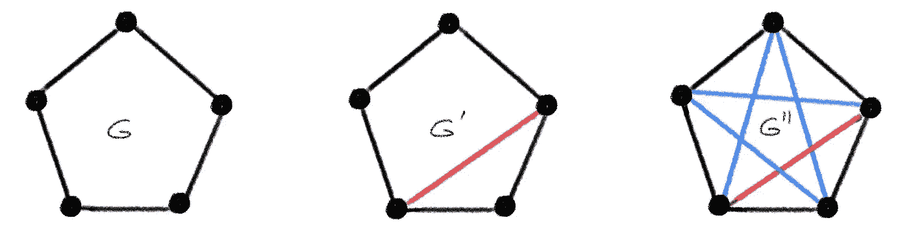
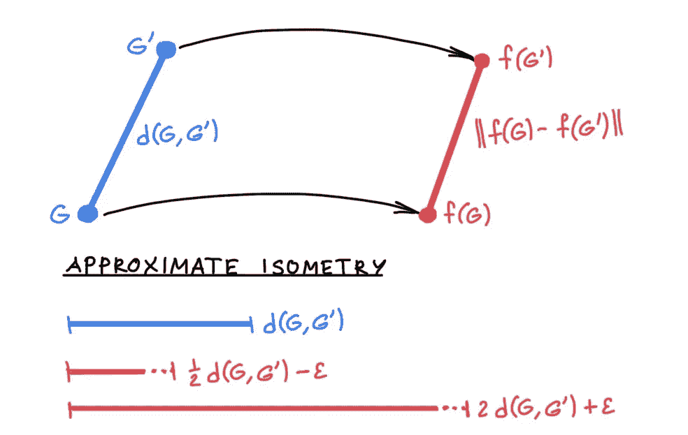

# 超越 Weisfeiler-Lehman:近似同构和度量嵌入

> 原文：<https://towardsdatascience.com/beyond-weisfeiler-lehman-approximate-isomorphisms-and-metric-embeddings-f7b816b75751?source=collection_archive---------28----------------------->

## 图形神经网络有多强大？

## 在这篇文章中，我认为图同构的设置对于分析图神经网络的表达能力来说太有限了，并建议基于度量嵌入的更广泛的设置。

*这是关于图形神经网络表达能力系列文章的第三篇。参见* [*第 1 部分*](/expressive-power-of-graph-neural-networks-and-the-weisefeiler-lehman-test-b883db3c7c49) *描述图神经网络与 Weisfeiler-Lehman 图同构测试之间的关系，以及* [*第 2 部分*](/beyond-weisfeiler-lehman-using-substructures-for-provably-expressive-graph-neural-networks-d476ad665fa3) *展示如何基于子结构计数构造可证明强大的图神经网络。*

W 在图形深度学习的背景下，已经表明消息传递神经网络[与 1-WL 测试](/expressive-power-of-graph-neural-networks-and-the-weisefeiler-lehman-test-b883db3c7c49)【2】一样强大。前往更高阶并且因此更强大的 *k* -WL 测试导致具有高计算复杂度和非局部操作的图形神经网络[3]，这在实际应用中是不切实际的。

我们在最近的一篇论文[4]中介绍的另一种[方法](/beyond-weisfeiler-lehman-using-substructures-for-provably-expressive-graph-neural-networks-d476ad665fa3)是打破 Weisfeiler-Lehman 层级结构，并求助于一种消息传递机制，这种机制能够感知局部图结构，如循环、集团和路径。这导致图形神经网络具有标准消息传递架构的吸引人的局部性和低复杂性，同时被证明比 2-WL 更强大，并且至少不比 3-WL 更弱。这种观点打开了图论中公开问题的深层链接，这些问题以前在图形神经网络表达性的上下文中没有被探索过。

故事就这样结束了吗？我相信我们可以通过改变对问题的看法来做得更好，并将在本文中讨论几个方向。

**近似同构。**虽然对图形神经网络表达能力的重要见解已经从图形同构问题的链接中显现出来，但设置本身相当有限。图形神经网络可以看作是试图寻找一个嵌入了 *f* ( *G* )，具有期望性质*f*(*G*)=*f*(*G′*)IFF*G*~*G′*的图。不幸的是，由于 Weisfeiler-Lehman 测试是图同构的必要但非充分条件，这只能以一种方式工作:*f*(*G*)=*f*(*G′*)if*G*~*G′*，但反过来就不一定了:两个不同构的图可以产生相等的嵌入。

在实际应用中，我们很少处理完全同构的图，而是处理*近似同构*的图，如下图所示:

近似同构的图的例子:两对图 *G* 、*G′*和 *G* 、 *G″* 都是非同构的。然而， *G* 和*G′*仅相差一条边，因此比 *G* 和 *G″* “更同构”,它们相差五条边。

量化“近似同构”概念的一种适当方式是以度量 *d* 的形式，如果两个图不相似，则该度量大，否则该度量小。图形编辑距离[5]或格罗莫夫-豪斯多夫距离[6]是两个可能的例子。重要的是，度量被定义为 *d* ( *G* ，*G′*)= 0 当且仅当*G*~*G′*，这意味着两个同构的图是不可区分的[7]。*等距嵌入的问题*

|*f*(*g*)f(*g′*)| =*d*(*g*，*g′*)为所有 *G* ，*g′*(♠)

尝试用欧几里得距离|替换图形距离。在图的嵌入之间，两个距离相等(在这种情况下，嵌入 *f* 被称为“等距”或“距离保持”)。

关于图神经网络的表达能力的工作表明，在多项式时间内构造满足(♠)的图嵌入是可能的，其中 Weisfeiler-Lehman 测试成功。这个设置似乎限制太多。首先，很可能不可能设计出一个局部有效的算法来保证所有图的♠[8]。二、图同构问题对近似同构的图不提供任何保证，在这种情况下 *d* ( *G* ，*G′*)>0。例如，原则上可能的是，更多相似的图在嵌入空间中不太相似，即， *d* ( *G* ，*G′*)<*d*(*G*， *G″* )但是|*f*(*G*-*f*(【T24

另一方面，公制公式提供了更多的灵活性。人们可以通过限制*度量膨胀*来放松它，而不是要求(♠)保持精确，

*c*⁻*d*(*g*，*g′*)≤|*f*(*g*)—*f*(*g′*)|≤*c d*(*g*，*g′*)对于 *c*

其可以表示为嵌入 *f* 的双李普希兹常数 *c* 。这意味着嵌入不会“拉伸”或“收缩”地面实况图距离 *d* 超过一个系数 *c* ，该系数理想情况下应尽可能接近 1。这种嵌入称为*近似等距。人们试图得到的结果是一个与图无关的界限，特别是与顶点数无关的界限。*

注意，图同构是(♣)的一个特例，因为对于同构的图*g*~*g′*有 *d* ( *G* ，*g′*)= 0，因此*f*(*g*)=*f*(*g′*)。如上所述，这不可能在所有的图中都实现。相反，模型(♣)可以进一步放宽，允许额外的*公制失真ε* ，

*c*⁻*d*(*g*，*g′*)d*ε*≤|*f*(*g*)*f*(*g′*)|≤*c d*(*g*

它对同构图形之间的距离设置了一个容差。在许多应用中，这是一个很小的代价，如果反过来一个人可以满足比(♠).)大得多的图族的话

近似等距嵌入问题。

**大概近似等距。**近似同构问题可以改写为“可能近似正确”(PAC)形式的概率陈述

𝖯( *c* ⁻ *d* ( *G* ，*g′*)ε≤|*f*(*g*)*f*(*g′*)|≤*c d*(*g*，*g′*)

其中“近似”在度量膨胀 *c* 的意义上被理解，而“可能”是指对于图的某些分布，界限()以高概率 1*δ*成立[9]。这种设置可能比确定性的近似等距嵌入问题更容易分析。

**桥接连续和离散结构。**最后但同样重要的是，图神经网络表达能力的问题主要集中在图的*拓扑*上。然而，在大多数实际应用中，图也有节点或边的特征或属性，通常表示为向量[10]。度量框架通过定义属性图之间的适当距离来自然地处理这两种结构。

作为最后的评论，我提醒大家应该记住，大多数关于图形神经网络表达能力的工作都是建立在图论经典结果基础上的最近发展。扩展到其他数学领域，如度量几何，似乎是一个有前途的途径，很可能在不久的将来开花结果。

[1] B. Weisfeiler，A. Lehman，[将一个图化简为标准形以及其中出现的代数](https://www.iti.zcu.cz/wl2018/pdf/wl_paper_translation.pdf)，1968 年(英译)

[2] K. Xu 等[图神经网络到底有多强大？](https://arxiv.org/abs/1810.00826) (2019)。继续。ICLR。

[3] H. Maron 等人[可证明强大的图形神经网络](https://arxiv.org/abs/1905.11136) (2019)。继续。神经炎。

[4] G. Bouritsas 等[通过子图同构计数提高图神经网络表达能力](https://arxiv.org/abs/2006.09252) (2020)。arXiv:2006.09252。

[5] A. Sanfeliu，K.-S. Fu，用于模式识别的属性关系图之间的距离度量(1983)。IEEE Trans。系统、人和控制论(3):353–362。

[6] M .格罗莫夫,《黎曼多样性的结构》( 1981 年)。

[7]从技术上讲， *d* 是一个伪度量，可以看作是模同构关系的图的商集𝒢⧵~上的度量。

[8]我说“可能”是因为图同构问题是否有多项式时间的解还是未知的。这种假设的算法似乎极不可能具有实际的时间和空间复杂性。

[9]在 N. M. Kriege 等人(2018)的图核理论表达能力的属性测试框架中，概率度量设置的一个版本先前用于分析图核。继续。IJCAI。

[10]虽然 Weisfeiler-Lehman 框架在技术上适用于彩色图，但它仅限于具有离散特征集的节点。

*我感谢卢卡·贝利、乔治·布瑞萨斯、法布里奇奥·弗拉斯卡、谢尔盖·伊万诺夫和伊曼纽·罗西校对了这篇文章，也感谢克里斯多夫·莫利斯指出了他之前在图形核的性质测试方面的工作。对图形深度学习感兴趣？在 Medium 上看我的* [*其他帖子*](https://towardsdatascience.com/graph-deep-learning/home) *，或者关注我的*[*Twitter*](https://twitter.com/mmbronstein)*。*