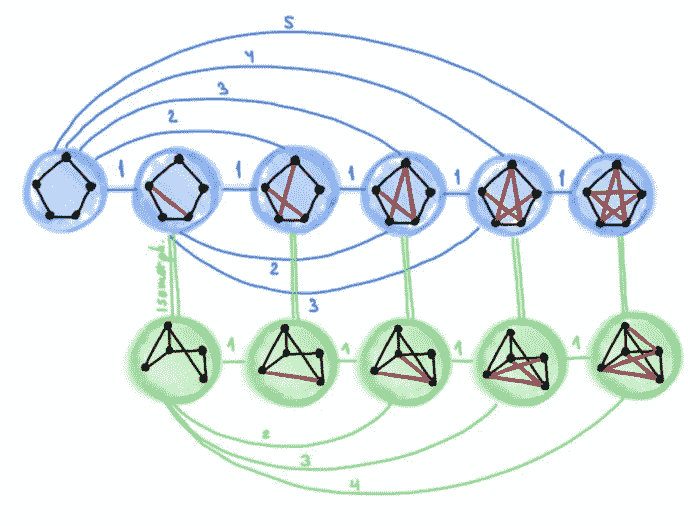
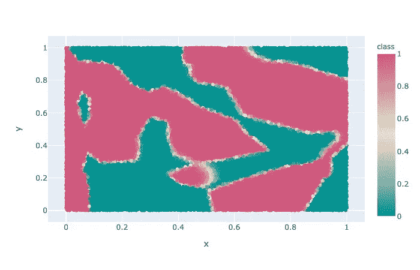
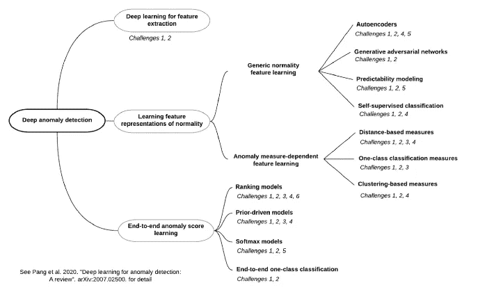

# 超越魏斯费勒-雷曼

> 原文：<https://towardsdatascience.com/beyond-weisfeiler-lehman-bc1f546d5164?source=collection_archive---------53----------------------->

## 超越 Weisfeiler-Lehman:近似同构和度量嵌入

由[迈克尔布朗斯坦](https://medium.com/u/7b1129ddd572?source=post_page-----bc1f546d5164--------------------------------) — 6 分钟阅读

在这篇文章中，我认为图同构的设置对于分析图神经网络的表达能力来说太有限了，并建议基于度量嵌入的更广泛的设置。这是关于图形神经网络表达能力系列文章的第三篇。

## [为什么神经网络可以逼近任何函数](/why-neural-nets-can-approximate-any-function-a878768502f0)

托马斯·汐宫光·克拉克——8 分钟阅读

在本文中，我将解释通用逼近定理，并用 PyTorch 代码展示两个快速示例，以演示神经网络学习逼近函数。如果你已经知道神经网络如何工作的基础知识，请随意直接跳到代码和可视化！

图片来源:Unsplash

## [概率编程简介](/intro-to-probabilistic-programming-b47c4e926ec5)

由法比亚娜·克莱门特 — 6 分钟读完

概率编程背后的思想是将来自统计的推理算法和理论与来自编程语言的形式语义、编译器和其他工具结合起来，为来自机器学习的模型和应用程序构建高效的推理评估器。

## [深度学习异常检测:综述](/a-comprehensive-survey-on-deep-learning-for-anomaly-detection-b1989b09ae38)

由[关松庞](https://medium.com/u/1e6e5ed9fb39?source=post_page-----bc1f546d5164--------------------------------) — 7 分钟读完

异常检测，也称为异常值检测，几十年来一直是一个活跃的研究领域，因为它在许多关键领域都有广泛的应用，如风险管理、合规性、安全、金融监控、健康和医疗风险以及人工智能安全。

美国宇航局在 Unsplash 上拍摄的照片

## [卫星图像分割初学者指南](/a-beginners-guide-to-segmentation-in-satellite-images-9c00d2028d52)

汉娜·彼得森 — 15 分钟阅读

与根据标签对整个图像进行分类的图像分类相反，图像分割包括检测和分类图像中的单个对象。此外，分割不同于对象检测，因为它在像素级工作以确定图像中对象的轮廓。