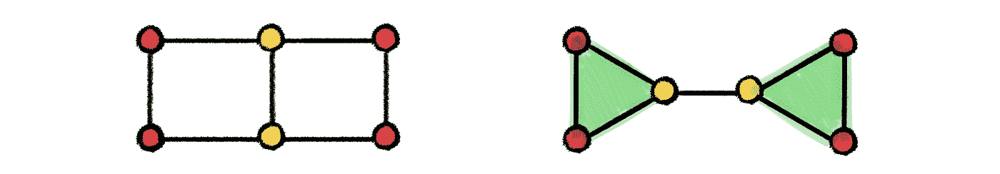
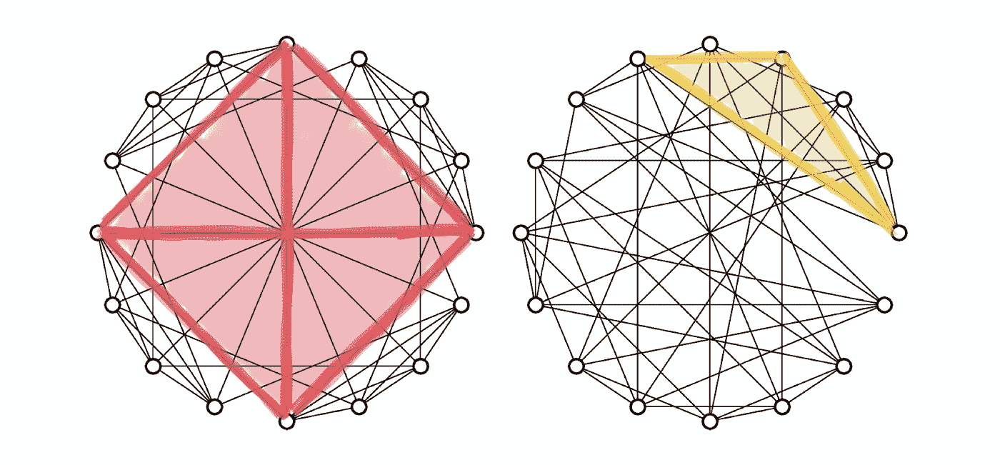
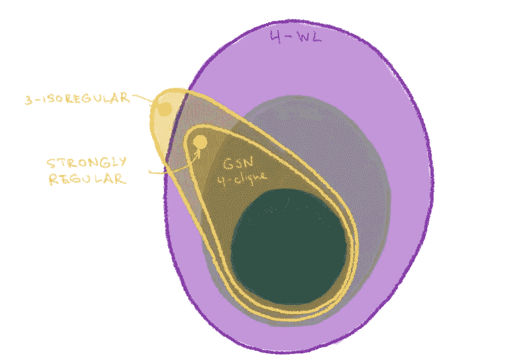
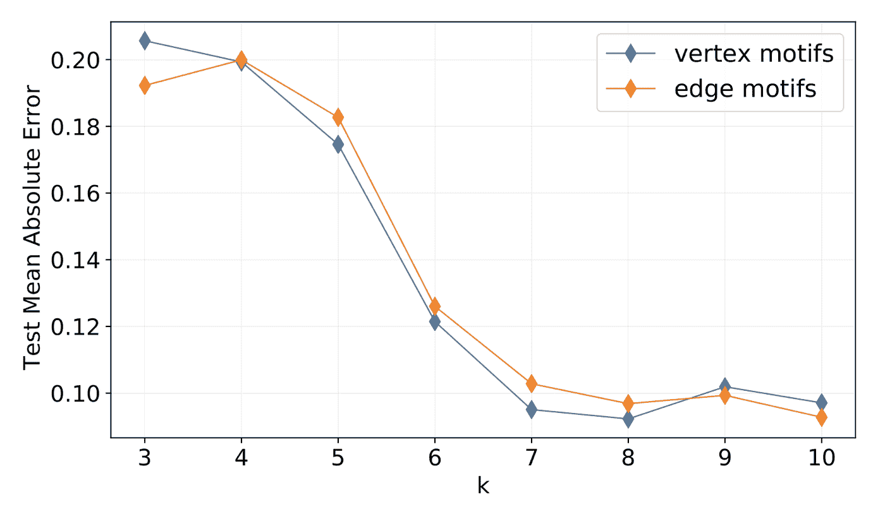
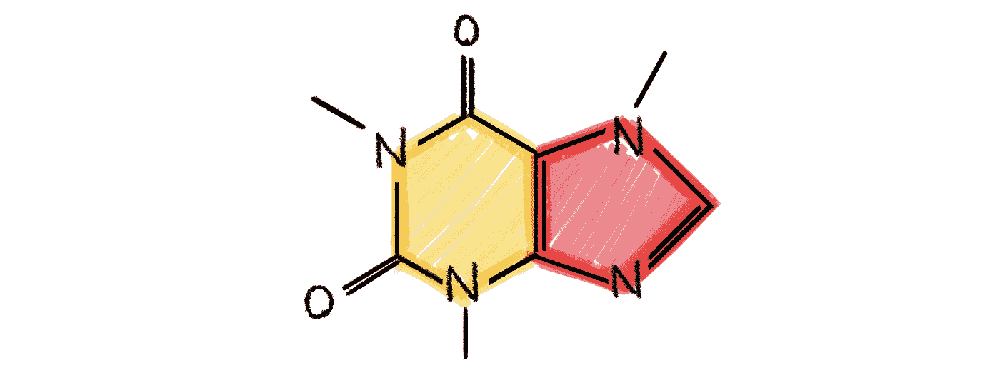

# 超越 Weisfeiler-Lehman:使用子结构用于可证明表达的图形神经网络

> 原文：<https://towardsdatascience.com/beyond-weisfeiler-lehman-using-substructures-for-provably-expressive-graph-neural-networks-d476ad665fa3?source=collection_archive---------11----------------------->

## 图形神经网络有多强大？

## 在这篇文章中，我将讨论如何设计不基于 Weisfeiler-Lehman 测试体系的局部且计算高效的强大图形神经网络。

*这是关于图形神经网络表达能力系列文章的第二篇。参见* [*第一部分*](/expressive-power-of-graph-neural-networks-and-the-weisefeiler-lehman-test-b883db3c7c49) *描述图神经网络与 Weisfeiler-Lehman 图同构测试之间的关系。在* [*第三部分*](https://medium.com/@michael.bronstein/beyond-weisfeiler-lehman-approximate-isomorphisms-and-metric-embeddings-f7b816b75751) *中，我论证了为什么我们要完全抛弃图同构问题。*

最近的开创性论文[1–2]建立了图神经网络和图同构测试之间的联系，观察了消息传递机制和 Weisfeiler-Lehman (WL)测试之间的相似性[3]。WL 测试是用于确定图同构的一系列图论多项式时间迭代算法的总称。 *k* -WL 测试根据一些邻域聚集规则在每一步重新着色 *k* 图的顶点元组，并在达到稳定着色时停止。如果两个图的颜色直方图不相同，则认为这两个图不是同构的；否则，这些图可能(但不一定)是同构的。

消息传递神经网络至多与 1-WL 测试(也称为节点颜色细化)一样强大，因此无法区分甚至是非同构图形的非常简单的实例。例如，消息传递神经网络不能计算三角形[4]，这是一个已知在社交网络中起重要作用的主题，它与指示用户“紧密结合”程度的聚类系数相关联[5]。有可能设计出更具表达力的图形神经网络来复制日益强大的 *k* -WL 测试【2，6】。然而，这种体系结构导致高复杂性和大量参数，但最重要的是，通常需要非本地操作，这使得它们不切实际。

不能用 1-WL 来区分但可以用 3-WL 来区分的非同构图形的例子，因为 3-具有计算三角形的能力。

因此，基于 Weisfeiler-Lehman 层次结构的可证明强大的图形神经网络要么不是非常强大但实用，要么强大但不实用[7]。我认为，有一种不同的简单方法来设计高效且可证明强大的图形神经网络，这是我们在与乔治·布里特萨斯和法布里齐奥·弗拉斯卡的一篇新论文中提出的[8]。

**图形子结构网络。**这个想法实际上非常简单，在概念上类似于[位置编码](https://kazemnejad.com/blog/transformer_architecture_positional_encoding/#what-is-positional-encoding-and-why-do-we-need-it-in-the-first-place)或 graphlet 描述符【9】:我们让消息传递机制知道本地图结构，允许根据端点节点之间的拓扑关系不同地计算消息。这是通过向消息传递函数传递与每个节点相关联的附加结构描述符来完成的[10]，这些描述符是通过子图同构计数来构建的。通过这种方式，我们可以将图的节点划分为不同的等价类，这些等价类反映了每个图中的节点之间以及不同图之间共享的拓扑特征。

我们称这种架构为图子结构网络(GSN)。它具有与标准消息传递神经网络相同的算法设计、存储器和计算复杂性，并具有额外的预先计算步骤，在该步骤中构造结构描述符。要计数的子结构的选择对于 GSNs 的表达能力和预计算步骤的计算复杂性都是至关重要的。

在具有 *n* 个节点的图中，计数大小为 *k* 的子结构的最坏情况复杂度是𝒪( *nᵏ* 。因此，它类似于高阶图神经网络模型或 Morris [2]和 Maron [6]。然而，与这些方法相比，GSN 有几个优点。首先，对于某些类型的子结构，如路径和循环，计数可以以低得多的复杂度完成。第二，计算量大的步骤仅作为预处理进行一次，因此不会影响保持线性的网络训练和推理，与消息传递神经网络中的方式相同。训练和推理中的记忆复杂度也是线性的。第三也是最重要的，GSN 的表达能力不同于 *k* -WL 测试，在某些情况下更强。

gsn 有多强大？子结构计数赋予 GSN 比标准消息传递神经网络更强的表达能力。首先，澄清 GSN 的表达能力取决于所使用的图子结构是很重要的。同样，我们有一个层次的 *k* -WL 测试，我们可能有基于计数一个或多个结构的 gsn 的不同变体。使用比星形图更复杂的结构，gsn 可以比 1-WL(或等价的 2-WL)更强大，因此也比标准消息传递架构更强大。对于 4-团，GSN 至少不亚于 3-WL，如以下强正则图的例子所示，在该例子中，GSN 成功，而 3-WL 失败:

16 个顶点，节点度为 6 的非同构[强正则图](https://en.wikipedia.org/wiki/Strongly_regular_graph)的例子，其中每两个相邻的顶点有 2 个共同邻居，每两个不相邻的顶点也有 2 个共同邻居。在这个例子中，3-WL 测试失败，而具有 4-团结构的 GSN 可以区分它们。在左边的图(称为 Rook 图)中，每个节点恰好参与一个 4-团。右图( [Shrikhande 图](https://mathematicaladd.wordpress.com/2017/02/06/visualizing-the-difference-between-the-4x4-rooks-graph-and-the-shrikhande-graph/))的最大集团大小为 3(三角形)。图来自[8]。

更一般地说，对于𝒪(1 大小的各种子结构，只要它们不能被 3-WL 计数，就存在 GSN 成功而 3-WL 失败的图[11]。虽然我们找不到相反的例子，但它们可能在原则上存在——这就是为什么我们关于 GSN 力量的陈述是弱形式的，“至少不减弱”。

这同样适用于更大的 k 值；上图中称为 *k* - *等正则*的强正则图的概括，是( *k* +1)-WL 测试失败的实例[12]。这些例子也可以通过具有适当结构的 GSN 来区分。因此，下图显示了 gsn 的表达能力:

GSN 不属于 Weisfeiler-Lehman 层级。有了适当的结构(例如，一定规模的集团或循环)，它很可能至少不亚于 k-WL。

GSN 原则上能有多强大？这仍然是一个悬而未决的问题。[图重构猜想](https://en.wikipedia.org/wiki/Reconstruction_conjecture) [13]假定了从所有删除节点的子结构中恢复图的可能性。因此，如果重构猜想是正确的，具有大小为*n*1 的子结构的 GSN 将能够正确地测试任何图的同构。然而，重构猜想目前只对大小为 *n≤* 11 [14]的图被证明，其次，这样大的结构是不切实际的。

更有趣的问题是类似的结果是否存在于独立于节点数量的“小”结构(𝒪(1 的)中。我们的经验结果表明，具有诸如[圈](https://en.wikipedia.org/wiki/Cycle_(graph_theory)#:~:text=In%20graph%20theory%2C%20a%20cycle,is%20called%20an%20acyclic%20graph)、[路径](https://en.wikipedia.org/wiki/Path_(graph_theory))和[集团](https://en.wikipedia.org/wiki/Clique_(graph_theory))的小子结构的 GSN 适用于强正则图，这对于 Weisfeiler-Lehman 测试来说是一个难题。

最重要的是，GSN 建立在标准消息传递架构之上，因此继承了它的局部性和线性复杂性。该方法的超参数包括为构造结构描述符而计数的结构。实际应用可能会受到所需表达能力、保证表达能力的结构大小以及计算复杂性之间的权衡的指导。

使用具有长度 k≥6 的循环的 GSN 显著改善了锌数据库中分子图的化学性质的预测，该锌数据库被制药公司用于候选药物的虚拟筛选。这种环状结构在有机分子中很丰富。图来自[8]。

在我们的实验中，我们观察到不同的问题和数据集受益于不同的子结构，因此这种选择很可能是特定于问题的。幸运的是，我们通常知道在某些应用中什么样的子结构很重要。例如，在社交网络中，三角形和高阶小集团很常见，并有明确的“社会学”解释。在化学中，周期是一种非常频繁的模式，比如出现在大量有机分子中的五元和六元 T2 芳香环。下图显示了我们大多数人都熟悉的一个例子，咖啡因[的分子](https://en.wikipedia.org/wiki/Caffeine)，它在我血液中的含量低得惊人。这听起来是写完这篇文章并给自己冲杯咖啡的好时机。

[1，3，7-三甲基黄嘌呤](https://en.wikipedia.org/wiki/Caffeine)，更广为人知的名称是咖啡因，是一种含有 5 环和 6 环的化学环状化合物的例子(用红色和黄色表示)。

[1] K. Xu 等[图神经网络到底有多强大？](https://arxiv.org/abs/1810.00826) (2019)。继续。ICLR。

[2] C. Morris 等人 [Weisfeiler 和 Leman go neural:高阶图神经网络](https://aaai.org/ojs/index.php/AAAI/article/view/4384/4262) (2019)。继续。AAAI。

[3] B. Weisfeiler，A. Lehman，[将一个图化简为标准形以及其中出现的代数](https://www.iti.zcu.cz/wl2018/pdf/wl_paper_translation.pdf)，1968 年(英译)

[4]因此，通过 1-WL 测试，具有不同数量三角形的两个图将被认为可能是同构的，或者等效地，将具有由消息传递神经网络构建的相同嵌入。有大量新的结果扩展了我们对什么结构在 WL 测试下是不变的理解，参见例如 V. Arvind 等人[关于 Weisfeiler-Leman 不变性:子图计数和相关图性质](https://arxiv.org/abs/1811.04801) (2018) arXiv:1811.04801 和 Z. Chen 等人[图神经网络能计数子结构吗？(2020) arXiv:2002.04025。](https://arxiv.org/abs/2002.04025)

[5]图子结构已经在复杂网络中使用了几十年。在生物信息学中，R. Milo 等人的开创性论文《网络基序:复杂网络的简单构建模块》(2002)。科学 298(5594):824–827。和 n . prulj 等人[建模交互组:无尺度还是几何？](https://watermark.silverchair.com/bth436.pdf?token=AQECAHi208BE49Ooan9kkhW_Ercy7Dm3ZL_9Cf3qfKAc485ysgAAAq8wggKrBgkqhkiG9w0BBwagggKcMIICmAIBADCCApEGCSqGSIb3DQEHATAeBglghkgBZQMEAS4wEQQM0dSVWoaQCCLbBJ-PAgEQgIICYnENSgyWT9FgCVosBTOeyyRmtWw4j9wHSvqt30AJoJBqzNoYzfJYrIdCyr1V7WepOWMZssTNQjPgiiBJGGsLDvzPnB7jfm4OF8X91JfMutgrioFxqvxaClQapirh65l4WBv9e9kqbErrMfahpd-Jx23l3jEx-KVHkneVqUEHqDNQngE1z4Y31EY8YirDNjscsBtpFcfvu4M0TaYX62WrNcUfUalAqhWBpA56gSrqffkSiG_htHXGjYLCyOI-TtyW8EmZ_y3QmTkyK8JN1eaZxeyXlxkB9xadNFWJP7bbl0PQKfJDYSwXm4jZWD9QUMsO9PaJc66VmksFv-J4B3dsMi5F2mPlE7_M-7lhLJHOgw46tJ6IuUmRS3la3pDtpqouN9n4kMXavOxavrFCiqH2t0QMw9pnuSnxYcD5ioohSs9WxO7gqS6BOiY6AP-Q7QjoX-ILY9haHSTOo90I3FTTjeIbD9zL3M6P4pBmaJzOzoyBLUsZtQRS-2vcqkJE-S36O-EaqWJeNP3keGYMT37chw3N62NzEmFTquuUqS3OTQM1z2p26GBqprknPKPy4FkowA_s67kHzYJFn860neEJCkoOm6-Dm--Dr7SuEXBfydf39XEBVpqC_IkaNl8hL630qr2MnKxDCwCsNt4aFum8hTuL89-EarI_YoBzq9zwIgQJyXZiNU7mVqlgq9LXGgcB-iTwtDHmoEc3JmEKv4zOaeXY4iGqUjbiQq5-14_Av-Kz0UujdV9oADUj2Q2kYagvQZMelDI7fIqRS-sk8VdRtRzeknChefIBp4j92dqbEdsJRAQ) (2004)生物信息学 20(18):3508–3515 介绍了用于生物相互作用网络分析的图形基序和 graphlets。在社会网络中，对三角形主题的研究至少可以追溯到 P. W. Holland 和 S. Leinhardt 的《社会网络中的局部结构》(1976)。社会学家。方法。1–45.

[6] H. Maron 等人[可证明强大的图形神经网络](https://arxiv.org/abs/1905.11136) (2019)。继续。神经炎。

[7]Morris 的 3-WL 等价图神经网络架构具有𝒪( *n* 空间-和𝒪( *n* ⁴)时间复杂度。Maron 的架构具有稍好的𝒪(空间和𝒪(时间复杂度。对于一个具有 100 万个节点的中等规模的图形，这仍然意味着巨大的 1TB 内存和万亿次计算。

[8] G. Bouritsas 等[通过子图同构计数提高图神经网络表达能力](https://arxiv.org/abs/2006.09252) (2020)。arXiv:2006.09252。

[9]基于子结构计数的图形分析方法明显早于最近关于图形深度学习的工作。值得注意的例子包括 T. Milenkovi 和 n . prulj 在生物信息学中提出的 graphlet 签名，[通过 graphlet 度签名揭示生物网络功能](https://www.ncbi.nlm.nih.gov/pmc/articles/PMC2623288/) (2008)。癌症信息。6:257–273，或 graphlet 内核 N. Shervashidze 等人[用于大型图形比较的高效 graphlet 内核](http://proceedings.mlr.press/v5/shervashidze09a/shervashidze09a.pdf) (2009)。继续。AISTATS。

[10]我们对边也展示了同样的机制，为了简洁起见，我在这里省略了。

[11] 3-WL 在子结构计数方面显得相当弱。例如，它可以计算多达 7 个节点的基元循环，但不能计算诱导的 4-循环或长度为 4 的路径。目前还不清楚通过在 WL 层次结构中向上移动可以获得什么样的子结构计数能力。

[12] B. L. Douglas，[《Weisfeiler-Lehman 方法与图同构测试》](https://arxiv.org/abs/1101.5211) (2011)。arXiv:1101.5211。请注意，在不同的参考文献所称的“ *k* -WL”之间存在一定程度的混淆。道格拉斯用术语*k*——WL 来称呼别人所说的(*k*——1)——FWL(“民间传说”WL)。在我们的术语中， *k* -WL 在(*k*-1)-等规图上失效。强正则图是 2-等正则的。

[13] P.J .凯利，[树的一个同余定理](https://projecteuclid.org/download/pdf_1/euclid.pjm/1103043674) (1957)。太平洋 j .数学。7:961–968.

[14] B. D. McKay，小图是可重构的(1997)。澳大利亚组合学杂志 15:123–126。

感谢卢卡·贝利、乔治·布里萨斯和法布里齐奥·弗拉斯卡帮助我校对这篇文章。本帖的 [*中文翻译*](https://www.infoq.cn/article/N49r0yKY3kQ6PxehJMFi) *由* [*刘止庸*](https://medium.com/@zhiyongliu) *提供。对图形深度学习感兴趣？查看我的* [*博客*](https://towardsdatascience.com/graph-deep-learning/home) *关于走向数据科学，* [*订阅我的*](https://michael-bronstein.medium.com/subscribe) *帖子，获取* [*中等会员*](https://michael-bronstein.medium.com/membership) *，或者关注我的*[*Twitter*](https://twitter.com/mmbronstein)*。*