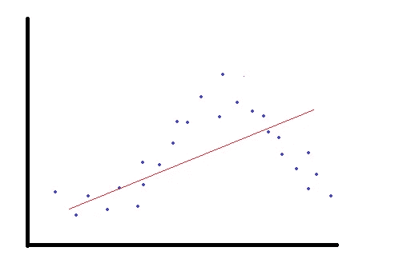
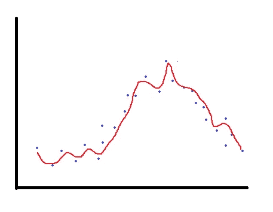
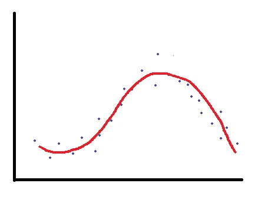

# 机器学习中的偏差和方差

> 原文：<https://towardsdatascience.com/bias-and-variance-in-machine-learning-b8019a5a15bc?source=collection_archive---------33----------------------->

## 成功的关键是找到偏差和方差之间的平衡。

照片由 [Unsplash](https://unsplash.com/s/photos/balance?utm_source=unsplash&utm_medium=referral&utm_content=creditCopyText) 上的 [Aziz Acharki](https://unsplash.com/@acharki95?utm_source=unsplash&utm_medium=referral&utm_content=creditCopyText) 拍摄

在预测分析中，我们建立机器学习模型，对新的、以前从未见过的样本进行预测。整个目的就是能够预测未知。但是模型不能凭空做出预测。我们向模型展示一些样本并训练它。然后，我们期望模型对来自相同分布的样本进行预测。

完美的模型是不存在的，所以我们建立和训练的模型会有错误。预测值和实际值之间会有差异。模型的性能与实际值和预测值之间的差异成反比。差异越小，模型越好。我们的目标是尽量减少误差。我们不能消除错误，但我们可以减少它。可以减小的误差部分有两个分量:**偏差**和**方差**。

模型的性能取决于偏差和方差之间的平衡。最佳模式介于两者之间。请注意，偏差和方差之间总是有一个权衡。挑战在于找到正确的平衡。

# **什么是偏差和方差？**

当我们试图用一个简单得多的模型来近似一个复杂的关系时，就会出现偏差。我认为它是一个懒惰的模型。考虑一种情况，其中自变量(特征)和因变量(目标)之间的关系非常复杂并且是非线性的。但是，我们尝试使用线性回归建立一个模型。在这种情况下，即使我们有数百万个训练样本，我们也无法建立准确的模型。通过使用简单的模型，我们限制了性能。不能反映特征和目标之间的真实关系。

具有高偏差的模型不能够捕捉重要的关系。因此，训练集和集合集的精度都将非常低。这种情况也被称为**欠配合**。具有高偏差的模型倾向于欠拟合。考虑下面的散点图，它显示了一个特征和一个目标变量之间的关系。如果我们使用红线作为模型来预测蓝色数据点所描述的关系，那么我们的模型就有很大的偏差，最终会使数据拟合不足。

高偏置，欠拟合

**方差**发生在模型对自变量(特征)的变化高度敏感的时候。该模型试图选取关于特征和目标之间关系的每个细节。它甚至学习数据中可能随机出现的噪声。特征中非常小的变化可能会改变模型的预测。因此，我们最终得到了一个模型，它捕获了训练集的每一个细节，因此训练集的准确性将非常高。然而，新的、以前未见过的样本的准确性不会很好，因为特征中总是存在不同的变化。这种情况也被称为**过拟合**。该模型过度适应训练数据，但未能很好地概括数据集内的实际关系。模型实际看到的样本的精度将非常高，但是新样本的精度将非常低。考虑我们之前讨论过的同一个例子。如果我们试图用下图中的红色曲线来模拟这种关系，模型会过度拟合。如你所见，它非常敏感，试图捕捉每一个变化。

高方差，过度拟合

所以高偏差和高方差都不好。完美的模型是低偏差和低方差的模型。然而，完美的模型很难找到，如果可能的话。偏差和方差之间有一个权衡。我们应该力求在它们之间找到恰当的平衡。作为一名机器学习工程师，成功的关键是掌握在偏差和方差之间找到正确的平衡。对于我们的情况，一个更好的模型应该是这样的:

非常合适

感谢您的阅读。如果您有任何反馈，请告诉我。